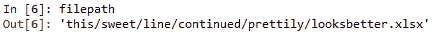
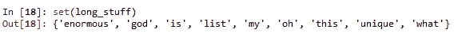

# Python 中的 10 个快速清理编码技巧

> 原文：<https://towardsdatascience.com/10-quick-and-clean-coding-hacks-in-python-1ccb16aa571b?source=collection_archive---------6----------------------->

## 让你的 Python 脚本漂亮易读


克里斯里德在 [Unsplash](https://unsplash.com?utm_source=medium&utm_medium=referral) 上的照片

嘿大家好！得益于 Python 漂亮的简单性，它提供了多种方法来完成相同的任务。它也是一种非常直观和易于读写的语言。也就是说，很容易被 Python 冲昏头脑，使事情看起来比实际需要的更复杂。**pep 8**《python 风格指南》提供了一些保持 python 整洁的指南。这里有一个快速列表，列出了 10 个你可以在代码中立即开始做的事情。

## 1.帮你的合作开发者一个忙，使用 docstrings

使用“三重双引号”来编写文档字符串，清楚地解释您的函数、模块和脚本的用途，即使您是以其他方式对其进行注释。请记住以句点结束文档字符串。(.)

```
def get_percent_sales(product,sales,region):“““Return the product Sales volumes in percent of total in country.Get percentage of product sales of the region.This function gets the product and corresponding sales by region and returns a percent sales of the region by total sales in that country. Region input is accepted only by city. Districts are not accepted. If city name is not found, exception is thrown. Parameters:             product (str) : Product name sales (int) : Sales Volume Returns: 
             percent_sales (float): Percent of total sales of    
                                    product.
"""
```

## 2.让你的逻辑陈述看起来更直观

不

```
if is_white == Falseif not is_white == False
```

做

```
is_white = Trueif is_white:else: 
```

## 3.使用。用 join 代替+来执行字符串连接

不

```
my_name = ‘firstname’+ ‘ ‘ + ‘lastname’
```

做

```
my_name = " ".join(['firstname','lastname'])
```

## 4.对可读的 for 循环使用列表理解

```
numbers = [1,2,3,4,5,6,7,8,9,10]
```

不

```
even_halves = [ ]for num in numbers:
    if num%2 == 0:
       even_halves.append(num/2)print(even_halves)
```

做:

```
even_halves = [num/2 for num in numbers if num%2==0]
```

## 5.如果要给变量赋值，请使用 def 函数而不是 lambda

保存 lambda 函数，以便在表达式中进行计算。

不

```
squared = lamdba x: x**2
```

做

```
def squared(x):
   return x**2
```

## 6.打破那些长长的队伍

注意文本换行。保持在编辑器的换行范围内。

不

```
df = pd.read_excel('This/extremely/long/file/path/that/extends/ /to/the/next/line/and/screws/with/indentation.xlsx')mylist = [1,2,3,4,5,6,7,8,9,10,11,12,13,14,15,16,17,18,19,20000,30000,3100000320000]
```

做反斜杠和隐式延续:

```
filepath = "this/sweet/line/" **\**
           "continued/prettily/"**\**
           "looksbetter.xlsx"df = pd.read_excel(filepath)my_list = [1,2,3,4,5,6,7,8,9,10,11,
          12,13,14,15,16,17,18,19,
          20000,30000,3100000,320000]if this_happens or that_happens **\**
   or these_happen:
      print('blah')
else:
   print('the other blah')
```



## 7.尽可能使用范围而不是列表

不

```
indices = [0,2,4,6,8,10]for idX in indices: print(name[idX])
```

做

```
for idX in range(0,12,2): print(name[idX])
```

## 8.在 Try 块下保持最小的代码量

不

```
try: names = get_data(students, classroom) numbers = get_scores(students, classroom) return names,numbersexcept KeyError: 
```

做:

```
try: names = get_data(students, classroom) numbers = get_scores(students, classroom)except KeyError:
    print('That's not a student in this classroom!')return names, numbers
```

## 9.比你已经做的多使用一些器械包

器械包提供的是性能而不是功能。如果在当前情况下不需要很多功能，那么最好选择集合而不是其他数据结构。

```
data = {‘find_this’, ‘among’, ‘all_the’,'other',’data’}if‘find_this’ in data: print(‘this exists!’)long_stuff = [‘this’,’list’,’list’,’is’,
             ’enormous’,’oh’,’my’,’god’,
             ’god’,’what’,’is’,
             ’unique’,’unique’]unique_values = set(long_stuff) 
```



## 10.使用 zip 迭代多个列表

```
students = [‘tom’,’dick’,’harry’,’larry’,’tim’,’benny’]scores = [100,20,40,60,30,40]
```

不要:

```
for i in range(len(students)): print(student[i],scores[i]
```

做

```
for student,score in zip(students,scores):
    print(student,score)
```

这是关于用 python 改进脚本的一些基本方法。遵循风格指南，做一个友好的程序员！