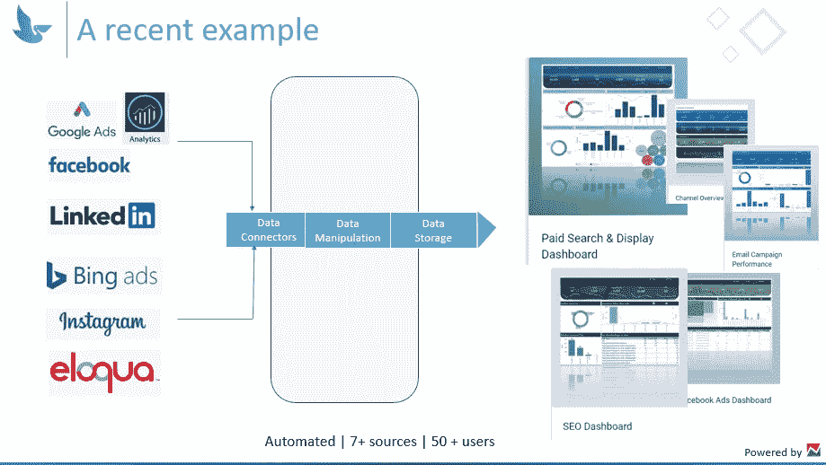
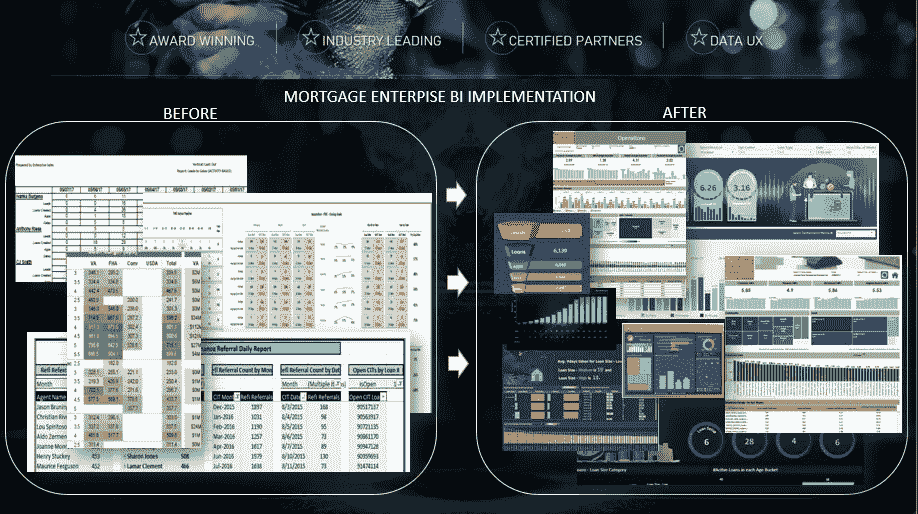
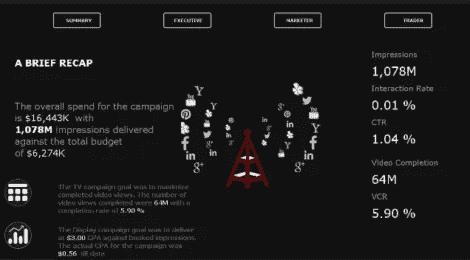
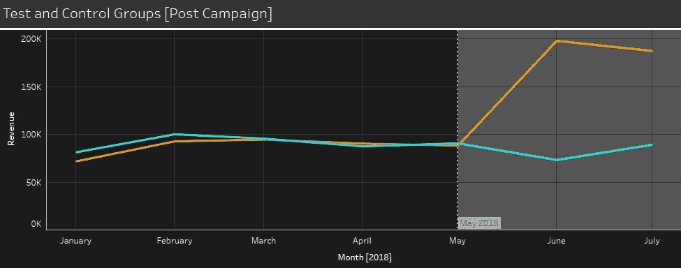
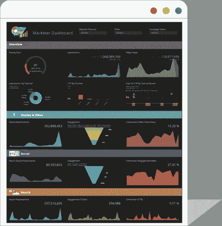
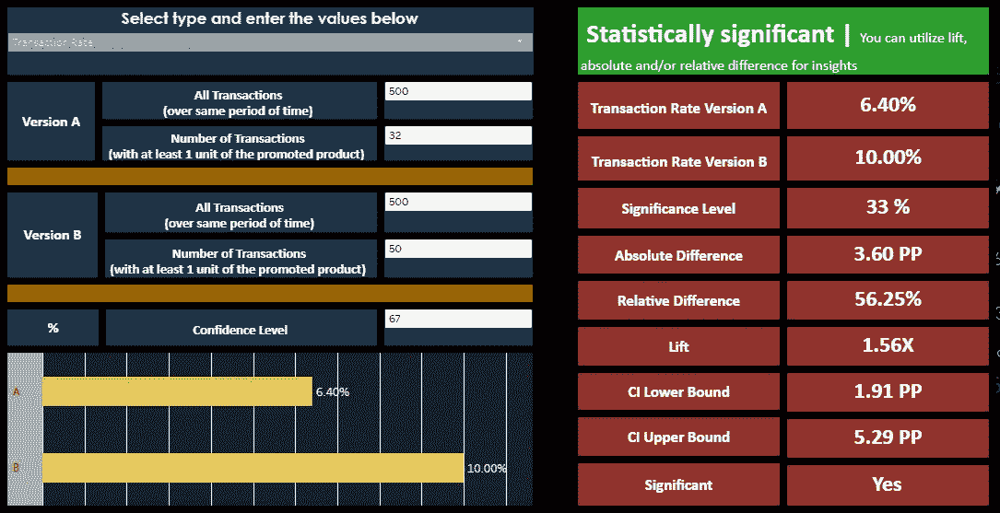

# 10 个商业智能工具应用实例|商业智能

> 原文：<https://towardsdatascience.com/10-real-world-examples-of-bi-tools-in-action-business-intelligence-54d5af285b9?source=collection_archive---------47----------------------->

## nabler.com

## 了解商务智能工具的应用

如今，每个组织都期待采用高级分析来理解不断增长的数据量，[商业智能](https://www.nabler.com/bi-consulting/) (BI)开启了一个充满机遇的世界。BI 可以为几乎每个业务流程增加价值。从提高生产力到深入了解客户需求和产品使用方式，商务智能几乎无所不在。商业智能可以使组织提供更新的见解和方向，并帮助他们在分析数据时变得更加积极主动，以提高效率并做出更好的业务决策。

为了获得更好的商业价值和持续跟踪，您的商务智能专业人员需要具备广泛领域的资格，并紧跟所有新趋势。随着技术的进步，数字化转型现在被视为一项至关重要的战略举措，商业智能工具已经演变为一种帮助公司充分利用数据的工具。这种反应是现代商业智能平台不断增强的能力的结果，这些平台支持数据访问、交互性、发现、实时警报、可操作的仪表盘、移动数据访问、人工智能生成的见解、人工智能驱动的数据播客和许多其他东西。[整体商业智能市场预计将以 9.5%的 CAGR 增长，从 2016 年的 170.9 亿美元增长到 2021 年的 268.8 亿美元](https://www.businesswire.com/news/home/20170322005782/en/Business-Intelligence-Market-Type-Data-type-Business)。

**以下是 10 大商业智能工具的实际例子。**

*   带来整体视图(收集和拼接正确的数据)
*   来自您的商业智能系统的警报(用于实时操作)
*   拥有更多可操作的仪表盘(洞察行动)
*   经验很重要(以行动为动机的陈述非常普遍)
*   优化您的移动数据访问(随时随地通过任何设备访问)
*   人工智能生成的见解(为更聪明的人提供的智能见解)
*   人工智能驱动的数据播客(尝试你传递信息的方式)
*   提升分析(用您的活动击中靶心)
*   面向营销人员的仪表板解决方案(提高 CMO 效率)
*   A/B 统计显著性计算器(数据集的关系计算器)

# 1.带来整体视图(收集和拼接正确的数据):

BI 报告平台使您能够做出明智的决策，但如何处理来自多个来源的不断增长的数据量仍然是一个挑战。您还将面临数据同步和以正确的粒度级别拼接数据的挑战。为了准确了解您的公司在任何给定时间的运营情况，您需要一个商业智能工具，将来自各部门的大量数据转化为组织的整体视图。

**解决方案:**尽管客户在进行数据业务，但他们的数据仍然分散在不同的地方，造成了对最后一次联系归属的混淆。我们采取的方法是首先理解业务目标和他们现有的数据源。这帮助我们决定哪些数据源应该自动化，哪些数据应该缝合在一起。

我们对情况的综合分析使我们的客户能够自动化 7 个以上的基本数据源和 50 个以上的用户。能够看到真相的一个版本也让他们能够实时做出明智的决定。

# 2.来自您的商业智能系统的警报(用于实时操作)

当您监控大量 KPI 并管理大量仪表板时，很容易忘记什么对您重要。Business alerts 将帮助您解决各种情况，例如当达到预定目标时，或者每当发生意外事件时，您都会收到通知，并完全控制推动您业务发展的因素。

**解决方案:**设置定制的数据警报是监控业务绩效的最有效方式。设置警报并不复杂，但是您的 BI 团队或顾问应该首先为合适的人员选择合适的 KPI。因此，BI 的发现阶段变得非常重要，在此阶段您可以了解棘手问题。有时不够清晰，但这足以指导我们思考 KPI 和警报。有时，高水平的 KPI 不会引起太多的兴趣，需要的是寻找一些相关的东西或试图得出一个分数或比率。最后一步是设置阈值和警报模式。大多数情况下，电子邮件是接收提醒的首选，但在某些情况下，短信文本。

# 3.拥有更多可操作的仪表盘(洞察行动)

决定什么应该在仪表板上是非常重要的。您不需要仪表盘上的大量数据，只要有足够的数据来帮助实现您组织的关键绩效指标(KPI)就足够了。获胜的分数不是仪表盘的总数，而是有多少仪表盘是可操作的，被广泛使用的。使仪表板更具可操作性的几个要素是:内容基准、目标、实时 KPI 监控、流量趋势、按主题和角色划分的绩效、参与度指标、ROI 证明。

**解决方案:**我们让客户能够查看他们的销售业绩仪表板。有几个仪表盘在显示销售业绩。根据服务的不同，每个销售经理都有自己的活动门槛(跟进电话和电子邮件/询问)。他们过去常常查看这些仪表板，并召开评审会议。但是，大量的表格和分散的视觉效果让我们很难理解整体表现，也很难看到他们与其他销售人员相比的位置。

使用散点图为他们创建分布，并通过启用参考线使其动态化，然后与 viz 交互，在数据手册中为他们提供实际结果。

# 4.经验很重要

也许你已经准备好了所有复杂转换的精确数据。但是呈现的方式很重要。带着行动动机看待数据的文化转变正在广泛流行。因此，在增强这些功能的同时，我们可能需要关注视觉效果的外观和感觉。正确的图表类型、度量标准和维度的正确使用以及良好的表示层会带来很大的不同。

**解决方案:**一个从输入到输出的开关。随着对高质量和正确数据输入的日益关注，对高质量输出的需求也在增加。对可视化可以提供什么的理解在很大程度上推动了消费者方面的需求。

一个交互式的、自我解释的商业智能仪表板是一种很好的方式，可以汇编几种不同的数据可视化，以提供对业务绩效的一目了然的概述。

图片由 nabler.com 拍摄

# 5.优化您的移动数据访问

移动商务智能的好处数不胜数。随时随地获得数据是时代的需要。这有助于您通过在整个组织中更广泛地传播商业智能来创建数据驱动的决策文化。但是这个旅程并不是偶然发生的。桌面上的视觉效果和移动中的数据是有区别的。您应该重建整个商业智能基础设施吗？这可能需要几年时间。

**解决方案:**如果您正在考虑移动商务智能，或者已经开始使用移动商务智能，这里有五个针对移动受众发布信息的最佳实践。

*   避免仪表板激增
*   写入更小的外形
*   考虑一个忙碌的观众
*   考虑新的移动场景
*   利用移动设备的自然协作流程

但是，在您考虑使用移动商务智能之前，您应该了解以下几点:

*   较小的屏幕意味着您可以使用的空间更少。布局必须是流线型的，整洁的，简洁的。
*   只显示桌面版本的基本数据，用户离不开这些数据。理想情况下，创建一个专属的移动商务智能仪表板来代表这一点。
*   由于用户将在旅途中检查手机上的数据，他们更可能关注日常运营数据，而不是分析。
*   考虑触摸屏——“胖手指”点击屏幕上的一个元素并被带到错误的页面是令人沮丧的。确保每个部件都有足够的空间，并且这些视觉元素之间有足够的间隔。
*   在应用程序的布局、颜色和元素方面保持一致，以避免混淆用户。
*   对比色。由于移动仪表板是为小屏幕设计的，您希望确保它在视觉上吸引人，并吸引人们对关键元素的注意。对比背景色和前景色，使数据点突出出来。

图片由 nabler.com 拍摄

# 6.人工智能产生的见解

企业似乎正在进入一个由数据统治的新时代。商业智能中的人工智能正在演变成日常商业活动。现在，您可以使用机器学习算法来识别大量数据中的趋势和见解，并做出更快的决策，这可能会使您实时保持竞争力。杰出的解决方案提供商已经超越了创建传统解决方案的阶段，开发出完整的整体平台，更好地实现商业智能和分析流程的自动化。

**解决方案:**人工智能可以用来释放真正分析的力量。虽然建立假设的传统方式是通过查询数据，但人工智能将帮助决策者使用查询数据来验证机器生成的洞察力。

荷兰国际集团、沃尔玛和通用电气等公司多年来一直在使用人工智能衍生的见解。这里有更多信息。

纳布勒的图片

纳布勒的图片

# 7.人工智能驱动的数据播客

为你的企业建立一个数据播客是传递信息的另一种创新方式。人工智能层将以纯文本的形式让你获得洞察力，而 NLP 层会将其转换为音频层。你甚至可以为你的企业尝试一些有趣的背景和品牌。

# 8.升力分析

提升分析是一种衡量活动如何影响关键指标的方法。当涉及多重接触归因时，可以通过查看受您的活动影响的场合，并将其与未受您的活动影响的场合进行比较，来应用营销提升分析。通过将您的治疗组与您的对照组进行比较，您可以看到上述每个指标的“提升”,并根据数据做出投资哪些活动或停止投资哪些活动的决策。

纳布勒的图片

它们有助于您更好地了解模型的整体性能。如果提升图的斜率不单调，您可以快速发现缺陷。此外，它还帮助您设置一个阈值，哪些用户值得锁定。最后，与随机定位相比，您可以估计您可以更好地定位用户。

# 9.面向营销人员的仪表板解决方案

成功的营销融合了硬数据和创造性的见解。您可以在一个营销仪表板中查看您的所有数据源，包括您的社交媒体平台、CRM、Google Analytics、内容营销仪表板、Web Analytics 仪表板等。所有营销 KPI 都在一个易于阅读的仪表板中，您将立即看到优化整体战略的机会。

**解决方案:**像现代的 CMO 一样，你使用各种营销技术和工具。您有许多数据源，并且总是在一个仪表板中创建一个整体视图是一项挑战。CMOs 通常会寻找以下类型的仪表板:

营销漏斗仪表板、渠道仪表板、社交媒体仪表板、内容营销仪表板、网络分析仪表板、搜索引擎营销仪表板、搜索引擎优化仪表板。

在这里，我们通过首先采取一种理解业务目标和数据类型的方法来帮助我们的客户。这有助于我们决定哪些数据源应该自动化和连接，并使数据流流向一个单一的仪表板，以提供完整的营销绩效的整体视图。我们还让我们的客户能够以正确的粒度级别将相关数据缝合在一起。

纳布勒的图片

# 10.A/B 统计意义计算器

A/B 测试显著性计算器是一种统计假设测试工具，用于计算两个数据集之间的关系，然后将这些数据集相互比较，以确定是否存在统计显著性关系。我们的客户使用 A/B 显著性计算器来确定 A/B 检验在统计上是否显著。你也可以在这里查看

纳布勒的图片

# 结论

如果你想跟上数字革命的步伐，你必须对你的数据采取严肃的策略。虽然今天进行的许多数据分析都是基于历史数据，但重点正在迅速转向商业中的人工智能。今天，它不再仅仅是呈现数据。重点是给出更多可操作的见解。为了在 2020 年的竞争中保持竞争力，您必须了解最新的商务智能工具，这些工具可以帮助您实时做出相关的业务决策。

*最初发表于*[*【https://www.nabler.com】*](https://www.nabler.com/articles/10-real-world-examples-of-bi-tools-in-action/)*。*