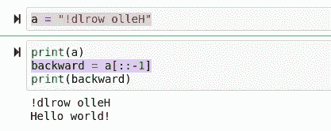
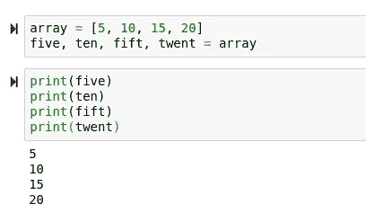
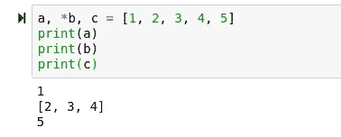
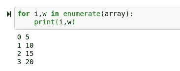
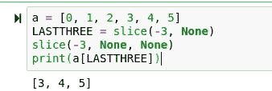
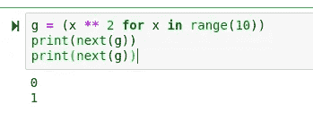
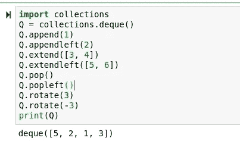

# 蟒蛇神的 10 个流畅蟒蛇招数

> 原文：<https://towardsdatascience.com/10-smooth-python-tricks-for-python-gods-2e4f6180e5e3?source=collection_archive---------1----------------------->

## 使你的 Python 代码个性化和更好的 10 个技巧


(Python logo src = http://python.org/)

虽然从表面上看，Python 似乎是一门简单的语言，任何人都可以学习，而且确实如此，但是当人们知道自己对这门语言的掌握程度时，可能会感到惊讶。Python 是很容易学习，但是很难掌握的东西之一。在 Python 中，做事情通常有多种方式，但是很容易做错事情，或者仅仅因为不知道模块的存在而重新创建标准库并浪费时间。

不幸的是，Python 标准库是一个巨大的怪兽，而且，它的生态系统绝对大得可怕。尽管可能有 200 万千兆字节的 Python 模块，但是您可以从 Python 中通常与科学计算相关的标准库和包中学习一些有用的技巧。

# №1:反转字符串

虽然这看起来很简单，但是用 char 循环反转一个字符串可能会很乏味和烦人。幸运的是，Python 包含了一个简单的内置操作来执行这项任务。为此，我们只需访问字符串中的 indice ::-1。

```
a = "!dlrow olleH"
backward = a[::-1]
```



# №2:变暗作为变量

在大多数语言中，为了将一个数组放入一组变量中，我们需要迭代地遍历这些值，或者按位置访问 dim，如下所示:

```
firstdim = array[1]
```

然而，在 Python 中，有一种更酷、更快的方法可以做到这一点。为了将值列表转换为变量，我们可以简单地将变量名设置为与数组相同的长度:

```
array = [5, 10, 15, 20]
five, ten, fift, twent = array
```



# №3:迭代工具

如果你打算花点时间在 Python 上，你肯定想熟悉 itertools。Itertools 是标准库中的一个模块，可以让你不断地进行迭代。它不仅使编写复杂的循环变得容易得多，还使您的代码更快、更简洁。这里只是使用 Itertools 的一个例子，但是有上百个例子:

```
c = [[1, 2], [3, 4], [5, 6]]
# Let's convert this matrix to a 1 dimensional list.
import itertools as it
newlist = list(it.chain.from_iterable(c))
```

# №4:智能拆包

迭代解包值可能相当密集和耗时。幸运的是，Python 有几个很酷的方法可以解包列表！一个例子是*，它将填充未赋值的值，并将它们添加到变量名下的新列表中。

```
a, *b, c = [1, 2, 3, 4, 5]
```



# №5:枚举

如果你不知道枚举，你可能应该熟悉它。枚举将允许你获取列表中某些值的索引。当处理数组而不是数据框时，这在数据科学中特别有用。

```
for i,w in enumerate(array):
    print(i,w)
```



# №6:命名切片

在 Python 中分割列表非常容易！有各种各样很棒的工具可以用来做这件事，但是有一个很有价值的工具是给你的列表命名的能力。这对于 Python 中的线性代数尤其有用。

```
a = [0, 1, 2, 3, 4, 5]
LASTTHREE = slice(-3, None)
slice(-3, None, None)
print(a[LASTTHREE])
```



# №7:将相邻列表分组

在 for 循环中，对相邻循环进行分组当然很容易，尤其是通过使用 zip()，但这肯定不是最好的方法。为了使事情变得简单和快速，我们可以用 zip 编写一个 lambda 表达式，将我们的相邻列表分组如下:

```
a = [1, 2, 3, 4, 5, 6]  
group_adjacent = lambda a, k: zip(*([iter(a)] * k)) 
group_adjacent(a, 3) [(1, 2, 3), (4, 5, 6)] 
group_adjacent(a, 2) [(1, 2), (3, 4), (5, 6)] 
group_adjacent(a, 1)
```

# №8:发生器的下一次()迭代

在编程中的大多数正常情况下，我们可以通过使用计数器来访问一个索引并获得我们的位置号，它只是一个加到:

```
array1 = [5, 10, 15, 20]
array2 = (x ** 2 for x in range(10))
counter = 0for i in array1:# This code wouldn't work because 'i' is not in array2.
   # i = array2[i]
    i = array2[counter]
#    ^^^ This code would because we are accessing the position of i
```

然而，我们可以使用 next()来代替它。接下来使用一个迭代器，它将我们当前的位置存储在内存中，并在后台遍历我们的列表。

```
g = (x ** 2 for x in range(10))
print(next(g))
print(next(g))
```



# №9:计数器

标准库中另一个很棒的模块是集合，今天我要向大家介绍的是集合中的计数器。使用计数器，我们可以很容易地得到一个列表的计数。这对于获取数据中值的总数、获取数据的空计数以及查看数据的唯一值非常有用。我知道你在想什么，

> “为什么不用熊猫呢？”

这当然是一个有效的观点。然而，使用 Pandas 来实现这一点肯定会更加难以自动化，这也是您在部署算法时需要添加到虚拟环境中的另一个依赖项。此外，Python 中的计数器类型有很多 Pandas 系列没有的特性，这使得它在某些情况下更加有用。

```
A = collections.Counter([1, 1, 2, 2, 3, 3, 3, 3, 4, 5, 6, 7]) 
A Counter({3: 4, 1: 2, 2: 2, 4: 1, 5: 1, 6: 1, 7: 1}) 
A.most_common(1) [(3, 4)] 
A.most_common(3) [(3, 4), (1, 2), (2, 2)]
```

# №10:出列

集合模块的另一个优点是出列。看看我们可以用这种类型做的所有巧妙的事情！

```
import collections
Q = collections.deque() 
Q.append(1) 
Q.appendleft(2) 
Q.extend([3, 4]) 
Q.extendleft([5, 6]) 
Q.pop()
Q.popleft()
Q.rotate(3) 
Q.rotate(-3)
print(Q)
```



# 结论

现在你知道了，这些是我一直在使用的一些我最喜欢的 Python 技巧。虽然其中一些可能用得不多，但这些技巧往往非常通用和有用。幸运的是，标准库函数的 Python 工具箱肯定不会开始变得光秃秃的，而且里面肯定有更多的工具。很可能有一些我甚至不知道，所以总是有一些令人兴奋的东西要学！