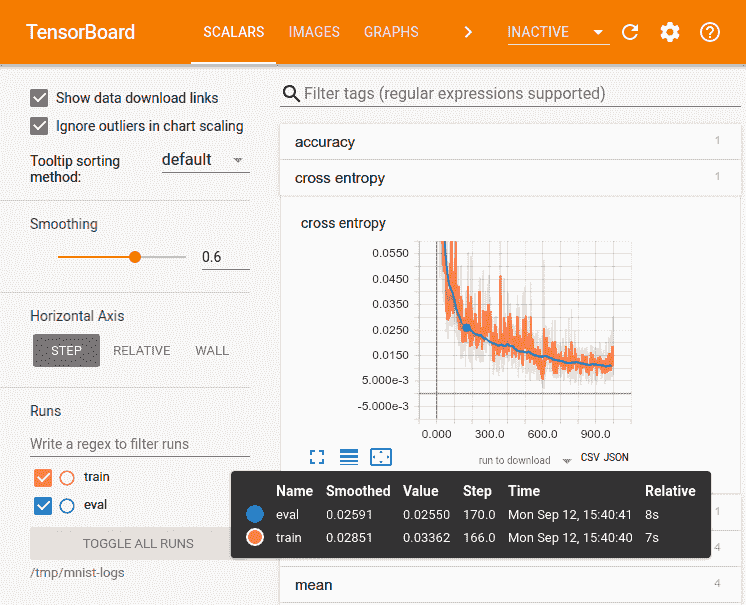
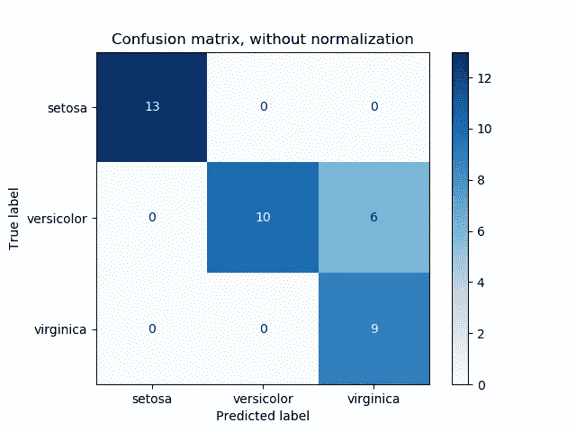

# 2020 年机器学习项目的 10 个阶段(以及你适合的阶段)

> 原文：<https://towardsdatascience.com/10-stages-of-a-machine-learning-project-in-2020-and-where-you-fit-cb73ad4726cb?source=collection_archive---------2----------------------->

## 了解机器学习相关项目涉及哪些阶段，并深入了解每个阶段相关的可交付成果和工作角色。

机器学习的阶段

# 介绍

随着领域和技术本身的发展，机器学习项目中涉及的阶段和工作流也在不断发展。

支持 GPU 的移动设备的出现在传统的 ML 项目工作流程中引入了一个新的阶段。新阶段的出现也创造了新的角色和职称。

> 本文旨在:
> 
> 1.详细解释机器学习项目中涉及的每个阶段。
> 
> 2.提及每个阶段涉及的角色。我还在 LinkedIn 上添加了每个职位在美国的求职链接。
> 
> 3.通知您每个阶段后交付的最终结果(这些被称为可交付成果)。

让我们开始吧。

# 1.问题定义

由 [Austin Distel](https://unsplash.com/@austindistel?utm_source=unsplash&utm_medium=referral&utm_content=creditCopyText) 在 [Unsplash](https://unsplash.com/s/photos/conversation-technology?utm_source=unsplash&utm_medium=referral&utm_content=creditCopyText) 上拍摄

问题定义是计算机视觉/ML 项目的初始阶段，它集中于获得对准备通过应用 ML 来解决的问题的理解。

它通常包括一个问题描述符，它以一种选定的形式记录了遇到要解决的问题的第一手经验的基于场景的描述。

这一阶段还从问题描述者的角度捕捉问题的理想解决方案。

问题描述者可以是客户、顾客、用户或同事。

> ***本阶段的可交付成果为一份文档(word 或 pdf)，包括(但不限于):***
> 
> ***1。问题陈述***
> 
> **②*。理想问题解答***
> 
> ***3。*对问题的理解和洞察**
> 
> ***4。*技术要求**

## 关联角色: [IT 业务分析师](https://www.linkedin.com/jobs/search/?keywords=information%20technology%20business%20analyst)

# 2.研究

威廉·艾文在 [Unsplash](https://unsplash.com/s/photos/research?utm_source=unsplash&utm_medium=referral&utm_content=creditCopyText) 上的照片

此阶段为后面的阶段奠定了基础，同时也为后续阶段中执行的实施和开发工作奠定了基础。

对解决方案将采取的形式以及数据结构、格式和来源的信息进行了探索。

结合对问题的理解、建议的解决方案和可用数据，将使合适的 ML 模型选择过程能够实现理想的解决方案结果。

在这个阶段，研究算法和模型实现的硬件和软件要求是有帮助的；这在后期节省了很多时间。

> ***此阶段的可交付成果是一份文档(word 或 pdf ),包括对以下内容的研究:***
> 
> ***1。*数据结构和来源**
> 
> ***2。解决方案表单***
> 
> ***3。神经网络/模型架构***
> 
> ***4。算法研究***
> 
> ***5。硬件要求***
> 
> ***6。软件需求***

## 关联角色:[机器学习研究员](https://www.linkedin.com/jobs/search/?geoId=103644278&keywords=machine%20learning%20researcher&location=United%20States)，[数据科学家](https://www.linkedin.com/jobs/search/?geoId=103644278&keywords=Data%20Scientist&location=United%20States)， [AI 研究员](https://www.linkedin.com/jobs/search/?keywords=AI%20Researcher&location=)

# 3.数据聚合/挖掘/搜集

照片由 [Sai Kiran Anagani](https://unsplash.com/@_imkiran?utm_source=unsplash&utm_medium=referral&utm_content=creditCopyText) 在 [Unsplash](https://unsplash.com/s/photos/collecting-data?utm_source=unsplash&utm_medium=referral&utm_content=creditCopyText) 上拍摄

数据是 ML/CV 应用的燃料。数据聚合是为训练模型的有效性和性能建立先例的关键步骤。

达成一致的解决方案的输出定义了聚合的数据。

数据理解至关重要，任何来源的数据都应利用可视化工具或统计方法进行检查和分析。

数据检查通过确保数据源是预期的数据来提高数据的完整性和可信度。

对数据进行的数据分析和探索还确保满足以下要求:

*   收集的数据需要足够多样化，以确保模型预测能力能够适应各种可能的情况。
*   收集的数据需要力求**无偏**，以确保模型能够在推断过程中恰当地概括。
*   收集的数据需要**丰富**。

收集数据的工具会有所不同。数据源可以是 API、XML 提要、CSV 或 Excel 文件的形式。在某些情况下，需要从在线资源中挖掘/搜集数据。确保在进行刮擦之前检查第三方网站的刮擦/挖掘政策。

> ***此阶段的可交付成果是一个文件夹，其中包含原始源数据以及每个子文件夹中的注释文件。***

## 关联角色:[数据科学家](https://www.linkedin.com/jobs/search/?geoId=103644278&keywords=Data%20Scientist&location=United%20States)，[数据分析师](https://www.linkedin.com/jobs/search/?geoId=103644278&keywords=data%20analyst&location=United%20States)

# 4.数据准备/预处理/扩充

照片由[米卡·鲍梅斯特](https://unsplash.com/@mbaumi?utm_source=unsplash&utm_medium=referral&utm_content=creditCopyText)在 [Unsplash](https://unsplash.com/s/photos/data-preparation?utm_source=unsplash&utm_medium=referral&utm_content=creditCopyText) 上拍摄

数据的预处理步骤主要基于模型输入要求。回到研究阶段，回忆所选模型/神经网络架构需要的输入参数和要求。

预处理步骤将原始数据转换成能够成功进行模型训练的格式。

数据预处理可包括以下确定的步骤，但不限于上述步骤:

*   数据重新格式化(调整图像大小、修改颜色通道、降噪、图像增强)
*   数据清理
*   数据标准化

数据扩充是一个步骤，旨在提高数据来源的多样性。图像数据的增强可以采取以下形式:

*   将图像旋转任意角度
*   缩放图像以创建放大/缩小效果
*   图像的裁剪
*   翻转(水平或垂直)图像
*   均值减法

> 此阶段的可交付成果是一个文件夹，其中包含标记为 train、test 和 validation 的子文件夹，以及每个子文件夹中的注释文件。

## 相关角色:[数据科学家](https://www.linkedin.com/jobs/search/?geoId=103644278&keywords=Data%20Scientist&location=United%20States)

# 5.模型实现

由[凯文·Ku](https://unsplash.com/@ikukevk?utm_source=unsplash&utm_medium=referral&utm_content=creditCopyText)在 [Unsplash](https://unsplash.com/s/photos/coding?utm_source=unsplash&utm_medium=referral&utm_content=creditCopyText) 上拍摄

通常，通过利用可从各种在线来源获得的现有模型来简化模型实现。大多数 ML/DL 框架，如 [PyTorch](https://pytorch.org/) 或 [TensorFlow](https://www.tensorflow.org/) ，都有预先训练好的模型，用于加速模型实现阶段。

这些预训练模型已经在稳健的数据集上进行了训练，并模仿了最先进的神经网络架构的性能和结构。

你很少需要从零开始实现一个模型。在模型实施阶段，预计将进行以下工作:

*   去除神经网络中的最后几层，使模型适应特定的任务。例如，移除 Resnet 神经网络架构的最后一层使得能够利用由编码器-解码器神经网络架构内的模型提供的描述符
*   微调预训练模型

> ***此阶段的可交付成果是一个准备好接受训练的模型。***

## 关联角色:[数据科学家](https://www.linkedin.com/jobs/search/?geoId=103644278&keywords=Data%20Scientist&location=United%20States)、[机器学习工程师](https://www.linkedin.com/jobs/search/?geoId=103644278&keywords=machine%20learning%20engineer&location=United%20States)、[计算机视觉工程师](https://www.linkedin.com/jobs/search/?geoId=103644278&keywords=computer%20vision%20engineer&location=United%20States)、 [NLP 工程师](https://www.linkedin.com/jobs/search/?geoId=103644278&keywords=NLP%20engineer&location=United%20States)、 [AI 工程师](https://www.linkedin.com/jobs/search/?geoId=103644278&keywords=ai%20engineer&location=United%20States)

# 6.培养

来自 https://github.com/tensorflow/tensorboard[的 tensor board UI](https://github.com/tensorflow/tensorboard)

在训练阶段中利用从先前数据阶段传递的训练数据。模型训练的实现包括通过已实现的模型传递细化的聚集训练数据，以创建能够很好地执行其专用任务的模型。

所实现的模型的训练包括在指定数量的时期内反复地通过模型传递小批量的训练数据。在训练的早期阶段，模型的性能和准确性可能非常不显著。尽管如此，当模型进行预测并将预测值与期望值/目标值进行比较时，神经网络中会发生反向传播，模型开始改进，并在设计和实现的任务中变得更好。

就在训练开始之前，我们必须设置超参数和网络参数，这些参数将指导我们在模型上的训练阶段的有效性。

**超参数**:这些是在网络训练开始前定义的值；它们被初始化以帮助引导网络达到积极的训练结果。它们的作用在机器/深度学习算法上，但不受算法影响。他们的价值观在训练中不会改变。超参数的例子是正则化值、学习率、层数等。

**网络参数**:这些是我们网络中未被手动初始化的组件。它们是嵌入的网络值，由网络直接操纵。网络参数的一个例子是网络内部的权重。

进行培训时，确保记录每个培训过程和每个时期的指标至关重要。通常收集的指标如下:

*   训练准确性
*   验证准确性
*   培训损失
*   验证损失

为了整理和可视化培训指标，可以使用可视化工具 Matplotlib 和 Tensorboard。

通过可视化训练度量，可以识别一些常见的 ML 模型训练陷阱，例如欠拟合和过拟合。

*   **欠拟合**:当机器学习算法无法学习数据集中的模式时，就会出现这种情况。可以通过使用更适合该任务的更好的算法或模型来修复欠拟合。还可以通过识别数据中的更多特征并将其呈现给算法来调整欠拟合。
*   **过度拟合**:这个问题涉及算法预测呈现给它的模式的新实例，过于基于它在训练期间观察到的模式实例。这可能导致机器学习算法无法准确地推广到看不见的数据。如果训练数据没有准确地表示测试数据的分布，则会发生过度拟合。可以通过减少训练数据中的特征数量以及通过各种技术降低网络的复杂性来修复过拟合。

> ***此阶段的可交付成果是开发的模型和培训指标***

## 关联角色:[数据科学家](https://www.linkedin.com/jobs/search/?geoId=103644278&keywords=Data%20Scientist&location=United%20States)，[机器学习工程师](https://www.linkedin.com/jobs/search/?geoId=103644278&keywords=machine%20learning%20engineer&location=United%20States)，[计算机视觉工程师](https://www.linkedin.com/jobs/search/?geoId=103644278&keywords=computer%20vision%20engineer&location=United%20States)， [NLP 工程师](https://www.linkedin.com/jobs/search/?geoId=103644278&keywords=NLP%20engineer&location=United%20States)， [AI 工程师](https://www.linkedin.com/jobs/search/?geoId=103644278&keywords=ai%20engineer&location=United%20States)

# 7.估价

混淆矩阵图片来自[https://sci kit-learn . org/stable/auto _ examples/model _ selection/plot _ confusion _ matrix . html](https://scikit-learn.org/stable/auto_examples/model_selection/plot_confusion_matrix.html)

在这个阶段，您应该有一个经过训练的模型，并准备好对其性能进行评估。

为了进行评估，我们利用了细化数据的一个分区，通常称为“测试数据”。在模型训练期间没有看到测试数据。它们也是预期在实际场景中遇到的数据示例的代表。

可以利用的评估策略的一些例子如下:

*   **混淆矩阵(误差矩阵)**:提供对分类器结果的基本事实的注释的匹配或不匹配的数量的可视化说明。混淆矩阵通常以表格形式构造，其中行用来自地面实况的观察结果填充，列用来自分类器的推断结果填充。
*   **精确召回**:这些是用于评估分类算法、视觉搜索系统等的性能指标。以评估可视化搜索系统(基于查询图像查找相似图像)为例，precision 捕获返回的相关结果的数量，而 recall 捕获数据集中返回的相关结果的数量。

> ***该阶段的可交付成果是包含评估结果的文件，也包括评估策略输出。***

## 关联角色:[数据科学家](https://www.linkedin.com/jobs/search/?geoId=103644278&keywords=Data%20Scientist&location=United%20States)，[机器学习工程师](https://www.linkedin.com/jobs/search/?geoId=103644278&keywords=machine%20learning%20engineer&location=United%20States)，[计算机视觉工程师](https://www.linkedin.com/jobs/search/?geoId=103644278&keywords=computer%20vision%20engineer&location=United%20States)， [NLP 工程师](https://www.linkedin.com/jobs/search/?geoId=103644278&keywords=NLP%20engineer&location=United%20States)， [AI 工程师](https://www.linkedin.com/jobs/search/?geoId=103644278&keywords=ai%20engineer&location=United%20States)

# 8.参数调整和推理

比尔·牛津在 [Unsplash](https://unsplash.com/s/photos/cogs?utm_source=unsplash&utm_medium=referral&utm_content=creditCopyText) 拍摄的照片

参数调整是通过修改超参数值进行的模型改进过程。参数调整的目的是提高模型性能，这与评估结果的改进相关。

一旦超参数被调整并且新的值被选择，训练和评估再次开始。

执行参数调整的过程，直到产生足够合适的模型。

推理是对我们模型的真实测试。它包括利用来自适用环境的真实世界数据。在这个阶段，我们应该对我们的模型性能充满信心。

> ***这个阶段的可交付成果是一个细化的模型***

## 关联角色:[数据科学家](https://www.linkedin.com/jobs/search/?geoId=103644278&keywords=Data%20Scientist&location=United%20States)、[机器学习工程师](https://www.linkedin.com/jobs/search/?geoId=103644278&keywords=machine%20learning%20engineer&location=United%20States)、[计算机视觉工程师](https://www.linkedin.com/jobs/search/?geoId=103644278&keywords=computer%20vision%20engineer&location=United%20States)、 [NLP 工程师](https://www.linkedin.com/jobs/search/?geoId=103644278&keywords=NLP%20engineer&location=United%20States)、 [AI 工程师](https://www.linkedin.com/jobs/search/?geoId=103644278&keywords=ai%20engineer&location=United%20States)

# 9.将模型转换为适当的移动格式

Patrick Michalicka 在 Unsplash 上拍摄的照片

一旦我们有了改进的模型，我们就可以把它放在可以使用的设备上。

当开发要在边缘设备(如手机或物联网设备)中使用的模型时，模型转换是一个必需的步骤。

模型转换涉及在 GPU/CPU 环境中训练的 ML 模型，并将它们转换成优化且高效的版本。流线型模型足够小，可以存储在设备上，并且足够精确，可以进行适当的推断。

支持将模型转换为移动优化模型的工具示例如下:

*   [**Core ML**](https://developer.apple.com/documentation/coreml) :这是苹果发布的一个框架，用来打造 iOS 专用机型。CoreML 为常见的机器学习任务(如识别和检测)提供了一些模型。它是 TensorFlow Lite 的 iOS 专用替代产品。
*   [**py torch Mobile**](https://pytorch.org/mobile/home/):py torch 是一个流行的机器学习框架，广泛用于机器学习相关的研究。PyTorch mobile 可以与 TensorFlow Lite 相比较，因为它能够将 PyTorch 训练模型转换为移动优化版本，可以在 iOS 和 Android 设备上利用。虽然，PyTorch Mobile 还处于起步阶段，目前处于实验发布状态。
*   [**TensorFlow Lite**](https://www.tensorflow.org/lite) :取已有的 TensorFlow 模型，[以. tflite 文件的形式将](https://www.tensorflow.org/lite/convert/index)转换成优化的高效版本。流线型模型足够小，可以存储在设备上，并且足够精确，可以进行适当的推断。

> ***本阶段的交付成果是一款针对设备使用进行了优化的 ML 模型。***

## 关联角色:[数据科学家](https://www.linkedin.com/jobs/search/?geoId=103644278&keywords=Data%20Scientist&location=United%20States)，[机器学习工程师](https://www.linkedin.com/jobs/search/?geoId=103644278&keywords=machine%20learning%20engineer&location=United%20States)，[计算机视觉工程师](https://www.linkedin.com/jobs/search/?geoId=103644278&keywords=computer%20vision%20engineer&location=United%20States)， [NLP 工程师](https://www.linkedin.com/jobs/search/?geoId=103644278&keywords=NLP%20engineer&location=United%20States)， [AI 工程师](https://www.linkedin.com/jobs/search/?geoId=103644278&keywords=ai%20engineer&location=United%20States)

# 10.模型部署

由 [SpaceX](https://unsplash.com/@spacex?utm_source=unsplash&utm_medium=referral&utm_content=creditCopyText) 在 [Unsplash](https://unsplash.com/s/photos/launch?utm_source=unsplash&utm_medium=referral&utm_content=creditCopyText) 上拍摄的照片

部署我们最终训练好的模型是所有确定阶段的最后一步。将我们的模型集成到一个更广泛的应用程序或工具生态系统中，或者简单地围绕我们的模型构建一个交互式 web 界面，是模型部署的一个基本步骤。

在生产环境中，还应该承担监控责任来评估模型的性能。这是为了确保模型表现足够好，并且仍然符合目的。

模型再训练和更新也是模型部署阶段中的一个过程。模型更新确保了我们的模型对于期望任务的可信性和可靠性。

> ***此阶段的可交付成果可能如下:***
> 
> ***1。型号性能监控系统***
> 
> ***2。访问模型功能的 Web UI 界面***
> 
> ***3。支持模型重新部署的持续集成管道***

## 关联角色:关联角色:[数据工程师](https://www.linkedin.com/jobs/search/?geoId=103644278&keywords=data%20engineer&location=United%20States)、[机器学习工程师](https://www.linkedin.com/jobs/search/?geoId=103644278&keywords=machine%20learning%20engineer&location=United%20States)、[计算机视觉工程师](https://www.linkedin.com/jobs/search/?geoId=103644278&keywords=computer%20vision%20engineer&location=United%20States)、 [NLP 工程师](https://www.linkedin.com/jobs/search/?geoId=103644278&keywords=NLP%20engineer&location=United%20States)、 [AI 工程师](https://www.linkedin.com/jobs/search/?geoId=103644278&keywords=ai%20engineer&location=United%20States)

## 希望你能从这篇文章中获得一些有用的信息。如果你喜欢这篇文章，并且想要更多，给我一个[关注](https://medium.com/@richmond.alake)。