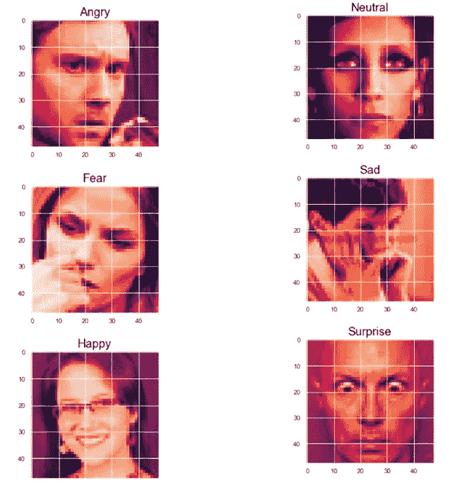
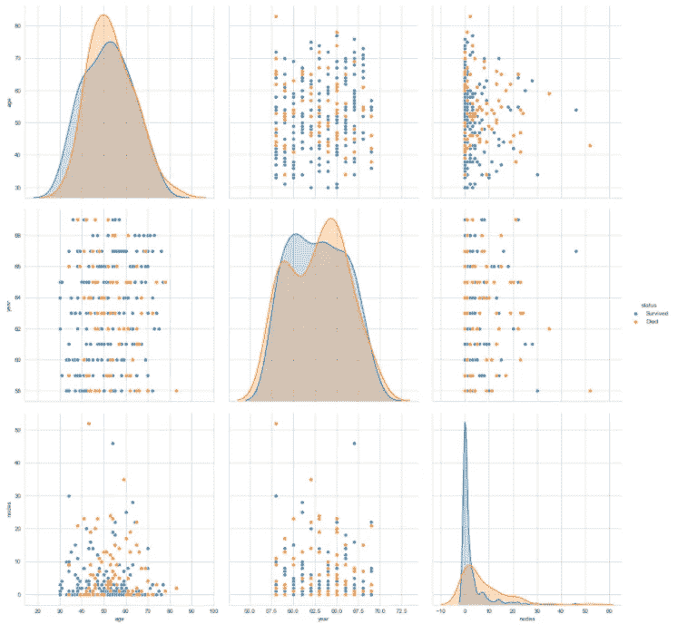
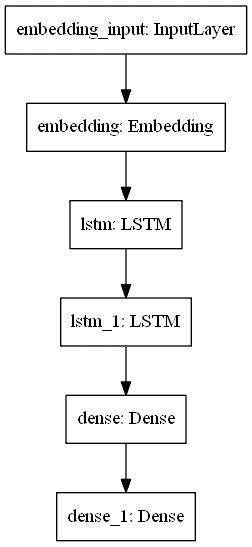
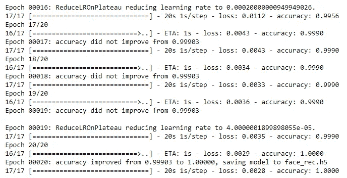
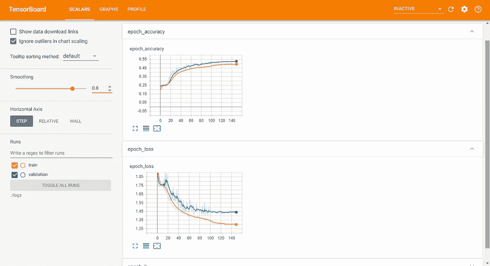

# 机器学习和数据科学项目的 10 步终极指南！

> 原文：<https://towardsdatascience.com/10-step-ultimate-guide-for-machine-learning-and-data-science-projects-ed61ae9aa301?source=collection_archive---------33----------------------->

## 详细讨论构建您的机器学习和数据科学项目的最佳方法。利用这 10 个步骤建立任何 ML 或数据科学项目！

照片由 [XPS](https://unsplash.com/@xps?utm_source=medium&utm_medium=referral) 在 [Unsplash](https://unsplash.com?utm_source=medium&utm_medium=referral) 上拍摄

数据科学和机器学习项目是最有趣和最吸引人的工作。

最初，当我开始我的人工智能之旅时，我对我可以支配的巨大机会和项目着迷。

我很兴奋，想把它们都做一遍。

然而，我会挑选一些这样的项目，一次开始一个，有时甚至一起开始，但是我很难找到成功完成它们的正确途径。

我发现大多数初学者也有类似的问题，并且在开始他们的项目时也在方向和组装上挣扎。为了以正确的方式构建您的项目，本文将介绍完整的路线图。

严格按照本文中编写的每一步来遵循给出的路线图是很重要的(除了少数例外)。类似于没有烹饪或订购就不能吃食物，没有实际构建就不能部署模型。

抛开这个类比，让我们来看看开发令人敬畏和酷的机器学习/数据科学项目的逐步过程。

# 1.问题陈述的选择和制定:

照片由[🇸🇮·扬科·菲利](https://unsplash.com/@itfeelslikefilm?utm_source=medium&utm_medium=referral)在 [Unsplash](https://unsplash.com?utm_source=medium&utm_medium=referral) 拍摄

> 研究，研究，再研究。

对于任何机器学习或数据科学项目来说，最重要的一步是确保你脑海中有一个问题陈述。然后继续研究同样的问题。

选择你认为比你的技能水平高一小步的问题陈述。如果你只是一个开始数据科学之旅的初学者，那么选择一个稍微复杂的初级项目。让我们说一些简单的线性回归项目也应该足够了。

如果你已经完成了一些基本的初级项目，那么瞄准一些中级项目射高一点应该是个不错的主意。了解你的技能，并不断努力提高它们。

请一次做一个项目。确保你对你选择从事的项目做了广泛的研究，不要让自己不知所措。

同时，不要一开始就放弃。请记住，没有人，绝对没有人在第一次尝试时就能得到所有的东西。所以不要放弃，坚持下去，直到完成你的机器学习或者数据科学项目。

# 2.制定和策划您的计划:

在 [Unsplash](https://unsplash.com?utm_source=medium&utm_medium=referral) 上由 [Austin Distel](https://unsplash.com/@austindistel?utm_source=medium&utm_medium=referral) 拍摄的照片

既然我们对要实施的项目有了一个清晰的概念，那么制定相应的策略和计划是非常必要的。

我强烈推荐的一个策略是通过研究论文、谷歌搜索(尤其是关于谷歌学术的搜索)阅读更多，或者通过在线观看 YouTube 视频了解更多。

在进入下一步并开始项目的实际实施之前，获得更多关于项目的信息和知识总是更好的。

为要执行的每项任务和应用程序建立一个大概的估计。考虑计算过程可能需要的资源和时间的数量。而且不用担心，这个估计不需要 100%准确。

对于这一步来说，只需要简单地了解一下计划如何执行就足够了。

# 3.数据收集:

作者截图

分析您的计划后的下一步是收集一些数据，以便您可以开始实施您的数据科学或机器学习项目。

数据收集是在一个已建立的系统中收集和测量目标变量信息的过程，然后使人们能够回答相关问题和评估结果。

谷歌搜索显然是寻找新资源的最佳方式。Kaggle 为其举办的每个特定比赛提供了一些最佳数据和数据集选项。有时在 GitHub 上也可以找到非常有趣的数据集。

如果你正在寻找做一些自然语言处理项目，那么你也可以利用维基百科或其他类似的网站通过网络抓取来提取数据。

Data.gov 和 UCI 机器学习库是其他很棒的网站，它们提供了大量丰富的数据集选项。

如果你想知道上面的人脸数据集使用的图像，那么请随意访问我的另一篇文章，它涵盖了深度学习端到端项目。下面提供了链接。

 [## 使用深度学习的人类情感和手势检测器:第 1 部分

### 了解如何从零开始构建具有深度学习的人类情感和手势检测器。

towardsdatascience.com](/human-emotion-and-gesture-detector-using-deep-learning-part-1-d0023008d0eb) 

# 4.探索性数据分析:

作者截图

可视化是任何数据科学项目的一个重要方面。

在统计学中，探索性数据分析是一种分析数据集以总结其主要特征的方法，通常采用可视化方法。可以使用或不使用统计模型，但 EDA 主要是为了查看数据可以告诉我们什么，而不仅仅是正式的建模或假设测试任务。

探索性数据分析在数据科学和机器学习项目领域的作用是能够详细了解手头的数据。

探索性数据分析提供了许多图表和种类来可视化和分析可用的数据。它提供了对如何进一步发展的简要理解和想法。

pyplot 和 seaborn 是用于可视化和执行探索性数据分析任务的两个最佳库模块。

请随意通过下面提供的链接访问我的另一篇文章，这篇文章涵盖了深度学习端到端项目的第二部分。下面链接中的文章进一步详细介绍了探索性数据分析，这是一个现实生活中的问题，有助于更好地理解这个分步指南。

 [## 使用深度学习的人类情感和手势检测器:第 2 部分

### 深入探究人类情感和手势识别

towardsdatascience.com](/human-emotion-and-gesture-detector-using-deep-learning-part-2-471724f7a023) 

# 5.预处理数据集:

照片由 [Unsplash](https://unsplash.com?utm_source=medium&utm_medium=referral) 上的 battle creek 咖啡烘焙师拍摄

对数据集进行预处理是数据科学的精髓部分。

我们可用的数据可能并不总是“干净的”在此引用中，clean 的含义是对任务有用的选择性数据。在自然可用的数据中，有许多冗余必须被删除，以获得一个整体干净的数据集来处理。

数据预处理是数据挖掘过程中的一个重要步骤。“垃圾进，垃圾出”这句话特别适用于数据挖掘和机器学习项目。

数据收集方法通常控制松散，导致超出范围的值、不可能的数据组合和缺失值等。

为了简化自然语言处理任务，最好使用 python 中内置的正则表达式模块。有关这方面的更多信息，请参考下面提供的文章链接。

 [## 4 个基本正则表达式操作符使自然语言处理变得更简单！

### 了解四种基本的常规操作，以清理几乎任何类型的可用数据。

towardsdatascience.com](/natural-language-processing-made-simpler-with-4-basic-regular-expression-operators-5002342cbac1) 

熊猫模块必须高度重视浏览我们的数据集。正则表达式模块对于预处理也非常重要。

# 6.构建您的结构:

克里斯多夫·伯恩斯在 [Unsplash](https://unsplash.com?utm_source=medium&utm_medium=referral) 上拍摄的照片

预处理步骤完成后，下一步是为您计划构建的模型构建结构。

这一步可以代表各种事物。

如果你正在处理一个机器学习问题，那么你要确保你完成了所有必要参数的计算。

其他需求可以是变量的热编码、特征缩放或其他建模需求，如将数据相应地分割成训练、测试或验证、选择超参数、调整模型等。

决定将用于整体实施的整个结构和流程。设计您的建模方法并构建一个最终管道，您可以开始开发您的模型。

您还可以选择最适合当前任务的算法。这可以是简单的线性回归算法，也可以是复杂的深度学习方法。

现在让我们进入有趣的部分，即模型的开发。

# 7.开发您的机器学习或深度学习模型:

作者截图

在可视化、预处理和构造步骤之后，我们最终可以转移到开发模型的更有趣的部分。

为更好地完成任务设计合适的模型是机器学习和数据科学最重要的方面。

为特定任务选择正确的算法以及设计能够解决问题并证明是最佳方法的简明架构是极其重要的。

在机器学习中，无论是有监督的还是无监督的，你都有一堆选项可以选择。如果您有时间和资源，并且不太确定哪种算法执行得最好，您可以尝试所有算法，然后决定哪种模型最适合您的问题陈述。

在深度学习中，您可以通过顺序方法、功能方法或自定义方法构建一个架构，以从头开始构建您自己的自定义模型，或者您可以利用许多可用的迁移学习模型，并尝试简化您的任务。

模型的开发是最重要的一步，因为该模型将被训练、测试和部署。所以把这一步做好是极其重要的。

现在让我们进入培训阶段。

# 8.训练/拟合您的模型:

作者截图

一旦模型建立起来，我们就可以前进到培训步骤。

训练模型是为了确保我们找到一个几乎完美的拟合，具有较低的损失和较高的精度。这也是为了确保没有欠拟合或过拟合。

欠拟合是指构建的模型表现不佳，无法对事物进行相应的分类并按要求解决问题。

过度拟合是指模型拟合得非常好，甚至考虑了异常值和噪声点，导致预测任务不准确。

学习算法在训练数据中查找将输入数据属性映射到目标(您要预测的答案)的模式，并输出捕获这些模式的 ML 模型。您可以使用 ML 模型来预测您不知道目标的新数据。

基本上，训练模型仅仅意味着从标记的例子中学习(确定)所有权重和偏差的好值。

现在让我们看看如何执行测试和分析步骤。

# 9.测试和分析您创建的模型:

作者截图

随着模型的构建和拟合完成，我们需要测试和分析我们拥有的模型。

我们可以利用图表来验证这些测试，并确保模型按预期执行。对于机器学习项目，您可以借助 python 提供的 matplotlib 库制作自己的自定义图表。

但是，您可以利用 TensorFlow 中的 tensorboard 选项来验证和检查培训实施。

这些图表应该能够提供一个详细的方法来说明所构建的模型将如何执行。在部署您的模型之前，还可以通过使用 AB 测试的方法来做进一步的分析。

如果你有兴趣了解更多，请随时查看这篇关于[下一个单词预测](/next-word-prediction-with-nlp-and-deep-learning-48b9fe0a17bf)和[创新聊天机器人](/innovative-chatbot-using-1-dimensional-convolutional-layers-2cab4090b0fc)的文章。

# 10.部署您的模型:

[钳工](https://unsplash.com/@benchaccounting?utm_source=medium&utm_medium=referral)对[去毛刺](https://unsplash.com?utm_source=medium&utm_medium=referral)拍照

部署阶段是构建任何模型的最后阶段。

一旦您成功地完成了模型的构建，如果您想自己保留它或部署它以便您可以面向更广泛的受众，这是一个可选步骤。

部署的方法各不相同，从将它部署为可以跨平台转移的应用程序，到使用 amazon 提供的 AWS 云平台进行部署，再到使用嵌入式系统。

如果你想部署像安全摄像头这样的东西，那么你可以考虑在摄像头旁边使用像 raspberry pi 这样的东西。如果您有兴趣了解更多关于面部识别的信息，以便只授予授权所有者访问权限，那么可以考虑下面提供的文章。

 [## 智能面部锁定系统

### 建立高精度人脸识别模型

towardsdatascience.com](/smart-face-lock-system-6c5a77aa5d30) 

有了所有这 10 个步骤，你应该准备好开始和完成你所有的数据科学或机器学习项目！

肖恩·奥·在 [Unsplash](https://unsplash.com?utm_source=medium&utm_medium=referral) 上拍摄的照片

# 结论:

在本文中，我们介绍了每个机器学习项目的逐步路线图和方法。

这些步骤中的每一步对于构建成功的数据科学或机器学习项目的完美架构都非常重要。

此外，必须按照上述相同的顺序执行上述每个步骤，选择性项目可能只有极少数例外。

总结一下所有涉及的步骤，确保在决定你的项目之前进行彻底的研究。然后在你开始实施你的项目之前制定一个计划。收集所有需要的数据，开始着手手头的工作。

执行探索性数据分析，以便对您拥有的数据和数据集有一个简要的了解。然后对数据进行相应的预处理，从构建结构开始。构建所需的模型并开始训练它们。

测试你训练过的模型，彻底分析。最后，您的模型现在应该可以部署了。部署您的模型以获得更广泛的受众。

看看我的其他一些文章，你可能会喜欢读！

 [## OpenCV:用代码掌握计算机视觉基础的完全初学者指南！

### 包含代码的教程，用于掌握计算机视觉的所有重要概念，以及如何使用 OpenCV 实现它们

towardsdatascience.com](/opencv-complete-beginners-guide-to-master-the-basics-of-computer-vision-with-code-4a1cd0c687f9)  [## 分步指南:使用 Python 进行数据科学的比例采样！

### 了解使用 python 进行数据科学所需的比例采样的概念和实现…

towardsdatascience.com](/step-by-step-guide-proportional-sampling-for-data-science-with-python-8b2871159ae6)  [## 2020 年及以后最受欢迎的 10 种编程语言

### 讨论当今 10 种最流行的编程语言的范围、优缺点

towardsdatascience.com](/10-most-popular-programming-languages-for-2020-and-beyond-67c512eeea73)  [## 带有完整代码片段和有用链接的 5 个最佳 Python 项目创意！

### 为 Python 和机器学习创建一份令人敬畏的简历的 5 个最佳项目想法的代码片段和示例！

towardsdatascience.com](/5-best-python-project-ideas-with-full-code-snippets-and-useful-links-d9dc2846a0c5) 

谢谢你们坚持到最后。我希望你们都喜欢这篇文章。祝大家有美好的一天！