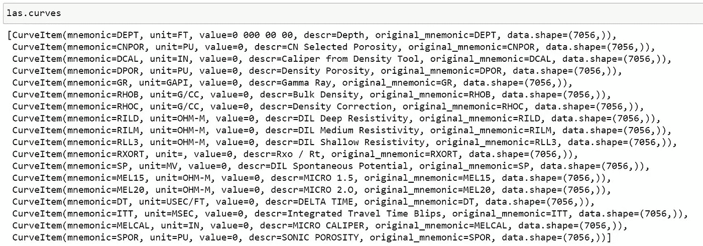
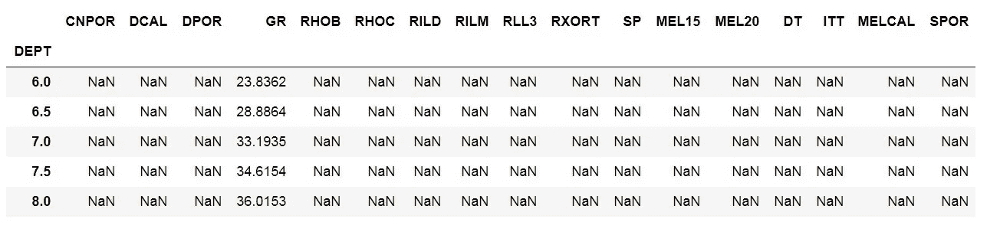
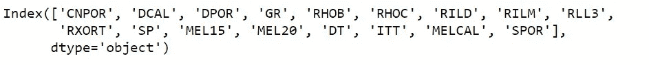
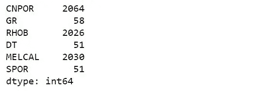
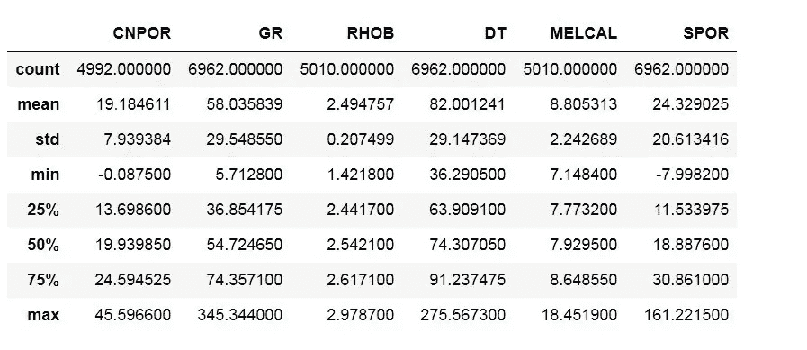
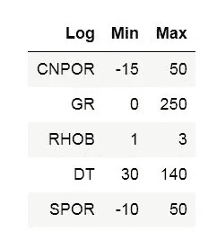
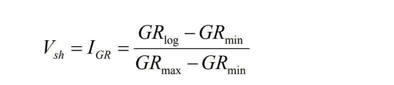
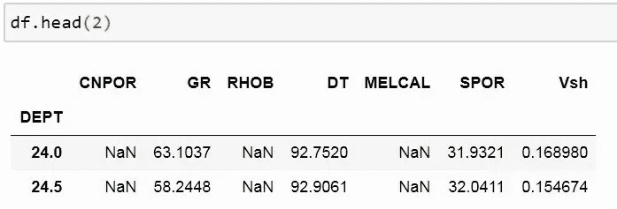
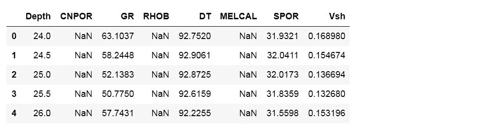
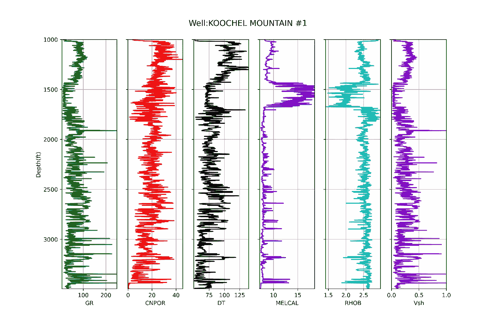

# Pandas 中处理 LAS 文件和绘图的 10 个步骤(第一部分)

> 原文：<https://towardsdatascience.com/10-steps-in-pandas-to-process-las-file-and-plot-610732093338?source=collection_archive---------7----------------------->

## 我使用这些步骤来准备 LAS 格式的测井数据，以便用 python 绘图

测井 ASCII 标准(LAS)是石油和天然气行业存储测井信息的常用格式。测井是通过深度间隔测量的地下岩石的物理特性。有几个商业软件可以读取这种格式。LAS 查看器有时是免费的，但功能有限。如果你想实现数据分析或高级数学计算，你必须购买许可证。

下面列出我使用最多的步骤:
1)读取文件
2)数据检查
3)列选择
4)缺失数据
5)删除行
6)统计
7)过滤
8)添加列
9)索引
10)绘图

如果你想使用我的示例数据，你可以访问堪萨斯大学的免费数据集。下载 2019 年 8 月的压缩文件，解压到您最喜欢的硬盘中。然后将文件号 *1050383876* 复制到工作 Jupyter 笔记本目录中读取。你也可以直接从我的 Github [账户](https://github.com/mardani72/LAS_Pandas)中获取本作品的全部 Jupyter 笔记本源文件和数据。

LAS 格式文件不能像熊猫那样用 python 中的通用库读取。首先我们需要安装 [*lasio*](https://lasio.readthedocs.io/en/latest/) lib。lasio 被编写为与 python 兼容，并且具有 NumPy 和 ordereddict 依赖。运行以下代码进行安装:

```
pip install lasio
pip install -r optional-packages.txt
pip install --upgrade lasio
```

# 1)读取文件

导入熊猫、numpy 和 lasio 后，按如下方式读取 LAS 文件:

```
import pandas as pd
import numpy as np
import lasiolas = lasio.read(r'1050383876.las')
```

lasio 有很好的特性，比如曲线可以在 LAS 文件的头部分显示日志信息。运行:

```
las.curves
```



使用这个命令，我们可以看到可用的曲线日志和基本信息，如文件中的单位和样本数据点数量。lasio 有其他功能，但我个人更喜欢将 LAS 文件转换成 pandas 数据帧，以获得其常用功能的优势:

```
df = las.df()    #store las file in df variable as pandas dataframe
```

# 2)数据检查

在 pandas 中使用 *head()* 函数，如果适合屏幕，我们可以看到 5 行和全部列。

```
df.head()
```



```
df.shape
```


数据帧有 17 个测井数据，列中有 7056 行作为深度间隔的采样点。我们可以认为井的较浅部分仅由 GR 记录，其余部分为空值。空值的 LAS 标准是-999.2500。

# 3)列选择

根据您的项目目的，您可以在数据集中选择不同的变量。首先，让我们看看这个文件中的可用日志:

```
df.columns
```



从这些日志中，我宁愿选择中子孔隙度、伽马射线、体积密度、声波、井径和计算声波孔隙度的列，并存储在一个新的变量中。请记住使用双括号，如下所示:

```
df_selected = df[['CNPOR', 'GR', 'RHOB', 'DT', 'MELCAL', 'SPOR']]
```

# 4)缺失数据

缺少值在 LAS 文件中非常常见，因为感兴趣的深度可能因具体测量而异。LAS 文件中打印的值-999.2500 表示空值。缺失值在数据集的中间部分并不常见。通常，它发生在文件的头部或尾部。 *isna* 函数如果位置有空值则返回 True，否则为 False。我们可以使用 *sum()* 函数将这些布尔值相加，如下所示:

```
df_selected.isna().sum()
```



假设我们希望将 GR、DT 和 SPOR 作为重要的日志保存在数据集中。因此，为了消除丢失的值，我们可以删除其中一个日志丢失的行。

# 5)删除行

```
df_dropped = df_selected.dropna(subset=['GR', 'DT', 'SPOR'],axis=0, how='any')
```

这行代码将删除一个(或多个)子集日志(' GR '，' DT '，' SPOR ')具有空值的所有行。

# 6)统计

运行*描述*命令查看数据统计。这有助于查看数据范围和异常值。

```
df_dropped.describe()
```



岩石的岩石物理性质有一个正常范围。超出该范围的读数不应视为有效。这些范围是:



将此表与我们文件的统计数据进行比较，可以看出我们有一些值超出了范围，我们可以过滤数据集。例如,“SPOR”的最大值是 162 %,而这在自然界是不可能的。

# 7)过滤

有几种方法可以过滤数据，比如 zscore。在这种方法中，我们可以去掉超出特定标准偏差范围(如 2 或更大)的值。我个人更喜欢高/低截滤波器，因为我可以控制最小值和最大值，如下所示:

```
df_filt1 = df_dropped.loc[(df_dropped.CNPOR > -15) & (df_dropped.CNPOR <= 50)]
df_filt2 = df_filt1.loc[(df_dropped.GR > 0) & (df_dropped.GR  <= 250)]
df_filt3 = df_filt2.loc[(df_dropped.RHOB> 1) & (df_dropped.RHOB<= 3)]
df_filt = df_filt3.loc[(df_dropped.DT > 30) & (df_dropped.DT <= 140)]
```

我们不需要过滤 SPOR，因为它是 DT 的函数。

# 8)添加列

有时我们需要使用现有的日志计算一个参数，并存储在单独的列中。让我们用最简单的等式来计算页岩体积:



```
df = df_filt.copy()      #make a copy of the latest dataset
df['Vsh'] = (df.GR - df.GR.min()) / (df.GR.max() - df.GR.min())
```



页岩体积作为名为 Vsh 的列添加。

# 9)索引

当我们读取 LAS 文件时，lasio 将深度列转换为索引。我们可以将深度称为绘制 aim 和重新索引数据集的新列。

```
df_idx = df.rename_axis('Depth').reset_index()
df_idx.head()
```



# 10)绘图

用 python 绘图是一个全面的讨论，但我将使用最简单的方法来可视化我的最终数据集。

```
import matplotlib.pyplot as plt
```

为了使代码可读和可重用，让我们定义一个函数:

```
def log_plot(logs):
    logs = logs.sort_values(by='Depth')
    top = logs.Depth.min()
    bot = logs.Depth.max()

    f, ax = plt.subplots(nrows=1, ncols=6, figsize=(12,8))
    ax[0].plot(logs.GR, logs.Depth, color='green')
    ax[1].plot(logs.CNPOR, logs.Depth, color='red')
    ax[2].plot(logs.DT, logs.Depth, color='black')
    ax[3].plot(logs.MELCAL, logs.Depth, color='blue')
    ax[4].plot(logs.RHOB, logs.Depth, color='c')
    ax[5].plot(logs.Vsh, logs.Depth, color='m')

    for i in range(len(ax)):
        ax[i].set_ylim(top,bot)
        ax[i].invert_yaxis()
        ax[i].grid()

    ax[0].set_xlabel("GR")
    ax[0].set_xlim(logs.GR.min(),logs.GR.max())
    ax[0].set_ylabel("Depth(ft)")
    ax[1].set_xlabel("CNPOR")
    ax[1].set_xlim(logs.CNPOR.min(),logs.CNPOR.max())
    ax[2].set_xlabel("DT")
    ax[2].set_xlim(logs.DT.min(),logs.DT.max())
    ax[3].set_xlabel("MELCAL")
    ax[3].set_xlim(logs.MELCAL.min(),logs.MELCAL.max())
    ax[4].set_xlabel("RHOB")
    ax[4].set_xlim(logs.RHOB.min(),logs.RHOB.max())
    ax[5].set_xlabel("Vsh")
    ax[5].set_xlim(logs.Vsh.min(),logs.Vsh.max())

    ax[1].set_yticklabels([]); ax[2].set_yticklabels([]);
    ax[3].set_yticklabels([])
    ax[4].set_yticklabels([]); ax[5].set_yticklabels([]) 

    f.suptitle('Well:KOOCHEL MOUNTAIN #1', fontsize=14,y=0.94)
```

像这样调用函数:

```
log_plot(df_idx)
```



# 结论

在这项工作中，我阅读了一口单井的 LAS 文件，其中包括几份岩石物理测井记录。转换为 pandas 数据框便于流畅地使用和处理。这些步骤可以以不同的顺序实现。

如果您喜欢其他方式，建议改进，或者对类似的数据集有一些困难，请留下评论！