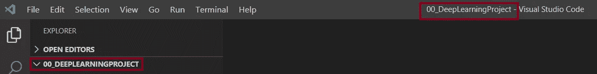
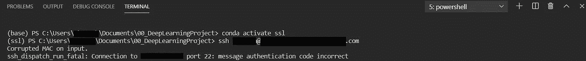

# 在 Windows 上使用 VSCode 设置全面的数据科学工作空间的 10 个步骤

> 原文：<https://towardsdatascience.com/10-steps-to-setup-a-comprehensive-data-science-workspace-with-vscode-on-windows-32fe190a8f3?source=collection_archive---------28----------------------->


VSCode 扩展。作者图片

要开始一个数据科学项目，选择一个有效的开发环境总是第一步。Jupyter 笔记本/实验室是常见的选择。我非常喜欢它。但是真的不够。

在我开始第一个专业数据科学项目的时候，我一起使用了很多工具:用于模型训练的 Jupyter Notebook，用于结构化 python 脚本的 PyCharm(免费社区版)，用于 Python 包管理的 Anaconda Prompt，用于远程 SSH 连接的 MobaXterm，用于原始数据审核的 Excel 等等。每天，我总是在不同的窗口之间跳来跳去。

幸运的是，我找到了一个支持以上所有功能的工具，最重要的是，它是免费的: ***VSCode*** 。

如果您正遭受与上述相同的问题，或者您是数据科学领域的初学者，本指南可能会帮助您构建自己的有效数据科学工作空间，并有一个良好的起点。

## 完成 10 个设置步骤后，在 VSCode 的单一窗口中，您将能够:

*   使用 Anaconda
*   编写结构化和可读的 python 脚本
*   使用 Jupyter 笔记本
*   管理 python 包和 conda 虚拟环境
*   通过 SSH 在远程服务器(例如 GPU 节点)上工作，界面非常用户友好
*   查看和编辑不同类型的文件(例如 txt，。csv，。xlsx，。png，。md，。yml，Dockerfile …)
*   使用 Git 版本控制
*   灵活应对未来的项目扩展，例如添加基于 Docker 的部署

现在，我们开始吧~🚀

```
**Overview of Contents**
Step 1: Install Anaconda
Step 2: (Optional) Create a Virtualenv in Anaconda Prompt
Step 3: Open VSCode
Step 4: Open Your Project Folder from VSCode
Step 5: Install Python Extension in VSCode
Step 6: Enable Your Virtualenv in VSCode
Step 7: Config the VSCode Terminal for 'conda' & 'python'
Step 8: Enable Jupyter Notebook in VSCode
Step 9: Connect to the Remote Server from VSCode via SSH
Step 10: Do Git Push in VSCode
```

**【以下设置基于 win 10】**

## 步骤 1:安装 Anaconda

你可以从[这里](https://www.anaconda.com/products/individual)安装最新版本，或者从[这里](https://repo.anaconda.com/archive/)安装存档版本。如果你准备使用 VSCode 中的集成终端，我强烈推荐你安装 Anaconda **≥ 4.6** 的版本。

成功安装后，您还安装了 Jupyter Notebook、python 和一些用于数据科学的常见 Python 包。而且你现在可以在**中找到 ***蟒蛇导航器*******蟒蛇提示*******Jupyter 笔记本*** 图标。****

**

## *步骤 2:(可选)在 Anaconda 提示符下创建一个虚拟环境*

*为了避免不同项目之间的相互干扰，最好在隔离的虚拟环境中开发。如果你真的喜欢在默认的`base` env 中开发，你可以跳过这一步。*

*打开 ***蟒蛇提示*** 从 ***开始*** *菜单*:*

**

*检查您当前的环境列表:*

```
*conda env list*
```

*创建自己的 ***virtualenv*** ，使用名称和指定的 python 版本(例如名称:ssl):*

```
*conda create --name ssl python==3.6.4*
```

*激活 virtualenv:*

```
*conda activate ssl*
```

*检查此 virtualenv 中存在哪些包(python 应该在 virtualenv 创建期间安装):*

```
*conda list*
```

*在 VSCode 中完成设置后，您可以在 VSCode 终端中直接管理您的 virtualenv。*

*更多康达环境管理，请查看[此处](https://docs.conda.io/projects/conda/en/latest/user-guide/tasks/manage-environments.html#creating-an-environment-with-commands)。*

## *步骤 3:打开 VSCode*

***选项 1:** 从 ***首页*** 页面打开 ***巨蟒导航>*** 启动 ***VSCode*** 。*

**

*Anaconda Navigator 主页*

***选项 2:** 也可以从[网站](https://code.visualstudio.com/)安装 VSCode。这样，您可以获得一个快捷方式，然后从桌面或任务栏快速启动 VSCode。从我自己的经验来看，这种方式比方案一更快。*

## *步骤 4:从 VSCode 打开项目文件夹*

*在您喜欢的任何地方创建一个新的项目文件夹作为您的根目录。打开 VSCode >点击左上方的 ***文件*** 点击 ***打开文件夹*** >点击目标文件夹名称。现在，您可以将所有项目文件和脚本放在这里。*

****

## *步骤 5:在 VSCode 中安装 Python 扩展*

*VSCode 是一个支持多种语言的源代码编辑器。为了启用 Python，我们需要安装 Python 扩展。*

*点击 ***扩展*** 图标在左栏>搜索 ***Python*** >点击 ***安装*** :*

**

*现在，您可以简单地用`.py`文件扩展名创建标准的 python 脚本:*

****

*如果你也喜欢 helloWorld.py 前面可爱的 python 图标，可以通过添加***vs code Great Icons***扩展得到。它可以帮助您轻松区分不同类型的文件和文件夹:*

**

## *步骤 6:在 VSCode 中启用您的 Virtualenv*

*在 VSCode 中，按`ctrl+shift+p`，中间上方会弹出一个命令面板。点击**Python:Select Interpreter>**你会看到一个包含你所有 **virtualenv** 和 **base** env >的列表选择合适的 virtualenv。*

*如果看不到***Python:Select Interpreter***，只需键入并搜索即可。*

****

*之后，带有 env 名称的 python 解释器将显示在状态栏的左下方:*

**

## *步骤 7:为“conda”和“python”配置 VSCode 终端*

*点击左上方的**‘终端’**或快捷方式`ctrl+shift+``，打开一个新的 VSCode 终端。终端将在右下方打开。*

*根据您的个人偏好选择默认 shell(默认值:cmd):*

****

*如果你和我一样想在 Windows 上使用 Linux 命令，Powershell 是你不错的选择。*

*选中后，只需打开另一个新的终端来捕捉您的更新。如果您在上一步成功选择了 python 解释器，virtualenv 现在将通过`conda activate`在您新打开的终端中**自动**激活。并且 virtualenv 名称将显示在前面的`**()**`中:*

**

*现在，您可以通过以下方式在终端中执行`.py`文件*

```
*python helloWorld.py*
```

***💢你可能会遇到的两个常见错误:***

***1。**无法在 Powershell 中运行`conda activate`。*

***解决方案:**康达仅从 **4.6** 版本开始支持 Powershell 中的`conda activate`。因此，如果您想在 VSCode 中使用 Powershell 作为默认 shell，请确保您的 conda 版本至少是 4.6 或更高(在不同的 Windows 系统中可能会有所不同)*

***2。无法识别的术语**错误当你在终端**中运行`conda`或`python`解决方案:**通过在终端中运行下面的命令得到你的 **python** 和 **conda** 路径*

```
*where python
where conda*
```

*将 python 和 conda 路径复制并粘贴到**环境变量**的**路径**:*

**

## *步骤 8:在 VSCode 中启用 Jupyter 笔记本*

*安装*包，其中包括*笔记本*、 *qtconsole* 和 *IPython 内核* via**

```
**pip install jupyter
# or
conda install -c conda-forge jupyter**
```

**创建新的 jupyter 笔记本文件:按`ctrl+shif+p` >搜索 ***创建新的空白 Jupyter 笔记本*** >点击>保存创建的`.ipynb`文件并命名:**

********

**几秒钟后，右上方的 ***Jupyter 服务器*** 将自动设置为*本地*，而 ***内核*** 为步骤 5 中选择的 conda 环境。**

**如果没有，或者你想改变内核/env:按`ctrl+shif+p` >搜索 ***选择解释器启动 Jupyter 服务器*** >点击它> 从显示的列表中选择一个合适的 env:**

********

**现在，你可以像往常一样使用 Jupyter 笔记本了:**

****

## **步骤 9:从 VSCode 连接到远程 SSH 服务器**

**另一个我最喜欢的很棒的特性是远程 SSH 连接，它支持使用完整的 VSCode 特性集打开任何远程文件夹。**

**安装 ***远程 SSH* 扩展**:**

****

**然后，您会在状态栏的左下角看到一个小小的连接图标:**

****

**点击图标>选择 ***远程-SSH:连接主机… >*** 添加标准 SSH 连接命令`ssh username@hostname` >回车:**

********

**将会打开一个空窗口，自动设置远程 SSH 连接。连接后，您会在状态栏的左下方看到带有`SSH:username@hostname`的主机名:**

****

**现在，您可以在连接的远程机器上打开您的主目录下的任何文件夹，并像在本地一样使用它:**

****

**💢如果您在远程连接期间得到如下的 ***输入时 MAC 损坏*** 错误，您可以通过在`ssh`中添加可用的 MAC 加密算法来解决。我在[这个故事](https://medium.com/@gooongna/5-steps-setup-vs-code-for-remote-development-via-ssh-from-windows-to-linux-b9bae9e8f904)里贴出了详细的步骤。**

****

## **步骤 10:在 VSCode 中执行 Git 推送**

**VSCode 支持即时可用的 Git 版本控制，因此您可以用一种非常令人愉快的格式跟踪您的代码，并通过几次点击轻松地推送它。**

**如果您打开的文件夹在 git 存储库下，那么分支名称将显示在左下方，在 VSCode 中带有一个`*****`。更改文件的总数将在左边栏中显示 ***源代码控制*** 图标。**

**在下面的例子中，它在主分支中，有一个更改的文件处于*未跟踪*状态。**

****

**点击 ***源代码控制*** 图标>点击文件名>可以在比较视图中查看详细的代码变化:**

****

**点击文件后的`**+**`图标进行修改>在上面的框中添加提交消息>点击上面的✔提交:**

****

**然后一个**同步更改**操作将显示在状态栏中，带有一个小图标`**1↑**`，表示您还有 1 个提交尚未推送:**

****

**只需单击它即可推送所有已提交的更改。成功推送后，`**1↑**`指示灯将消失:**

****

**现在，您在 VSCode 中的数据科学工作区已经准备好了！**

## **结论**

**VSCode 远比我上面分享的强大。有许多支持不同开发需求的多样化扩展。如果您对它们不熟悉，并且在开始时对大型扩展池感到有点困惑，下面的基本扩展可能会帮助您开始。继续努力吧！**

```
****- Predawn Theme Kit**  # readable code
**- Sublime Text Keymap and Settings Importer** # readable code
**- Excel Viewer ** # preview csv file in excel format
**- Prettify JSON**  # parameter config
**- YAML**  # parameter config**
```