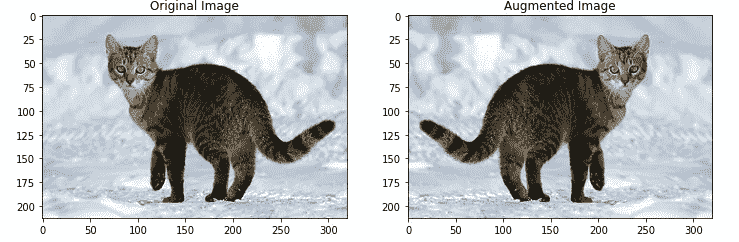
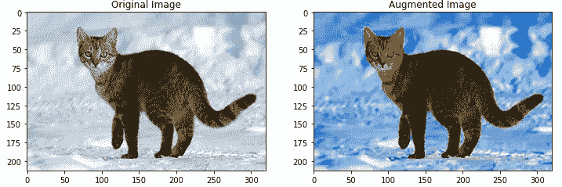
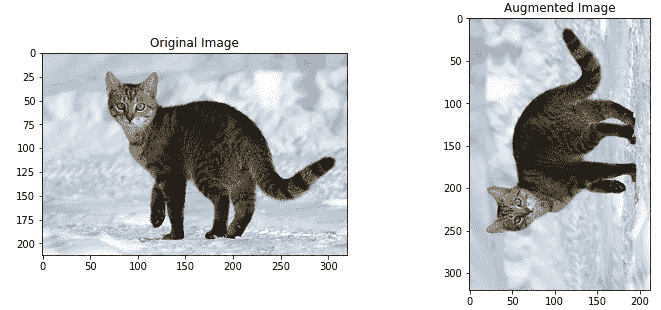
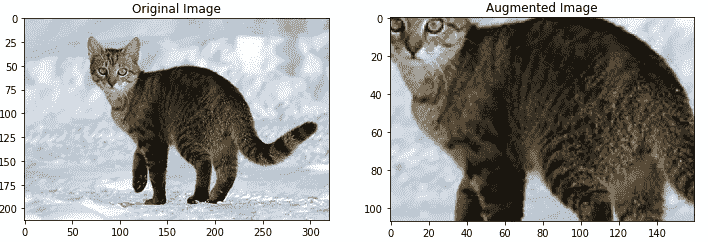
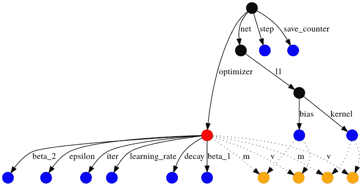

# 每个 ML 从业者必须知道的 10 个张量流技巧

> 原文：<https://towardsdatascience.com/10-tensorflow-tricks-every-ml-practitioner-must-know-96b860e53c1?source=collection_archive---------30----------------------->

## 为什么 TensorFlow 是完整的 ML 包


作者照片，Logo via [TensorFlow](https://www.tensorflow.org/)

TensorFlow 2.x 在构建模型和总体 TensorFlow 使用方面提供了很多简单性。TF2 有什么新鲜事吗？

*   使用 Keras 和热切的执行轻松构建模型。
*   在任何平台上的生产中实现强大的模型部署。
*   强大的研究实验。
*   通过清理废弃的 API 和减少重复来简化 API。

在本文中，我们将探讨 TF 2.0 的 10 个特性，这些特性使 TensorFlow 的使用更加流畅，减少了代码行数，提高了效率，因为这些函数/类属于 TensorFlow API。

# 第 1(a)条。用于构建输入管道的 tf.data API

tf.data API 提供了数据管道和相关操作的函数。我们可以构建管道、映射预处理函数、混洗或批处理数据集等等。

## 从张量构建管道

```
>>> dataset = tf.data.Dataset.from_tensor_slices([8, 3, 0, 8, 2, 1])
>>> iter(dataset).next().numpy()
8
```

## 分批和洗牌

```
**# Shuffle**
>>> dataset = tf.data.Dataset.from_tensor_slices([8, 3, 0, 8, 2, 1]).shuffle(6)
>>> iter(dataset).next().numpy()
0**# Batch**
>>> dataset = tf.data.Dataset.from_tensor_slices([8, 3, 0, 8, 2, 1]).batch(2)
>>> iter(dataset).next().numpy()
array([8, 3], dtype=int32)**# Shuffle and Batch**
>>> dataset = tf.data.Dataset.from_tensor_slices([8, 3, 0, 8, 2, 1]).shuffle(6).batch(2)
>>> iter(dataset).next().numpy()
array([3, 0], dtype=int32)
```

## 压缩两个数据集

```
>>> dataset0 = tf.data.Dataset.from_tensor_slices([8, 3, 0, 8, 2, 1])
>>> dataset1 = tf.data.Dataset.from_tensor_slices([1, 2, 3, 4, 5, 6])
>>> dataset = tf.data.Dataset.zip((dataset0, dataset1))
>>> iter(dataset).next()
(<tf.Tensor: shape=(), dtype=int32, numpy=8>, <tf.Tensor: shape=(), dtype=int32, numpy=1>)
```

## 映射外部函数

```
def into_2(num):
     return num * 2>>> dataset = tf.data.Dataset.from_tensor_slices([8, 3, 0, 8, 2, 1]).map(into_2)
>>> iter(dataset).next().numpy()
16
```

# 第 1 款(b)项。图像数据生成器

这是 tensorflow.keras API 最好的特性之一(在我看来)。ImageDataGenerator 能够生成数据集切片，同时进行批处理和预处理，并实时增加数据**。**

生成器允许数据流直接来自目录或数据帧。

> 关于 ImageDataGenerator 中数据扩充的一个**误解**是，它**向现有数据集添加更多数据**。虽然这是数据扩充的实际定义，但在 ImageDataGenerator 中，数据集中的**图像会在训练的不同步骤中动态转换**，以便模型可以在它没有看到的有噪声的数据上进行训练。

```
train_datagen = ImageDataGenerator(
        rescale=1./255,
        shear_range=0.2,
        zoom_range=0.2,
        horizontal_flip=True
)
```

这里，对所有样本进行重新缩放(用于归一化)，而其他参数用于增强。

```
train_generator = train_datagen.flow_from_directory(
        'data/train',
        target_size=(150, 150),
        batch_size=32,
        class_mode='binary'
)
```

我们为实时数据流指定目录。这也可以使用数据帧来完成。

```
train_generator = flow_from_dataframe(
    dataframe,
    x_col='filename',
    y_col='class',
    class_mode='categorical',
    batch_size=32
)
```

*x_col* 参数定义图像的完整路径，而 *y_col* 参数定义分类的标签列。

该模型可以直接由发电机供电。尽管需要指定*每个时期的步骤数*参数，该参数本质上是*样本数//批量大小。*

```
model.fit(
    train_generator,
    validation_data=val_generator,
    epochs=EPOCHS,
    steps_per_epoch=(num_samples // batch_size),
    validation_steps=(num_val_samples // batch_size)
)
```

# 2.用 tf.image 扩充数据

数据扩充是必要的。在数据不足的情况下，对数据进行修改并将其作为一个独立的数据点，是在数据较少的情况下进行训练的一种非常有效的方法。

tf.image API 提供了用于转换图像的工具，这些工具稍后可以用于前面讨论的 tf.data API 的数据扩充。

```
flipped = tf.image.flip_left_right(image)
visualise(image, flipped)
```



上述代码片段的输出

```
saturated = tf.image.adjust_saturation(image, 5)
visualise(image, saturated)
```



上述代码片段的输出

```
rotated = tf.image.rot90(image)
visualise(image, rotated)
```



上述代码片段的输出

```
cropped = tf.image.central_crop(image, central_fraction=0.5)
visualise(image, cropped)
```



上述代码片段的输出

# 3.张量流数据集

```
pip install tensorflow-datasets
```

这是一个非常有用的库，因为它是 TensorFlow 从各个领域收集的非常著名的数据集的单一转储点。

```
import tensorflow_datasets as tfdsmnist_data = tfds.load("mnist")
mnist_train, mnist_test = mnist_data["train"], mnist_data["test"]
assert isinstance(mnist_train, tf.data.Dataset)
```

tensorflow-datasets 中可用数据集的详细列表可在文档的[数据集页面上找到。](https://www.tensorflow.org/datasets/catalog/overview)

> 音频、图像、图像分类、对象检测、结构化、摘要、文本、翻译、视频是 tfds 提供的类型。

# 4.预训练模型下的迁移学习

迁移学习是机器学习中的新亮点，听起来很重要。训练一个已经被其他人训练过的基准模型并且拥有大量资源(例如，一个人可能负担不起的多个昂贵的 GPU)是不可行和不切实际的。迁移学习解决了这个问题。一个预训练的模型可以为一个给定的用例重用，或者可以为一个不同的用例扩展。

TensorFlow 提供了基准预训练模型，可以根据所需的使用情况轻松扩展。

```
base_model = tf.keras.applications.MobileNetV2(
    input_shape=IMG_SHAPE,
    include_top=False,
    weights='imagenet'
)
```

这个 *base_model* 可以很容易地用附加层或者不同的模型来扩展。例如:

```
model = tf.keras.Sequential([
    base_model,
    global_average_layer,
    prediction_layer
])
```

有关 tf.keras.applications 下其他模型和/或模块的详细列表，请参考[文档页面](https://www.tensorflow.org/api_docs/python/tf/keras/applications)。

# 5.评估者

> 估计器是 TensorFlow 对完整模型的高级表示，它被设计为易于扩展和异步训练
> 
> — [张量流文档](https://www.tensorflow.org/tutorials/estimator/premade)

预制估算器提供了一个非常高层次的模型抽象，因此您可以直接专注于训练模型，而不用担心较低层次的复杂性。例如:

```
linear_est = tf.estimator.LinearClassifier(
    feature_columns=feature_columns
)linear_est.train(train_input_fn)
result = linear_est.evaluate(eval_input_fn)
```

这显示了使用 tf.estimator 构建和训练估计器是多么容易。估计器也可以定制。

TensorFlow 有许多预制的估计器，包括线性回归器、BoostedTreesClassifier 等。在 [TensorFlow 文档](https://www.tensorflow.org/api_docs/python/tf/estimator)中可以找到完整、详细的估算表。

# 6.自定义图层

众所周知，神经网络是多层深度网络，其中各层可以是不同的类型。张量流包含许多预定义的层(如密集，LSTM 等。).但是对于更复杂的体系结构，层的逻辑要比主层复杂得多。对于这种情况，TensorFlow 允许构建自定义图层。这可以通过创建 tf.keras.layers.Layer 类的子类来实现。

```
class CustomDense(tf.keras.layers.Layer):
    def __init__(self, num_outputs):
        super(CustomDense, self).__init__()
        self.num_outputs = num_outputs

    def build(self, input_shape):
        self.kernel = self.add_weight(
            "kernel",
            shape=[int(input_shape[-1]),
            self.num_outputs]
        )

    def call(self, input):
        return tf.matmul(input, self.kernel)
```

如[文档](https://www.tensorflow.org/tutorials/customization/custom_layers)中所述，实现您自己的层的最佳方式是扩展 tf.keras.Layer 类并实现:

1.  *__init__* ，在这里可以进行所有与输入无关的初始化。
2.  *构建*，在这里你知道输入张量的形状，并且可以完成剩下的初始化工作。
3.  *调用*，在这里进行正向计算。

虽然内核初始化可以在 *__init__* 中完成，但是在 *build* 中初始化被认为更好，否则，您将不得不在每个新层创建的实例上显式指定 *input_shape* 。

# 7.定制培训

tf.keras Sequential 和 Model API 使得训练模型更加容易。然而，大多数时候在训练复杂模型时，使用定制损失函数。此外，模型训练也可以不同于默认值(例如，将梯度分别应用于不同的模型组件)。

TensorFlow 的自动微分功能有助于高效计算梯度。这些原语用于定义自定义训练循环。

```
def train(model, inputs, outputs, learning_rate):
    with tf.GradientTape() as t:
 **# Computing Losses from Model Prediction**
        current_loss = loss(outputs, model(inputs)) **# Gradients for Trainable Variables with Obtained Losses**
    dW, db = t.gradient(current_loss, [model.W, model.b]) **# Applying Gradients to Weights**
    model.W.assign_sub(learning_rate * dW)
    model.b.assign_sub(learning_rate * db)
```

这个循环可以重复多个时期，并根据使用情况进行更加定制的设置。

# 8.检查站

保存张量流模型有两种类型:

1.  **SavedModel** :保存模型的完整状态以及所有参数。这与源代码无关。`model.save_weights('checkpoint')`
2.  **检查点**

检查点捕获模型使用的所有参数的精确值。用顺序 API 或模型 API 构建的模型可以简单地保存为 SavedModel 格式。

但是，对于定制模型，检查点是必需的。

> 检查点不包含由模型定义的计算的任何描述，因此通常仅当使用保存的参数值的源代码可用时才有用。

## 保存检查点

```
checkpoint_path = “save_path”**# Defining a Checkpoint**
ckpt = tf.train.Checkpoint(model=model, optimizer=optimizer)**# Creating a CheckpointManager Object**
ckpt_manager = tf.train.CheckpointManager(ckpt, checkpoint_path, max_to_keep=5)**# Saving a Model**
ckpt_manager.save()
```

## 从检查点加载

TensorFlow 通过遍历带有命名边的有向图，从正在加载的对象开始，将变量与检查点值进行匹配。



通过[文档](https://www.tensorflow.org/guide/checkpoint)恢复模型的依赖图

```
if ckpt_manager.latest_checkpoint:
    ckpt.restore(ckpt_manager.latest_checkpoint)
```

# 9.Keras 调谐器

这是 TensorFlow 中一个相当新的特性。

```
!pip install keras-tuner
```

超参数调整或超调整是挑选定义 ML 模型配置的参数的过程。这些因素是特征工程和预处理后模型性能的决定因素。

```
**# model_builder is a function that builds a model and returns it**
tuner = kt.Hyperband(
    model_builder,
    objective='val_accuracy', 
    max_epochs=10,
    factor=3,
    directory='my_dir',
    project_name='intro_to_kt'
)
```

除了 HyperBand，BayesianOptimization 和 RandomSearch 也可用于调优。

```
tuner.search(
    img_train, label_train, 
    epochs = 10, 
    validation_data=(img_test,label_test), 
    callbacks=[ClearTrainingOutput()]
)
 **# Get the optimal hyperparameters**
best_hps = tuner.get_best_hyperparameters(num_trials=1)[0]
```

此外，我们使用最佳超参数来训练模型:

```
model = tuner.hypermodel.build(best_hps)
model.fit(
    img_train, 
    label_train, 
    epochs=10, 
    validation_data=(img_test, label_test)
)
```

# 10.分布式培训

如果您有多个 GPU，并希望通过在多个 GPU 上分散训练循环来优化训练，TensorFlow 的各种分布式训练策略能够优化 GPU 的使用，并为您操纵 GPU 上的训练。

tf.distribute.MirroredStrategy 是最常用的策略。它到底是怎么工作的？[单据](https://www.tensorflow.org/tutorials/distribute/custom_training)状态:

*   所有的变量和模型图都被复制到复制品上。
*   输入在副本之间均匀分布。
*   每个复制品计算它接收的输入的损失和梯度。
*   通过求和，梯度在所有副本中同步。
*   同步后，对每个副本上的变量副本进行相同的更新。

```
strategy = tf.distribute.MirroredStrategy()with strategy.scope():
    model = tf.keras.Sequential([
        tf.keras.layers.Conv2D(
            32, 3, activation='relu',  input_shape=(28, 28, 1)
        ),
        tf.keras.layers.MaxPooling2D(),
        tf.keras.layers.Flatten(),
        tf.keras.layers.Dense(64, activation='relu'),
        tf.keras.layers.Dense(10)
    ])

    model.compile(
        loss="sparse_categorical_crossentropy",
        optimizer="adam",
        metrics=['accuracy']
    )
```

对于其他策略和自定义训练循环，请参考[文档](https://www.tensorflow.org/tutorials/distribute/keras)。

# 结论

TensorFlow 足以构建 ML 管道的几乎所有组件。本教程的要点是介绍 TensorFlow 提供的各种 API 以及如何使用它们的快速指南。

[这里的](https://github.com/rojagtap/tensorflow_tutorials)是指向 GitHub 代码库的链接。随便叉吧。

# 参考

本指南中使用的代码引用自以下官方 TensorFlow 文档:

[](https://www.tensorflow.org/tutorials) [## 教程| TensorFlow 核心

### 完整的端到端示例，帮助 ML 初学者和专家了解如何使用 TensorFlow。尝试谷歌教程…

www.tensorflow.org](https://www.tensorflow.org/tutorials) [](https://www.tensorflow.org/tutorials) [## 教程| TensorFlow 核心

### 完整的端到端示例，帮助 ML 初学者和专家了解如何使用 TensorFlow。尝试谷歌教程…

www.tensorflow.org](https://www.tensorflow.org/tutorials)