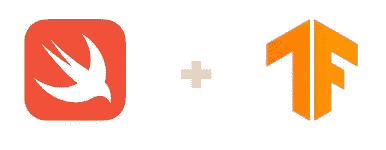

# Swift 程序员应该知道的 10 个术语(基础)

> 原文：<https://towardsdatascience.com/10-terms-and-terminologies-a-swift-programmer-should-know-basic-e2c469c359f6?source=collection_archive---------30----------------------->

## 理解 Swift 中的基本术语，这是一种编程语言，TensorFlow 利用它来实现稳健算法

罗曼·辛克维奇在 [Unsplash](https://unsplash.com/s/photos/code?utm_source=unsplash&utm_medium=referral&utm_content=creditCopyText) 上拍摄的照片

# 介绍

Swift 是苹果在 2014 年发布的开源语言。它已经迅速成为开发人员正在学习和使用的流行的现代编程语言之一。

Swift 是一种通用的编程语言，用于 iOS 应用程序开发甚至机器学习等任务。

[雨燕和张量流](https://github.com/tensorflow/swift)

TensorFlow(机器学习平台)发布了其流行库的 beta Swift 实现。虽然 TensorFlow 的 Swift 版本才刚刚处于测试阶段。

 [## TensorFlow 的 Swift

### Swift for TensorFlow 是用于深度学习和差异化计算的下一代系统。

www.tensorflow.org](https://www.tensorflow.org/swift) 

## 本文提供了不熟悉 Swift 编程语言的开发人员需要理解的基本术语，以便完全掌握和利用该语言。

# 条款

*   **引用类型(类)**:当这些类型被分配给一个变量、常量或传递给一个函数时，它们不会被复制，而只是新的分配器指向数据在内存中的位置。
*   **值类型(结构)**:这些是类型(整数、布尔、字符串等。)的值在分配给占位符变量、常量或作为变量/参数传递给函数时被复制。
*   **继承**:类通常有定义的属性、方法、类型和其他封装在其中的对象。Swift 中的类对象可以获取另一个类的封装对象和属性；这就是所谓的继承。通过利用继承，另一个类可以访问不同类的方法和属性。
*   **子类**:从不同类继承属性、函数和其他对象的类。
*   **超类**:向其他类提供其属性、函数和其他嵌入对象的类。
*   **基类**:缺少的类不继承或者依赖于另一个类。
*   **扩展**:诸如结构、类或枚举的构造对象可以通过使用扩展来扩展它们现有的功能。扩展向对象、类或协议添加新的类型、方法、属性、初始化器等。
*   **覆盖**:从另一个类(超类)继承属性和方法的类(子类)可以修改超类的现有属性、方法和其他对象。
*   **枚举** : Swift 提供了定义一级类型的能力，该类型包含在程序执行阶段不会受到任何形式修改的数据。枚举允许在单个类型下组合相关的值和数据类型。
*   **协议**:启用“设计规范”对象的定义，该对象可以包含诸如类、结构、枚举或协议之类的对象应该遵守和符合的属性和方法。

# 结论

现在，您已经有了一些基本的 Swift 术语和一些描述，以便全面理解 Swift 编程语言提供的标准工具和额外津贴。

从现在开始，您可以观看 YouTube 上关于本文中提到的术语的底层实施的教程，或者直接访问 Swift 官方文档[网站](https://swift.org/)。

我在下面的文章中介绍了两种常见的 Swift 对象、类和结构之间的区别。

 [## Swift 中类别和结构之间的差异

### 虽然类和结构有一些明显的相似之处，但本文列出了结构之间的差异…

medium.com](https://medium.com/swlh/differences-between-classes-and-structures-in-swift-ab2e27956665)