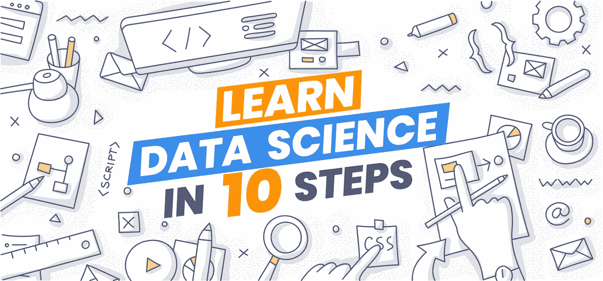
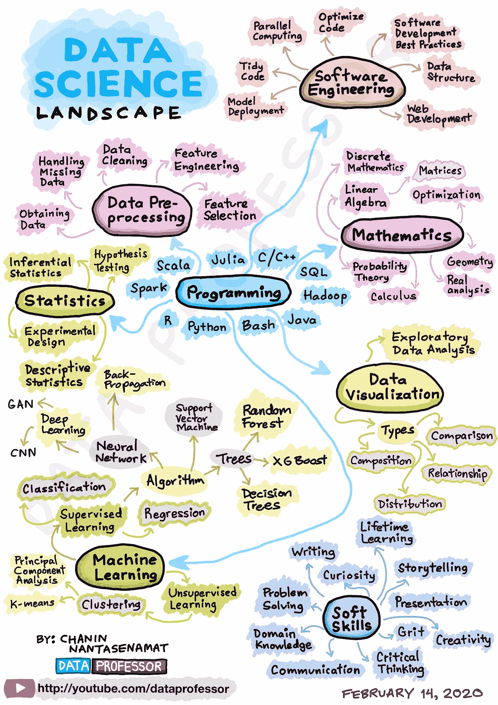

# 用 10 个步骤学习数据科学

> 原文：<https://towardsdatascience.com/10-things-i-wish-i-knew-about-learning-data-science-7a30bfb91759?source=collection_archive---------2----------------------->

## [数据科学](https://towardsdatascience.com/tagged/data-science/)

## 开始数据科学之旅的终极路线图



由 [koctia](https://elements.envato.com/user/koctia) 在 [Envato Elements](https://elements.envato.com/) 上的照片修改(经许可)

在我的 YouTube 频道([数据教授](https://www.youtube.com/dataprofessor?sub_confirmation=1))上，我经常被问到以下关于如何进入数据科学的问题:

*   *如何成为一名数据科学家？*
*   *成为数据科学家的路线图是什么？*
*   *学数据科学要上哪些课程？*

所以我想写一篇关于它的文章可能是一个好主意。所以，在这里。应该注意的是，我希望了解的关于学习数据科学的 10 件事是基于我作为一名自学成才的数据科学家的个人经历。问题是，如果我可以让时间倒流，并建议我 22 岁的自己学习数据科学，那么这些是我想说的一些事情。

我在 2004 年开始了我的数据科学之旅。那时，数据科学这个术语还处于婴儿期，而更广泛使用的术语是数据挖掘。直到 2012 年，*数据科学*这个术语才开始获得关注，并成为主流流行，这是因为《哈佛商业评论》的一篇题为 [*数据科学家:21 世纪最性感的工作*](https://hbr.org/2012/10/data-scientist-the-sexiest-job-of-the-21st-century) 的文章，作者是 Thomas Davenport 和 D.J. Patil。

# 什么是数据科学？

简而言之，数据科学本质上是一个利用数据来解决问题，并为公司和组织带来影响、价值和洞察力的领域。数据科学已经应用于广泛的学科和行业，涵盖教育、金融、医疗保健、地质、零售、旅游和电子竞技。数据科学的技术技能集涉及数据收集、数据预处理、探索性数据分析、数据可视化、统计分析、机器学习、编程和软件工程的使用。除了技术方面，数据科学家还需要各种软技能。下面的信息图高度概括了数据科学家的基本技能。



[资料图](https://github.com/dataprofessor/infographic/blob/master/04-Data-Science-Landscape.JPG)由查宁·南塔塞纳马特(又名[数据教授](https://www.youtube.com/dataprofessor?sub_confirmation=1)

# 1.您的数据科学之旅是个人的

您的数据科学之旅是个人的。不要拿自己和别人比较，记住每个人都是独一无二的，我们每个人都在不同的旅途上。为什么我们要踏上别人的旅程？专注于您自己的数据科学之旅。被挫折耽搁是可以的，但是不要让这些阻碍阻止你达到你的目标。迟到总比不到好。

拥抱 i *mposter 综合征*，将不安全感视为*导向图*，这将在你的数据科学之旅中帮助你。特别是，这可能会引导你走向自我完善的道路。列出你自己要学习和要做的事情。找出你还不知道的数据科学概念和技能，记下你想知道的。然后从这份数据科学概念/技能的清单中，集中精力每天只学习 1 件新东西。在一年的时间里，你会惊讶于*复合效应*以及你学到了多少新概念和技能。

# 2.如何学习数据科学？

## 学习风格

我们如何学习？学习风格****通俗地说*分为三大类型:

1.  视觉(参见)
2.  听觉(听觉)
3.  动觉

```
**Disclaimer: It should be noted that there is no scientific proof for the learning styles and thus herein we used the term ‘popularly’ to depict the mainstream popularity of its use. The learning style is used herein to illustrate the various and many form and medium that exists. Advices presented herein are based solely on my own opinion and experience. Please refer to the published research on learning style myth at:* https://www.apa.org/news/press/releases/2019/05/learning-styles-myth
```

知识无处不在，学习的源泉有多种形式。例如，你可以从书籍、博客、视频、播客、有声读物、讲座、教学中学习，最重要的是通过实践。

> “学习数据科学的最佳方式是研究数据科学。”
> 
> — Chanin Nantasenamat(又名数据教授)

当您学习新的概念或技能时(*即*来自视觉和听觉)，您可以通过将新获得的知识立即应用到您的数据科学项目中来巩固您所学的知识(*即*动觉)。通过不断学习数据科学，你将逐渐强化和磨练你刚刚学到的新概念和新技能。随着时间的推移，你会掌握它们。

此外，为了进一步巩固你对这些新概念或新技能的理解，你可以教别人(例如，写一篇教程博客，制作一个视频教程和教别人)。通过这样做，你可以利用上面提到的三种学习方式，从而最大限度地发挥你的学习潜力。同样值得注意的是，教导他人将有助于你将新的概念或技能具体化为你自己的语言，这样做有助于重组你的思想并更好地理解它。

## 学会如何学习

这只是关于如何学习的建议的冰山一角。事实上，在 Coursera 上有一个由 Barbara Oakley 博士和 Terrence Sejnowski 博士开设的名为 [*的在线课程，学习如何学习*](https://www.coursera.org/learn/learning-how-to-learn) ，这是一个很棒的课程，它会教你一些学习技巧，帮助你更有效地学习。

另一篇值得一读的文章是 Evernote 的一篇中型文章，题为 [*学习费曼技巧*](https://medium.com/taking-note/learning-from-the-feynman-technique-5373014ad230) ，总结了诺贝尔奖获得者、物理学家理查德·费曼发明的学习技巧。此外，YouTube 上一个关于 25 个最佳科学研究技巧的视频[](https://www.youtube.com/watch?v=OVByjeVgKKw)*提供了关于有效学习技巧的可行技巧，您也可以在学习数据科学时使用。*

*此外，斯科特·扬写了一本关于 [*超学习*](https://amzn.to/2XoqCiY) 的优秀书籍，分享了他在短短一年内学习麻省理工学院四年制计算机科学课程的自学经历。此外，乔希·考夫曼发表了一个 [TED 演讲](https://www.youtube.com/watch?v=5MgBikgcWnY)并在他的书 [*中描述了前 20 个小时*](https://amzn.to/2z4d7M7) 我们可以在短短的 20 个小时内学会任何我们想要的东西。*

*掌握学习的艺术将使您能够更有效地学习和研究数据科学，从而使您的学习体验更加愉快。*

## *学习数据科学的策略和所需的技能*

*2020 年初，我在 YouTube 上发布了一个视频[*2020 年学习数据科学的策略*](https://www.youtube.com/watch?v=7XdoaQYwTeA&t) ，我在视频中分享了一些实用的技巧和诀窍，以帮助你开始数据科学之旅。您可能还想了解如何成为一名数据科学家 [*(学习途径和所需技能)*](https://www.youtube.com/watch?v=jhImgx8I8oI) 在这里，我将带您鸟瞰数据科学的整体面貌，并涵盖所有数据科学家都应该了解的 8 项重要技能。*

*2021 年初，我发布了一个更加扩展的视频 [*【学习数据科学的艺术(2021 年如何学习数据科学)*](https://www.youtube.com/watch?v=oR670Txwh88) ，在这里我分享了我关于如何开始学习数据科学的最佳技巧。我研究并提炼了一些必要的最佳实践，帮助你开始学习数据科学的旅程。可以在 [Data Professor YouTube 频道](https://www.youtube.com/dataprofessor?sub_confirmation=1)的[数据科学 101 播放列表](http://bit.ly/dataprofessor-ds101)中找到提供学习数据科学的策略和建议的其他视频。*

*学习数据科学的艺术(2021 年如何学习数据科学)*

*2020 年学习数据科学的策略*

*如何成为数据科学家(学习路径和技能)*

*Ken Jee 就如何学习数据科学发表了一篇优秀的媒体文章和 YouTube 视频。此外，他还在他的 YouTube 视频中分享了他的建议 [*我将如何学习数据科学(如果我必须重新开始)*](https://www.youtube.com/watch?v=4OZip0cgOho) *。**

# *4.学习数据科学的资源(收费还是免费)*

*有大量的学习资源可供学习数据科学。事实上有这么多，这可能是压倒性的选择。我将把可用的学习资源分为两大类:收费和免费。*

*在接下来的部分中，我将列出一些学习数据科学的资源，分别是**收费**和**免费。***

## *收费学习资源*

*   *[365 数据科学](https://365datascience.pxf.io/c/2365590/791349/11148)*
*   *[数据营](https://bit.ly/dataprofessor-datacamp)*
*   *[数据请求](https://www.dataquest.io/)*
*   *[数据科学道场](https://datasciencedojo.com/)
    1。[数据科学训练营](https://datasciencedojo.com/data-science-bootcamp/)2。[用于数据科学的 Python](https://datasciencedojo.com/python-for-data-science/)
    3。[实习](https://datasciencedojo.com/data-science-training-and-internship/)*
*   *[奥赖利在线学习](https://www.oreilly.com/online-learning/)(每月 49 美元或每年 499 美元)*
*   *Udemy ( [数据科学课程](https://bit.ly/dataprofessor-udemy-datascience) ) —以下为顶级课程:
    1。[机器学习 A-Z:动手 Python & R 在数据科学](https://bit.ly/dataprofessor-udemy-ML-AZ)
    2。 [Python for Data Science 与机器学习训练营](https://bit.ly/dataprofessor-udemy-python-ds)
    3。[数据科学课程 2020:完整的数据科学训练营](https://bit.ly/dataprofessor-udemy-ds-2020)
    4。[数据科学 A-Z:现实生活中的数据科学练习包括](https://bit.ly/dataprofessor-udemy-ds-az)
    5。[R Programming A-Z:R For Data Science With Real exercise！](https://bit.ly/dataprofessor-udemy-r)
    6。人工智能 A-Z:学习如何构建一个人工智能。[机器学习、数据科学和深度学习用 Python](https://bit.ly/dataprofessor-ml-ds-dl-python)
    8。 [Python A-Z:具有真实练习的数据科学 Python！](https://bit.ly/dataprofessor-python-az)
    9。[数据科学统计与商业分析](https://bit.ly/dataprofessor-udemy-statistics)
    10。[完整的机器学习和数据科学:零到精通](https://bit.ly/dataprofessor-udemy-complete-ml)*

## *免费或收费的学习资源*

*   ***edX** —除了 CS50，其他都是收费的1。 [CS50](https://www.edx.org/course/cs50s-introduction-to-computer-science) (价值 90 美元的免费/可验证证书)
    2。[数据科学专业证书](https://www.edx.org/professional-certificate/harvardx-data-science)(哈佛大学)
    3。[统计学和数据科学的微硕士项目](https://www.edx.org/micromasters/mitx-statistics-and-data-science)(麻省理工)
    4。[数据科学微硕士项目](https://www.edx.org/micromasters/uc-san-diegox-data-science)(加州大学圣地亚哥分校)
    5。 [IBM 的 IBM 数据科学专业证书](https://www.edx.org/professional-certificate/ibm-data-science) (IBM)
    6。[微观分析硕士项目:基本工具和方法](https://www.edx.org/micromasters/gtx-analytics-essential-tools-and-methods)(佐治亚理工大学)
    7。[分析学硕士](https://www.edx.org/masters/online-master-science-analytics-georgia-tech)(佐治亚理工大学)*
*   ***Coursera** —免费审核或收费获得证书1。[机器学习](https://www.coursera.org/learn/machine-learning)(吴恩达/斯坦福大学)
    2。[数据科学专业](https://www.coursera.org/specializations/jhu-data-science) (10 门课程/约翰·霍普斯金大学)
    3。[高管数据科学专业](https://www.coursera.org/specializations/executive-data-science) (5 门课程/约翰·霍普斯金大学)
    4。[数据挖掘专业](https://www.coursera.org/specializations/data-mining) (6 门课程/伊利诺伊大学)
    5。[数据科学计算机科学硕士](https://www.coursera.org/degrees/master-of-computer-science-illinois/data-science) (8 门课程/伊利诺伊大学香槟分校)
    6。[应用数据科学硕士](https://www.coursera.org/degrees/master-of-applied-data-science-umich)(密歇根大学)*
*   ***uda city**——uda city 的[数据科学学院](https://www.udacity.com/school-of-data-science)和[人工智能学院](https://www.udacity.com/school-of-ai)提供的精选入门课程免费或纳米学位课程收费。
    1。[数据科学入门](https://www.udacity.com/course/intro-to-data-science--ud359)(免费)
    2。[数据分析介绍](https://www.udacity.com/course/intro-to-data-analysis--ud170)(免费)
    3。[数据分析与可视化](https://www.udacity.com/course/data-analysis-and-visualization--ud404)(免费)
    4。[用于数据分析的 SQL](https://www.udacity.com/course/sql-for-data-analysis--ud198)(免费)
    5。[推断统计学简介](https://www.udacity.com/course/intro-to-inferential-statistics--ud201)(免费)
    6。[数据科学家纳米学位项目](https://www.udacity.com/course/data-scientist-nanodegree--nd025)(收费)
    7。[数据分析师纳米学位项目](https://www.udacity.com/course/data-analyst-nanodegree--nd002)(收费)
    8。[数据可视化纳米学位计划](https://www.udacity.com/course/data-visualization-nanodegree--nd197)(收费)
    9。[数据工程师纳米学位项目](https://www.udacity.com/course/data-engineer-nanodegree--nd027)(收费)
    10。[机器学习工程师纳米学位项目](https://www.udacity.com/course/machine-learning-engineer-nanodegree--nd009t)(收费)*

## *免费的学习资源*

*   *[**Kaggle 微课**](https://www.kaggle.com/learn/overview) — 14 门微课组成:
    1。[Python](https://www.kaggle.com/learn/python)2。[机器学习介绍](https://www.kaggle.com/learn/intro-to-machine-learning)
    3。[中级机器学习](https://www.kaggle.com/learn/intermediate-machine-learning)
    4。[数据可视化](https://www.kaggle.com/learn/data-visualization)
    5。[熊猫](https://www.kaggle.com/learn/pandas)6。[特色工程](https://www.kaggle.com/learn/feature-engineering)
    7。[深度学习](https://www.kaggle.com/learn/deep-learning)
    8。[SQL](https://www.kaggle.com/learn/intro-to-sql)简介
    9。[高级 SQL](https://www.kaggle.com/learn/advanced-sql)
    10。[地理空间分析](https://www.kaggle.com/learn/geospatial-analysis)
    11。[微挑战](https://www.kaggle.com/learn/microchallenges)
    12。[机器学习可解释性](https://www.kaggle.com/learn/machine-learning-explainability)
    13。[自然语言处理](https://www.kaggle.com/learn/natural-language-processing)
    14。[游戏 AI 和强化学习简介](https://www.kaggle.com/learn/intro-to-game-ai-and-reinforcement-learning)*
*   ***YouTube** —有几个极好的频道，涵盖了数据科学中的几个重要主题。1。[数据教授](https://www.youtube.com/dataprofessor?sub_confirmation=1)2。[肯吉](https://www.youtube.com/c/kenjee1?sub_confirmation=1)3。[克里斯纳伊克](https://www.youtube.com/user/krishnaik06)4
    4。 [Codebasics](https://www.youtube.com/channel/UCh9nVJoWXmFb7sLApWGcLPQ)
    5。[3 蓝色 1 棕色](https://www.youtube.com/channel/UCYO_jab_esuFRV4b17AJtAw)6。乔希·斯塔默的 StatQuest。[send ex](https://www.youtube.com/user/sentdex)8。[数据学校](https://www.youtube.com/user/dataschool)
    9。 [Python 程序员](https://www.youtube.com/user/consumerchampion)
    10。[莱克斯·弗里德曼](https://www.youtube.com/user/lexfridman)
    11。Abhishek tha kur12。[两分钟试卷](https://www.youtube.com/user/keeroyz)
    13。[安德烈亚斯·克雷茨](https://www.youtube.com/channel/UCY8mzqqGwl5_bTpBY9qLMAA)14
    。[科里斯查费](https://www.youtube.com/user/schafer5)
    15。西拉杰·拉瓦尔
    16。[故事由数据(Kate Strachnyi)](https://www.youtube.com/channel/UCU9GTVEPqlSNRDHypVf3BRw)
    17。RichardOnData
    18。[霍马理工](https://www.youtube.com/channel/UCV0qA-eDDICsRR9rPcnG7tw) ( [数据科学播放列表](https://www.youtube.com/watch?v=xC-c7E5PK0Y&list=PL0BAwa0pBqg6dr_DfCL3DmeSLtFoAq7UR) )
    19。 [365 数据科学](https://www.youtube.com/channel/UCEBpSZhI1X8WaP-kY_2LLcg)
    20。[数据科学道场](https://www.youtube.com/user/DataScienceDojo)
    21。[数据营](https://www.youtube.com/channel/UC79Gv3mYp6zKiSwYemEik9A)
    22。[导入数据](https://www.youtube.com/channel/UCYDacpfRrCX6_8oDDlzTgFw)
    23。[数据科学杰伦](https://www.youtube.com/channel/UCcQx1UnmorvmSEZef4X7-6g)
    24。[大卫·兰格](https://www.youtube.com/channel/UCRhUp6SYaJ7zme4Bjwt28DQ)
    25。丹尼尔·伯克
    26。 [Python 工程师](https://www.youtube.com/channel/UCbXgNpp0jedKWcQiULLbDTA/)*

## *从竞赛和黑客马拉松中学习*

*学习和提高数据科学技能的另一种方式是参加数据科学竞赛和黑客马拉松。你可以参加数据科学竞赛的一个知名和受欢迎的平台是 [Kaggle](https://www.kaggle.com/competitions) ，而主办机器学习黑客马拉松的平台是 [MachineHack](https://www.machinehack.com/) 。*

*参加这些活动的最大好处是，由于即兴的性质，在处理手头的问题时需要大量的即兴创作和创造力。由于这些事件涉及时间因素(例如，有一个具体的截止日期提交日期)，因此潜意识里你有动力将项目进行到底。可以想象，在一个学习场景中，你没有在特定日期或时间前完成数据科学项目的压力，那么你可能会推迟(即，可能因拖延或生活中的事件而推迟)项目的完成。回想一下你在学校的时候，你必须为一场在特定日期和时间举行的考试而学习。因此，你将通过进行必要的阅读、回忆、理解和记忆来准备考试(*即*)，以便你能够参加和参加考试。同样，如果您决定参加并完成一项竞赛或黑客马拉松，那么您将需要准备并分析由这些事件给出的数据集(*即*数据预处理、探索性数据分析、特征工程、模型构建和模型解释)。*

*参加竞赛和黑客马拉松的另一个重要原因是，通过寻找提高模型性能的创造性方法，您可能会获得有价值的提示和技巧。在这样做的过程中，您可能会参与到学习过程中，从而接触到其他数据科学家同事，讨论如何处理数据集的新方法，并在这样做的过程中学习一些新东西。此外，您寻找提高模型性能的方法的旅程可能会引导您挖掘研究文献并尝试新事物、库和/或方法。如果仅仅通过传统和被动的方式学习，所有这些都是不可能的。*

*有关更多精彩的数据科学竞赛和黑客马拉松，请参考 [Benedict Neo](https://medium.com/u/9a24cc840494?source=post_page-----7a30bfb91759--------------------------------) 在《走向数据科学》中关于 [*10 个数据科学竞赛的精彩帖子，为您磨练 2020 年*](/10-data-science-competitions-for-you-to-hone-your-skills-for-2020-32d87ee19cc9) 的技能。此外，还建议参加 Coursera 关于 [*如何赢得数据科学竞赛的课程:向顶级 kaggler*](https://www.coursera.org/learn/competitive-data-science)学习，并了解在这些竞赛中获胜的一些最佳实践。你可能还想看看 Abhishek Thakur 在 YouTube 上关于 [*我的旅程的视频:我如何在 Kaggle*](https://www.youtube.com/watch?v=z15TKkAPNUM) 上成为世界上第一个 4x(和 3x)大师。*

# *5.为什么是数据科学？*

*对你为什么要学习数据科学有一个明确的目的和原因，可以帮助你更好地欣赏数据科学。通过探索以下主要问题，花些时间来思考这个问题。*

## *我为什么要学数据科学？*

*你想问自己的最重要的问题很简单*你为什么想学数据科学？*通过回答这个问题，你将更好地了解你需要首先专注于学习数据科学的哪个领域，因为这个领域非常广阔，而且很容易迷路和掉进兔子洞。*

## *我将如何在我的项目中使用数据科学*

*确定如何在项目中使用数据科学非常重要。您想要回答的一些问题包括:*

*   *您将执行探索性数据分析吗*
*   *你会开发一个回归/分类/聚类模型吗*
*   *你会开发一个聊天机器人吗*
*   *你会开发一个推荐系统吗*

## *通过使用数据科学，我能为我的工作带来什么价值*

*正如斯蒂芬·柯维在他的《高效人士的 7 个习惯》中所说，“从心中的目标开始。”*

*   *因此，花点时间想想你希望数据科学达到的理想目标。*
*   *心中有了一个明确的目标，你会惊讶地发现自己对实现这个目标有多投入。*

# *6.保持自己的责任感和生产力！*

*首先，对自己的学习进度负责将有助于你坚持下去。我是由肯·吉创立的一个了不起的数据科学家在线社区的成员。在这个在线社区中，会有一个讨论板，成员可以公开发布他们一周或一个月的目标。这样做，有助于我们坚持我们最初的意图和目标。*

*Ken 还在他的中型文章 [*中分享了他关于如何在学习数据科学*](/how-to-stay-motivated-and-productive-when-learning-data-science-6b3fbdf8697f) 时保持动力和生产力的更多技巧和诀窍。凯文·道姆出版的《高度负责的人的八个习惯》中有更多的建议。*

*以下是一些提高工作效率的基本建议:*

1.  *每天留出专门的时间(最好是每天 1-2 小时或至少 45 分钟)来学习和研究数据科学*
2.  *避免分心(关掉手机，避免查看社交媒体等。).如果你不能阻止分心的事物接近你，那么把自己从一个分心的环境中转移出来可能是一个更好的主意。这意味着你应该找一个安静的地方，在那里你可以全神贯注。*
3.  *不要拖延，不要想太多，去做吧！(像耐克一样)为了帮助你克服这一点，尝试应用两分钟规则(阅读这篇关于[如何通过使用‘两分钟规则’](https://medium.com/the-mission/how-to-stop-procrastinating-by-using-the-2-minute-rule-310fa8495fb9)停止拖延的中型文章)来帮助你保持运动。*

*因为在一天结束的时候，如果你没有进步，你就没有学习，你就不能实现你的目标，在你的职业生涯中达到你想要的位置。*

*我的一个好朋友 Ken Jee 发起了一个学习挑战，帮助你对自己的学习之旅负责。如肯所说，为了参加挑战:*

1.  *每天至少花 5 分钟阅读、学习或实施一个数据科学项目*
2.  *在社交平台( [Twitter](https://twitter.com/hashtag/66daysofdata) 、 [LinkedIn](https://www.linkedin.com/feed/hashtag/66daysofdata/) 等)分享自己的进步。)使用 [#66daysofdata](https://twitter.com/hashtag/66daysofdata)*

*这就是全部，现在您有了一个庞大的数据科学学习者社区，让您在数据科学学习之旅中负起责任。您可以从下面的视频中了解这一举措:*

*什么是 [#66DaysOfData](https://www.youtube.com/hashtag/66daysofdata) ？*

# *7.拥抱失败，学会热爱调试*

*拥抱失败。你必须学会适应不舒服的事情。因为简单来说，没有免费的午餐。没有付出，就没有收获。所以当你遇到失败时，不要纠结于它，只要重新站起来，继续尝试。*

*卡住是完全可以的，不理解 X 算法是可以的，不知道如何调试失败的代码也是可以的。在继续应对挑战之前，你可以休息一会儿，让头脑清醒一下。有时你的大脑变得堵塞和迟钝，所以休息一下可能有助于恢复活力和精神。*

*当您陷入数据科学项目的编码错误中，并且不确定如何继续时。如果你有一个精通编码的朋友，问问他或她。否则，如果您的问题已经有答案，搜索堆栈溢出。如果没有，就问！*

*学会热爱调试，把它作为一个学习机会，你可以从失败和错误中获得有价值的见解和教训。因为不失败就不学习。但是当你失败的时候，不要对自己太苛刻，要学会重新站起来，重新开始。你想从失败中恢复过来。*

# *8.不要担心试图学习一切*

*该领域的新手可能会被所有花哨的术语所震惊，但请不要被吓倒，并记住数据科学和机器学习是一个动态的、不断增长和发展的领域，因此总会有新技术的引入。简单来说，唯一不变的就是变化本身。*

*如上所述，不要被吓倒，采取潜水和开始。你从哪里开始并不重要，最重要的是你真正**开始**你的数据科学之旅。*

## *专注于基础*

1.  ****数据角力*** (Python — pandas，R — dplyr)*
2.  *仔细阅读 ***统计数据*** ，以便将它们应用到您的模型中。例如，应用适当的统计来比较模型(参数与非参数)。*
3.  ****探索性数据分析*** 和 ***描述性统计*** 用于获得数据的概述*
4.  *从构建 ***简单且可解释的机器学习*** 模型开始(线性回归，基于树的方法)*
5.  *使用你有信心使用的机器学习方法( ***了解其背后的数学*** )*

## *专注于项目，而不是技术*

*不要想太多。克服“我应该学什么语言？”两难，选一个继续前进。*

*要知道编程是一种工具，它应该可以帮助你将你的项目理念推向开发和部署*

*编程的基本概念是与语言无关的，这意味着核心基础适用于各种语言:*

*   *定义变量、数组、数据框等。*
*   *流量控制(例如循环、if 和 else 语句)*
*   *数据科学中的具体任务
    -数据争论/数据预处理
    -数据可视化
    -模型构建
    -模型部署*

# *9.让您的项目可重复*

*使您的数据科学项目可重现的一些好处如下:*

## *其他人可以帮助你*

*   *当你面临一个编码错误时，制作一个最小的工作示例(MWE)是很重要的，因为这将允许其他人重现你的错误，以便他们可以帮助你。*

## *为未来的自己和他人节省时间*

*   *将您的项目导出为 Docker 容器以及 Python 和 Conda 的环境。因为由于安装在您的编码环境中的基础库的不断变化的版本，今天起作用的可能 6 个月后就不起作用了。因此，使用虚拟环境、Docker 容器或至少导出库版本(如下所示的 pip 和 conda)是非常必要的。*

*在 pip 中导出环境:*

```
*pip freeze > requirements.txt*
```

*conda 中的导出环境:*

```
*conda env export > environment.yml*
```

# *10.学习成功从内部开始*

*本节探讨数据科学之旅的成功水平从内部开始这一理念。它是关于让你的思想为即将到来的和即将成为的你做好准备。这些概念包括:好奇心、热爱过程、成长心态和毅力。*

## *好奇心*

*好奇心可以被认为是成为数据科学家的核心和必要技能之一，因为它让我们在追求解决问题的创造性方法时保持动力和毅力。阿尔伯特·爱因斯坦曾经把好奇心和知识相提并论。*

> *“好奇心比知识更重要。”*
> 
> *―阿尔伯特·爱因斯坦*

*Eric Colson 在他的哈佛商业评论文章 [*好奇心驱动的数据科学*](https://hbr.org/2018/11/curiosity-driven-data-science) *中强调了好奇心的重要性。**

> *“…少考虑数据科学将如何支持和执行您的计划，多考虑如何创造一个环境，让您的数据科学家能够提出您做梦也想不到的东西。”*
> 
> *―埃里克·科尔森*

## *热爱这个过程*

*学习数据科学不是一件容易的事，也不是不可能的事。一个非技术背景的人绝对有可能闯入数据科学，就像我在我以前的媒体文章 [*中所做的那样，并讨论了生物学家如何成为数据科学家*](/how-a-biologist-became-a-data-scientist-c52ec0060b8c) *。**

*当谈到热爱这个过程时，三个名字浮现在脑海中:迈克尔·乔丹、加里·维纳查克和克莱门特·米哈伊尔斯库。这三个人可以被认为是他们所做的最好的人，他们对他们所做的事情充满热情。*

*在签署他的第一份职业篮球合同时，迈克尔·乔丹确保了一份特殊的*

> *[《游戏之爱》](https://news.nike.com/news/jordan-converse-love-of-the-game)*

*合同中包括了一项条款，允许乔丹随时随地不受限制地打篮球。*

*正如加里·维纳查克(VaynerX 的董事长，VaynerMedia 的首席执行官，五次 NYT 畅销书作家)在一个 [YouTube 视频](https://www.youtube.com/watch?v=QSyzJBc_9Ok)中被问及他是否可以委派大部分工作以减少工作时间时说的。*

> *“我热爱工作的过程，我热爱磨砺，我热爱攀登。…如果我不能完成完成我想要的事情所需的工作，我会窒息的。”*
> 
> *―加里·维纳查克*

*clément Mihailescu(algo expert 首席执行官，前脸书软件工程师和技术 YouTube)在一个 [YouTube 视频](https://www.youtube.com/watch?v=TIJidKbjcAs)中说，他没有感到筋疲力尽。*

> *“归根结底，你必须享受这个过程。无论你在做什么，无论你在努力追求什么，你都必须享受每一天，你必须热爱本质的东西。你必须活着，呼吸它。”*
> 
> *―克莱门特·米哈伊尔斯库*

## *成长心态和勇气*

*基于几年的研究，安吉拉·杜克沃斯(性格实验室的创始人兼首席执行官，宾夕法尼亚大学心理学教授)在她的畅销书 [*Grit:激情和毅力的力量*](https://amzn.to/2TWEoHJ) ( [YouTube 视频](https://www.youtube.com/watch?v=H14bBuluwB8))中将术语 g *rit* 定义为*激情*和*坚持*的结合。特别是，她对勇气的定义摘录如下:*

> *"毅力是保持对长期目标的兴趣和努力的倾向。"*
> 
> *―安吉拉·杜克沃斯*

*卡罗尔·德韦克在她的书《心态:改变你的思维方式以实现你的潜力》中描述了她对指导我们生活的两种主要心态的研究结果:*(1)成长心态和(2)固定心态。前者与成功联系在一起，而后者通常会导致自我怀疑和不满足的生活。在她的 TED 演讲中，Dweck 提出了在舒适区之外工作的重要性，认为这是提高你表现的关键。**

**在数据科学中，变化是不可避免的，因为总是会引入新的和具有挑战性的概念，这些概念可能会完全覆盖或重新定义以前的概念。我们总是会受到复杂挑战的轰炸，要应对这些变化和挑战，要从内心开始，特别是要有正确的心态，帮助你走向成功。**

# **奖金:11。承担全部责任**

**往往很容易想出借口，把人生的不幸归咎于无数的事情。当我们这样做时，就像加里·维纳查克常说的那样，“我们没有责任”(YouTube 上的一个优秀视频 [*停止指责他人&承担全部责任*](https://www.youtube.com/watch?v=hfUjFyxYhmI) )。**

**学习数据科学与我们生活中的任何其他努力没有什么不同。问题是，我们会对自己在学习过程中遇到的延误或障碍负责，还是不承担全部责任，把责任推给别人。**

**考虑以下关于承担全部责任的引语(在 YouTube 上观看这些引语的前两个引语和第三个引语)**

> **“对发生在你身上的事情承担全部责任，这是人类成熟的最高形式之一。接受全部责任，这是你知道自己已经从童年步入成年的一天。”**
> 
> **―吉米·罗恩**

> **"在你接受对自己生活的责任之前，别人会主宰你的生活."**
> 
> **―欧灵·伍德沃**

> **“一切都在你身上，一切都是你的错。你想真正赢得人生吗？你想得到真正的快乐吗？你知道我为什么真的开心吗？因为我认为一切都是我的错。如果我不喜欢，我可以改变。”**
> 
> **―加里·维纳查克**

**现在，花点时间思考一下。让我们开始承担责任并承担全部责任，你会惊讶于你在数据科学之旅中所能取得的成就。只有我们能够客观并对我们的行为和缺乏进展承担全部责任，我们才会有能力对此采取行动。我将引用吉米·罗恩的一句话。**

> **成功不是你追求的东西，成功是你成为的东西。**
> 
> **―吉米·罗恩**

# **结束语**

**这就是我希望了解的关于学习数据科学的 10 件事，如果我能回到过去，告诉 22 岁的自己关于学习数据科学的事情。我希望这些对您开始数据科学之旅有用，或者如果您已经开始，希望您能从中找到有用的东西。直到下一次，学习数据科学的最好方法是做数据科学，请享受旅程！**

# **公开**

*   **作为亚马逊的合作伙伴和 Kite 的会员，我可能会从合格的购买中获利，这将有助于未来内容的创作。**

# **接下来读这些**

*   **[**如何用 Python 构建 AutoML App**](/how-to-build-an-automl-app-in-python-e216763d10cd)
    *使用 Streamlit 库的分步教程***
*   **[**学习数据科学的策略**](/strategies-for-learning-data-science-47053b58c19f)
    *打入数据科学的实用建议***
*   **[**如何免费搭建一个简单的作品集网站**](/how-to-build-a-simple-portfolio-website-for-free-f49327675fd9)
    *不到 10 分钟从头开始的分步教程***

## **✉️ [订阅我的邮件列表，获取我在数据科学方面的最佳更新(偶尔还有免费赠品)!](http://newsletter.dataprofessor.org/)**

# **关于我**

**我是泰国一所研究型大学的生物信息学副教授和数据挖掘和生物医学信息学负责人。在我下班后的时间里，我是一名 YouTuber(又名[数据教授](http://bit.ly/dataprofessor/))制作关于数据科学的在线视频。在我做的所有教程视频中，我也在 GitHub 上分享 Jupyter 笔记本([数据教授 GitHub page](https://github.com/dataprofessor/) )。**

**[](https://www.youtube.com/dataprofessor?sub_confirmation=1) [## 数据教授

### 数据科学、机器学习、生物信息学、研究和教学是我的激情所在。数据教授 YouTube…

www.youtube.com](https://www.youtube.com/dataprofessor?sub_confirmation=1) 

## 在社交网络上与我联系

YouTube: [http://youtube.com/dataprofessor/](http://youtube.com/dataprofessor/)

[LinkedIn:](https://www.linkedin.com/company/dataprofessor/)[https://www.linkedin.com/company/dataprofessor/](https://www.linkedin.com/company/dataprofessor/)

[https://www.linkedin.com/company/dataprofessor/](https://twitter.com/thedataprof)

[【HTTP://facebook.com/dataprofessor/】](https://www.youtube.com/redirect?redir_token=w4MajL6v6Oi_kOAZNbMprRRJrvJ8MTU5MjI5NjQzN0AxNTkyMjEwMDM3&q=http%3A%2F%2Ffacebook.com%2Fdataprofessor%2F&event=video_description&v=ZZ4B0QUHuNc)
【GitHub:[【HTTPS://github.com/dataprofessor/】](https://github.com/dataprofessor/)
[Instagram:【HTTPS://www.instagram.com/data](https://www.instagram.com/data.professor/)**