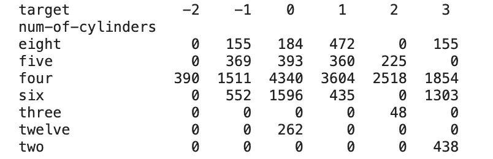
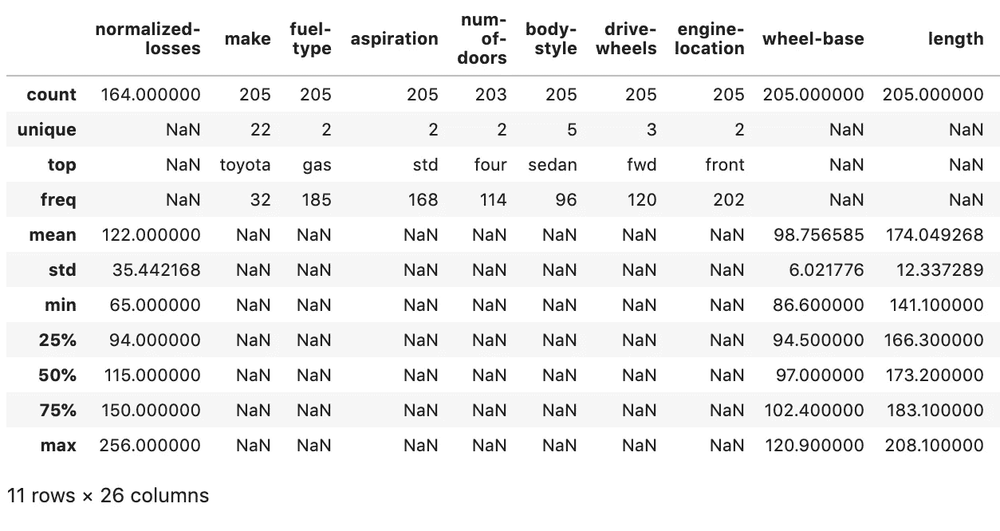
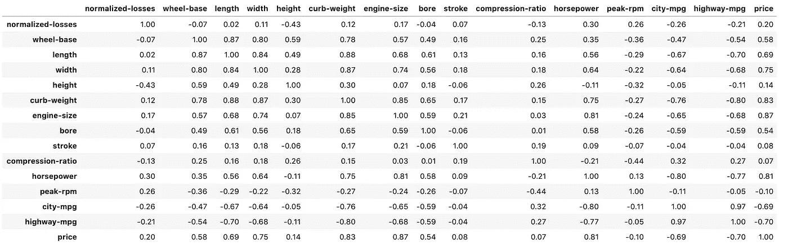
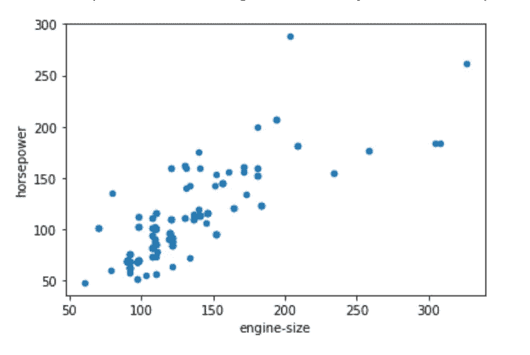
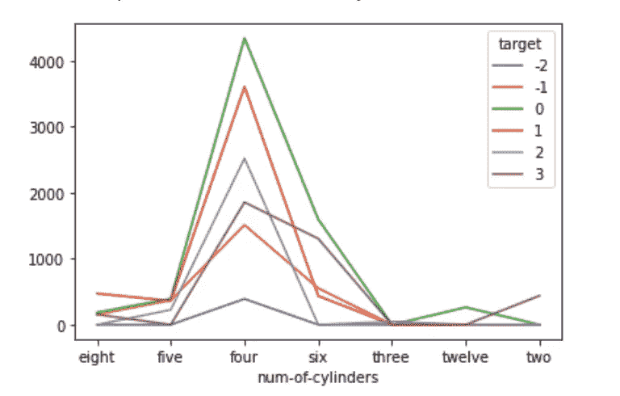
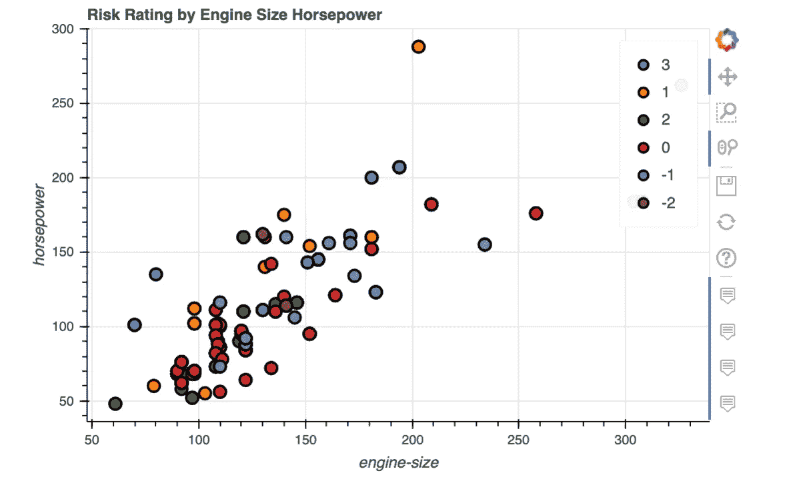
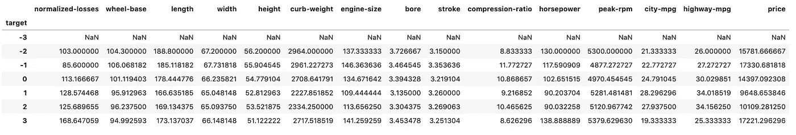
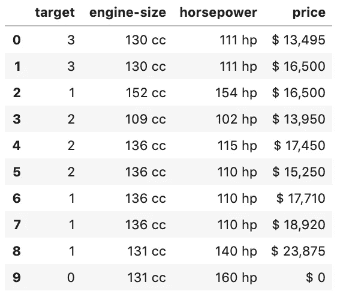
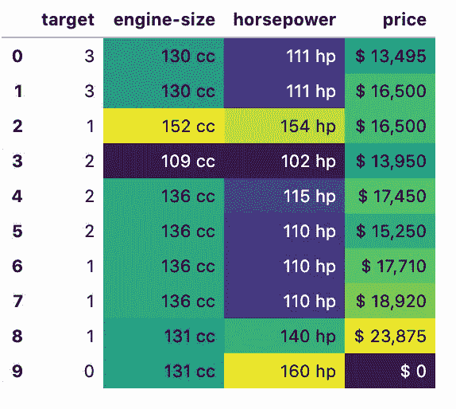
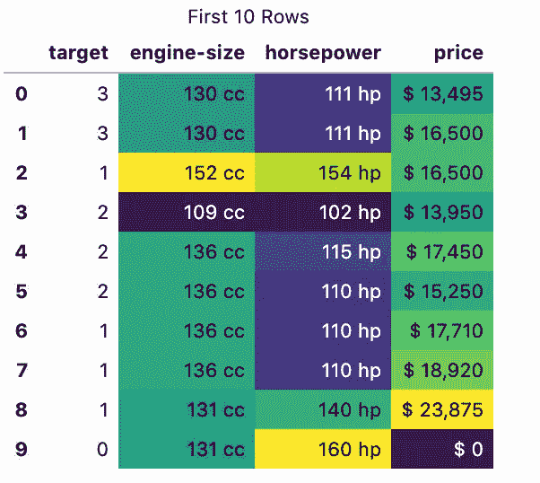

# 关于熊猫你不知道的 10 件事

> 原文：<https://towardsdatascience.com/10-things-you-didnt-know-about-pandas-d20f06d1bf6b?source=collection_archive---------15----------------------->

## 直到现在…


乔恩·泰森在 [Unsplash](https://unsplash.com/s/photos/question?utm_source=unsplash&utm_medium=referral&utm_content=creditCopyText) 上的照片

Pandas 是使用 Python 执行数据分析的权威库。它最初是由一家名为 AQR Capital Management 的公司开发的，但在 2009 年被开源用于一般用途。

它迅速成为 Python 用户数据分析的首选工具，现在拥有大量用于数据提取、操作、可视化和分析的功能。

熊猫有许多有用的方法和功能，这里是关于这个库你可能不知道的十件事。

熊猫可以 pip 安装，如果你还没有它。完整的文档，以及一些优秀的通用数据分析教程，可以在[这里](https://pandas.pydata.org/)找到。

```
pip install pandas
```

在整篇文章中，我将使用“汽车”数据集提供代码示例，该数据集包含汽车的各种特征及其相应的保险风险评级。该数据集通常用作机器学习分类任务，目标是预测汽车的风险评级。

在建立机器学习模型之前，数据分析是一个重要的初步步骤。

如果您有 Scikit-learn，可以使用下面的代码导入数据集。或者，也可以在这里下载[。](https://www.openml.org/d/9)

# 1.您可以创建类似 Excel 的数据透视表

数据透视表通常被认为是 Excel 最强大的功能之一。它们通过对变量进行分组、过滤和计算，使用户能够快速理解包含在非常大的数据集中的模式和特征。

Pandas 库包含允许你创建[数据透视表](https://pandas.pydata.org/pandas-docs/stable/reference/api/pandas.pivot_table.html)的方法，这些数据透视表与 Excel 和其他电子表格工具中的数据透视表非常相似。

下面的代码使用 Pandas 数据透视表根据汽车拥有的气缸数量来比较汽车的保险风险评级。



# 2.describe()函数也可用于分析非数字特征

pandas `[**describe()**](https://pandas.pydata.org/pandas-docs/stable/reference/api/pandas.DataFrame.describe.html)`函数可以快速生成描述性统计数据的摘要，默认情况下，只针对数据集中的数值。然而，这个非常有用的 Pandas 工具也能够通过简单地添加`include=’all’`参数来提供非数字列的摘要。

这对于包含分类变量的维度等信息非常有帮助，这些信息有助于为机器学习的转换策略提供信息。

```
data.describe(include='all')
```



# 3.内置统计函数

就像 Excel Pandas 一样，它包含了大量的[计算工具](https://pandas.pydata.org/pandas-docs/stable/user_guide/computation.html)，可以将常用的统计方法应用到数据中。例如，使用`corr()` 方法可以快速计算出数据集中变量之间的相关性。

```
round(data.corr(),2)
```



# 4.绘图功能

Pandas 具有内置绘图功能，允许您从数据框、分组或数据透视表中快速创建最常见类型的绘图。

以下代码创建了一个散点图，在我们的数据框架中比较发动机大小和马力。

```
data.plot.scatter(x='engine-size', y='horsepower')
```



只需将`.plot()`添加到我之前创建的数据透视表中，就可以生成汇总数据的图表。

```
pivot_table.plot()
```



# 5.更漂亮的情节

默认情况下，Pandas 绘图方法使用 Matplotlib 作为可视化的后端。然而，Pandas 也支持许多其他的 Python 绘图库。

例如，要更改后端并使用散景进行可视化，只需使用以下代码。

这提供了一个更丰富的，交互式的可视化。



关于熊猫可视化使用不同后端的更详细的教程，见下面我以前的文章。

[](/plotting-in-pandas-just-got-prettier-289d0e0fe5c0) [## 熊猫里的情节越来越漂亮了

### 创建丰富的可视化和仪表板与熊猫绘图后端为 Plotly 和 Bokeh

towardsdatascience.com](/plotting-in-pandas-just-got-prettier-289d0e0fe5c0) 

# 6.分割-应用-组合策略的工具

Hadley Wickham 在 2011 年发表的一篇论文[中首次概述了拆分-应用-合并这一有用的数据分析策略](https://www.jstatsoft.org/article/view/v040i01)。本文详细介绍了一种常见的数据分析模式，通过这种模式，数据首先被分解为合理的、可管理的块或段，对每个单独的段执行操作，然后再次拼凑在一起以形成比较。

这种数据分析模式可以在数据透视表中看到，正如我们在上面描述的那样，也可以在 SQL group by 语句中看到。除了数据透视表，Pandas 还提供了另一种利用这种策略的方法，称为`[**groupby()**](https://pandas.pydata.org/pandas-docs/stable/reference/api/pandas.DataFrame.groupby.html)`。

这种方法，在一行代码中，允许您将数据集分解成片段，执行一些统计计算，然后将这些片段重新组合在一起进行比较。

以下代码按目标变量中的唯一值对数据进行分段，计算每列的平均值，然后显示结果。



# 7.美观时尚的桌子

如果你想用熊猫分享你的数据分析结果，那么你可能会想让你的数据表看起来更好，更容易被人类消化。Pandas 有一系列的样式选项来控制结果在数据框中的显示方式。

样式选项可以更改数字的显示方式，例如，在百分点上添加%符号、控制小数位数、在结果中添加条件格式或突出显示特定值。

下面的代码将适当的样式应用于我们的数据集中选择的列。输出现在更容易阅读了。



# 8.使用内置样式轻松创建热图

熊猫内置了一些常见的风格模式。您可以使用其中之一轻松创建热图。

下面的代码将热图格式应用于我们之前创建的 data_summary。



# 9.使用熊猫选项来控制显示

熊猫有一系列选项，你可以设置它们来控制数据帧的输出。这些可以用来控制要显示的最大行数或列数、显示浮点数时使用的小数位数以及日期显示的格式。

# 10.给表格添加标题

还有一系列样式可以添加到表格中，以增强数据之外的显示。

例如，您可以像这样给表格添加标题。



感谢阅读！

我每月都会发一份简讯，如果你想加入，请点击此链接注册。期待成为您学习旅程的一部分！