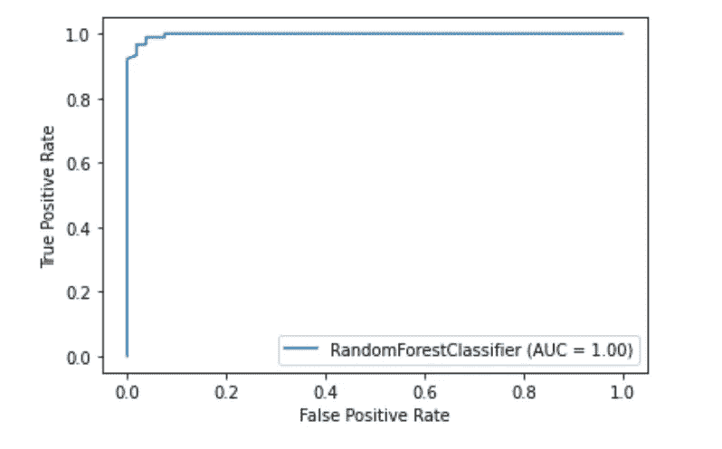
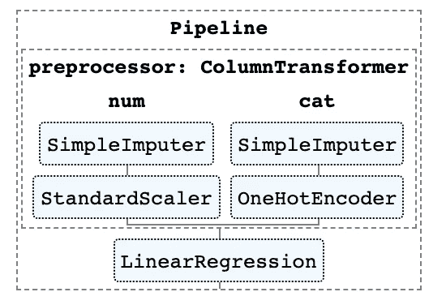
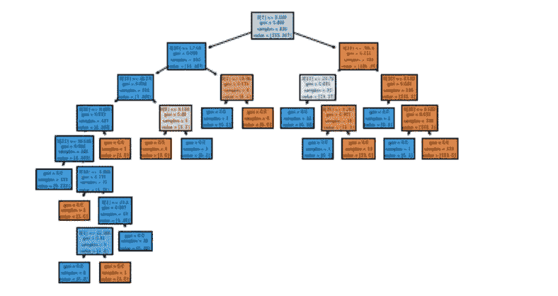

# 关于 Scikit 你不知道的 10 件事-了解

> 原文：<https://towardsdatascience.com/10-things-you-didnt-know-about-scikit-learn-cccc94c50e4f?source=collection_archive---------24----------------------->

## …直到现在

[莎莎的故事](https://unsplash.com/@sanfrancisco?utm_source=unsplash&utm_medium=referral&utm_content=creditCopyText)在 [Unsplash](https://unsplash.com/s/photos/crystal-ball?utm_source=unsplash&utm_medium=referral&utm_content=creditCopyText) 上的照片

Scikit-learn 是使用最广泛的 Python 机器学习库之一。它有一个标准化和简单的界面，用于预处理数据和模型训练，优化和评估。

该项目最初是由 David courna peau 开发的谷歌代码之夏项目，并于 2010 年首次公开发布。自创建以来，该库已经发展成为一个丰富的生态系统，用于开发机器学习模型。

随着时间的推移，该项目开发了许多方便的功能和能力，增强了它的易用性。在本文中，我将介绍您可能不知道的 10 个最有用的特性。

# 1.Scikit-learn 有内置的数据集

Scikit-learn API 内置了各种各样的 [**玩具和真实世界数据集**](https://scikit-learn.org/stable/datasets/index.html) 。这些可以通过一行代码来访问，如果您正在学习或者只是想快速尝试一种新的功能，这些非常有用。

您还可以使用 [**生成器**](https://scikit-learn.org/stable/datasets/index.html#generated-datasets) 轻松生成合成数据集，用于回归`make_regression()`、聚类`make_blobs()`和分类`make_classification()`。

所有加载实用程序都提供了返回已经分割为 X(特征)和 y(目标)的数据的选项，以便它们可以直接用于训练模型。

# 2.第三方公共数据集也很容易获得

如果你想直接通过 Scikit-learn 访问更多种类的公开可用数据集，有一个方便的功能可以让你直接从 openml.org 网站导入数据。该网站包含超过 21，000 个不同的数据集，用于机器学习项目。

# 3.有现成的分类器来训练基线模型

为项目开发机器学习模型时，首先创建基线模型是明智的。这个模型本质上应该是一个“虚拟”模型，例如总是预测最频繁出现的类别的模型。这提供了一个基准来测试你的“智能”模型，这样你就可以确保它比随机结果表现得更好。

Scikit-learn 包括一个用于分类任务的`[**DummyClassifier()**](https://scikit-learn.org/stable/modules/generated/sklearn.dummy.DummyClassifier.html)` 和一个用于基于回归的问题的`**DummyRegressor()**`。

# 4.Scikit-learn 有自己的绘图 API

Scikit-learn 有一个内置的 [**绘图 API**](https://scikit-learn.org/stable/developers/plotting.html) ，它允许您在不导入任何其他库的情况下可视化模型性能。包括以下绘图实用程序:部分相关图，混淆矩阵，精确回忆曲线和 ROC 曲线。

# 5.Scikit-learn 具有内置的特征选择方法

提高模型性能的一种技术是仅使用最佳特征集或通过移除冗余特征来训练模型。这个过程被称为特征选择。

Scikit-learn 有许多功能来执行 [**特征选择**](https://scikit-learn.org/stable/modules/classes.html#module-sklearn.feature_selection) 。一个例子就是众所周知的`[**SelectPercentile()**](https://scikit-learn.org/stable/modules/generated/sklearn.feature_selection.SelectPercentile.html#sklearn.feature_selection.SelectPercentile)`。该方法根据所选的统计方法来选择表现最好的 X 百分位特征进行评分。

# 6.管道允许你将机器学习工作流程中的所有步骤连接在一起

除了为机器学习提供广泛的算法，Scikit-learn 还提供了一系列预处理和转换数据的功能。为了促进机器学习工作流程的可重复性和简单性，Scikit-learn 创建了[**管道**](https://scikit-learn.org/stable/modules/generated/sklearn.pipeline.Pipeline.html) ，允许您将众多预处理步骤与模型训练阶段链接在一起。

管道将工作流中的所有步骤存储为单个实体，可以通过 fit 和 predict 方法调用该实体。当您对管道对象调用 fit 方法时，预处理步骤和模型训练会自动执行。

# 7.使用 ColumnTransformer，您可以对不同的特性应用不同的预处理

在许多数据集中，您将拥有不同类型的要素，这些要素需要应用不同的预处理步骤。例如，您可能混合了分类数据和数值数据，您可能希望通过一键编码将分类数据转换为数值数据，并对数值变量进行缩放。

Scikit-learn 管道有一个名为**[**column transformer**](https://scikit-learn.org/stable/modules/generated/sklearn.compose.ColumnTransformer.html#sklearn.compose.ColumnTransformer)的函数，它允许您通过索引或指定列名来轻松指定对哪些列应用最合适的预处理。**

# **8.您可以轻松地输出管道的 HTML 表示**

**管道通常会变得非常复杂，尤其是在处理真实世界的数据时。因此，Scikit-learn 提供了一种方法来输出管道中步骤的 HTML 图**，这非常方便。****

********

# ****9.有一个绘图功能来可视化树木****

****`[**plot_tree()**](https://scikit-learn.org/stable/modules/generated/sklearn.tree.plot_tree.html)`功能允许您创建决策树模型中的步骤图。****

********

# ****10.有许多第三方库扩展了 Scikit-learn 的特性****

****许多第三方库都可以使用 Scikit-learn 并扩展它的特性。****

****两个例子包括 [**类别编码器**](http://contrib.scikit-learn.org/category_encoders/) 库，它为分类特征提供了更大范围的预处理方法，以及 [**ELI5**](https://eli5.readthedocs.io/en/latest/) 包，用于更好的模型解释能力。****

****这两个包也可以直接在 Scikit-learn 管道中使用。****

****感谢阅读！****

****我每月发送一份时事通讯，如果你想加入，请通过此链接注册。期待成为您学习旅程的一部分！****