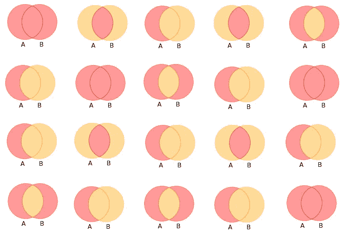
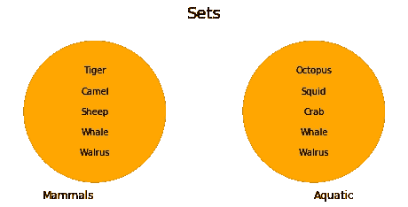
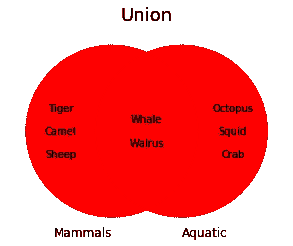
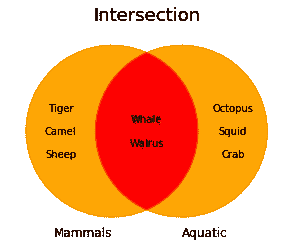
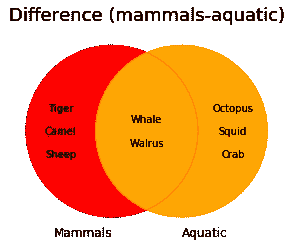
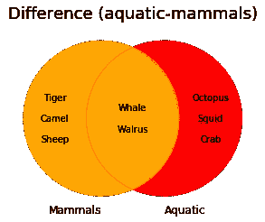
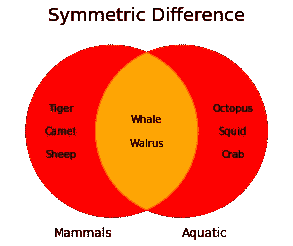
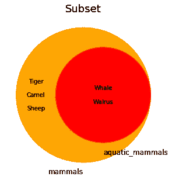
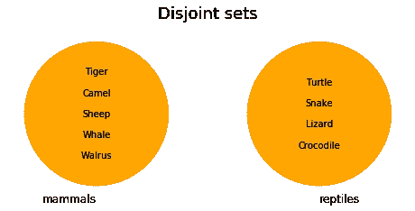

# 关于 Python 中的集合，你应该知道的 10 件事

> 原文：<https://towardsdatascience.com/10-things-you-should-know-about-sets-in-python-9902828c0e80?source=collection_archive---------14----------------------->

## Python 中集合的使用指南

# 1.什么是 Python 集合？

一个**集合**是一个**无序**和**可变**的**唯一**元素的集合。集合用花括号( **{}** )表示，是用逗号分隔的元素。

下面的代码块显示了两个集合，包含数字和城市的集合。

任何不可变的数据类型都可以是集合中的元素(例如字符串和整数)。如果试图在集合中使用可变数据类型，就会引发异常( **TypeError** )，如下所示。

# 2.用 set()构造函数创建一个集合

**集合**也可以用内置函数**集合(【iterable】)**定义。该函数将 iterable(即任何类型的序列、集合或迭代器)作为参数，返回包含输入中唯一项的集合(删除重复值)。

如上所示，输入项的原始顺序没有保持，因为集合是无序的容器。

我们也可以使用没有任何输入参数的 **set()** 构造函数。在这种情况下，构造函数返回一个空的**集合**。

# 3.向集合中添加元素

要将一个元素添加到一个**集合**，我们使用 **set.add(element)** 方法。该方法就地修改集合，返回 **None** 。

如下图所示，**。如果元素已经存在，add()** 方法不会将元素添加到集合中，因为**集合**不能包含重复的项目。

与列表不同，我们不能在给定的索引处插入元素，因为**集合**是**无序**容器，这意味着元素在**集合**中没有特定的位置。

# 4.从集合中移除元素

从集合中移除元素有三种方式:

*   使用 **set.remove(x)** 方法
*   使用 **set.discard(x)** 方法
*   使用 **set.pop()** 方法

## 该移除方法

**set.remove(x)** 方法从**集合中移除一个元素 **x** 。**该方法修改**设置**在位，返回**无**。如果元素 **x** 不存在，则引发异常( **KeyError** )。

## 丢弃方法

**set.discard(x)** 方法从一个**集合**中移除一个元素 **x** ，如果它存在的话。与**移除方法**相比，如果要移除的元素不存在，**丢弃方法**不会引发异常( **KeyError** )。

如上图所示，**丢弃方法**修改**设置**在位，返回**无**。

## 流行方法

**set.pop()** 方法从**集合中移除并返回任意元素。**

与**列表**相比，**弹出方法**没有任何参数。我们不能指定想要移除的索引，因为**集合**是一个**无序的**元素集合。

# 5.数学运算:并、交、差和对称差

我们可以使用 **Python** 中的集合来计算**并**、**交**、**差**、**对称差**等数学运算。这些逻辑运算可以用一个叫做**维恩图**的图来表示。文氏图广泛应用于数学、统计学和计算机科学中，以可视化集合之间的差异和相似性。我们可以使用第三方库 **matplotlib-venn 绘制面积加权的二圆和三圆**维恩图**。**💜

给定两个集合，一个包含哺乳动物，另一个包含水生动物。

我们可以用下面的方式计算上述数学运算。

## 联盟

两套 **A** 和 **B** 的**并集**是包含 **A** 、 **B** 或**两者**中元素的集合，用 **A ∪ B** 表示。

**文氏图**的红色阴影区域代表哺乳动物和水生动物集合的**联合**。

两个集合的并

为了用 **Python** 计算这个操作，我们可以使用 **set.union(另一个集合)**方法或者 **|** 操作符。

两个集合的并

如上所示，两者都返回一个包含哺乳动物和水生动物集合中所有项目的新集合。

## 交集

两个集合 **A** 和 **B** 的**交集**是包含两个集合共有元素的集合，用 **A ∩ B** 表示。

**文氏图**的红色阴影区域代表哺乳动物和水生动物集合的**交叉点**。

两个集合的交集

在 Python 中，我们可以使用 **set.intersection(另一个集合)**方法或 **&** 运算符来计算两个集合的交集。

如您所见，**交集**方法和 **&** 操作符返回一个新的集合，包含两个集合中存在的项目，而不修改它们。

## 差异

两个集合 **A** 和 **B** 的差是集合 **A** 中不包含在集合 **B** 中的所有元素的集合，用 **A-B** 表示。

**文氏图**的红色阴影区域代表哺乳动物和水生动物(哺乳动物-水生动物)的**差异**。这一组包括哺乳动物，但不是水生动物。

哺乳动物减去水生动物的差异

我们还可以获得水生动物而不是哺乳动物，计算水生动物和哺乳动物之间的差异。

水生动物减去哺乳动物的差异

要在 Python 中计算两个集合之间的差，我们可以使用 **set.difference(另一个集合)**方法(set-other set)或( **-** )运算符。

正如您所观察到的，哺乳动物和水生动物这两个集合没有被就地修改。

## 对称差

两个集合 **A** 和 **B** 的**对称差**是在集合 **A** 和 **B** 中的一个集合中，但不在两个集合中的元素集合，用**A△B**表示

下面的**维恩图**表示哺乳动物和水生动物(红色阴影区域)集合的**对称差**。这一组包括哺乳动物和水生动物，但不包括两者。

两个集合的对称差

在 Python 中，我们可以使用**set . symmetric _ difference(another set)方法**或 **^算子**找到两个集合的**对称差**，如下所示。

# 6.子集和超集

A **集合 A** 是 a **集合 B (A ⊆ B)** 的**子集**或者等价地**集合 B** 是 a**集合 a(b⊇a)**的**超集**，如果**集合 A** 的所有元素都包含在**集合 B** 中。

下面的**维恩图**代表两组**哺乳动物**和**水生哺乳动物**，是**水生哺乳动物**哺乳动物**的子集**。

为了检查**集合 A** 是否是**集合 B** 的子集/超集，我们可以使用以下方法:

*   **A.issubset(B)** →如果**集合 A** 的所有元素都包含在**集合 B.** 中，则该方法返回 **True**
*   **A.issuperset(B) →** 如果**集合 B** 的所有元素都包含在**集合 A** 中，则该方法返回 **True** 。

下面的代码块使用这两种方法来检查一个集合是否是另一个集合的子集/超集。

# **7。不相交**

如果两个**集合**没有公共元素，则它们是**不相交的**。以下两组**哺乳动物**和**爬行动物**是不相交的集合，因为它们的交集是一个空集**。**

我们可以使用 **set.isdisjoint(另一个集合)**方法检查两个**集合**是否**不相交**。如果两个集合没有共同的元素，这个方法返回 **True** 。如果有，它返回**假**。

# 8.检查元素是否存在于集合中

为了检查一个元素是否存在于**集合**中，我们必须使用一个**成员操作符**。成员运算符用于测试序列中是否存在某个元素(例如字符串、列表、元组、集合或字典)。有两个成员资格运算符，如下所述。

*   中的**→如果左侧的对象**包含在右侧的对象**中，则评估为**真**。**
*   **不在**中→如果左侧的对象**不在右侧的对象**中，则评估为**真**。

# 9.求一个集合的长度

要确定集合中包含多少个元素，我们可以使用 **len()** 函数。这个函数返回一个对象的项数。函数的输入不仅可以是集合，也可以是另一种类型的序列，如字符串、字典、列表或元组。

# **10。替代容器:冷冻器**

一个 **frozenset** 对象是一个一旦被创建就不能被改变的集合。我们使用**frozenset(【iterable】)**构造函数在 Python 中创建一个 frozenset，提供一个 iterable 作为输入。

由于 **frozensets** 是不可变的，它们不接受就地修改集合的方法，例如 **add** 、 **pop** 或 **remove** 。如下所示，试图将一个元素添加到一个 **frozenset** 中会引发一个异常( **AttributeError** )。

与集合不同，frozensets 可以用作字典中的键或另一个集合的元素。

# 有趣的网站

除了官方的 Python 文档之外，还有多个网页提供了如何使用集合的详细解释和示例。

 [## Python 集合

### 集合是一个没有顺序和索引的集合。在 Python 中，集合是用花括号写的。创建一个集…

www.w3schools.com](https://www.w3schools.com/python/python_sets.asp)  [## Python 集(带示例)

### 集合是项目的无序集合。每个集合元素都是唯一的(没有重复)并且必须是不可变的(不能是…

www.programiz.com](https://www.programiz.com/python-programming/set)  [## Python 中的集合-真正的 Python

### 在本教程中，您将学习如何有效地使用 Python 的 set 数据类型。

realpython.com](https://realpython.com/python-sets/) 

# 更多关于 Python 容器的文章

 [## 关于 Python 中的列表，你应该知道的 15 件事

### Python 中列表的使用指南

towardsdatascience.com](/15-things-you-should-know-about-lists-in-python-c566792eca98)  [## 关于 Python 中的字典，你应该知道的 15 件事

### Python 中词典的使用指南

towardsdatascience.com](/15-things-you-should-know-about-dictionaries-in-python-44c55e75405c) 

阿曼达💜