# Java 中你做错的 10 件事

> 原文：<https://towardsdatascience.com/10-things-youre-doing-wrong-in-java-7608e2f050c7?source=collection_archive---------1----------------------->

## Java 开发人员最常犯的错误

由 [Max Duzij](https://unsplash.com/@max_duz?utm_source=medium&utm_medium=referral) 在 [Unsplash](https://unsplash.com?utm_source=medium&utm_medium=referral) 上拍摄的照片

在我的职业生涯中，我面试过几十个软件工程师，从初级到高级技术领导。在许多情况下，候选人在基本概念上有差距。

在本文中，我将根据我作为技术领导者和采访者的经验，列出 Java 开发人员最常犯的错误。

# 1)忽略访问修饰符

不要问我为什么，考生经常忘记 Java 中受保护的访问修饰符的作用域。可能是面试中积累的焦虑和紧张，但通常他们只提到两者之一:

*   受保护的字段、方法和构造函数可以从同一个包中访问
*   可以从子类中访问受保护的字段、方法和构造函数

我真的不知道忘记哪个更糟糕，但不引用包级范围揭示了候选人从未测试过受保护的方法(受保护的项可从测试类路径访问，只要包是相同的)；公共的和受保护的方法是你的软件提供的 API 的一部分。所以忘记这个属性就相当于在一次采访中宣称**从来没有为你的软件编写过有意义的测试！**

# 2)不使用 equals()

如果你使用`==`(比较运算符)而不是`equals()`调用，那么你必须改变你的习惯，因为结果可能会让你大吃一惊。

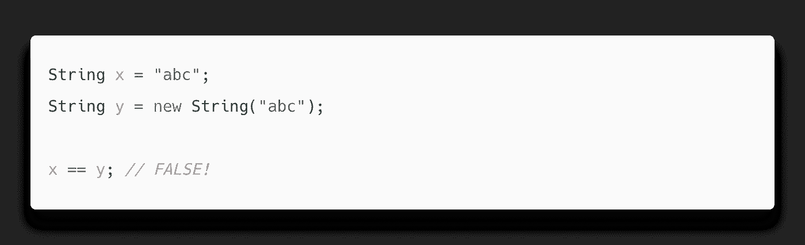

## 说明

当你想比较两个`String`时，千万不要用`==`，一般来说，不要用任何物体。`==`只是比较两个操作数的对象引用(内存地址比较)而不是它们的内容。

在上面的例子中，字符串`y`并没有受益于*字符串内部化*:它的内存地址不同于`x`的地址。

# 3)字符串连接

如果你处理大量的字符串或者巨大的`String`，你可能会在连接过程中**浪费大量的内存**。

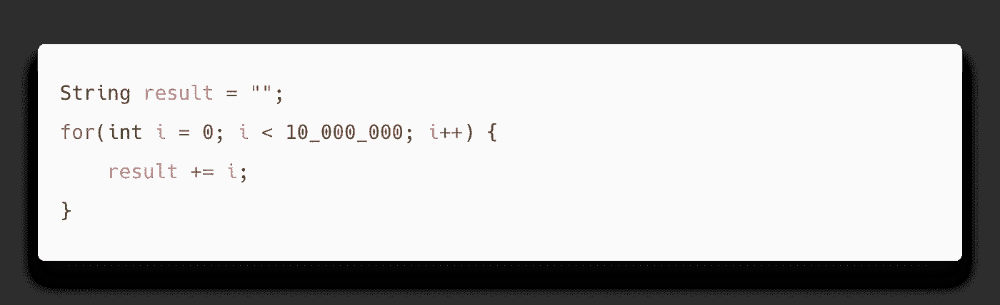

在上面的例子中，您正在创建几个`StringBuilder`和`String`对象:准确地说是 10.000.000 `StringBuilder`和 10.000.001 `String`！

## 说明

为了理解正在发生的事情，我们必须后退一步。

当您使用`+`操作符进行字符串连接时，您正在创建一个中间对象，它在将值赋给目标对象之前存储连接的结果。

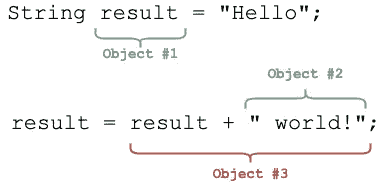

在上面的例子中，我们一共创建了 3 个对象:2 个用于文字，1 个用于连接，即第一个字符串`result`加上第二个`" world!"`的副本。这是因为`String`是不可变的。

但是编译器足够聪明，可以将代码转换成以下代码(不适用于 java 9+，因为它使用了`[StringContactFacotry](https://docs.oracle.com/javase/9/docs/api/java/lang/invoke/StringConcatFactory.html)`，但是结果非常相似)

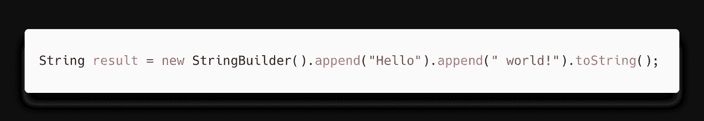

这种优化移除了中间串联对象，内存被 2 个字符串文字和 1 个`StringBuilder`占用。一般情况下，字符串对象的数量从 ***O(n )*** 下降到 ***O(n)*** 。

回到第一个例子，编译器像这样优化代码

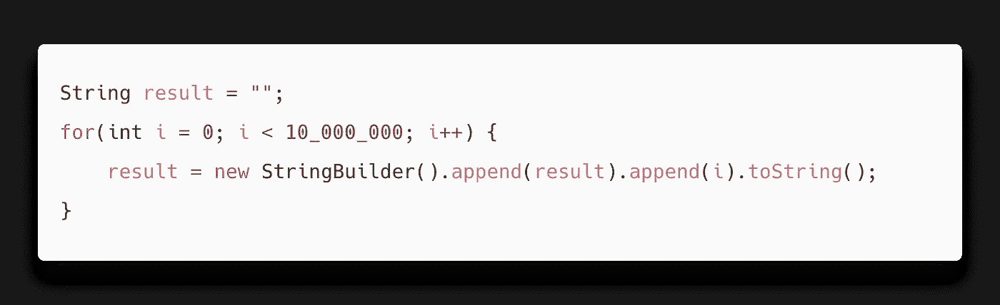

编译器只是优化了内部连接，但是这会创建大量的`StringBuilder`和`String`对象！连接字符串的正确方法如下，只需要 1 个`StringBuilder`和 1 个`String`

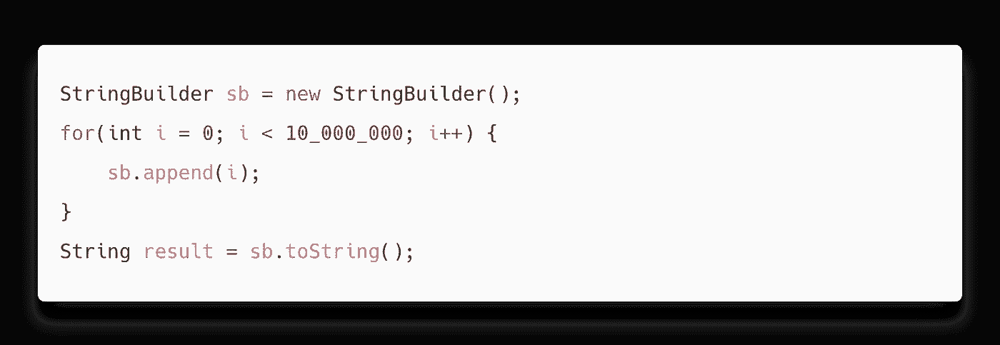

不错的进步！

# 4)字符串形式的密码

将用户提供的密码存储在字符串对象中是一个安全问题，因为它们容易受到内存攻击。

你应该使用`char[]`，因为`[JPasswordField](https://docs.oracle.com/en/java/javase/12/docs/api/java.desktop/javax/swing/JPasswordField.html)`和 [Password4j](https://github.com/Password4j/password4j) 已经在做了。如果我们谈论 web 应用程序，大多数 web 容器在`HttpServletRequest`对象中以`String`的形式传递纯文本密码，所以在这种情况下，您几乎无能为力。

## 说明

字符串由 JVM 缓存(interning)并存储在 PermGen 空间(Java 8 之前)或堆空间中。在这两种情况下，缓存的值仅在垃圾回收发生后被删除:这意味着您不知道特定的值何时从字符串池中被删除，因为垃圾回收器的行为是非确定性的。

另一个问题是`String`是不可变的，所以你不能清除它们。然而`char[]`并不是不可变的，在处理之后可以被删除(*例如*用`0`替换每个元素)。通过这个简单的技巧，攻击者可以在内存中找到清零的数组，而不是明文密码。

# 5)返回空值

我发现过多少次这样的方法:

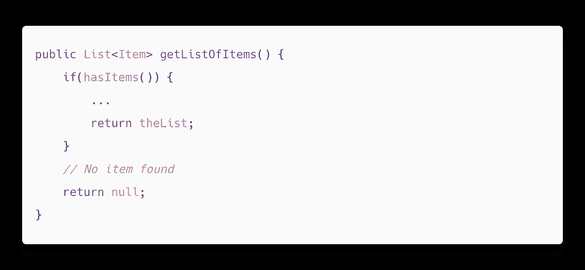

返回`null`的问题是，您强迫调用者对结果进行空检查；在这种情况下，调用者希望如果没有条目，那么将返回一个空列表。

你总是想返回一个异常或者一个特殊的对象(比如一个空列表),否则使用你的代码的应用程序将会受到`NullPointerException`的影响

# 6)传递空值

另一方面，传递`null`意味着你想当然地认为你调用的代码可以管理一个`null`。如果这不是真的，你的应用程序肯定会抛出一个`NullPointerException`。

当你显式地传递`null`时，你会在你的代码中产生很多混乱。下面是一个经典的例子

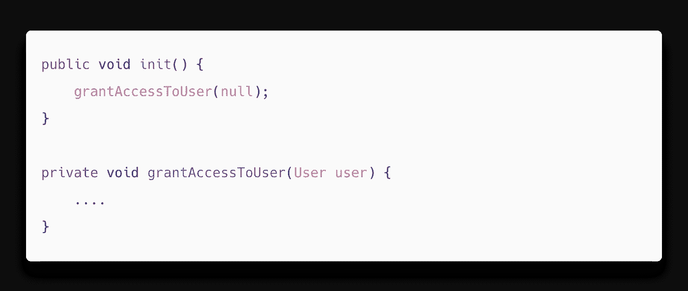

调用`init()`时，没有`User`对象可用。那么，如果你连一个`User`都没有，为什么要调用一个用`User`操作的方法呢？如果你需要包含在`grantAccessToUser()`中的逻辑，你应该用不同的方法提取并使用它，而不是传递一个`null`。

# 7)重方法

以下示例可能会**导致您系统的性能损失**:

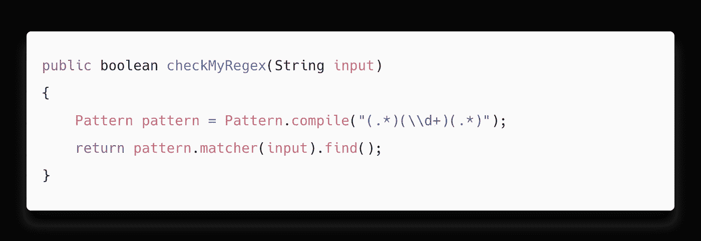

`Pattern.compile()`是一个重方法，不应该在每次需要检查字符串是否匹配相同模式时调用它。

## 说明

`Pattern.compile()`预编译模式，以便使用更快的内存表示。与单个匹配相比，该操作需要不可忽略的计算能力。

提高性能的一个经典方法是在静态字段中缓存`Pattern`对象，如下所示:

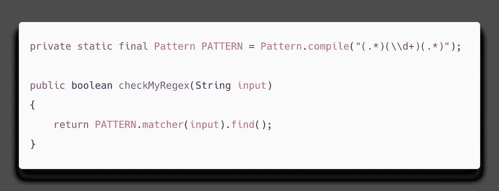

每当您重用同一个计算量很大的无状态对象时，都应该使用这种解决方案。

# 8)使用“返回代码”而不是抛出异常

在某种程度上，开发人员认为异常是邪恶的，他们倾向于编写返回奇怪值的方法，比如`-1`或`"C_ERR"`。

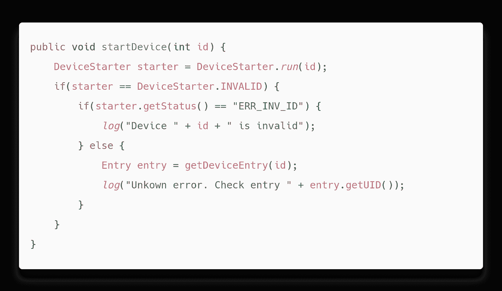

这是一个值得创建自定义`Exception`的典型案例。然后，该示例可以重写如下:

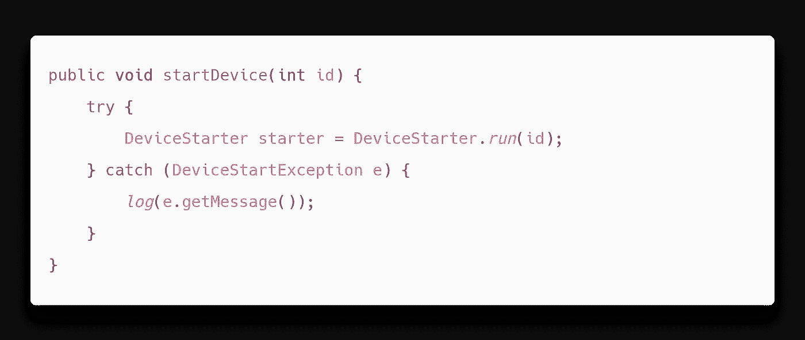

如您所见，可读性和可维护性大大提高了。调用者不必处理每一个返回代码，只需读取`DeviceStartException`的内容。

# 9)迭代时触摸集合

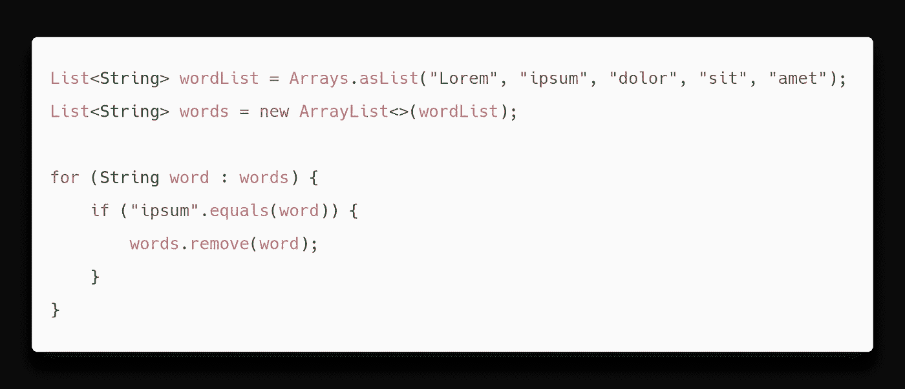

这段代码会抛出一个`ConcurrentModificationException`。

## 说明

在对列表进行迭代时从列表中删除一个项目会使列表迭代器表现不佳，*例如*跳过元素、重复元素、索引数组末尾等。这也是为什么很多收藏更喜欢扔个`ConcurrentModificationException`的原因。

您应该使用底层数组的迭代器:

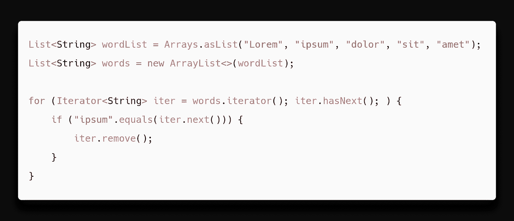

# 10)使用字符串缓冲区

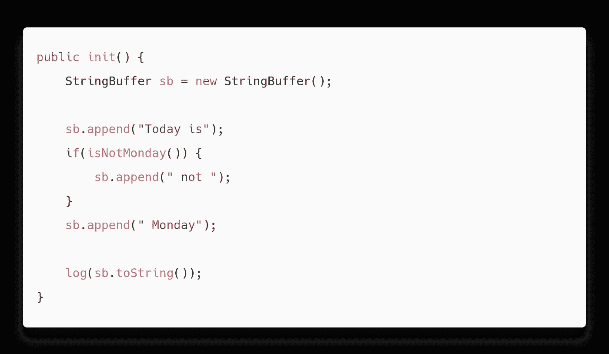

由于`StringBuffer`的同步特性，这个例子**产生了大量的开销**。在更复杂的上下文中，读者可能会认为需要同步，而实际上并不需要。

如果你在一个项目中发现了一个`StringBuffer`，这可能是因为一些遗留 API(即 Java 5 之前)需要它，很少是因为你的代码试图在并发上下文中添加`String`。

用`StringBuilder`代替:随 Java 5 引入，所有操作不同步。

# 结论

这只是我在采访和许多活跃的项目中看到的错误的一个子集。我甚至没有提到 OOP 的陷阱，设计模式，过度工程，内存泄漏等等…

如果你正在犯这些错误，现在是时候改变你的编码风格，让你的应用程序更易维护，更安全。这并不难，避免这些陷阱会提高你作为开发人员的经验，并且会自动让你为下一次面试做好准备。

继续学习任何编程语言背后的理论，而不仅仅是语法，多写代码，使用静态代码分析器，比如 SonarQube，因为它可以指出实际的错误并突出潜在的错误。

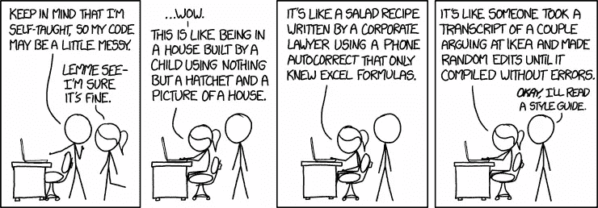

来源: [xkcd](https://xkcd.com/1513/)