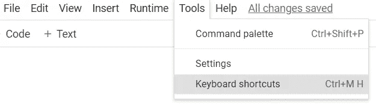
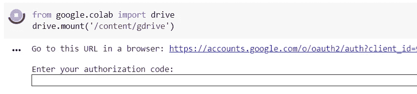
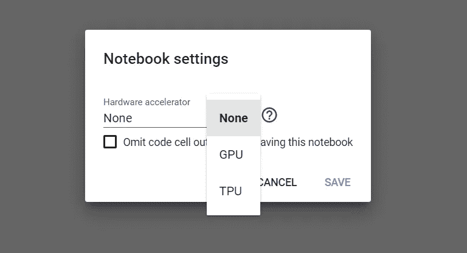
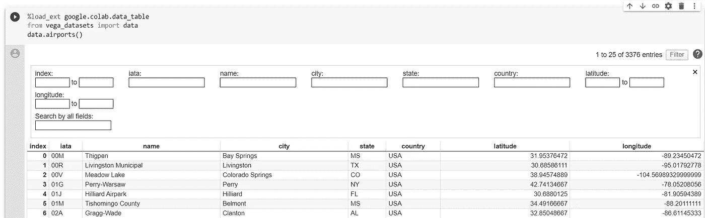
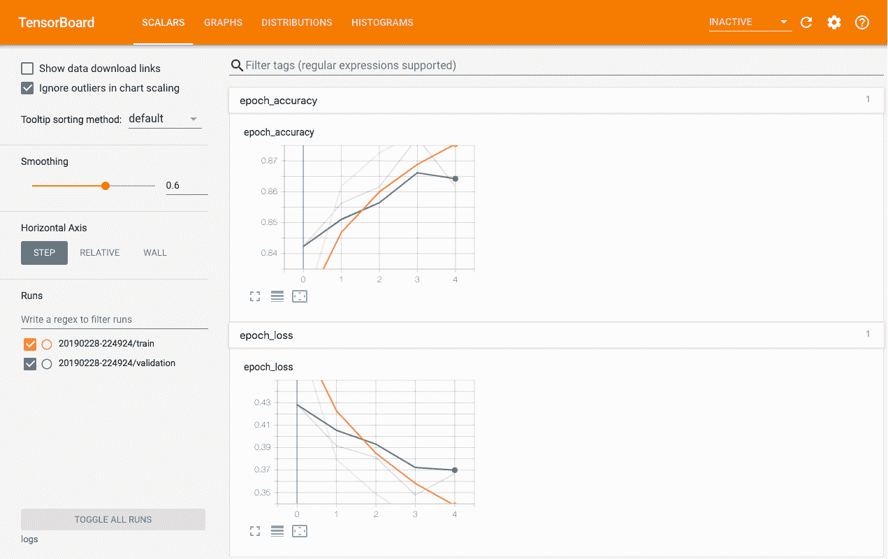
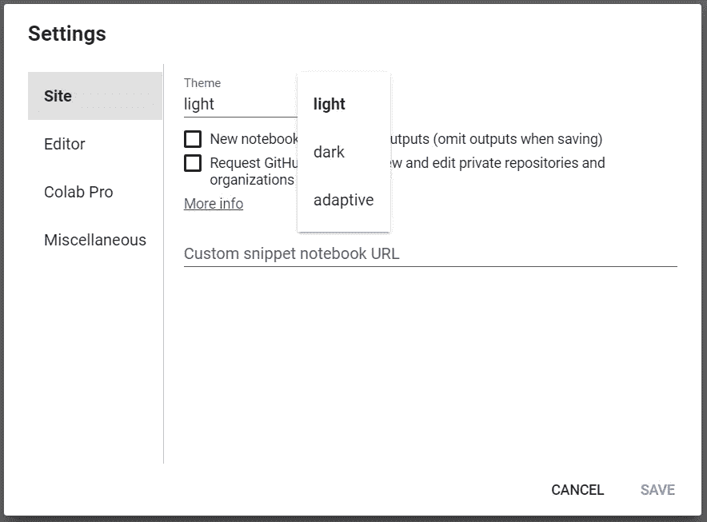

# 更好的 Google Colab 体验的 10 个技巧

> 原文：<https://towardsdatascience.com/10-tips-for-a-better-google-colab-experience-33f8fe721b82?source=collection_archive---------1----------------------->


杰森·塔西曼在 [Unsplash](https://unsplash.com/s/photos/computer-girl?utm_source=unsplash&utm_medium=referral&utm_content=creditCopyText) 上的照片

[Colab](https://colab.research.google.com) 是一个伟大的编码工具。我经常使用它，用于大量的任务，从传统的机器学习到使用 PyTorch、TensorFlow 或 OpenCV 的深度学习应用程序。有了 [Google Colab](https://colab.research.google.com) ，创建和共享笔记本变得直观而简单😃

> 以下是我长期收集的 10 个技巧和窍门，可以帮助你充分利用 Google Colab。

**目录:**

1.  [使用键盘快捷键节省时间](#c6c5)
2.  [将您的 Google Drive 安装到 Colab 上](#0d57)
3.  [运行 bash 命令](#0295)
4.  [上传/下载文件](#55b7)
5.  [激活 GPU 和 TPU](#f56b)
6.  将 Colab 链接到 GitHub
7.  [阻止 Colab 断开](#8c1e)
8.  [将数据框显示为交互式表格](#34af)
9.  [配合 Colab 使用 TensorBoard】](#d1fb)
10.  [改变显示模式](#b714)

# 1.使用键盘快捷键节省时间

您可以通过选择“工具”→“键盘快捷键”来访问所有快捷键。



但这里是我选择的 5 个最佳:

*   **撤消上一个操作(在单元格内):** ctrl + m + z
*   **查找并替换:** ctrl + m + h
*   **在上面插入代码单元格:** ctrl + m + a
*   **在下面插入代码单元格:** ctrl + m + b
*   **删除单元格:** ctrl + m + d

请务必查看其他快捷方式，并定制您最喜欢的快捷方式！

# 2.将你的谷歌硬盘安装到 COLAB

这项功能对于访问存储在 Google Drive 上的文件非常有用。这也是保存模型和数据的最佳方式。为此，只需输入以下代码片段:

```
**from** google.colab **import** drive
drive.mount('/content/gdrive')
```

该单元将返回以下内容:



点击链接，让谷歌 Colab 访问你的驱动器，并检索授权码。粘贴，就大功告成了！

现在，您可以使用批处理命令`!cd`或左侧的“文件”面板来访问位于
*/content/g Drive/My Drive/*
下的 Google Drive 文件。

# 3.运行 BASH 命令

Bash 命令可以通过在命令前面加上“！”来运行。
举例:

*   **用`!wget <ENTER URL>`从网上下载**数据集
*   **用`!pip install <LIBRARY>`或`!apt-get install <LIBRARY>`安装**库
*   **运行**一个现有的。带`!python script.py`的 py 脚本
*   **用`!git clone <REPOSITORY URL>`克隆**一个 git 库

# 4.上传/下载文件

要从您的计算机上传一个(或多个)文件，请运行:

```
**from** google.colab **import** files
files.upload()
```

要下载文件，请运行:

```
**from** google.colab **import** files
files.download('path/to/your/file')
```

另一种方法是使用左侧面板上的**文件浏览器**，拖动&拖放。

⚠️请注意，你一离开谷歌实验室，这些文件就会消失。

# 5.激活 GPU 和 TPU

Google Colab 的默认硬件是 CPU。然而，您可以为深度学习等计算要求更高的任务启用 GPU(甚至 TPU)支持。

点击:“运行时”→“更改运行时类型”→“硬件加速器”。然后选择所需的硬件。



通过执行以下代码，您可以轻松检查 GPU 是否已启用:

```
import tensorflow as tf
tf.test.gpu_device_name()
```

# 6.将 COLAB 链接到 GITHUB

## 打开 Colab 下的 GitHub 文件:

要打开 GitHub 上托管的笔记本，有 3 个选项:

*   前往 https://colab.research.google.com 的[切换到 GitHub 标签，输入笔记本的网址](https://colab.research.google.com/)
*   该笔记本带有一个“在 Colab 中打开”的徽章，允许您直接在 Google Colab 上打开它。
    插入 README.md 文件的降价代码是:

```
[](https://colab.research.google.com/github/googlecolab/colabtools/blob/master/notebooks/colab-github-demo.ipynb)
```

*   使用[“在 Colab 中打开”镀铬加长件](https://chrome.google.com/webstore/detail/open-in-colab/iogfkhleblhcpcekbiedikdehleodpjo)。安装后，每当你在 GitHub 中找到一个 Jupyter 笔记本，点击插件的图标，它就会在 Colab 中打开。

## 将 Colab 笔记本保存在 GitHub 存储库中:

跟随:“文件”→“在 GitHub 中保存一个副本”。一旦点击，它将要求您的 git 帐户的授权。最后，您将能够将 collaboratory 笔记本保存到您选择的存储库中。

# 7.阻止 COLAB 断开连接

## 因闲置而断开连接:

这是 Google Colab 的一个很大的缺点，我相信你们很多人至少遇到过一次这个问题。你决定休息一会儿，但是当你回来的时候，你的笔记本是断开的！

实际上，如果我们让笔记本闲置超过 30 分钟，Google Colab 就会自动断开连接。🕑

在 Linux 上，通过按 F12 或 ctrl+shift+i 打开 Chrome DevTools，并在控制台中输入以下 JavaScript 代码片段:

```
**function KeepClicking**(){
console.log("Clicking");
document.querySelector("colab-connect-button").click()
}
**setInterval**(KeepClicking,60000)
```

该功能每 60 秒点击一次连接按钮。由此，Colab 认为笔记本不是闲置的，你不用担心断线！

## 任务运行时断开连接:

首先，要知道当你连接到 GPU 时，你在云机器上一次最多有 **12 个小时**。

有时你会被切断连接，即使是在这 12 小时的时间间隔内。如 Colab 的 FAQ 中所解释的:“协同实验室是为了交互使用。长时间运行的后台计算，特别是在图形处理器上，可能会停止。”😕

# 8.将数据框架显示为交互式表格

Colab 包括一个扩展，可以将 pandas 数据帧呈现到交互式表格中，这些表格可以被动态地过滤、排序和浏览。

用`%load_ext google.colab.data_table`启用该扩展，用`%unload_ext google.colab.data_table`禁用



# 9.配合 COLAB 使用 TENSORBOARD

TensorBoard 是一种工具，用于提供深度学习工作流程中所需的测量和可视化。它可以直接在 Colab 中使用。📉 📈

首先加载 TensorBoard 笔记本扩展:

```
%load_ext tensorboard
```

创建模型后，使用以下命令在笔记本中启动 TensorBoard:

```
%tensorboard --logdir logs
```



更多细节，请查看关于该主题的 [Tensorflow 教程](https://www.tensorflow.org/tensorboard/tensorboard_in_notebooks)。

# 10.更改显示模式

黑暗模式:很多人更喜欢这种模式，因为它对他们的眼睛来说更放松。您可以按照“工具”→“设置”→“主题”来激活它。



**对于猫&爱狗人士:**对，有 Kitty 和 Corgi 模式。进入“工具”→“设置”→“其他”。在这里，你可以选择模式，你会看到你的猫和狗在你的屏幕上漫步！😹 🐶


> 我希望这篇文章对您有所帮助，并且您将继续使用这个精彩的免费工具。请在下面的评论中分享你的额外建议。编码快乐！

为了进一步阅读，你可以看看这篇非常详尽的博文:

[](https://neptune.ai/blog/google-colab-dealing-with-files) [## 如何在 Google Colab 中处理文件:你需要知道的一切- neptune.ai

### 谷歌合作实验室是一个免费的 Jupyter 笔记本环境，运行在谷歌的云服务器上，让用户…

海王星. ai](https://neptune.ai/blog/google-colab-dealing-with-files)