# 数据之旅的 10 个技巧(我希望我知道)

> 原文：<https://towardsdatascience.com/10-tips-i-wish-i-had-known-before-starting-a-data-journey-905d83f06c33?source=collection_archive---------29----------------------->

## 在与数据打交道 6 年多之后，在开始这段奇妙的旅程之前，我想知道以下这些

布拉德利·埃夫隆先生在斯坦福大学为我签名售书《计算机时代的统计推断》。作者照片

关于数据科学、机器学习、人工智能和大数据，人们说了很多。从 [*【新石油】*](https://www.economist.com/leaders/2017/05/06/the-worlds-most-valuable-resource-is-no-longer-oil-but-data) 的做法，到 [*【二十一世纪最性感的工作】*](https://hbr.org/2012/10/data-scientist-the-sexiest-job-of-the-21st-century) ，到一个被炒作的部门的 [*【欧洲百分之四十的‘人工智能创业公司’实际上并不使用人工智能，索赔报告】*](https://www.theverge.com/2019/3/5/18251326/ai-startups-europe-fake-40-percent-mmc-report) *。*

在一个新行业的兴起过程中，承诺和期望不断涌现。很多人都在研究这个领域，但从某种意义上来说，信息是相当分散的，而不是*。这篇文章简要总结了在开始之前我想知道的关于数据的 10 件事:*

1.  *背景:我们是如何走到这一步的？*
2.  **这完全是尺寸问题**
3.  **在维度上有意义- >训练算法**
4.  **聪明的数据胜过复杂的算法**
5.  **不是有机器学习的问题等着你**
6.  **端到端构建、快速迭代和沟通**
7.  **开源，这不是宗教**
8.  **每天学习，应对冒名顶替综合症**
9.  **要谦虚**
10.  **未来、职业和话题**

*这个演讲是启动第三版 [AI 星期六马德里分会](https://www.saturdays.ai/city-madrid.html)的基调。 [AISaturdays](https://www.saturdays.ai/index.html) 是一个惊人的倡议，旨在通过聚集在一起并通过编码学习来实现人工智能的民主化，目的是创建项目。*

*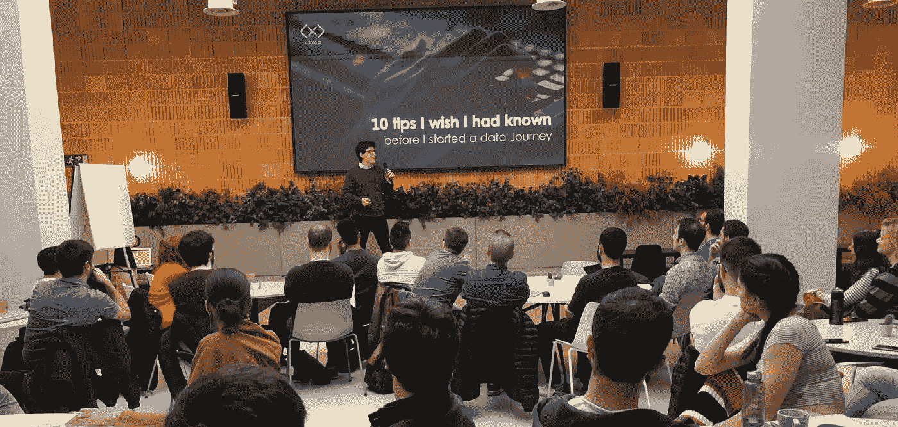*

*请继续收听第四版！[https://www.saturdays.ai/city-madrid.html](https://www.saturdays.ai/city-madrid.html)。作者照片*

*开始吧！*

# *1.-语境:我们是怎么走到这一步的？*

*在某种程度上，似乎突然之间大多数公司都对*【大数据】*产生了浓厚的兴趣。从所有这些噪音中，出现了一句话:*“大数据就像青少年的性行为:每个人都在谈论它，没有人真正知道如何去做，每个人都认为其他人都在做，所以每个人都声称自己在做”**

*三件事情的发展创造了这个*【大数据】*机会:*

1.  ***数据:**社会的数字化以及**收集和存储**所有这些知识的能力。把数据当成*原材料**
2.  ***计算:**计算能力遵循摩尔定律发展，摩尔定律描述了计算机的能力每两年翻一番。这使得**能够处理**所有这些知识。把它想象成*工具**
3.  ***算法:**我们今天使用的算法自 80 年代(甚至更早)就已经存在，但现在它们可以被编程为所有这些知识的行动号召。把它想象成*食谱**

*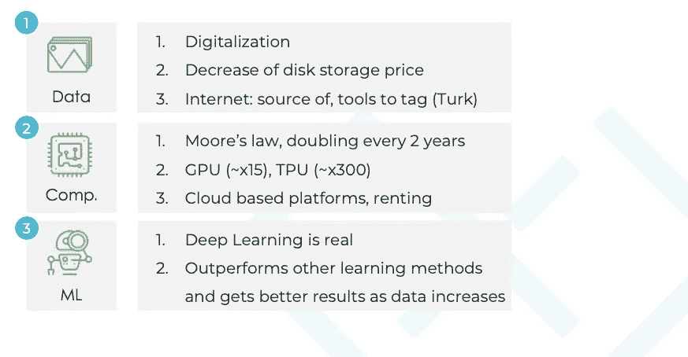*

# *2.-这都是尺寸的问题*

*把数据想象成维度，就像图形中的点。维度可以像 Excel 列一样简单。在下面的示例中，您可以看到由一组变量(维度)表示的三个人。这些变量可以用图表来表示:*

*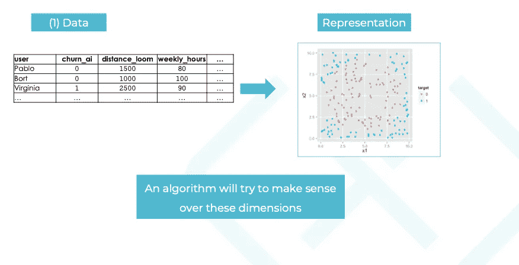*

*在这种情况下，我们有 3 个维度，*距离 _ 织机*、*每周 _ 小时数*和*流失 _ 人工智能*。这里的目标是用一种算法来区分不同的用户。*

*一旦你用维度来表示信息，你就会更好地理解算法是做什么的。*

# *3.-在维度上有意义->训练算法*

*一旦你把数据看作是维度的集合，就把算法看作是一种工具，它试图在这些维度上找到意义。在下面的示例中，目标是用可用数据(列/维度)区分蓝色和红色用户。不同的算法会以不同的方式提取它们的逻辑:*

*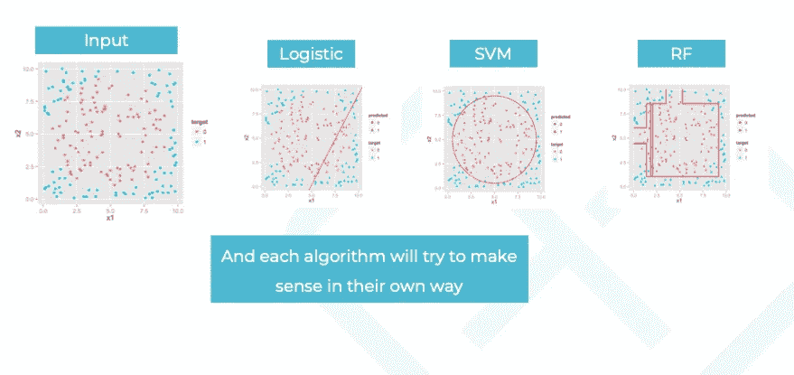*

*   ***逻辑推理:**以线性方式*
*   ***支持向量机(SVM)**非线性方式*
*   ***随机森林(RF):** 以*“树”*的方式划分各个维度*

*算法想要优化以区分这些点的函数(在我们的例子中是用户之间的分离)就是我们所说的**目标函数**。指导算法的函数，并告诉我们它是对还是错:*

*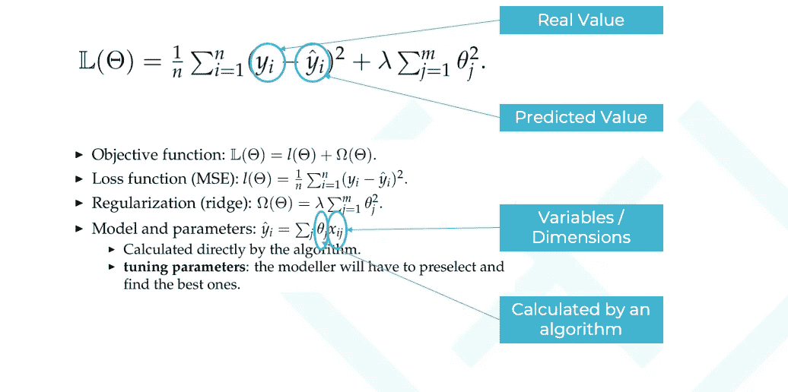*

*最终目标是使*实际值*和*预测值*尽可能接近*、*而不过度拟合。该算法使用可用的维度(变量)并使用其自身的逻辑来实现这一目标。*

# *4.-复杂算法之上的智能数据*

*机器学习对复杂性有偏见。一旦你在这个领域工作，有时你可能会试图以某种深奥的方式混合不同的模型，这只会增加越来越多的复杂性。通常情况下，越简单越好。为了提高算法的性能，有两种明确的方法:*

*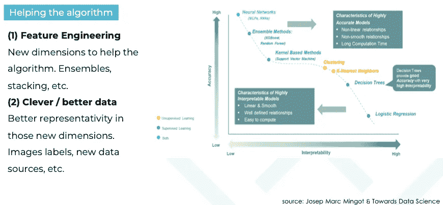*

1.  ***特征工程:**从当前信息创建新变量。*
2.  ***聪明的数据:**添加与你的问题相关的新数据。*

*几乎总是，聪明的数据会赢。当你面临一个 ML 问题时，想想哪些变量会帮助你改进你的模型。*

# *5.-没有机器学习问题等着你*

*句号。大多数时候，当你到达一家公司时，你可能会认为他们会有一个机器学习问题，就像你在课程中看到的那样，为你准备好了。**现实离得再远不过了**。有三种情况:*

1.  *在“大数据”流程中工作的公司，你可能是他们的第一个*数据人。这对于第一份工作来说是一个痛苦的处境。如果你听到*“是的，我们有很多数据。csv 文件"***
2.  *公司拥有良好的技术堆栈，你可以访问数据库并找到一个 ML 问题。你必须判断何时何地应用 ML*
3.  *你可以有第三种类型，在这种类型中，你受到优秀数据团队的欢迎，但是，这种情况很难找到*

*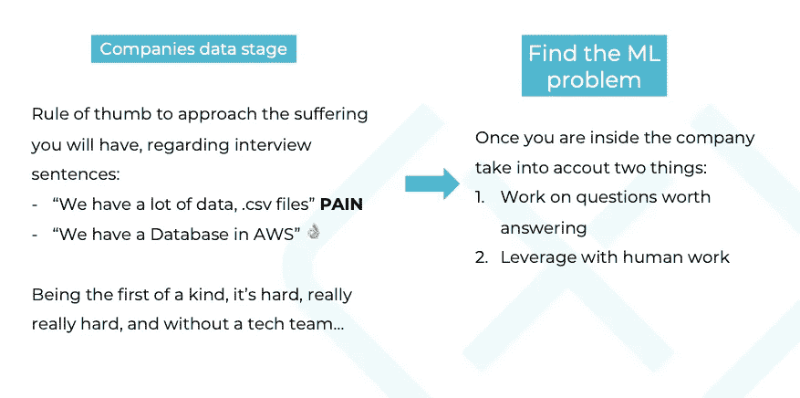*

*在寻找机器学习问题时，你应该记住两个事情:*

1.  *研究值得回答的问题*
2.  *通过人工工作利用您的解决方案*

# *6.-端到端构建、快速迭代和沟通*

*产生影响的关键是尽可能快地对算法流程进行端到端迭代。你的变量对你的问题可能是误导性的/不现实的(泄漏)，其中一些在生产中可能无法计算。问自己一个问题:我的预测有意义吗？*

*当你迭代直到过程结束时，你会意识到这些事情。*

*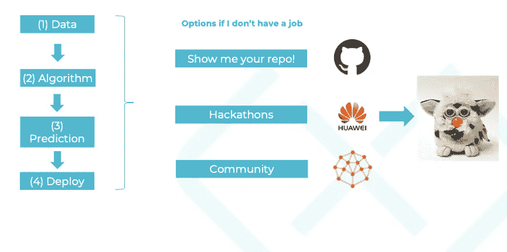*

*找工作？做事，分享东西。拥有一个 Github repo，参与黑客马拉松，融入你的社区……不要听起来像个 Furby。*

# *7.——开源，这不是宗教*

*从授权软件到开放知识。谢谢开源。如今，知识对每个人都是开放的，公司不能拥有“专属知识”。从一开始就不是这样。这么多年来一直有个讨论，*哪个更好:**

*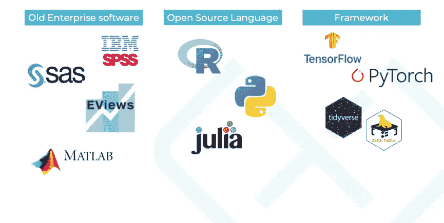*

*老企业软件？开源 R 还是 Python？这一点目前已经转移到参考框架。以“开源的方式”思考，拥抱知识，准备好学习新的东西。像这样新的、毫无结果的讨论肯定会出现，不要浪费你的时间。*

# *8.-每天学习并应对冒名顶替综合症*

*这是一场马拉松，而不是短跑。在左图中，您看到了过去被称为数据科学家的独角兽(🦄).在右边，一个来自 David Silver 的 RL 课程的更真实的图表([链接](https://www.davidsilver.uk/wp-content/uploads/2020/03/intro_RL.pdf))。*

*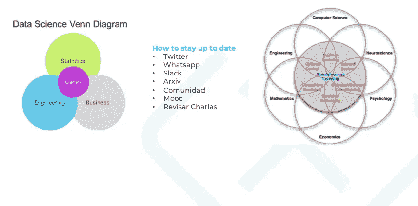*

*依我拙见，跟上时代并成为“人工智能专家”几乎是不可能的。你可以成为某个领域的专家，但不是所有领域的专家。这可能会产生某种冒名顶替综合症。不要担心，我采访过的几乎每个数据科学家都会遇到这种情况。在这个行业中，你必须每天学习。*

# *9.-保持谦逊*

*这是[特雷弗·哈斯蒂](https://web.stanford.edu/~hastie/)。斯坦福大学教授，世界上最著名的统计学家之一。图片背后的故事是，我敲他的门要书签名(是的，书呆子)，我们进行了一次很棒的关于统计学、深度学习和 r 的对话。*

*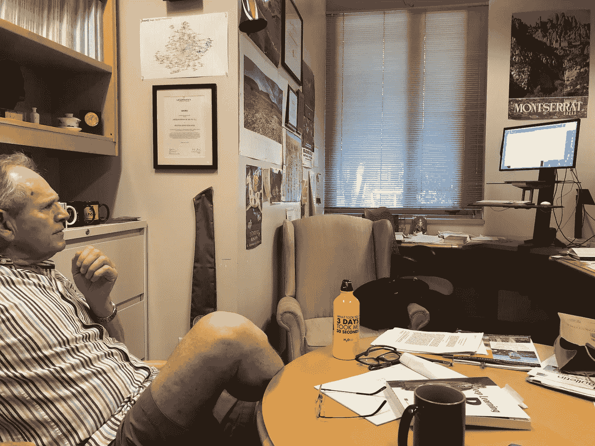*

*作者照片。*

*他，最好的人之一，他对我非常谦虚和友好。旅途中非常重要的一件事。*

> *完整的故事在这里👇*

# *10.-未来、职业和主题*

*数据科学职业的繁荣可能类似于突然诞生的“医生”职业。*数据科学家*是一个越来越专业化的通用术语。两个剖面是顶级的:*

1.  ***机器学习工程师:**云+算法*
2.  ***应用数据科学家:**发现 ML 商机*

*我认为最有趣的话题之一是**因果推断**。我们正在创造惊人的东西，这些东西可以预测、构建洞察力并帮助我们，但它们是如何做出决策的呢？我们能从分析中得出因果关系吗？突破关联，才能明白事情为什么会发生。*

*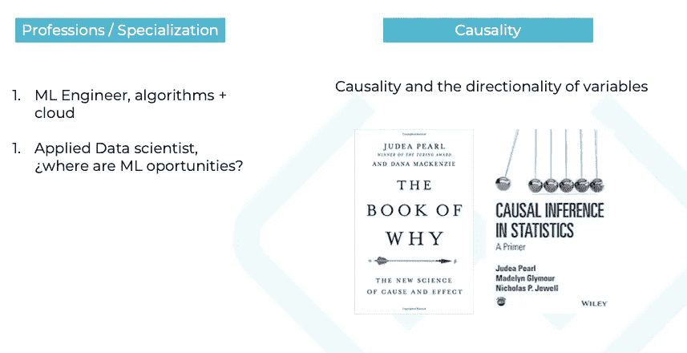*

*祝您的数据之旅愉快！*

***完整演示***

*请随时联系我:bort@xplore.ai*