# 让您的数据科学代码更干净、更高效的 10 个技巧

> 原文：<https://towardsdatascience.com/10-tips-to-make-your-data-science-code-cleaner-798ba398fcbe?source=collection_archive---------34----------------------->

## [**现实世界中的数据科学**](https://medium.com/towards-data-science/data-science-in-the-real-world/home)

## 大多数 Moocs 和大学课程都不会教你如何用 Python 进行专业编码，这篇文章会给你一些提示。

[注意:本文会根据您的反馈定期更新。欢迎在评论中添加您的评论。]

首先，我想指出的是，这个列表并不详尽，但它是我的许多经验和阅读的结果:

*   我从事数据科学项目、进行代码审查和开发机器学习管道的经验，其中涉及许多数据科学家(数据科学家 Modeo.ai 的联合创始人、Pronoo.ai 的 CTO、自由数据科学家和 GarageISEP 的 AiLab 负责人)。
*   我在亚马逊网络服务组织的自动驾驶汽车锦标赛 AWS DeepRacer 上的工作，在那里我赢得了法国版并参加了 2019 年 12 月在拉斯维加斯举行的世界决赛(见:[https://medium . com/@ matthieurousseau _ 16015/what-is-the-AWS-deep racer-league-and-how-do-we-win-the-French-edition-facae 656680 c](https://medium.com/@matthieurousseau_16015/what-is-the-aws-deepracer-league-and-how-did-we-win-the-french-edition-facae656680c))
*   我读过的关于这个主题的书(我强烈推荐):

1.  罗伯特·马丁。干净的代码:敏捷软件技术手册。皮尔森，2009 年。
2.  奥雷连·盖伦。*使用 Scikit-Learn 和 TensorFlow 进行动手机器学习:构建智能系统的概念、工具和技术*。奥莱利，2017。
3.  韦斯·麦金尼。*用于数据分析的 Python*。奥莱利，2017。
4.  罗伯特·马丁。*干净的架构:软件结构和设计的工匠指南*。培生，2017。

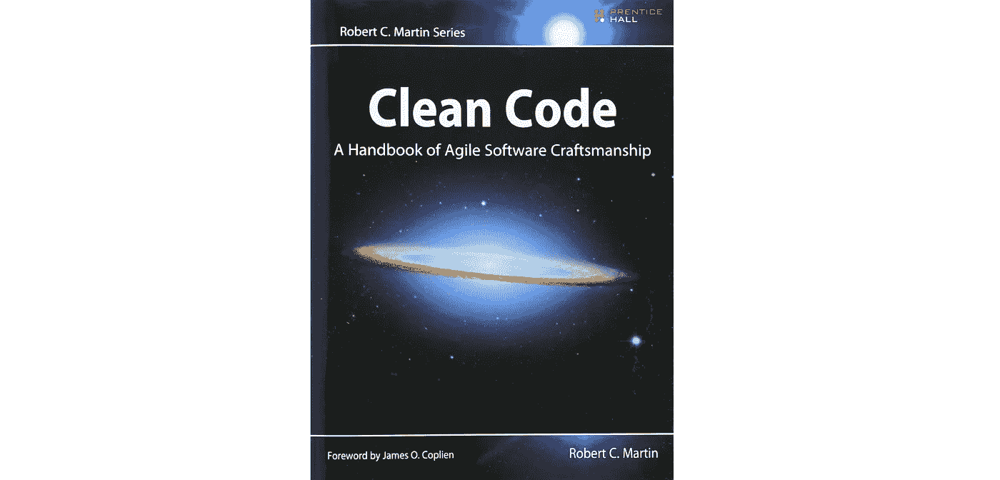

罗伯特·马丁。*干净的代码:敏捷软件技术手册*。皮尔森，2009 年，[https://www.amazon.fr/](https://www.amazon.fr/)。

尽管我在法国大学学习数据科学多年，但我的大部分知识都是通过 Coursera 和 Udemy 上的在线课程获得的(我想我是现代数据科学家的陈词滥调，但感谢吴恩达)。然而，我不得不说，在在线课程中教授代码的方式和如何开发代码以用于现实世界的应用程序之间存在巨大的差距。

我不会假装说我的编码方式是最好的，我也不认为正确编码是一门精确的科学，但是通过遵循这 10 个技巧，你可以大大提高代码的可读性。

# **1。每个功能一个抽象层次**

为了使代码更具可读性，每个函数必须专用于一个任务。最好有很多函数，而不是太长的函数，做几件事，因此令人困惑。为了确保一个函数只做一件事，将函数限制在一个抽象层次上是很重要的。

什么是抽象层次？该函数的目的是从数据库中检索数据，然后对数据进行预处理。

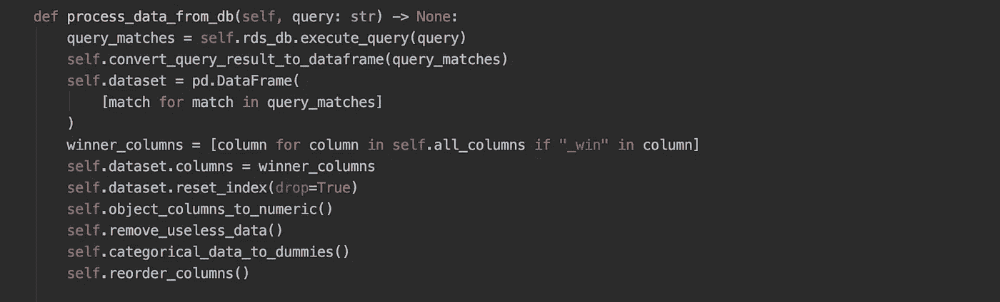

在下图中，你可以看到三个层次的抽象。这其实是代码层面的问题。我们是否将“高级”函数视为 process_data_from_db，我们是否像重命名列一样直接操作 Pandas 数据框架？

下面是我们可以做些什么来使这段代码更具可读性:

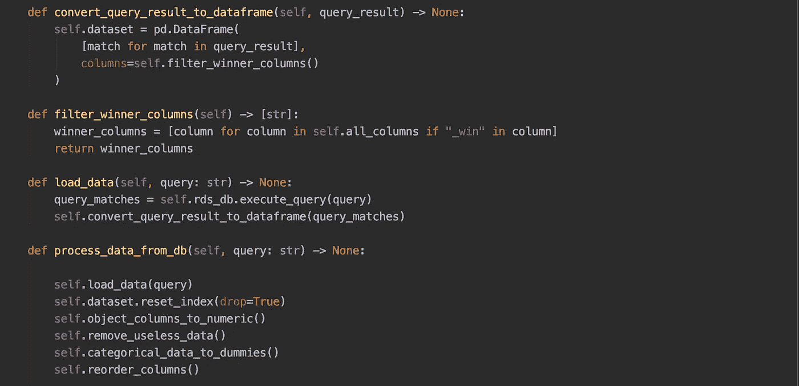

# **2。使用类型提示提高可读性**

因为我们的目标是操作数据，所以我们的函数通常采用不同的数据类型作为参数(列表、元组、字典、Pandas DataFrame、Numpy 数组等)。因此，必须指定每个参数的类型以及返回对象的类型。

为此，建议使用提示来指定每个参数和每个返回对象的类型。这使得代码更容易阅读和维护。

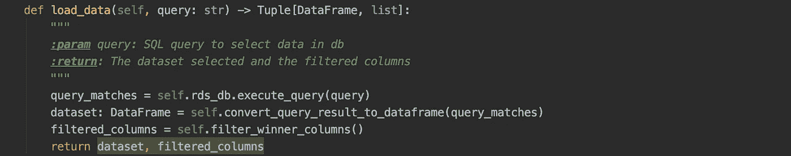

https://www.bernat.tech/the-state-of-type-hints-in-python/见

# 3.**论据**

应该尽可能地限制争论。令人惊讶，对吧？让我告诉你为什么。

函数有几种类型，一元(0 个自变量)、一元(1 个自变量)、二元(2 个自变量)、三元(3 个自变量)和多元(3 个以上自变量)。一元是可以接受的，二元应该避免，超过 3 个参数就太多了。

主要原因是它们需要大量的概念性工作，因此很难理解，尤其是在具有复杂工作流的管道中。第二个原因与单元测试有关。当您对函数执行单元测试时，您必须测试每个参数之间所有可能的组合，这使得这一阶段的测试更加复杂。

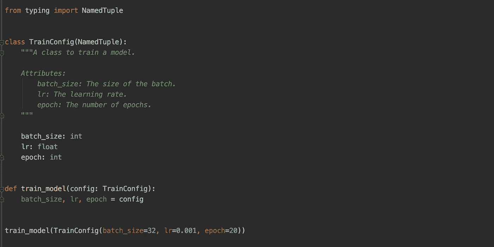

# **4。分块和缩进**

功能必须很小。没有人想在 2000 行的函数中寻找错误。为了使函数可读，每个语句尽量少用几行(if，else，while…)。

理想情况下，每条语句尽量只占一行。为了尽可能清楚起见，这一行可以用来调用具有显式名称的函数。当你别无选择的时候，尽量限制自己最多两级缩进，以免影响代码的可读性。

此外，Python 允许在一行中进行循环，这有助于提高清晰度。

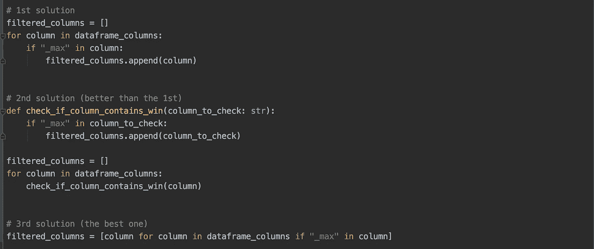

# **5。错误处理**

错误管理不是开发数据科学管道中最令人兴奋的部分，但却是必不可少的。它将帮助您监督管道的执行，并在出错时做出正确的决策。

首先，一个好的反应是用 try 开始你的顶层脚本，除了，最后，因为它们定义了你的程序的执行范围。如果执行失败，它将在 catch 中恢复，因此您将能够根据错误的类型做出正确的决定。

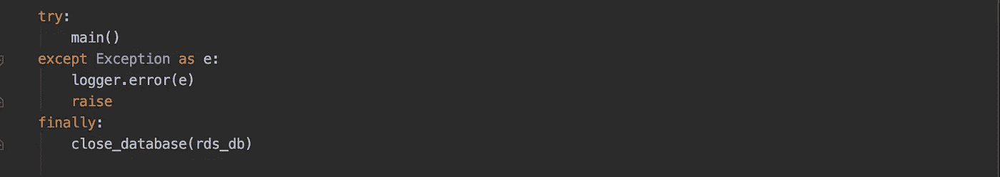

另一个充分利用例外的方法是发展你自己的例外。

假设您正在通过 API 检索数据。最有可能的是，您无法控制 API 返回给您的内容，这会影响您的程序的正确执行。

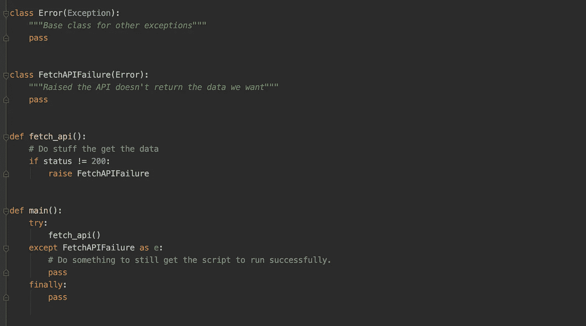

见:[https://jeffknupp . com/blog/2013/02/06/write-cleaner-python-use-exceptions/](https://jeffknupp.com/blog/2013/02/06/write-cleaner-python-use-exceptions/)

# 6.**使用记录器，不打印**

打印有利于调试和测试，但是当涉及到将代码投入生产时，日志记录器更合适。

印刷品的格式更复杂，可读性更差，最重要的是包含的信息很少。另一方面，记录器包含更多的信息，被直接格式化，并且具有一定的信息级别，可以识别信息的重要性(信息、警告、错误等)。).

在下图中，您可以看到培训脚本的执行显示。关于登录 Python 的更多细节，请参见 https://docs.python.org/3/howto/logging.html。

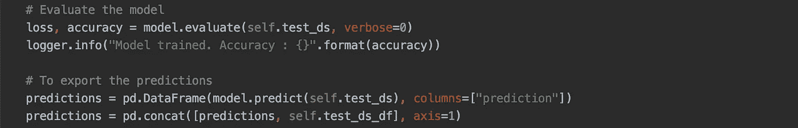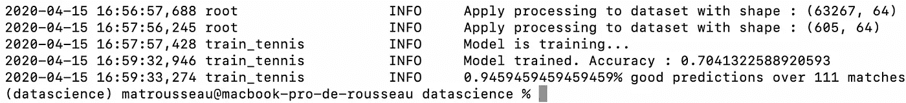

# 7.**文档字符串**

Docstring 是 Python 中必不可少的元素。它必须出现在任何语句声明中(函数、类或方法定义)。它们使代码更加清晰，并作为对象的文档。

一个通用的约定提供了所有的可维护性、清晰性、一致性，也是良好编程习惯的基础。它没有做的是坚持让你违背自己的意愿去跟随它。那是 Python！”

*—蒂姆·彼得斯论比较语言. python，2001 年 6 月 16 日*

有两种类型的文档字符串，单行文档字符串和多行文档字符串。

**单行 docstring** 用于最明显的情况，它们适合单行。描述简明扼要，并提供了函数名称所提供的附加信息。正如 Python 文档中所述:

*   即使字符串在一行中，也要使用三重引号。这使得以后扩展它变得容易。
*   结束引号和开始引号在同一行。这看起来更适合一行程序。
*   docstring 前后都没有空行。
*   文档字符串是以句点结尾的短语。它将函数或方法的效果规定为命令(“Do this”、“Return that”)，而不是描述；例如，不要写“返回路径名…”。
*   单行 docstring 不应该是重复函数/方法参数的“签名”(可以通过内省获得)。

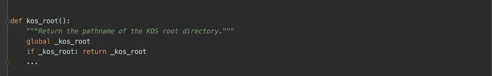

多行文档字符串用于更复杂的情况。描述更加详细，后面还有一个空行。重要的是，它应该在一行中，并通过一个空行与 docstring 的其余部分分隔开。摘要行可以与起始引号在同一行，也可以在下一行。整个文档字符串的缩进与其第一行的引号相同(参见下面的示例)。

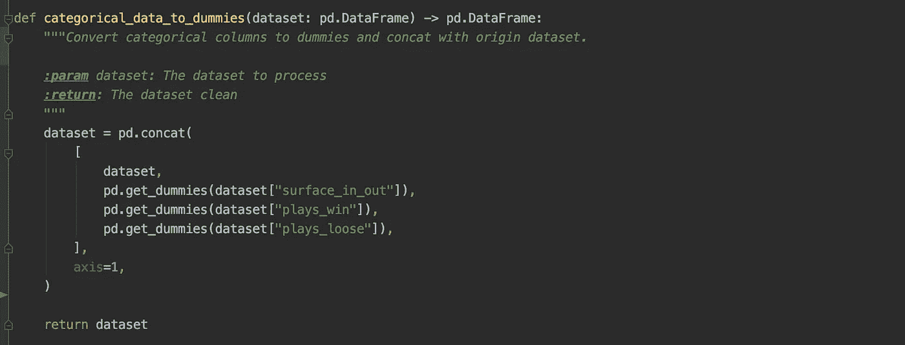

参见:【https://www.python.org/dev/peps/pep-0257/#abstract】T2

# 8.单元测试

Python 测试是一个非常广泛的话题，并且可能非常复杂，但是它们对于使您的 python 代码更干净和更健壮是必不可少的。

*“在计算机程序设计中，* ***单元测试*** *是一种软件测试方法，通过这种方法对单个源代码单元、一组或多组计算机程序模块以及相关的控制数据、使用程序和操作程序进行测试，以确定它们是否适合使用”。*科拉瓦、亚当、胡伊津加、多洛塔(2007 年)。 [*自动化缺陷预防:软件管理中的最佳实践*](http://www.wiley.com/WileyCDA/WileyTitle/productCd-0470042125.html) 。威利-IEEE 计算机学会出版社。第 75 页。

有效测试的一个好技巧是使用 TDD 三定律和 F.I.RS.T 原则(适用于 Python 和其他编程语言)。

**TDD 三定律:**

1.  在你写完一个失败的单元测试之前，你不能写任何产品代码。
2.  你不能写超过足以失败的单元测试，不编译就是失败。
3.  您不能编写比足以通过当前失败的单元测试更多的产品代码。

**F.I.R.S.T**

1.  快速:测试应该快速运行，因为你必须经常测试它们。否则，你就不能充分发挥它们的潜力，因为它们会浪费你的时间。
2.  **独立:**测试不应该相互依赖，它们不应该为下一次测试设置条件。您应该能够按照您想要的顺序运行它们。
3.  可重复:测试必须能够在任何环境下运行，无论是生产阶段还是原型开发阶段，无论是在任何机器上。因此，使用的环境不会影响测试的成功。
4.  **自我验证:**测试的输出应该是布尔值。要么考上了，要么没考上但是没有中介。否则，通过测试就变得主观了。
5.  **及时:**单元测试必须在正确的时间开发，即在测试阶段，而不是在产品中。

参见:【https://docs.python.org/3/library/unittest.html

# 9.**评论**

如果使用得当，Python 注释非常有用，但是如果使用不当，它可能会成为混乱和信息过剩的主要来源。当我们开发的代码不够清晰时，我们使用它们，这是正常的，因为并不总是能够清楚地解释我们的代码做什么。

有几种类型的**好的**评论:

1.  **法律意见**:版权、许可等…
2.  **信息性注释**:当您需要指定正在解析的日期的格式时。
3.  **意图解释**:缩进往往反映了一种复杂的逻辑，它可以用来简要解释他们在做什么。
4.  澄清:你的代码很难理解。阐明返回的参数或变量的用法有时很有用。
5.  **后果警告**:执行某些代码块可能会产生重要后果。注释可以用来提醒另一个代码用户。
6.  放大:它们可以用来放大可能被忽视的代码的重要性。

但也有几种类型的恶评:

1.  **不明确**:当你懒于写好，评论没有提供明确的信息。
2.  **多余**:当你重复 docstring 中或者之前注释中说过的话。
3.  **噪音信息**:不必事事评论，否则说明你的代码不清楚。
4.  **注释掉的代码:**删除旧的不用的代码比注释掉好。

# 10.**重新格式化代码的工具**

关于代码的格式，Python 的结构要求我们非常仔细，以便正确地格式化我们的代码。实际上，要跳过的行数根据代码中声明的内容而有所不同(我们是声明一个类、一个方法还是一个变量？).

列表不要太长，否则，你必须回到那一行，行的长度、空间规则等等也是如此……总之，有很多规则要遵循，用手一丝不苟地遵循它们太长了(见[https://www.python.org/dev/peps/pep-0008/](https://www.python.org/dev/peps/pep-0008/))。

幸运的是，一些库会自动格式化你的代码，节省的时间是相当可观的。最著名的库是 Black 和 Yapf，我强烈推荐它们。它们很容易集成到像 PyCharm 这样的 IDE 中，结果非常好。

此外，一个好的 IDE 可以指出主要的风格错误，并提出修改建议。就我而言，我使用 PyCharm，其纠错系统非常高效。

下面的代码向您展示了如何将格式糟糕的难看代码转换成格式良好的难看代码。

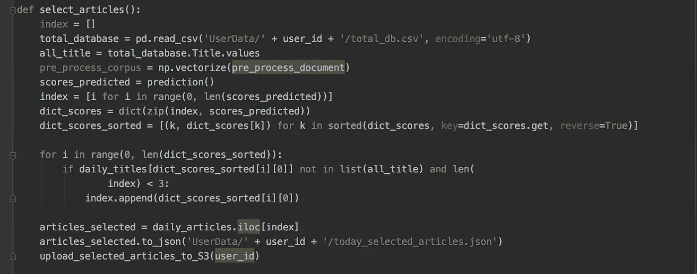

以前

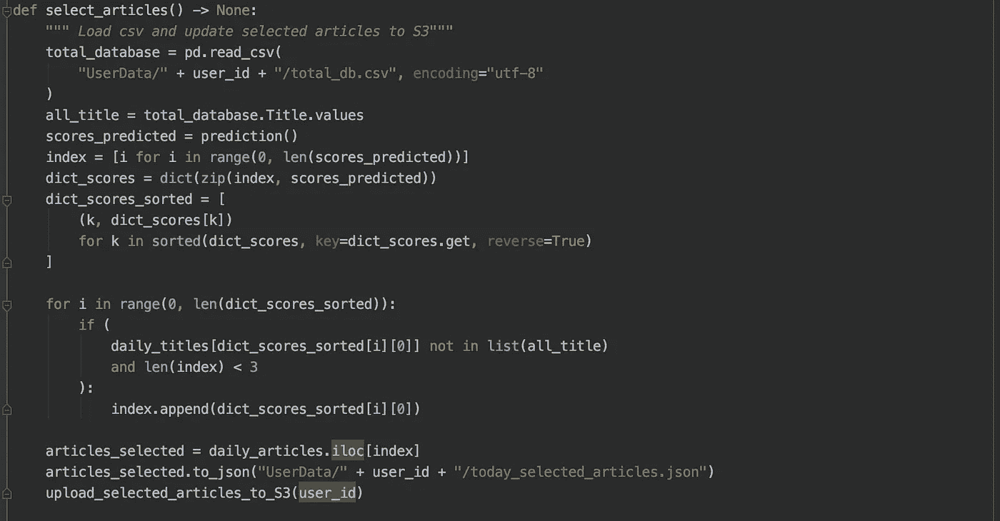

在布莱克和皮查姆之后

参见:[https://open source . com/article/18/7/7-python-libraries-more-maintable-code](https://opensource.com/article/18/7/7-python-libraries-more-maintainable-code)

# 结论

我希望您会对这篇文章感兴趣，并且它会为您提供一些改进 Python 代码的线索。

我还推荐你看看这个 GitHub 资源库，它包括了本文中提到的概念和其他代码示例:【https://github.com/davified/clean-code-ml。

如果您对本文中提到的技巧有任何意见，请随时对本文发表评论或通过电子邮件发送给我: [matthieu@modeo.ai](mailto:matthieu@modeo.ai) 。