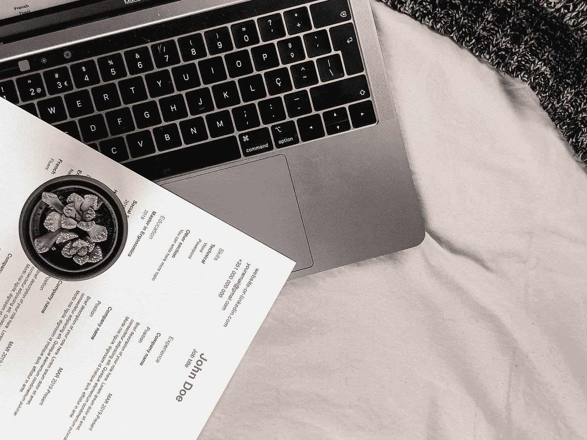

# 向数据科学过渡的 10 项任务

> 原文：<https://towardsdatascience.com/10-to-dos-to-transition-into-data-science-e84b7eb1f3fa?source=collection_archive---------51----------------------->

## 意见

## 构建个人数据科学组合的一些有用提示

Avel Chuklanov 在 [Unsplash](https://unsplash.com?utm_source=medium&utm_medium=referral) 上拍摄的照片

数据科学是统计学、编程和讲故事的交叉。从根本上说，数据科学角色从创造可操作的见解的能力中获得价值。数据科学家的职责不同于学术界的研究科学家。与传统研究相比，行业任务的进展速度更快，不那么模糊。本文将为那些希望从学术界跳到数据科学家岗位的人提供指导。

## 1:不断学习

适应新技术和信息的能力是成为一名娴熟的数据科学家的关键。不断学习新的技巧和技术将有助于你获得一个职位，并在这个职位上取得进步。在我自己的经历中，我遇到过许多要求 Go 的开放职位。虽然我的工作主要是用 Python 编写的，但我已经开始创建一个小型的围棋组合。对于那些寻求更结构化的数据科学学习的人，还存在训练营、开放式课件和远程程序。对于那些拥有研究生学位的人，我推荐像 [Insight](https://insightfellows.com/) 这样的公司，除了培训之外，它还提供指导。这篇文章最大的收获是不断学习。

照片由[蒂姆·莫斯霍尔德](https://unsplash.com/@timmossholder?utm_source=medium&utm_medium=referral)在 [Unsplash](https://unsplash.com?utm_source=medium&utm_medium=referral) 上拍摄

## 2:沟渠 R

对于那些有学术背景的人来说，你可能熟悉统计编程语言 R。根据对 S [tackOverflow](https://stackoverflow.com/jobs) 工作板的特别搜索，R 只是 1.26%的可用职位的标签。我猜这个数字会继续下降。工业上通常不使用 r，原因有二。第一:R 是开源的，一些公司要求统计软件具有商业责任，这意味着使用 SAS 或 Matlab。第二:R 在规模上较慢，R 的功能在其他语言中被复制，比如 python 中的 pandas。如果你打算转行到工业界，现在就从避免 r 开始。

克里斯·迪诺托在 [Unsplash](https://unsplash.com?utm_source=medium&utm_medium=referral) 上拍摄的照片

## 3:开始写博客

真正学到东西的最好方法是教书。博客可以兼作文件夹和巩固你所学知识的地方。Medium 是开始写作和吸引他人的好地方。我喜欢将我的兼职项目发布到[的数据科学](https://towardsdatascience.com/)网站上，我发现[向他们的出版物投稿很简单。Medium 是一个很好的平台，可以通过代码、图像甚至动画来练习讲述数据故事。](/questions-96667b06af5)

 [## 不断变化的美国住房市场人口统计数据

### 一个使用海绵和赛璐珞制作动画的人口金字塔

towardsdatascience.com](/changing-us-housing-markets-demographics-34d9b0c71cb4) 

## 4:获得一个 GitHub 帐户

熟悉 Git 和 [GitHub](https://github.com/) 是数据科学家的必备技能。Git 是版本控制的一个例子。版本控制创建程序的历史副本，允许团队灵活地进行更改、修复错误或恢复代码，以实现流畅的功能。GitHub 也被用作数据科学家的公共投资组合。GitHub 的另一个好处是能够通过 GitHub 页面免费托管域名。

 [## 使用 GitHub 创建漂亮的静态网页

### 查找模板和为静态网页创建表单的位置

towardsdatascience.com](/building-a-beautiful-static-webpage-using-github-f0f92c6e1f02) 

## 5:制作个人网站

网站是一个有趣又方便的项目，可以提升你的形象，也是一种资源，让其他人可以看到你的成就、博客或任何你想分享的东西。我的个人网站可以在 c[odyglickman.com](https://codyglickman.com/)找到。如果你打算做自由职业者，网站开发会很有用，一些咨询数据科学网站的好例子包括 [Claudia Ten Hoope](https://www.claudiatenhoope.com/) 和 [Data Dolittle](https://datadolittle.com/) 。

由 [Le Buzz](https://unsplash.com/@le_buzz?utm_source=medium&utm_medium=referral) 在 [Unsplash](https://unsplash.com?utm_source=medium&utm_medium=referral) 上拍摄

## 6:创建 StackOverflow 配置文件

StackOverflow 是一个学习和运用你的知识帮助他人的好地方。StackOverflow 也是一个地方，当我完全被某件事难倒时，我会去那里。这个社区很棒，也很有帮助。你也可以通过帮助回答别人的问题来回馈社会。

[格伦·诺布尔](https://unsplash.com/@glennoble?utm_source=medium&utm_medium=referral)在 [Unsplash](https://unsplash.com?utm_source=medium&utm_medium=referral) 上的照片

## 7:熟悉云计算

远程工作的兴起和不断增长的数据规模意味着您的个人笔记本电脑可能无法处理工业所需的任务。 [AWS](https://aws.amazon.com/) 、[谷歌云](https://cloud.google.com/)和[微软 Azure](https://azure.microsoft.com/en-us/) 是云计算领域的主导者，这三家公司都有低成本或免费的试用版，让你熟悉在网络上发布命令。

图片由 [C Dustin](https://unsplash.com/@dianamia?utm_source=medium&utm_medium=referral) 在 [Unsplash](https://unsplash.com?utm_source=medium&utm_medium=referral) 上拍摄

## 8:在社交媒体上与其他数据科学家联系

[Twitter](https://twitter.com/glickman_cody) 和 [LinkedIn](https://www.linkedin.com/in/codyglickman/) 是联系其他数据科学家的好地方。与其他数据科学家的交流创造了新的发展机会。我通过推文找到了很多辅助项目的灵感，比如我的照片马赛克项目。

 [## 使用 Python 创建照片镶嵌

### 一步一步的教程，让你自己的美丽的图像

towardsdatascience.com](/creating-photo-mosaics-using-python-49100e87efc) 

## 9:练习打包您的代码并使其可重复

要成为一个优秀的数据故事讲述者，你的代码应该引导他人理解你的思维过程，并且易于使用。在我的博士项目中，我遇到了一些软件，它们是这个领域的标准，不是因为它性能最好，而是因为它非常容易使用。[打包](https://pypi.org/)、[整理](https://www.docker.com/)或[分发](https://docs.conda.io/en/latest/)你的代码对于与队友或客户的适当合作是必须的。

照片由 [Unsplash](https://unsplash.com?utm_source=medium&utm_medium=referral) 上的 [Victoire Joncheray](https://unsplash.com/@victoire_jonch?utm_source=medium&utm_medium=referral) 拍摄

## 10:用数据科学材料更新你的简历

更新你的简历，加入你的成就和新获得的技能。突出你为你的博客创建的项目，分享你的网站链接，或者包括你的 GitHub，以引导潜在雇主注意你的成就。

[joo ferro](https://unsplash.com/@joaoscferrao?utm_source=medium&utm_medium=referral)在 [Unsplash](https://unsplash.com?utm_source=medium&utm_medium=referral) 上拍摄的照片

# 概括起来

不断学习|放弃 R |开始写博客|获得 GitHub 帐户|创建个人网站|创建 StackOverflow 个人资料|熟悉基于云的计算|在社交媒体上与其他数据科学家联系|练习打包您的代码并使其可复制|用数据科学材料更新您的简历

祝你过渡顺利。在评论中添加额外的技巧和提示，我会相应地更新这篇文章。我叫科迪·格利克曼，可以在 LinkedIn 上找到我。查看下面的一些其他文章和附带项目。

 [## 医学图像中的数据增强

### 如何通过重塑和重采样数据来提高视觉模型的性能

towardsdatascience.com](/data-augmentation-in-medical-images-95c774e6eaae)  [## Python 中的星图

### 使用 Diamonds 和 Matplotlib 创建星图的教程

towardsdatascience.com](/stars-charts-in-python-9c20d02fb6c0)  [## 探索大学足球薪酬

### 按州和会议列出的每个学生的价格

medium.com](https://medium.com/swlh/exploring-college-football-salaries-dc472448684d)