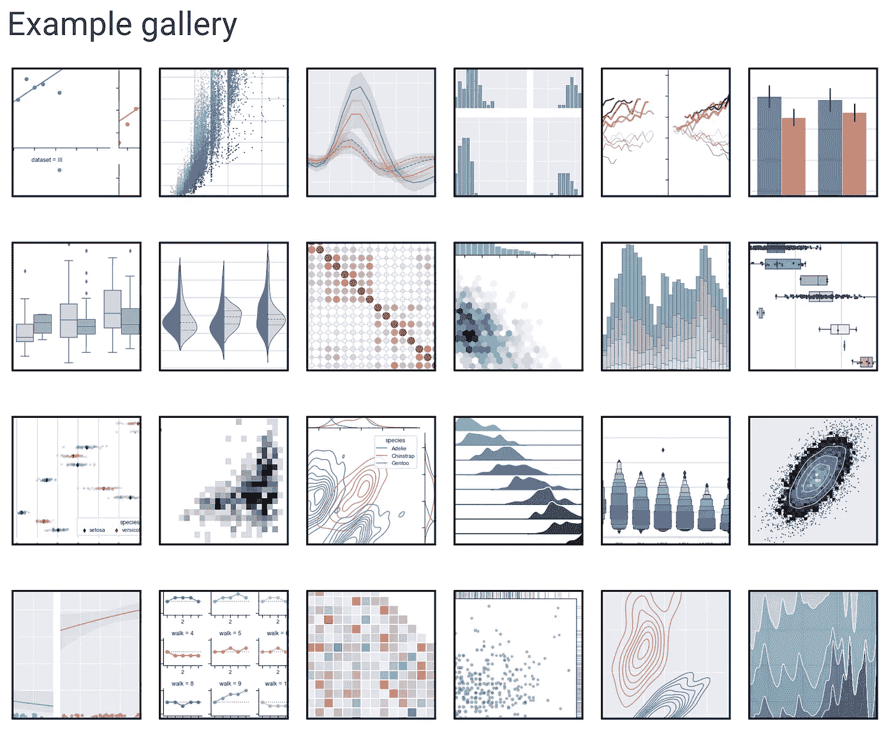
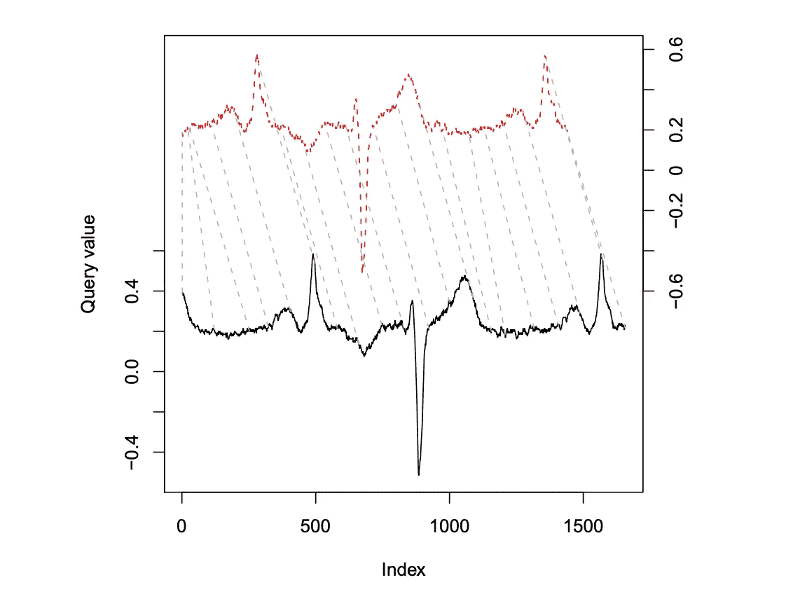

# 10 项被低估的 Python 技能

> 原文：<https://towardsdatascience.com/10-underrated-python-skills-dfdff5741fdf?source=collection_archive---------5----------------------->

## 特征分析、超参数调整、数据可视化等技巧。


来自 [Pexels](https://www.pexels.com/photo/photo-of-woman-leaning-on-wooden-fence-3321584/?utm_content=attributionCopyText&utm_medium=referral&utm_source=pexels) 的[杰梅因·乌林瓦](https://www.pexels.com/@roseleon?utm_content=attributionCopyText&utm_medium=referral&utm_source=pexels)的照片

在 2012 年的一篇文章中，"[21 世纪最性感的工作](https://hbr.org/2012/10/data-scientist-the-sexiest-job-of-the-21st-century)，"*哈佛商业评论*描绘了[数据科学团队](https://medium.com/atlas-research/data-science-team-eae84b1af65d)毫不费力地从数据中创造可操作信息的愿景。

虽然它不完全是 *Baywatch* ，但数据科学是一个充满活力的领域，具有巨大的潜力，可以从组织的顶级战略资产(由强大的数据基础架构提供的竞争优势)中产生有价值的见解。

为了帮助你的数据科学工作，这里有**十个被低估的 Python 技能**。我敢说，掌握这些能力会让你成为更性感的数据科学家。我们的团队平衡了美貌和智慧，同时挑战极限，救人于危难之中，并做出英雄行为。所以让我们开始吧。

## #10 —设置虚拟环境

虚拟环境为您的 Python 项目设置了一个独立的工作空间。无论您是独自工作还是与合作者一起工作，拥有一个虚拟环境都是有帮助的，原因如下:

1.  避免包冲突
2.  为软件包的安装位置提供清晰的视线
3.  确保项目使用的包版本的一致性

虚拟环境的使用允许你(和你的队友)对不同的项目有不同的依赖。在虚拟环境中，您可以在不影响系统安装的情况下测试安装包。


“我有点喜欢这里。这是隐私。”—*流言终结者*的杰米·韩门。美国宇航局在 [Unsplash](https://unsplash.com?utm_source=medium&utm_medium=referral) 拍摄的照片。

部署 [venv 模块](https://docs.python.org/3/library/venv.html)对避免后续问题非常有帮助，所以在开始你的项目时不要跳过这一步。

[*阅读更多*](https://avilpage.com/2020/02/reduce-python-package-footprint.html) *:通过建立一个包含科学计算最常用软件包的虚拟环境，节省空间——并避免在不同的地方安装多个软件包的相同版本。然后在特定于项目的环境中以. pth 文件的形式共享该公共环境。*

## #9 —根据 PEP8 标准进行评论

写一些好的评论来增强自信和协作能力。在 Python 中，这意味着遵循 [PEP8](https://www.python.org/dev/peps/pep-0008/#comments) 风格指南。

注释应该是声明性的，比如:

```
# Fix issue with utf-8 parsing
```

**不是** `# fixes issue`

这里有一个关于 [docstring](https://www.python.org/dev/peps/pep-0257/) 的例子，这是一种特殊类型的注释，用于解释函数的用途:

```
def persuasion():
   """Attempt to get point across."""
   print('Following this advice about writing proper Python comments will make you popular at parties')
```

文档字符串特别有用，因为您的 IDE 会将该字符串文字识别为与类相关联的定义。在 Jupyter Notebook 中，您可以通过将光标放在函数的末尾并同时按 Shift 和 Tab 来查看函数的文档字符串。

## #8 —寻找好的公用事业代码

你听说过“站在巨人的肩膀上”这句话 Python 是一种资源极其丰富的语言。你可以通过认识到你不必单干来加速你的数据科学发现——你可以而且应该重用在你之前的程序员的实用程序代码。

实用程序代码的一个很好的来源是 [Chris Albon](https://chrisalbon.com/) 的博客，他是装饰我家庭办公室/卧室墙壁的[机器学习抽认卡](https://machinelearningflashcards.com/)的创造者。他的网站的登录页面提供了数百个代码片段的导航，以加速您在 Python 中的工作流程。

例如，克里斯向我们展示了如何[应用一个函数](https://chrisalbon.com/python/data_wrangling/pandas_apply_function_by_group/)(这样一个熊猫的滚动平均值——)。rolling())到数据帧，按组:

```
df.groupby('lifeguard_team')['lives_saved'].apply(**lambda** x:x.rolling(center=False,window=**2**).mean())
```

这段代码输出一个数据帧，其中包含每两行的滚动平均值，在。groupby()语句。

## #7 —使用 pandas-profiling 实现自动化 EDA

使用 [pandas-profiling toolkit](https://pandas-profiling.github.io/pandas-profiling/docs/master/rtd/) 来自动化您的大部分探索性数据分析。EDA 是任何数据科学项目的关键阶段零。它通常涉及基本的统计分析，并查看特征如何相互关联。


[熊猫——剖图](https://pandas-profiling.github.io/pandas-profiling/docs/master/rtd/)前来救援。照片由 [NeONBRAND](https://unsplash.com/@neonbrand?utm_source=medium&utm_medium=referral) 在 [Unsplash](https://unsplash.com?utm_source=medium&utm_medium=referral) 上拍摄

本文将带您了解一种标准的“手动”数据探索方法，并将其与 pandas-profiling 库创建的自动报告进行比较:

[](/a-better-eda-with-pandas-profiling-e842a00e1136) [## 一个更好的带有熊猫轮廓的 EDA

### 探索性数据分析已死，熊猫万岁——剖析！事半功倍，完美概述您的数据。

towardsdatascience.com](/a-better-eda-with-pandas-profiling-e842a00e1136) 

## #6 —利用 qcut 改进目标分析

在这个关于改善机器学习工作流程的优秀视频中， [Rebecca Bilbro](https://rebeccabilbro.github.io/) 提供了明智的建议，在进行特征分析之前检查一下你的目标列。

[从心中的目标开始](https://amzn.to/3jVSt31)——这样你就能在投入预测或分类之前对目标变量有一个坚实的理解。采取这种方法有助于你提前发现潜在的棘手问题(例如[阶级不平衡](/how-to-handle-smote-data-in-imbalanced-classification-problems-cf4b86e8c6a1))。

如果你正在处理一个连续的变量，绑定你的值可能是有用的。使用 5 个箱子提供了利用帕累托原则的机会。要创建五分位数，只需使用 panda 的 q-cut 功能:

```
amount_quintiles = pd.qcut(df.amount, q**=**5)
```

每个容器将包含 20%的数据集。将目标变量的前五分之一与后五分之一进行比较，通常会产生有趣的结果。这种方法是一个很好的起点，可以用来确定在你的目标变量中，哪些表现最好(或最差)的人是异常的。

为了进一步了解，还可以看看丽贝卡在《DC 职业系列》中的表现，由你的真实采访:

## # 5-向要素分析添加可视化

可视化不仅仅用于商业智能仪表板。当你研究一个新的数据集时，加入一些有用的图表和图形会降低洞察的速度。



[Seaborn 示例图库](https://seaborn.pydata.org/examples/index.html)

使用数据来提高你的分析能力有许多可能的方法。一些可供探索的资源:

*   [Seaborn 样板间](https://seaborn.pydata.org/examples/index.html)
*   [散景笔记本示例](https://docs.bokeh.org/en/latest/docs/gallery.html#notebook-examples)
*   [Plotly Python 开源图形库](https://plotly.com/python/)
*   [黄砖画廊](https://www.scikit-yb.org/en/latest/gallery.html)
*   [Streamlit for data exploration](/the-most-useful-ml-tools-2020-e41b54061c58#a989)(*感谢*[*Ian Xiao*](https://medium.com/u/a0eb4622a0ca?source=post_page-----dfdff5741fdf--------------------------------)*的这个提示！*)
*   [Tableau 入门指南](/new-data-science-f4eeee38d8f6#04d5)

## #4 —测量和优化运行时间

数据科学家有点像修补匠的名声。但是随着这个领域越来越接近软件工程，对简洁、高性能代码的需求也增加了。应该根据时间、空间和磁盘使用来评估程序的性能，这是可伸缩性能的关键。

Python 提供了一些[分析工具](https://docs.python.org/3/library/profile.html)来展示你的代码在哪里花费时间。为了支持函数运行时的监控，Python 提供了 [timeit](https://docs.python.org/3/library/timeit.html) 函数。

```
**%%**timeitfor i in range(100000):
    i **=** i******3
```

在和熊猫一起工作的时候，提高你的代码的一些快速胜利:

1.  按照预期的方式使用 pandas:不要遍历数据帧行，而是使用 [apply](https://pandas.pydata.org/pandas-docs/stable/reference/api/pandas.DataFrame.apply.html) 方法
2.  利用 [NumPy](https://numpy.org/) 数组实现更高效的编码

## #3—简化时间序列分析

处理时间序列可能令人望而生畏。我的训练营教练在准备讲授这个话题的那天，带着一副闹鬼的表情出现在课堂上。

幸运的是， [dtw-python 包](https://pypi.org/project/dtw-python/)提供了一种比较时间序列的直观方式。简而言之，动态时间弯曲计算不同长度的两个数组或时间序列之间的距离。



通过[DTW 包](https://www.jstatsoft.org/article/view/v031i07)对齐两个时间序列

首先，DTW 拉伸和/或压缩一系列潜在的不同长度，使它们尽可能彼此相似。借用语音识别的一个例子，采用这种技术将有助于算法识别“now”和“nowwwwwwww”是同一个词，无论是由一个急躁的成年人还是一个暴躁的蹒跚学步的孩子说出。变换后，包计算单个对齐元素之间的距离。

了解更多信息:

*   [在这里下载论文](https://www.jstatsoft.org/article/view/v031i07)(最初在 R 中实现，但仍然与 Python 相关)
*   [在此阅读用例](https://scholar.google.it/scholar?oi=bibs&hl=it&cites=5151555337428350289)
*   使用 Google Colab [此处](https://colab.research.google.com/drive/1-fbhBlKRrEG8jkqoBAWOAzWaOarDQcDp?usp=sharing) &此处[玩玩 DTW Python 吧。](https://colab.research.google.com/github/nipunbatra/blog/blob/master/_notebooks/2014-05-01-dtw.ipynb)

## #2 —为实验跟踪设置 ML 流量

[ML 流](https://mlflow.org/docs/latest/index.html)支持跟踪参数、代码版本、指标和输出文件。MlflowClient 函数创建和管理实验、管道运行和模型版本。使用`mlflow.log_artifact`、`.log_metric()`和`.log_param()`记录工件(例如数据集)、指标和超参数。

您可以使用`mlflow ui`命令在本地主机浏览器中轻松查看所有实验的元数据和结果。

此外，请查看这份完整的数据科学工作流程指南:

[](https://medium.com/atlas-research/model-selection-d190fb8bbdda) [## 型号选择综合指南

### 选择正确算法的系统方法。

medium.com](https://medium.com/atlas-research/model-selection-d190fb8bbdda) 

## #1 —理解 __main__ 函数

使用`if __name__ == '__main__'`提供了编写代码的灵活性，这些代码可以从命令行执行或者作为一个包导入到交互式环境中。这个条件语句控制程序在给定的上下文中如何执行。

您应该预料到，将您的代码作为可执行文件运行的用户与将您的代码作为包导入的用户有着不同的目标。`if __name__ == ‘__main__'`语句提供了基于代码执行环境的控制流。

*   `__name__`是模块全局命名空间中的一个特殊变量
*   它有一个由 Python 设置的`repr()`方法
*   `repr(__name__)`的值取决于执行上下文
*   在命令行中，`repr(__name__)`的计算结果为“_ _ main _ _”——因此 if 块中的任何代码都将运行
*   作为包导入，`repr(__name__)`评估为导入的名称——因此 if 块中的代码将*而不是*运行

为什么这很有帮助？好吧，从命令行运行你的代码的人会有立即执行函数的意图。有人将您的软件包作为实用程序代码导入到 Jupyter 笔记本中，这可能不是真的。

在`if __name__ == ‘__main__'`中，您应该创建一个名为`main()`的函数，其中包含您想要运行的代码。在各种编程语言中，main 函数提供了执行的入口点。在 Python 中，我们只是按照惯例命名这个函数`main()`——与低级语言不同，Python 并没有赋予 main 函数任何特殊的意义。然而，通过使用标准术语，我们让其他程序员知道这个函数代表了完成脚本主要任务的代码的起点。

主函数应该调用模块中存储的其他函数，而不是在`main()`中包含完成任务的代码块。有效的模块化允许用户按照自己的意愿重用代码的某些方面。

模块化的程度取决于您——更多的功能意味着更大的灵活性和更容易的重用，但是可能会使您的包更难被人阅读和解释，因为他们要遍历功能之间的逻辑中断。

## 额外收获:知道何时不使用 Python

作为一名全职 Python 程序员，有时我怀疑自己是否过度依赖这个工具进行科学计算。Python 是一种令人愉快的语言。它简单明了，维护成本低，而且它的动态结构非常适合数据科学研究的探索性质。

尽管如此，Python 肯定不是处理广义的机器学习工作流程的每个方面的最佳工具。例如:

*   SQL 对于将数据移入数据仓库的 ETL 过程是必不可少的，数据仓库中的数据可以被[数据分析师和数据科学家](/data-analyst-vs-data-scientist-2534fc1057c3)查询
*   [Java](/java-for-data-science-f64631fdda12) 可能有助于构建管道组件，如数据摄取和清理工具(例如，使用 [Apache PDFBox](https://pdfbox.apache.org/) 解析 PDF 文档中的文本)
*   在数据科学领域，Julia 正以极快的速度取代 Python
*   Scala 通常用于大数据和模型服务

在这个由 TWIML AI 播客主持的小组讨论中，专家们探索了他们选择的编程语言的数据科学应用。

听到一个 JavaScript 开发人员谈论使用这种典型的以 web 开发为中心的语言进行机器学习的潜力有点奇怪。但是，嘿，它是勇敢的和有创造性的——它有潜力通过打破机器学习和传统软件开发之间的障碍来使数据科学民主化。

目前，JavaScript 拥有数量优势:根据 2020 年栈溢出开发者调查，68%的开发者使用 JavaScript，相比之下，44%的开发者使用 Python。只有 1%的人使用朱莉娅，但预计这种情况会迅速改变。更多的 ML 开发者是否意味着更多的竞争，更多的见解，甚至更多的 arXiv 论文？更有理由提高您的 Python 技能。

## 摘要

在本文中，我们介绍了数据科学家可能忽略的 10 项 Python 技能。这些提示包括:

*   [为您的项目创建虚拟环境(#10)](#eeab)
*   [根据 Python 风格指南进行评论(#9)](#bd0a)
*   [寻找公用事业代码而不是重新发明轮子(#8)](#aa14)
*   [提升你的 EDA](#1f2a) 、[目标分析](#fb33)、[特征分析](#c257) (#7、6、5)
*   [基于运行时优化编写更高性能的代码(#4)](#0e56)
*   [使用动态时间弯曲进行时间序列分析(#3)](#2f9e)
*   [ML 流(#2)的跟踪实验](#8022)
*   [结合主功能，增加软件包的灵活性(#1)](#73b1)

我希望这篇文章能够让您在推进数据科学实践的同时学到一些新东西。

**如果你喜欢这篇文章**，请在 [Medium](https://medium.com/@nicolejaneway) 、 [LinkedIn](http://www.linkedin.com/in/nicole-janeway-bills) 、 [YouTube](https://www.youtube.com/channel/UCO6JE24WY82TKabcGI8mA0Q?view_as=subscriber) 和 [Twitter](https://twitter.com/Nicole_Janeway) 上关注我，了解更多提高你数据科学技能的想法。当“ [**资源在 2020 年**](https://page.co/ahje9p) 最后几个月为您的数据科学增压”发布时，注册即可获得通知。

**免责声明**:本文中任何指向书籍的超链接都是附属链接。提前感谢你对我写作的支持。

**你认为哪些蟒蛇技能被低估了？请在评论中告诉我。**

## 提升 Python 技能的项目

[](https://medium.com/atlas-research/ner-for-clinical-text-7c73caddd180) [## 面向临床文本的命名实体识别

### 使用 pandas 将 2011 i2b2 数据集重新格式化为用于自然语言处理(NLP)的 CoNLL 格式。

medium.com](https://medium.com/atlas-research/ner-for-clinical-text-7c73caddd180) [](/build-full-stack-ml-12-hours-50c310fedd51) [## 12 小时 ML 挑战

### 如何使用 Streamlit 和 DevOps 工具构建和部署 ML 应用程序

towardsdatascience.com](/build-full-stack-ml-12-hours-50c310fedd51) [](/walkthrough-mapping-gis-data-in-python-92c77cd2b87a) [## 演练:在 Python 中映射 GIS 数据

### 通过 GeoPandas DataFrames 和 Google Colab 提高您对地理空间信息的理解

towardsdatascience.com](/walkthrough-mapping-gis-data-in-python-92c77cd2b87a) [](https://medium.com/@maxtingle/getting-started-with-spotifys-api-spotipy-197c3dc6353b) [## 开始使用 Spotify 的 API & Spotipy

### 《数据科学家快速入门指南》,指导如何浏览 Spotify 的 Web API 并使用 Spotipy Python 访问数据…

medium.com](https://medium.com/@maxtingle/getting-started-with-spotifys-api-spotipy-197c3dc6353b)