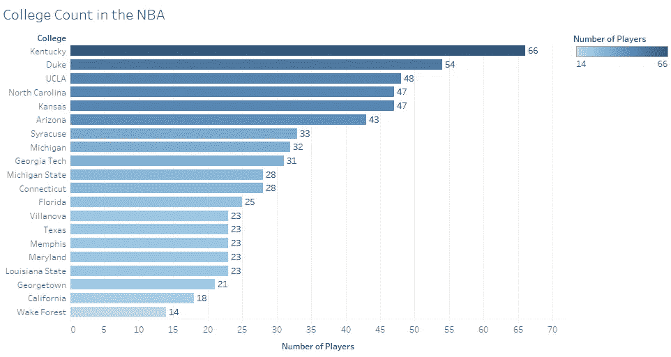
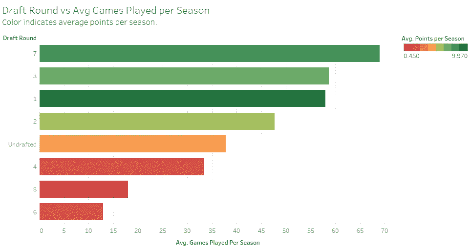
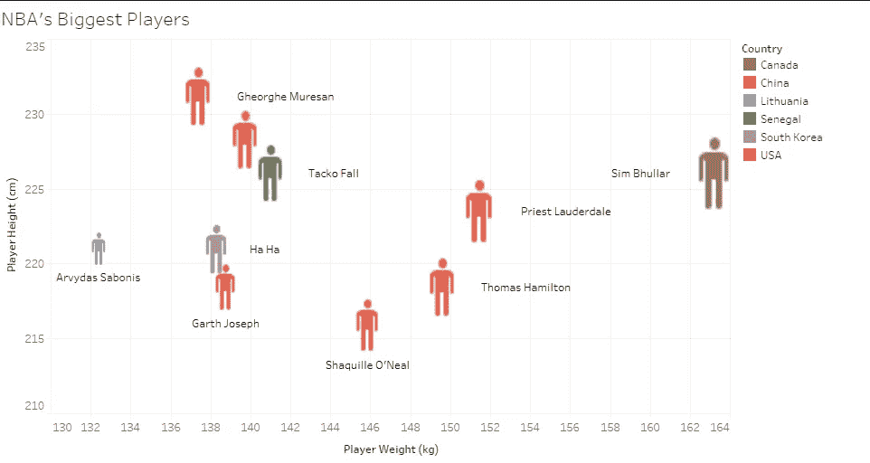
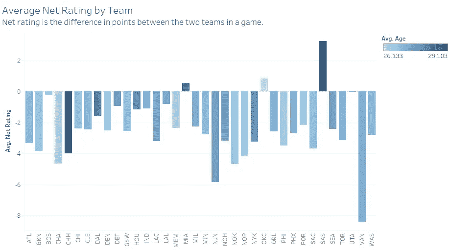
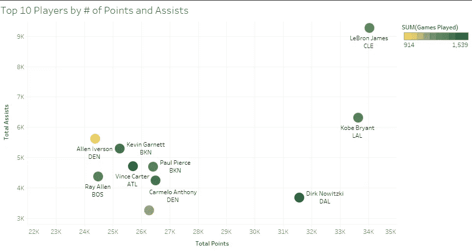
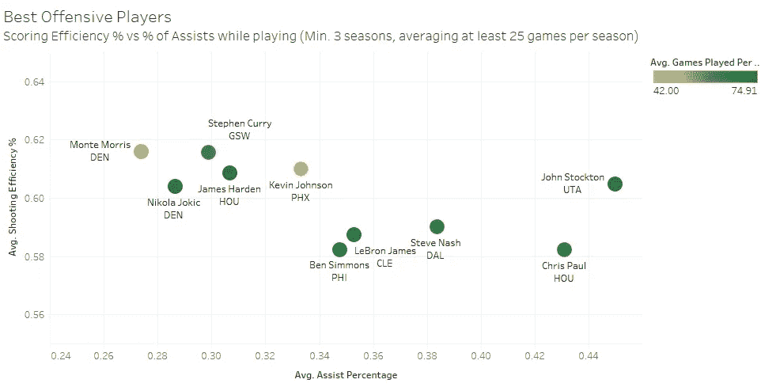
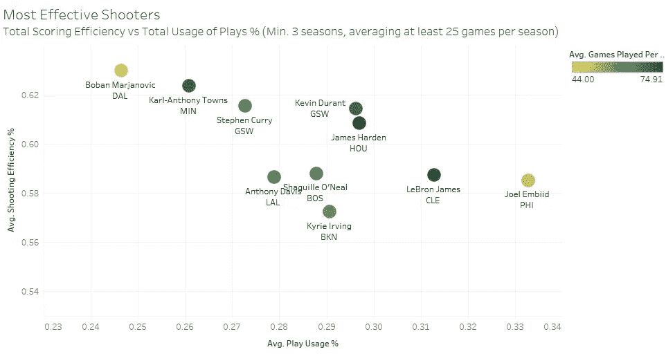
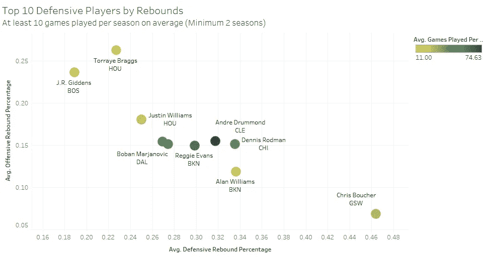
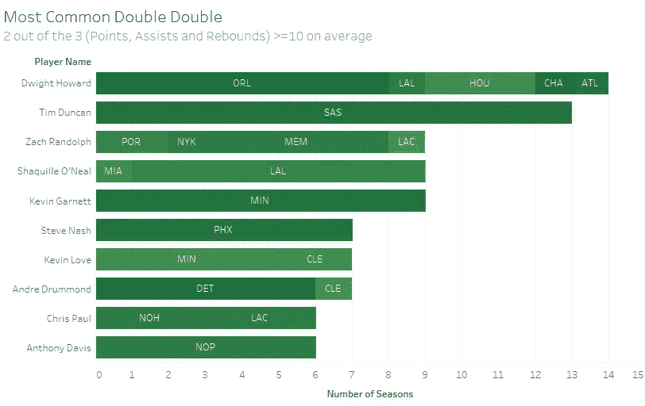
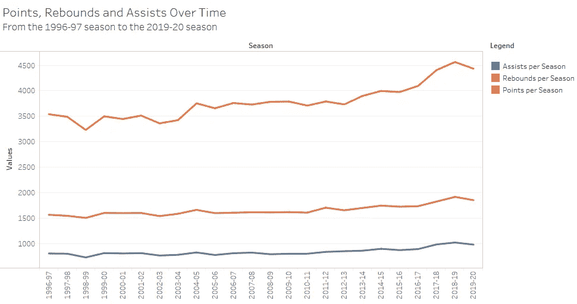

# NBA 的 10 个独特形象

> 原文：<https://towardsdatascience.com/10-unique-visualizations-of-the-nba-b981cfdb78bf?source=collection_archive---------20----------------------->

## 体育分析

## 一种数据科学的方法来处理丢失篮球

篮球，快回来。(照片由 [TJ 德拉戈塔](https://unsplash.com/@tjdragotta?utm_source=medium&utm_medium=referral)在 [Unsplash](https://unsplash.com?utm_source=medium&utm_medium=referral) 上拍摄)

## 我想念 NBA。

由于新冠肺炎疫情事件，NBA 暂停比赛，这只是当今世界的一个小插曲。但和很多其他体育爱好者一样，我怀念观看体育直播的那种刺激感。

所以我处理了它，就像任何热爱数据的篮球爱好者会做的一样:**我进入了统计数据，并建立了一些图表。**

我使用 **Tableau** (我最近才学会如何使用，但已经绝对喜欢上了)来构建这些情节，以及我在 Kaggle 上找到的一个[数据集](https://www.kaggle.com/justinas/nba-players-data)，其中包含了从 1996-97 赛季到 2019-20 赛季在 NBA 打球的所有球员的信息。

在我开始之前，没有创建一个单独的图表，我立即发现了我的第一个有趣的见解:

> 自 1996 年以来，NBA 只有 2235 名独特的球员。

对于 24 年的篮球生涯来说，这是一个非常低的数字。而这也是为什么我们不断听到专家说进入 NBA 就像“中彩票”一样。

# 在 NBA 之前

大学篮球是 NBA 典型的招募点，大多数球员在成功的大学篮球生涯后都会转为职业球员。像 NCAA 疯狂三月这样的比赛非常受欢迎，在这些比赛中表现出色的球员吸引了 NBA 招聘人员的目光。

## 1.就让球员进入 NBA 而言，最成功的大学是哪几所？

**每所大学参加过 NBA 的球员人数**

这些是美国前 20 名进入 NBA 打球的大学。

> 排名前三的大学是肯塔基大学、杜克大学和加州大学洛杉矶分校，它们是最成功的大学，有 168 名球员继续在 NBA 打球。

球员通常是在不同的选秀轮中从大学中挑选出来的。成为首轮选秀权，意味着你是精英中的精英。

## **2。但是选秀会影响球员每个赛季参加多少场比赛吗？**

**选秀轮 vs 每个赛季的平均比赛场次**(颜色表示每个赛季的平均分数)

**未必。**

第一轮选秀权只打第三多的比赛，而第七轮和第三轮选秀权平均每个赛季打更多的比赛。

但就每个赛季的平均分数(图中的颜色)而言，第一轮选秀权贡献的分数最高。这可能是因为第一轮选秀权得到了更多的休息，以便在对球队至关重要的比赛中更有效地得分吗？

另一个有趣的见解，**未被选秀帮助你**比被第四、第六或第八轮选上打更多的比赛。令人惊讶。

# 最大的最大的

所以球员被选中了。他很有可能又高又壮。NBA 以拥有最高最强壮的球员而闻名，他们是真正的运动员。

事实上，自 1996 年以来，球员的平均身高和体重分别为 200.8 厘米(6 英尺 5 英寸)和 100.6 公斤(221.7 磅)。

## 3.他们中最大的玩家是谁？

**NBA 最大的球员，身高(厘米)和体重(公斤)**(颜色代表国家)

由于 NBA 的大多数球员都来自美国，所以一些大牌球员也来自美国也就不足为奇了。

但看起来有史以来最大的球员之一是来自加拿大的西姆·布拉尔，他身高 2.26 米(7 英尺 5 英寸)，体重 163 公斤(359 磅)。

[**沙奎尔·奥尼尔**](https://en.wikipedia.org/wiki/Shaquille_O%27Neal) ，被誉为 NBA 最好的“大个子”之一，身高 2.15 米(7 英尺 1 英寸)，体重 145 公斤(319 磅)。姚明 (图中未标注的橙色图标)也是最好的“大个子”之一，身高 2.29 米(7 英尺 6 英寸)，体重 141 公斤(310 磅)

# 最重要的团队统计数据？

团队可以用许多不同的方式来衡量，每种方式都会带来不同的见解。但可以说，其中最重要的是“净评级”。净评分是指球队每 100 分的得分差异。

## 4.哪支球队的净评分最好和最差？

**自 1996 年以来所有团队的平均净评分**(颜色表示团队的平均年龄)

事实证明，圣安东尼奥马刺队自 1996 年以来平均净得分最高，为+3.24 ，这意味着平均每 100 分，他们领先 3 分。只有另外两个队有积极的净收视率，迈阿密热火队和俄克拉荷马雷霆队。最差的球队是现已解散的温哥华灰熊队，负 8.39 分。

另一个令人惊讶的发现是圣安东尼奥马刺队也是所有赛季中平均年龄最大的球队。经验，以拥有一个更老的团队的形式，真的有用吗？这可能是另一个分析的基础。

# 最佳进攻球员

*(免责声明:这些统计数据是从 1996 年开始的，所以这里只记录了迈克尔·乔丹职业生涯的一半，他不在这些***的名单上，但是有了一个更大的数据集，你可以肯定他会在那里。)**

*有太多的指标可以用来衡量单个球员。对于一个进攻球员，负责创造尽可能多的篮筐的球员，使用和分析最多的指标是得分和助攻。*

## *5.哪些球员得分和助攻最多？*

**

***总积分 vs 总助攻**(颜色表示比赛总次数)*

***勒布朗·詹姆斯**，在一个完全属于他自己的联盟中，一个完全的异类，以惊人的 34，027 分和 9，280 次助攻远远超过其他人。**科比·布莱恩特**(瑞普·曼巴)是唯一一个能以 33633 分和 6319 次助攻接近 LBJ 的人。(我用谷歌搜索了迈克尔·乔丹的完整数据，他以 32292 分和 5633 次助攻排在第三位左右)*

*名单上其他值得注意的球员有**德克·诺维茨基**，他得到 31，561 分和 3，667 次助攻；以及**阿伦·艾弗森**，他在这张图表上出场次数最少，在 914 场比赛中得到 24，380 分和 5，622 次助攻。(相比之下，勒布朗打了 1256 场，科比打了 1346 场，德克打了 1522 场)。*

*— — — — — — — — — — — — — — — — — — — — — — — — — — — — — —*

*用不同的方式使用得分和助攻可以带来更多的见解。使用球员的总投篮效率和球员在场上的助攻百分比，一组完全不同的球员出现了。*

## *6.哪些球员的投篮效率和助攻率最高？*

**

***得分效率% vs 助攻贡献百分比**(颜色表示每个赛季的平均比赛场次)*

*约翰·斯托克顿看起来几乎像一个异类，有着很高的投篮效率和很高的平均助攻率。但是图中某些球员的重复出现，比如斯蒂芬·库里、詹姆斯·哈登、勒布朗·詹姆斯和克里斯·保罗，展示了他们出众的投篮能力。同样更年轻的是，像本·西蒙斯和尼古拉·约基奇这样的现役球员无疑正在上升，并且很快会以稳定的表现主导这些统计数据。*

*— — — — — — — — — — — — — — — — — — — — — — — — — — — — — —*

*游戏使用百分比是一个球员在场上使用团队游戏的百分比估计值。通常，当游戏使用百分比增加时，玩家的得分效率降低。真正的超级明星球员是那些能够保持这两个数字的人，他们变成了非常高效的射手。*

## *7。谁是最有效的射手？*

**

***得分效率%与游戏使用率%** (颜色表示每个赛季的平均游戏次数)*

***乔尔·恩比德**的平均播放使用率最高，而**博班·马扬诺维奇**的平均命中率最高。*

*但是最有效的超级射手似乎是**凯文·杜兰特、詹姆斯·哈登和勒布朗,**詹姆斯，因为他们运用战术的能力全面，投篮效率高。*

*紧随其后的是安东尼·戴维斯、沙奎尔·奥尼尔和斯蒂芬·库里。*

# *最佳防守队员*

*尽管通常被忽视，防守球员是那些做大部分繁重工作并积极为团队的成功做出贡献的人。如果没有一个伟大的防守球员，不管你有多少伟大的进攻球员，你最终都会陷入更糟糕的境地。*

*篮板是另一个衡量防守球员效率的重要指标。抢篮板球指的是球员在错过投篮或罚球后把球捡回来。*

*篮板有两种类型，进攻型和防守型。一个超级防守球员在理想状态下会有很多这两种类型的篮板。*

## *8.就篮板而言，谁是防守最好的球员？*

**

***平均进攻篮板% vs 平均防守篮板%** (颜色表示每个赛季的平均出场次数)*

*平均每个赛季至少打 10 场比赛，至少 2 个赛季，他们是篮板最多的 10 名防守球员。*

*最佳防守篮板手是克里斯·鲍彻，最佳进攻篮板手是吉登斯和特雷耶·布拉格斯。*

*但是一个后卫最重要的是他们的全面能力，在进攻和防守篮板方面最好的球员是**丹尼斯·罗德曼**和**安德烈·德拉蒙德**。*

# *双重麻烦*

*另一个经常使用的指标是“双双”，当一个球员在以下指标中的两个指标上超过 10 分:得分、助攻、篮板、抢断和盖帽。*

*大多数双打双打通常由得分、助攻和篮板组成，我在这里称之为“最常见的双打”。*

## *9.哪些球员有最多的赛季场均“最普通”的两双？*

**

***平均“最常见”双双的赛季数***

*德怀特·霍华德(14 个双双赛季)以微弱优势超过蒂姆·邓肯(13 个双双赛季)，成为“最常见”双双的最高赛季数。*

*安东尼·戴维斯，一个更年轻的现役球员，也在这个名单上，这表明经过几个伟大的赛季，他有很好的机会在这个名单上上升。*

*令人惊讶的是，克里斯·保罗也出现在这张图中，展示了他出色的投篮能力和全面的能力。*

# *进化中的游戏？*

*有很多关于这项运动如何随着时间的推移而改变的讨论。许多人认为攻击性和强度已经随着时间的推移而下降，而另一些人认为游戏已经演变成一种更优雅和更具观赏性的形式。*

*可以说，到目前为止，一些最重要的指标是得分、助攻和篮板。*

## *10.随着时间的推移，这些重要的指标(得分、助攻、篮板)实际上改变了多少？*

**

***1996-97 年至 2019-20 年的得分、篮板和助攻***

***赛季总助攻**和**赛季总篮板**在很大程度上看起来**不变**，有略微增加的趋势。*

***每赛季总积分**，另一方面**大幅增加**。1996-97 赛季的总积分为 3540 分，而 2018-19 赛季的总积分为 4565 分。即使是不完整的 2019-20 赛季也已经有 4434 分，有望超过 2018-19 赛季，成为有史以来得分最高的赛季(无论赛季何时恢复)。得分的增加可以归功于三分球革命的兴起，现在的三分球得分比以往任何时候都多。这也可能是因为现在比以前有更多的高得分比赛。*

# *结论*

*我希望你能从这些图表中得到一些启示，因为我确实做到了。这只是表明最好的学习方法是实践的另一种方式。*

*我欢迎对这些可视化的任何类型的建议或修改，或新的想法。如果你认为合适的话，一定要在篮球对话和争论中使用它们。*

*我希望这有助于填补目前缺乏运动留下的空白。(早点回来，正常生活)*

**随时联系我*[*LinkedIn*](https://www.linkedin.com/in/vishnu-bharadwaj-796877175/)*，或者查看我的*[*GitHub*](https://github.com/vishnubharadwaj00)*我做过的其他项目。**