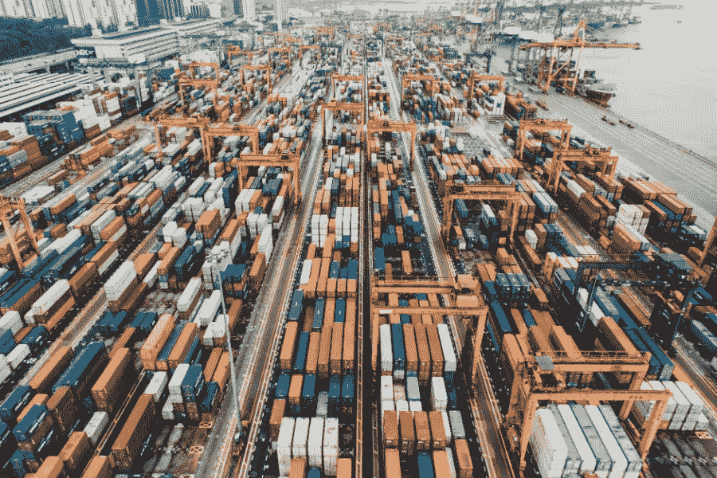

# 人工智能改善分销和供应链的 10 种方式

> 原文：<https://towardsdatascience.com/10-ways-ai-improves-distribution-and-the-supply-chain-bbd2dc600965?source=collection_archive---------44----------------------->

## 在世界各地，人工智能正在让供应链变得更快、更可靠、更有利可图。

图片来源: [Unsplash](https://unsplash.com/photos/fN603qcEA7g)

## 在世界各地，人工智能正在让供应链变得更快、更可靠、更有利可图。

人工智能是当今企业最有前途的技术之一。麦肯锡对 2000 多名参与者的研究发现， [58%的受访者至少在一个流程中使用 AI](https://www.mckinsey.com/featured-insights/artificial-intelligence/global-ai-survey-ai-proves-its-worth-but-few-scale-impact) 。这一令人印象深刻的采用率也不是毫无根据的，因为人工智能可以在几个方面改善供应链管理等领域。

物流是一个快速发展的重要行业，也是许多其他行业赖以运转的行业。因此，它将受益于全面而及时的数据分析。AI 让这一切成为可能。

一些人工智能技术已经在物流领域得到广泛应用，而一些则刚刚出现。以下是人工智能改善供应链的 10 种方式。

# 1.更快的数据分析

数据分析对现代供应链至关重要。物流公司需要分析大量信息，找出效率低下的地方和潜在的改进方法。这个过程不需要人工智能，但速度要快得多。

手动梳理信息以建立有见地的联系会花费很多时间。在像物流这样对时间敏感的行业，这可能是个问题。由于人工智能系统可以一次分析多个数据集，它们可以在很短的时间内给出供应链结果。

# 2.预估需水量

管理库存通常不像你想象的那么简单。如果一个仓库错误地估计了未来的需求，它可能会以产品过少或过多而告终。这两种情况都可能造成巨大的金钱损失，但 AI 提供了一个解决方案。

通过预测分析，人工智能系统可以利用过去的趋势和市场信号来预测需求。仓库经理可以使用它们来查看他们需要储存或多或少的物品。然后，他们可以避免盈余和赤字，保持一贯的准备行动。

亚马逊[在其供应链的几乎每个层面](https://medium.com/@RemiStudios/artificial-intelligence-for-inventory-management-c8a9c0c2a694)都使用人工智能，尤其是在仓库。它对客户需求的人工智能预测是它如何在电子商务行业保持领先地位的一部分。这有助于它比大多数竞争对手(如果不是全部的话)更快地完成订单。

# 3.工序自动化

亚马逊几乎在供应链的每个层面都使用人工智能，尤其是在仓库。它对客户需求的人工智能预测是它如何在电子商务行业保持领先地位的一部分。这有助于它比大多数竞争对手(如果不是全部的话)更快地完成订单。

一般来说，人工智能系统往往比人类更擅长数据繁重、单调的工作。将这样的任务分配给 AI 不仅节省了时间，还节省了资金。当人工智能处理这些行政工作时，它将人类员工解放出来，同时从事其他项目。

像手动归档文件这样的任务[会让企业每年花费 6500 个小时](https://www.tungsten-network.com/press-release/supply-chain-friction-costs-businesses-6500-hours-a-year/)，这是一个巨大的时间损失。想象一下，一家公司如果增加 6000 多个小时的工作时间，可以完成多少事情。这种生产率优势对物流企业来说太有利了，不容忽视。

# 4.更可靠的发货更新

许多公司使用 RFID 标签等技术来跟踪供应链中的产品。然而，有时，物品运输时没有这些标签或事件会导致它们不可读。通过使用人工智能，企业仍然可以向客户提供货运更新。

当跟踪技术失败时，人工智能可以计算交付量，因此公司仍然可以提供估计。这些程序可以分析像平均运输时间和天气模式这样的事情，以提供准确的结果。然后，供应链可以了解他们的进展，并保持客户满意度。

# 5.自动化仓库管理

无数其他因素影响着供应链运行的效率，但管理不善的仓库从一开始就阻碍了成功。尽管情况紧急，[只有 20-30%的仓库在尽可能有效地运转。使用人工智能来管理运营可以有所帮助。](https://cherrysind.com/blogs/importance-warehouse-management-system/)

自动化仓库管理系统(WMS)可以通过数据分析发现低效之处。由于人工智能通常更擅长在数据点之间建立有见地的联系，这可以消除管理中的人为错误。全面的小改变可以导致效率的大幅度提高。

# 6.优化路线规划

供应链需要充分利用运输来按时交付产品。通常，这意味着规划从 A 点到 b 点的最快、最安全的方式。在预测分析的另一个应用中，人工智能也非常适合这项工作。

人工智能系统可以观察交通模式和天气，以确定最佳行动方案。由于诸如此类的因素是动态的，最佳路线可能每天都在变化。因此，供应链需要像 AI 这样的工具，可以快速分析数据和规划路线。

自 2012 年以来，UPS 已经使用一个名为 ORION 的系统来优化其路线。从那以后，这个人工智能每年为该公司节省了 1 亿英里和 1000 万加仑的燃料。

# 7.监控产品质量

自 2012 年以来，UPS[已经使用一个名为 ORION](https://www.globenewswire.com/news-release/2020/01/29/1977072/0/en/UPS-To-Enhance-Orion-With-Continuous-Delivery-Route-Optimization.html) 的系统来优化其路线。从那以后，这个人工智能每年为该公司节省了 1 亿英里和 1000 万加仑的燃料。

供应链管理不仅仅是确保产品准时到达。物流公司还需要确保货物完好无损地到达，这对于一些物品来说是一个挑战。人工智能可以确定敏感产品的寿命和风险因素，帮助企业确保产品质量。

如果有任何不可预见的延误，人工智能系统可以确定他们是否需要重新调整路线以保护一些产品。如果一批货物包含食物或植物，他们可能需要改变路线，先运送这些。没有人工智能，公司可能不知道如何即时做出这些改变。

# 8.明智的供应商选择

对于一些供应链经理来说，选择合适的产品供应商可能是一场赌博。如果他们不能提供一致的质量，或者容易出现丑闻和道德问题，这可能会损害物流公司的公众形象。然而，在人工智能的帮助下，他们可以更好地了解每个企业的历史和潜在风险。

人工智能系统可以确定与一家公司做生意是否会有财务或公共关系风险。然后，供应链可以就供应商选择做出明智的决策。

# 9.改进的客户支持

人工智能最常见的应用之一是聊天机器人，最常见的是客户支持角色。在过去的一年里，大约有 40%的美国消费者使用过聊天机器人。它们使供应链能够提供全天候的客户支持。

通过人工智能处理客户参与，物流公司将员工解放出来，专注于其他任务。不仅客户支持得到改善，整体效率也得到提高。这些人工智能也让顾客更容易获得信息。

DHL 允许客户[通过 Alexa](https://www.retaildive.com/news/dhl-taps-alexa-to-deliver-package-status-updates/442459/) 检查他们的订单状态，给他们快速、可靠的答复。除了作为一个快速、免提的信息网关，智能扬声器已经出现在许多家庭中。习惯使用这些技术的人将会很高兴能够通过它们了解他们的订单。

# 10.自主航运

这些人工智能也让顾客更容易获得信息。

DHL 允许客户[通过 Alexa](https://www.retaildive.com/news/dhl-taps-alexa-to-deliver-package-status-updates/442459/) 检查他们的订单状态，给他们快速、可靠的答复。除了作为一个快速、免提的信息网关，智能扬声器已经出现在许多家庭中。习惯使用这些技术的人将会很高兴能够通过它们了解他们的订单。

随着人工智能技术的进步，它最终将实现完全自主的航运。人工智能是自动驾驶汽车的关键，无人驾驶交付将缩短运输时间。自动驾驶卡车不需要停下来休息，所以他们可以在更短的时间内行驶更长的路程。

这项技术还不可用，但研究人员正在接近成功。它将随着人工智能的进一步采用而改进，从而导致更快的开发和实现。

完全自主的航运可能现在还不是现实，但几家公司正在努力。2017 年，[劳斯莱斯与谷歌](https://www.forbes.com/sites/bernardmarr/2017/10/23/rolls-royce-and-google-partner-to-create-smarter-autonomous-ships-based-on-ai-and-machine-learning/#42ec1bb26dfe)合作开发自动驾驶货船。虽然这项技术还不可用，但随着人工智能的进一步采用，它将得到改善，从而加快开发和实施。

# 数据驱动的物流链

以数据为中心的供应链管理对于改善物流行业至关重要。人工智能与此密切相关，因为它允许公司充分利用数据的潜力。随着 AI 在这一领域的广泛采用，该行业将继续改善。

供应链是许多行业的支柱。当物流公司采用人工智能时，它会产生效益的连锁反应，并改善该部门的功能。