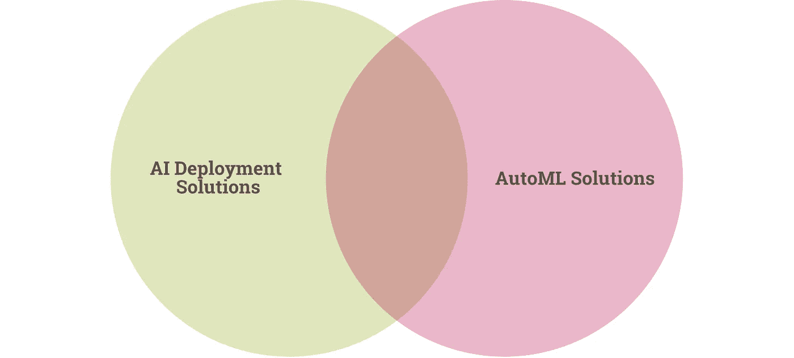

# 部署和服务人工智能模型进行预测的 10 种方法

> 原文：<https://towardsdatascience.com/10-ways-to-deploy-and-serve-ai-models-to-make-predictions-336527ef00b2?source=collection_archive---------32----------------------->

## 探索 Flask、云巨头、小众玩家、AutoML 和其他部署 AI 的方式。

克里斯汀·休姆在 [Unsplash](https://unsplash.com?utm_source=medium&utm_medium=referral) 上拍摄的照片

创建模型只是通往现实世界人工智能之旅的一步。部署意味着将您的模型——无论是 Jupyter 笔记本还是某处的. py 文件——转化为可用的服务。

简化的 AI 管道。由作者创建。

我不会深入讨论[容器](/using-docker-kubernetes-to-host-machine-learning-models-780a501fda49)，它们与部署和服务模型是分开的。像 Docker 和 Kubernetes(托管 Docker 容器)这样的容器系统就像是模型的盒子，可以创建可复制、可伸缩和隔离的环境，您可以在其中设置依赖关系，这样模型就可以在任何执行环境中工作。

以下是部署、托管和服务人工智能模型进行预测的 10 种方式。

# 1.Flask 的内置服务器

首先，Flask 的内置服务器不是生产级的，因为它不能扩展。尽管如此，由于它的易用性，它是一个方便的工具，用于快速实验和快速建立并运行您的模型。

要在 Flask 上部署，请遵循以下一般步骤:

*   [安装烧瓶](https://flask.palletsprojects.com/en/1.1.x/installation/)
*   序列化你的 AI 模型(例如用 [Pickle](https://docs.python.org/3.4/library/pickle.html) 或 [joblib](https://joblib.readthedocs.io/en/latest/auto_examples/serialization_and_wrappers.html)
*   创建另一个。py 文件与上面的序列化模型在同一个目录中，它将用于在 Flask 中创建 web 服务
*   运行。来自终端的 py 文件
*   检查您的本地主机地址，看看它是否工作
*   使用输入数据进行 http POST 调用以接收预测

这篇[关于数据科学的文章](/a-flask-api-for-serving-scikit-learn-models-c8bcdaa41daa)展示了一个使用 Flask API 部署 Sklearn 模型的示例。

# 2.云中的烧瓶

在云中运行 Flask 将让您获得更大的可伸缩性，尽管这比使用内置服务器更复杂。

这里有一些你可以使用的云服务器:

*   [在 Heroku 部署烧瓶](https://devcenter.heroku.com/articles/getting-started-with-python)
*   [在谷歌应用引擎上部署 Flask](https://cloud.google.com/appengine/docs/standard/python3/runtime)
*   [在 AWS 弹性豆茎上展开烧瓶](https://docs.aws.amazon.com/elasticbeanstalk/latest/dg/create-deploy-python-flask.html)
*   [在 Azure (IIS)上部署](https://docs.microsoft.com/en-us/azure/app-service/containers/how-to-configure-python)
*   [在 PythonAnywhere 上部署](https://help.pythonanywhere.com/pages/Flask/)

这篇 [FreeCodeCamp 文章](https://www.freecodecamp.org/news/how-to-build-a-web-application-using-flask-and-deploy-it-to-the-cloud-3551c985e492/)非常详细地介绍了如何在云中部署带有 Flask 的模型。

# 3.AutoML 解决方案

AutoML 越来越受欢迎。尽管与 AI 部署不是同一个概念，但是大多数 AutoML 解决方案都允许在其核心 AutoML 功能之上进行简单的模型部署。

AI 部署解决方案和 AutoML 解决方案的重叠。由作者创建。

以下是一些 AutoML 解决方案，可以实现简单(甚至是一次点击)的模型部署:

*   [Cloud AutoML](https://cloud.google.com/automl) (这允许您使用提供的 REST API 生成预测)
*   [Azure AutoML](https://docs.microsoft.com/en-us/azure/machine-learning/concept-automated-ml) (这将生成一个`.pkl`文件，其中包含您可以在 Azure 中部署的模型)
*   [Apteo](http://apteo.co) (这是一个无代码的解决方案，允许您在浏览器中或通过 API 生成预测)

这些解决方案提供的不仅仅是人工智能部署，还可以大幅提高数据科学团队的效率。

 [## AutoML 会是数据科学家的末日吗？

### AutoML 越来越受欢迎。这就是事情的变化。

towardsdatascience.com](/will-automl-be-the-end-of-data-scientists-9af3e63990e0) 

# 4.Azure 机器学习

Azure ML 专注于提供企业级云服务，尽管使用微软的服务器显然会让你付出代价。

通过 Azure ML 部署任何模型有 5 个主要步骤:

*   收集先决条件(Azure ML 工作区、Azure CLI、工作区中经过培训的 ML 模型)
*   通过创建推理配置来准备部署
*   使用 [Model.package](https://docs.microsoft.com/en-us/python/api/azureml-core/azureml.core.model.model?view=azure-ml-py#package-workspace--models--inference-config-none--generate-dockerfile-false-) 创建一个 Docker 映像
*   将图像部署为 web 应用程序
*   通过向 URL 提交数据并显示响应来使用 web 应用程序

# 5.GCP

[在 GCP](https://cloud.google.com/ai-platform/prediction/docs/deploying-models) 部署有三个主要步骤:

*   将您的模型上传到云存储桶。
*   创建一个 AI 平台预测[模型资源](https://cloud.google.com/ai-platform/prediction/docs/reference/rest/v1/projects.models#Model)。
*   创建一个 AI 平台预测[版本资源](https://cloud.google.com/ai-platform/prediction/docs/reference/rest/v1/projects.models.versions)，指定你保存模型的云存储路径。

像 Azure 一样，GCP 提供了企业级的可扩展性和安全性，尽管它需要广泛的技术专长才能运行。

# 6.AWS SageMaker

AWS SageMaker 为您的模型提供了一个 HTTPS 端点，利用它在三个步骤中提供推理:

*   在 SageMaker 中创建模型，包括相关的 S3 路径和 Docker 注册路径
*   为 HTTPS 端点创建端点配置
*   创建 HTTPS 端点

# 7.IBM Watson ML

虽然 AWS、GCP 和 Azure 是在云中部署人工智能的三大巨头，但 [IBM 的 Watson ML](https://www.ibm.com/cloud/machine-learning) 提供了一个更适合的解决方案，允许您动态地重新训练模型并自动生成 API。

IBM 为其服务提供了一份很好的白皮书，它更广泛地扩展到 ML 服务器和管道。

# 8.Oracle 数据科学平台

[Oracle 的数据科学平台](https://www.oracle.com/dk/data-science/cloud-infrastructure-data-science.html)允许团队构建、管理和部署具有可再现性、高安全性和全面的模型构建环境的模型。

 [## Oracle 云数据科学平台

### AgroScout 和 Oracle——利用新一代技术战胜饥饿“这一愿景的成功依赖于管理……

www.oracle.com](https://www.oracle.com/dk/data-science/cloud-infrastructure-data-science.html) 

# 9.阿里云

阿里云通过其弹性算法服务(EAS)提供了几种部署模型的方法，包括:

*   将模型上传到控制台
*   使用 PAI Studio 部署模型
*   使用 DSW 部署模型
*   使用 EASCMD 客户端部署模型

 [## 如何在 EAS 中部署模型

### 人工智能机器学习平台(PAI)的弹性算法服务(EAS)与 PAI Studio 和

www.alibabacloud.com](https://www.alibabacloud.com/help/doc-detail/126312.htm) 

# 10.提供；给予

[Render](https://render.com/docs) 是这个列表中比较容易使用的工具之一，因为它直接从 GitHub 或 GitLab 部署你的模型。你需要做的就是像平常一样推送你的代码。

很快。AI 为在 Render 上部署模型提供了一个有用的指南，展示了它是多么简单。

 [## 渲染时部署

### 这是一个快速指南，只需点击几下鼠标，就可以在 Render 上部署训练好的模型。它附带了一个启动回购…

course.fast.ai](https://course.fast.ai/deployment_render.html) 

# 结论

部署和服务人工智能模型的解决方案越来越多。

如果您的需求很简单，您可能会坚持使用 Flask，而如果您需要企业级的可伸缩性(并且拥有企业级的专业知识和资源)，您可能会选择 AWS、Azure 或 GCP。

如果你有更多的小众需求，你可能会选择甲骨文，IBM，或者阿里巴巴。如果您想要一个没有太多麻烦的端到端解决方案，您可能会选择 AutoML 工具。

你怎么看——你会在这个列表中添加任何部署工具吗？