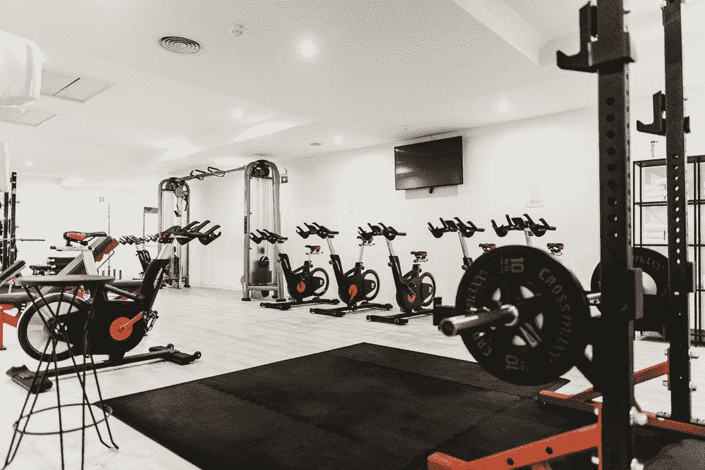
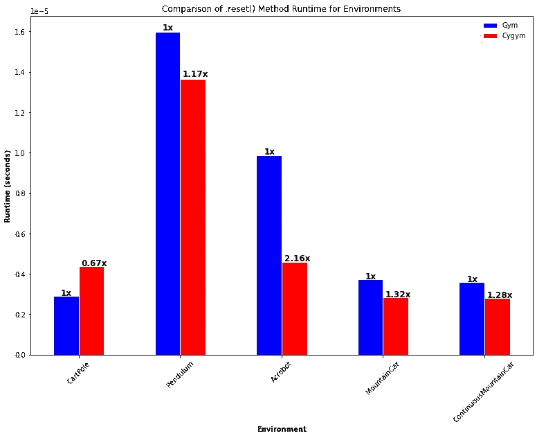
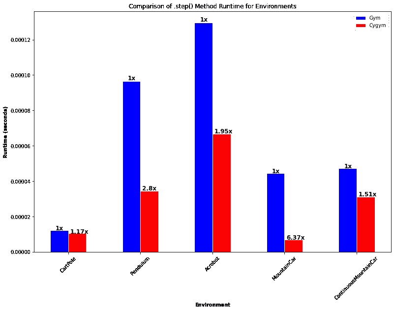
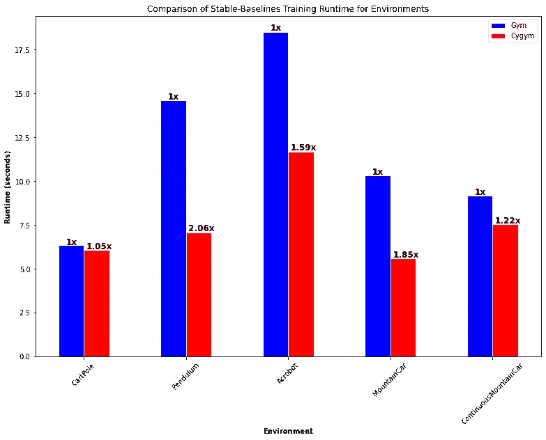

# 使用 Cygym，强化学习环境速度提高 100%

> 原文：<https://towardsdatascience.com/100-faster-reinforcement-learning-environments-with-cygym-20a3a970ebd1?source=collection_archive---------28----------------------->

## 使用 cygym 更快地替代健身房环境



我们可以用更快的环境来加速强化学习吗？[图片来源](https://unsplash.com/photos/dDp-6pXrYik)

任何至少涉足强化学习的人都可能会告诉你他们已经使用了 OpenAI 的健身包(链接如下)，而且理由充分！这是一个易于使用、可扩展且支持良好的包，它减少了设置 RL 项目的大部分开销。

然而，当用最少的资源进行一个大规模的项目时，从多次运行的代码中挤出每一滴性能是很重要的。在从事一个 RL 项目时，我浏览了一下经典控制环境的源代码，这些环境通常用于对 RL 代理进行基准测试，看看我们是否可以获得一些廉价的速度增益。

我注意到所有的 gym 代码都是用纯 Python 编写的，所以我大脑中的生产代码部分立即想到:“将这些环境进行 cythonizing 以提高速度怎么样？”

## Cython 快速介绍

Cython 是 Python 的一个超集，支持将解释的 Python 代码编译成速度极快的 C 扩展。这样做的好处是，我们实际上不必编写任何 C 代码，只需对我们的 Python 脚本做一些小的修改！根据不同的用例，有时您会发现 Python 代码的速度提高了 1000 倍以上。健身房环境的方法看起来是一个很好的选择，因为它在游戏的每一帧都被调用一次，这在训练 RL 代理时会出现数百万次。

# cygym 简介

我最近发布了一个公共存储库，其中包含一个名为 **cygym** 的 Python 包，它包含了原始 gym 包中经典控制环境的 cythonized 版本。原始环境代码的所有功劳都归于这些脚本的作者，但我确实引入了一些小的优化，并利用一些 Cython 魔术来获得比原始实现高达 100%的速度提升。希望这个数字只会随着我们扩展代码库和获得更多贡献者而上升。

# 安装和导入

cygym 的安装和设置非常容易，只需克隆公共包存储库并使用 pip 安装即可！

```
git clone https://github.com/gursky1/cygym
cd cygym
pip install -e . 
```

Pip 应该处理软件包所需的所有设置，但是如果您对这种方式的安装有问题，您可以自己手动构建软件包，并使用`setuptools`以另一种方式安装:

```
python setup.py build_ext --inplace bdist_wheel
pip install dist/(wheel file here).whl
```

如果您仍然遇到问题，请随时打开问题或直接联系我！

# 快速启动

Cygym 几乎是 OpenAI gym 的一个完整插件，你所要做的就是导入环境类并开始！

开始使用 cygym

Cygym 也应该兼容任何和所有的 OpenAI 健身房包装器。我们现在正在做的一个功能是让 cythonized 类与 OpenAI gym 注册表兼容，但由于 Cython 的原因，这不是非常简单的。

# 一些初始速度比较

我们可以执行的第一个速度测试是比较两种最常见的健身房方法`.reset()`和`.step()`在健身房和 cygym 中运行经典控制问题所需的时间。

当我们初始化一个环境时，`.reset()`被调用，而`.step()`被调用来应用一个动作并获得下一帧。与环境交互的大部分运行时间是在`.step()`中度过的，所以我们将更加重视这种比较:



gym 和 cygym 在初始化环境时的绝对和相对速度比较

不幸的是，cythonizing 似乎只给使用`.reset()`的初始化环境带来了适度的速度提升，有时甚至会减慢它的速度！但是不用担心，这个方法每集只调用一次，所以这些结果对于我们的下一个比较来说是次要的:



gym 和 cygym 在迭代环境中的绝对和相对速度比较

哇！使用我们的 cythonized 变体，我们可以看到迭代环境的速度提高了六倍！请注意，我们的大部分环境交互时间都在这里，这意味着我们的整体模型训练时间应该较少依赖于环境！

用随机动作测试两种常见的方法都很好，但是 cygym 在实际训练代理方面做得如何呢？让我们来看看…

# 具有稳定基线的 RL 代理培训

Stable baselines 是原始 OpenAI baselines 包的优秀分支，它包含了许多 RL 算法的实现，如 Deep-Q、TRPO、SAC、PPO 等等。我不会深入研究这个包，但我们将利用 Stable-Baseslines 中可用的矢量化环境以及我们的 gym 和 cygym 环境来训练实际的 RL 代理，并查看为 100k 帧训练我们的模型需要多长时间:

使用 Cygym 培训稳定基线代理的示例

现在，我们将进行与前面部分类似的比较，查看我们所有的经典控制环境，看看使用 cygym 可以获得什么样的速度提升:



gym 和 cygym 训练 RL 代理的绝对和相对速度比较

又来了，哇！看起来 cygym 总是比 gym 快，火车时间减少了 50%!当尝试构建新模型架构的原型或进行超参数搜索时，这可能是一个巨大的差异。

# 未来版本

在未来，我们计划看看与 OpenAI gym 的进一步兼容性，例如在我们的 cythonized 环境中使用`gym.make()`，以及可能的快速渲染(目前还不支持)。

我们还计划研究一下 cythonizing 更复杂的任务，比如最初 gym 包的 box2d 和算法模块中的任务。

# 结论

我们已经证明，使用 cygym 进行简单的 cythonization 可以大幅减少 RL 代理培训时间，这意味着等待时间更少，分析结果的时间更多！我们正在积极寻找 cygym 的贡献者和维护者，所以如果你有 Cython 包开发和优化的经验，请联系我们！

# 资源

**Cygym:快速 gym 兼容经典控制 RL 环境**

[](https://github.com/gursky1/cygym) [## gursky1/cygym

### 这个存储库包含 OpenAI Gym classic 控制环境的 cythonized 版本。注意是这个包…

github.com](https://github.com/gursky1/cygym) 

**OpenAI Gym:强化学习环境的多功能包**

[](https://github.com/openai/gym) [## 开放/健身房

### 状态:维护(期待 bug 修复和小更新)OpenAI Gym 是一个开发和比较…

github.com](https://github.com/openai/gym) 

**cy thon:Python 语言的编译超集**

 [## cy thon:Python 的 C 扩展

### Cython 是一个针对编程语言和扩展 Cython 编程语言的优化静态编译器…

cython.org](https://cython.org/) 

**稳定基线:OpenAI 基线的一个分支**

[](https://github.com/hill-a/stable-baselines) [## 丘陵/稳定基线

### 稳定基线是一组基于 OpenAI 基线的强化学习算法的改进实现…

github.com](https://github.com/hill-a/stable-baselines)