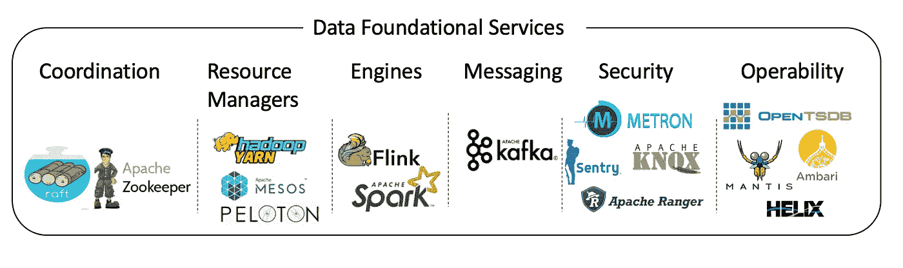

# 面向数据专业人员的 100 篇开源大数据和 ML 架构论文(续)

> 原文：<https://towardsdatascience.com/100-open-source-big-data-and-ml-architecture-papers-for-data-professionals-sequel-53fe690440a8?source=collection_archive---------38----------------------->

作者图片

# 介绍

在过去十年中，大数据技术极具颠覆性，开源在塑造其发展过程中发挥了主导作用。它已经导致了一个复杂的生态系统，新的框架、库和工具几乎每天都在发布，在技术人员努力理解系统的复杂性时造成了混乱。2015 年，我试图通过揭开这个空间的神秘面纱来解决这个问题。过去 5 年发生了很多变化，Spark 和 Flink 等新生态系统颠覆了第一代系统，人工智能和 ML 的进步以及云提供商产品的成熟。觉得这是拍续集的好时机。

这一次，我试图用一个由 3 部分组成的系列来解开这个复杂性。第一部分(当前文章)从开源生态系统的角度概述了该架构。第二篇将从云提供商的角度介绍架构的实现，而第三篇将从一些正在大规模处理数据的领先技术公司的角度介绍架构的实现。

如果你是一个大数据爱好者或技术专家(或挠头)，花一些时间深入理解关键系统的架构以了解其演变是很重要的。理解架构组件和微妙之处也将帮助您为您的用例选择和应用合适的技术。在我过去十年的旅程中，一些文献帮助我成为一名受过更好教育的数据专家。我在这里的目标不仅是分享文献，也是利用这个机会让开放源码系统的迷宫变得更加清晰。

需要注意的是，大部分参考文献都非常倾向于提供一个深入的架构概述(在大多数情况下，它指的是原始的研究论文)。

# 架构层

# 1.数据基础服务

作者图片

**a)协调**——这些系统用于跨分布式数据系统的协调和状态管理，都是从 [Paxos](http://research.microsoft.com/en-us/um/people/lamport/pubs/paxos-simple.pdf) 中获得灵感的。

*   Zookeeper——灵感来自于 Chubby 虽然是一个一般的协调服务，而不仅仅是一个锁定服务。
*   [Raft](http://raft.github.io/raft.pdf) 一种在多个现代数据库中使用的共识算法，例如 CockroachDB MongoDB 和 InfluxDB。

**b)资源管理器** —虽然第一代 Hadoop 生态系统始于 YARN 之类的单片调度器，但进化发生在分层调度器(Mesos)上，这些调度器可以跨不同类型的计算范式管理不同的工作负载，以实现更高的利用率和效率。

*   [YARN](http://54e57bc8-a-62cb3a1a-s-sites.googlegroups.com/site/2013socc/home/program/a5-vavilapalli.pdf?attachauth=ANoY7co94J9PVjpjD5GD4z-S8e1O7YrLsqHssH7aeFReTJaoOBLbvLhq9HeDNb-PQz2jQvPUeQbDjJa2bctooZz5_zHCKWXAKZrYqAy_mVCLIQqU0Cc-sNQBHOJNsUTyVPfEdpHQ5yoIGVdIzoCnQwsFjbSX2ztS9b0OBNI2SjDCdvLE7Hsi5ktJINChoFa7w0ELgFvir4sEAJaL-G1qgmUglhOjVjHgwXYsqHH7FOPXrTVC-csZelo%3D&attredirects=0) —是一个资源管理和作业调度框架。
*   Mesos —在多个不同的集群计算框架之间进行调度。
*   Peloton[是由优步构建的统一资源调度器，运行在 Mesos 之上，支持不同的工作负载——I)具有长期运行服务的无状态作业 ii)有状态作业长期运行的服务，如来自 Cassandra、MySQL 和 Redis 的服务，它们具有状态，iii)批处理作业或 iv)守护程序作业。](https://eng.uber.com/resource-scheduler-cluster-management-peloton/)

这些与 Hadoop 调度程序松散耦合，Hadoop 调度程序的主要功能是基于调度策略/配置来调度作业。比较流行的有[容量调度](http://hadoop.apache.org/docs/stable1/capacity_scheduler.pdf)和[公平份额调度](http://elmeleegy.com/khaled/papers/delay_scheduling.pdf)(此处[背景](https://arxiv.org/ftp/arxiv/papers/1207/1207.0780.pdf))。

**c)引擎—** 是执行运行时，为运行不同种类的计算提供环境。两种最常见的引擎是

● [Spark](https://www.usenix.org/legacy/event/hotcloud10/tech/full_papers/Zaharia.pdf) —在蓬勃发展的生态系统中广受欢迎和广泛采用。

● [弗林克](http://asterios.katsifodimos.com/assets/publications/flink-deb.pdf)——很像火花；优于火花的优势在于恰好一次流处理。

**d)消息传递** — [Kafka](http://notes.stephenholiday.com/Kafka.pdf) 是最广泛使用的数据处理消息传递系统。

**e)安全**

● [Hadoop 安全设计](http://carfield.com.hk:8080/document/distributed/hadoop-security-design.pdf)——抓住 Hadoop 设计关键方面的开创性论文。可以在[这里](https://www.xplenty.com/blog/5-hadoop-security-projects/)找到这些项目的概述。

● [阿帕奇密特隆](https://metron.apache.org/current-book/index.html) -是一个网络安全应用框架，为安全监控和异常检测提供一个集中的工具，具有日志聚合、完整数据包捕获索引、存储、高级行为分析和数据丰富的功能，同时将最新的威胁情报信息应用于安全遥测。

●[Apache Knox](http://public-repo-1.hortonworks.com/HDP-LABS/Projects/Knox/1.3.3.0-59/KnoxTechnicalPreview.pdf)——是 Hadoop 的 Web/REST API 网关解决方案。它通过 REST 提供了访问所有 Hadoop 资源的单一访问点。它充当虚拟防火墙，对入站请求强制执行身份验证和使用策略，并阻止所有其他内容。

● [Apache Ranger](http://files.meetup.com/19917255/Apache%20Ranger%20Meetup.pdf) —是一个用于 Hadoop 集群的策略管理工具。它包括一组广泛的管理功能，包括审计、密钥管理和跨 HDFS、Hive、YARN、Solr、Kafka 和其他模块的细粒度数据访问策略。

● [Apache Sentry](http://events.linuxfoundation.org/sites/events/files/slides/ApacheSentry2015_0.pdf) -对存储在 Apache Hadoop 中的数据进行细粒度授权。在 Hadoop 中跨多个数据访问路径实施一组通用策略。Apache Sentry 与 Apache Ranger 重叠，因为它也处理授权和许可。

**f)可操作性** —操作框架提供了管理工作负载的指标、基准和性能优化功能。

*   OpenTSDB —一个建立在 HBase 之上的时间序列度量系统。
*   [Ambari](https://ambari.apache.org/) —是一个用于收集、聚合和提供 Hadoop 和系统指标的系统。
*   [Helix](https://engineering.linkedin.com/research/2012/untangling-cluster-management-with-helix)—LinkedIn 开发的一个通用集群管理系统。
*   [螳螂](https://netflixtechblog.com/open-sourcing-mantis-a-platform-for-building-cost-effective-realtime-operations-focused-5b8ff387813a) —螳螂平台建于网飞，提供可观察性以帮助快速识别问题，触发警报，并应用弹性以最小化或完全避免停机时间。

# 2.数据存储服务

作者图片

**a)文件系统—** 分布式文件系统提供存储、容错、可伸缩性、可靠性和可用性。

*   [Google 文件系统](http://static.googleusercontent.com/media/research.google.com/en/us/archive/gfs-sosp2003.pdf)——分布式文件系统的开创性工作，塑造了 Hadoop 文件系统。
*   [Hadoop 文件系统](http://zoo.cs.yale.edu/classes/cs422/2014fa/readings/papers/shvachko10hdfs.pdf)-HDFS 发展的历史背景/架构。
*   [Ceph 文件系统](http://citeseerx.ist.psu.edu/viewdoc/download?doi=10.1.1.73.7717&rep=rep1&type=pdf)—HDFS 的[替代方案](http://www.usenix.org/legacy/publications/login/2010-08/openpdfs/maltzahn.pdf)，融合了块、文件和对象存储。
*   Alluxio 公司。超光速粒子-一种内存存储系统，用于处理现代低延迟数据处理。

**b)文件格式—** 文件系统也经历了文件格式和压缩技术的发展。[面向列与行存储](http://citeseerx.ist.psu.edu/viewdoc/download?doi=10.1.1.324.2739&rep=rep1&type=pdf)很好地概述了数据布局、压缩和物化。一篇比较和对比它们的好的[综述](https://thinksis.com/wp-content/uploads/2018/10/Nexla_Whitepaper_Introduction-to-Big-Data-Formats-Saket-Saurabh.pdf)论文可以在这里找到。一篇详细的论文在这里是。一个相关的主题是[压缩](https://pdfs.semanticscholar.org/4b38/d84d8efba442c14fd8a9fc4b95b37be093b7.pdf)技术及其在 Hadoop 生态系统上的比较。

*   [Avro](http://mil-oss.org/resources/mil-oss-wg3_an-introduction-to-apache-avro_douglas-creager.pdf)——围绕[protocol buffers](http://homepages.lasige.di.fc.ul.pt/~vielmo/notes/2014_02_12_smalltalk_protocol_buffers.pdf)——谷歌推广的语言中立序列化格式——为 Hadoop 生态系统建模。它是基于行的格式。
*   在 Google 的 [Dremel 的](https://static.googleusercontent.com/media/research.google.com/en/pubs/archive/36632.pdf)论文中首次提到了面向列的拼花格式。
*   [orc file](http://web.cse.ohio-state.edu/hpcs/WWW/HTML/publications/papers/TR-14-2.pdf)—Hive 使用的一种改进的面向列的格式。
*   [箭头](https://arrow.apache.org/) —一种内存中独立于语言的列格式，用于平面和分层数据，还支持零拷贝读取，用于闪电般快速的数据访问，而没有序列化开销。

**c)表格式—** 最近，一组现代的表格式，如 Delta Lake、胡迪、Iceberg ( [比较](https://databricks.com/session_na20/a-thorough-comparison-of-delta-lake-iceberg-and-hudi))正试图通过 ACID 合规性、快照隔离、安全模式演化和对 CRUD 操作的高性能支持来解决事务性保证。

*   [Delta Lake](https://databricks.com/wp-content/uploads/2020/08/p975-armbrust.pdf) —使用压缩成 Apache Parquet 格式的事务日志来提供 ACID 属性和时间旅行。
*   Apache Iceberg —最初由网飞开发，提供事务保证、快照隔离、列投影和谓词下推。
*   [阿帕奇胡迪](https://github.com/apache/hudi) (Hadoop Upserts 删除和增量)——最初在[优步](https://eng.uber.com/apache-hudi-graduation/)开发，再次带来了数据湖的 ACID 合规性。

# 3.数据管理服务

作者图片

**a)数据查询—** 数据查询工具的范围从 SQL 这样的声明性语言到 Pig 这样的过程性语言。

*   [Pig](http://infolab.stanford.edu/~olston/publications/sigmod08.pdf) —很好地概述了 Pig 拉丁语，而 [*Pig*](http://paperhub.s3.amazonaws.com/a7b584c04b61fabb8d10333e91989120.pdf) 则介绍了如何使用 Pig 构建数据管道。
*   [Hive](http://infolab.stanford.edu/~ragho/hive-icde2010.pdf) —提供 Hive 的介绍，而 [*Hive*](http://www.vldb.org/pvldb/2/vldb09-938.pdf) 另一篇好文章试图分享 Hive 在脸书背后的动机。
*   凤凰—h base 上的 SQL。
*   [Spark SQL](https://cs.stanford.edu/~matei/papers/2015/sigmod_spark_sql.pdf)—Spark 上的关系数据处理。
*   [方解石](https://arxiv.org/pdf/1802.10233.pdf) —提供对异构数据源的优化查询处理，并嵌入到多个大数据系统中。

**b)可视化**

*   [超集](https://superset.apache.org/) —由 AirBnb 开发，是一款针对大数据的数据探索和数据可视化工具。

**c)数据集成—** 数据集成框架提供了在大数据系统之间接收和输出数据的良好机制。

*   [Sqoop](https://sqoop.apache.org/)——在 Hadoop 和关系数据存储之间移动数据的工具。
*   [Flume](http://www.ijcte.org/vol10/1206-R004.pdf) —面向流的数据流，从所有指定的服务器收集日志，并将其加载到中央存储。
*   [Goblin](https://citeseerx.ist.psu.edu/viewdoc/download?doi=10.1.1.1057.7590&rep=rep1&type=pdf) —最初由 LinkedIn 开发，简化了大数据集成的常见方面，如流数据和批量数据生态系统的数据摄取、复制、组织和生命周期管理。
*   [马尔马拉](https://eng.uber.com/marmaray-hadoop-ingestion-open-source/)——优步研发，支持摄食和扩散。

**d)流程编排—** 工具帮助构建数据管道

*   [阿帕奇 Nifi](http://nifi.apache.org/docs.html) -数据分发与处理系统；提供了一种将数据从一个地方移动到另一个地方的方法，并在移动过程中根据需要做出路由决策和转换。
*   [Apache air flow](http://airflow.incubator.apache.org/)——最初由 AirBnb 开发，帮助创作、安排和监控工作流程。
*   [Oozie](https://dl.acm.org/doi/10.1145/2443416.2443420) —管理 Hadoop 作业的工作流调度系统。
*   [阿兹卡班](https://azkaban.github.io/)——LinkedIn 开发的工作流管理器。
*   Genie —网飞开发的数据管道框架。

**e)元数据工具** —提供一个中心位置来接收新数据源、发现数据集和见解、浏览元数据、探索原始或相当未处理的数据以了解数据谱系、创建和共享见解以及查看数据质量监控&异常检测。

*   [地面](https://rise.cs.berkeley.edu/wp-content/uploads/2017/03/CIDR17.pdf) —管理所有告知数据使用的信息的系统。
*   [Apache Atlas](http://docs.hortonworks.com/HDPDocuments/HDP2/HDP-2.5.3/bk_data-governance/content/ch_hdp_data_governance_overview.html) —数据治理平台，旨在与 Hadoop 堆栈中的其他工具和流程交换元数据、跟踪血统。
*   DataHub —由 LinkedIn 开发，提供元数据发现和数据门户的完整解决方案。
*   [Amundsen](https://eng.lyft.com/amundsen-lyfts-data-discovery-metadata-engine-62d27254fbb9) —由 Lyft 开发，提供数据发现和元数据管理。
*   [Metacat](https://github.com/Netflix/metacat) —由网飞开发，提供统一的元数据探索 API 服务。

# 4.数据处理服务

作者图片

数据处理框架可以根据处理的模型和延迟大致分类。

**a)Batch—**[MapReduce](http://static.googleusercontent.com/media/research.google.com/en/us/archive/mapreduce-osdi04.pdf)—来自 Google on MapReduce 的开创性论文。

**b)流式传输**

*   [Apache Beam](https://beam.apache.org/) 受 Google [Dataflow](http://www.vldb.org/pvldb/vol8/p1792-Akidau.pdf) 和 [Millwheel](http://static.googleusercontent.com/media/research.google.com/en//pubs/archive/41378.pdf) 的启发，它统一了定义批处理和流数据并行处理流水线的模型。
*   [Flink](http://sites.computer.org/debull/A15dec/p28.pdf) — Flink 为编程模型和执行引擎中的实时分析、连续流和批处理提供了统一的模型。使用[异步屏障同步](https://arxiv.org/pdf/1506.08603.pdf)处理[状态](http://www.vldb.org/pvldb/vol10/p1718-carbone.pdf)。
*   [Spark Streaming](https://cs.stanford.edu/~matei/papers/2018/sigmod_structured_streaming.pdf) —引入了连接传统批处理和交互处理的微批处理架构。
*   [Twitter Heron](http://delivery.acm.org/10.1145/2750000/2742788/p239-kulkarni.pdf?ip=65.204.229.97&id=2742788&acc=OA&key=4D4702B0C3E38B35%2E4D4702B0C3E38B35%2E4D4702B0C3E38B35%2EA518155024F4ED9E&__acm__=1523404812_80d06d684ca85fcda9ccf70b18987ed1)——公开了与 [Storm](https://www.slideshare.net/KarthikRamasamy3/storm-twitter) 相同的 API 接口，但是在它的基础上进行了改进，具有更高的可扩展性、更好的可调试性、更好的性能，并且更易于管理。
*   [Samza](http://www.vldb.org/pvldb/vol10/p1634-noghabi.pdf)—LinkedIn 的流处理框架。

**c)互动**

*   [Dremel](http://www.vldb.org/pvldb/vldb2010/papers/R29.pdf)——谷歌关于其如何处理交互式大数据工作负载的论文，该论文为 Hadoop 上的多个开源 SQL 系统奠定了基础。
*   脸书开发的开源 MPP SQL 查询引擎，可以快速处理大型数据集。
*   [Impala](http://cidrdb.org/cidr2015/Papers/CIDR15_Paper28.pdf) — MPI 风格的处理使 Hadoop 能够应对交互式工作负载。
*   [Drill](https://drill.apache.org)—Dremel 的开源实现。
*   [Tez](http://web.eecs.umich.edu/~mosharaf/Readings/Tez.pdf) —使用 YARN 的得律阿德斯的开源实现。

**d)实时**

*   [德鲁伊](http://static.druid.io/docs/druid.pdf)——一个实时的 OLAP 数据仓库。可操作的时间序列分析数据库。
*   [皮诺](https://cwiki.apache.org/confluence/download/attachments/103092375/Pinot.pdf?version=1&modificationDate=1571428741000&api=v2) —在 OLAP LinkedIn 数据商店开发，与德鲁伊非常相似。
*   AresDB —开发了利用 GPU 进行实时分析的优步。

**e)迭代**

*   Pregel——谷歌关于大规模图形处理的论文。
*   Giraph —围绕 Google Pregel 建模的大规模分布式图形处理系统。

# 5.ML 服务

作者图片

ML 服务为机器学习开发人员、数据科学家和数据工程师提供基础，使他们的 ML 项目从构思到生产和部署，快速且经济高效。

**a) ML 生命周期** —典型的 ML 生命周期始于数据准备，随后是(特征)发现、开发和训练模型、测试、部署，最后使用模型进行推理或预测。数据准备通常与获取、导出和清理足够的训练数据以馈入 ML 算法相关联。特征发现和提取识别对业务领域最重要的关键数据属性。部署包括可观察性、可调试性、监控和生产化。现代 ML 生命周期中有几个挑战(见[科技债务](https://papers.nips.cc/paper/5656-hidden-technical-debt-in-machine-learning-systems.pdf))ML 生命周期系统正在试图解决。

著名的开源软件有(很好的概述[这里](https://databaseline.tech/a-tour-of-end-to-end-ml-platforms/)):

*   来自 Databricks 的 MLFlow 的一个关键原则是*开放接口*设计，科学家和数据工程师可以将他们的模型引入到结构化环境中。
*   [米开朗基罗](https://eng.uber.com/michelangelo/)由优步打造，允许大规模无缝构建、部署和操作机器学习解决方案。
*   Metaflow 是网飞大学使用的一个 python 库，用于构建和部署数据科学工作流。

**b)分布式处理框架—** 在构建分布式深度学习框架方面有很多进展，这里可以找到很好的介绍其中比较流行的是谷歌的 [GPIPE](https://arxiv.org/pdf/1811.06965.pdf) ，优步的 [Horovard](https://arxiv.org/pdf/1802.05799.pdf) 和 DeepMind 的 [TF-Replicator](https://arxiv.org/pdf/1902.00465.pdf) 。

特征存储库(Feature Stores)—特征存储库允许不同的团队管理、存储和发现用于机器学习项目的特征。它充当数据工程和数据科学之间的 API，实现改进的协作。这里有一个很棒的介绍，这里有[列出的特色店列表。几个受欢迎的是来自谷歌的](http://featurestore.org/)[盛宴](https://cloud.google.com/blog/products/ai-machine-learning/introducing-feast-an-open-source-feature-store-for-machine-learning)和一些背景[这里的](/using-feast-to-centralize-feature-storage-in-your-machine-learning-applications-dfa84b35a1a0)，来自 Logicalclocks 的 [HopsWorks](https://uploads-ssl.webflow.com/5e6f7cd3ee7f51d539a4da0b/5e6f7cd3ee7f519fdfa4dadb_feature%20store%20whitepaper%201-0.pdf) ，来自 LinkedIn 的 [Frame](https://www.slideshare.net/DavidStein1/frame-feature-management-for-productive-machine-learning) 和来自 Airbnb 的 [ZipLine](https://youtu.be/iUnO4MLAGDU) 。

**d) ML 库** — ML 开发人员通常希望尝试*每一种可用的算法来构建最精确的模型，一个从事活动项目的团队可能会尝试多个处理库，常见的有 [MxNet](https://www.cs.cmu.edu/~muli/file/mxnet-learning-sys.pdf) 、 [TensorFlow](http://download.tensorflow.org/paper/whitepaper2015.pdf) 、 [Clipper](https://www.usenix.org/system/files/conference/nsdi17/nsdi17-crankshaw.pdf) 、 [Caffe](https://arxiv.org/pdf/1408.5093.pdf) 、 [PyTorch](https://papers.nips.cc/paper/9015-pytorch-an-imperative-style-high-performance-deep-learning-library.pdf) 、 [Theano](https://arxiv.org/pdf/1605.02688.pdf) 和[Chainer](https://arxiv.org/pdf/1908.00213.pdf)*

# 6.数据服务系统

作者图片

广义地说，分布式数据存储根据底层模式和支持的数据结构分为列、键值、文档、图形、搜索、关系和内存中。

a)面向列的商店

*   [BigTable](http://static.googleusercontent.com/media/research.google.com/en/us/archive/bigtable-osdi06.pdf)—Google 关于分布式面向列的数据存储的开创性论文。
*   [HBase](http://citeseerx.ist.psu.edu/viewdoc/download?doi=10.1.1.294.8459&rep=rep1&type=pdf) —虽然没有明确的论文，但这提供了该技术的一个很好的概述。
*   [Hypertable](http://www.hypertable.com/collateral/whitepaper-hypertable-architecture.pdf)——围绕 BigTable 建模。

b)关键值商店

*   [Dynamo](http://www.cs.ucsb.edu/~agrawal/fall2009/dynamo.pdf) —关于键值分布式存储系统的开创性论文。
*   [卡珊德拉](http://www.cs.cornell.edu/projects/ladis2009/papers/lakshman-ladis2009.pdf)——灵感来自迪纳摩；面向多维键值/列的数据存储。
*   [伏地魔](http://static.usenix.org/events/fast/tech/full_papers/Sumbaly.pdf)——另一个受迪纳摩启发，在 LinkedIn 开发的。
*   [RocksDB](https://rocksdb.org/) —由脸书开发，是一种日志结构数据库引擎，针对闪存驱动器和高速磁盘驱动器等快速、低延迟存储进行了优化。

c)文档存储

*   CouchDB —一种流行的面向文档的数据存储。
*   [MongoDB](https://www.mongodb.com/mongodb-architecture) —对 MongoDB 架构的很好介绍。

d)图形存储

*   [Neo4j](https://neo4j.com/) —最流行的图形数据库。
*   泰坦—Apache 许可下的图形数据库。

e)搜索商店

*   [弹性搜索](https://www.elastic.co/) —分布式可扩展搜索引擎。
*   [Solr](https://lucene.apache.org/solr/) —类似于 ElasticSearch。

f)时间序列

*   [TimeScaleDB](http://caxapa.ru/thumbs/880838/timescaledb.pdf) —可伸缩的时间序列数据库。
*   [InfluxDB](https://cs.ulb.ac.be/public/_media/teaching/influxdb_2017.pdf) —另一个流行的时间序列数据库([差异](https://blog.timescale.com/blog/timescaledb-vs-influxdb-for-time-series-data-timescale-influx-sql-nosql-36489299877/))。

g)关系

*   [cocroach db](https://dl.acm.org/doi/pdf/10.1145/3318464.3386134)——仿照谷歌的[扳手](http://static.googleusercontent.com/media/research.google.com/en/us/archive/spanner-osdi2012.pdf)。
*   [MySQL](https://www.mysql.com/) —广泛使用的关系数据库。
*   另一个非常流行的数据库。

h)内存中

*   [Memcache](https://www.ijert.org/research/a-brief-introduction-to-memcached-with-its-limitation-IJERTV3IS21081.pdf) —一个可扩展的分布式缓存，它在[脸书](https://www.usenix.org/system/files/conference/nsdi13/nsdi13-final170_update.pdf)的使用。
*   [Redis](https://redis.io/) —另一种流行的分布式缓存，带有磁盘持久性选项。

# 附录

一些一般性的论文可以为您提供关于 NoSQL、数据仓库规模计算和分布式系统的背景知识。

*   [分布式系统基础](http://github.com/aphyr/distsys-class)
*   [作为计算机的数据中心](http://www.morganclaypool.com/doi/pdf/10.2200/S00516ED2V01Y201306CAC024)–为仓库规模计算提供了很好的背景。
*   [最终一致性](https://cs.stanford.edu/people/chrismre/cs345/rl/eventually-consistent.pdf)–分布式系统不同一致性模型的背景。
*   [CAP 定理](https://dzone.com/articles/understanding-the-cap-theorem) —一个关于 CAP 及其演化的很好的背景及其[评论](http://jvns.ca/blog/2016/11/19/a-critique-of-the-cap-theorem/)。
*   [λ](http://jameskinley.tumblr.com/post/37398560534/the-lambda-architecture-principles-for)-典型数据管道的既定架构。
*   [Kappa](http://radar.oreilly.com/2014/07/questioning-the-lambda-architecture.html)–一种将处理向上游移动到流层的替代架构。

# 摘要

我希望这些文件在你开始或加强你的旅程时有用。在第二部分，我们将从云提供商的角度来看架构，而在第三部分，我们将了解一些领先的技术公司如何使用这些(或开发了类似的技术)来解决他们的业务问题。

*最初发表于*[T5【https://www.linkedin.com】](https://www.linkedin.com/pulse/100-open-source-big-data-ml-architecture-papers-sequel-anil-madan/)*。*