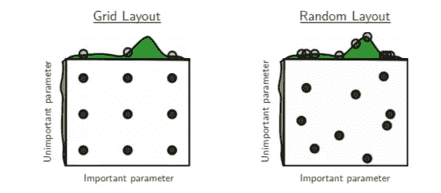
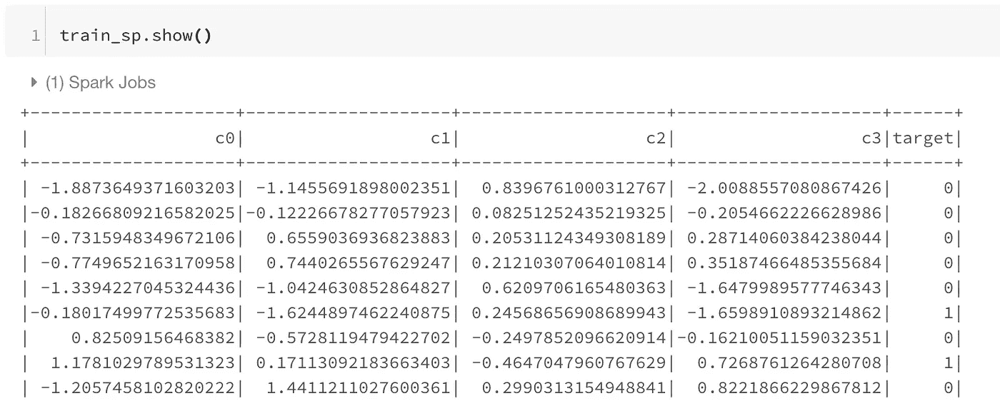
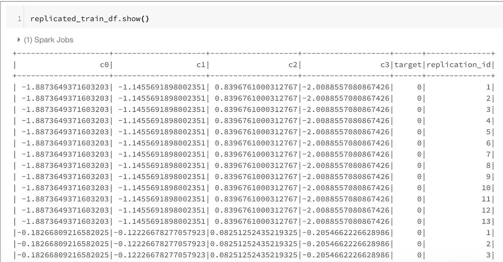
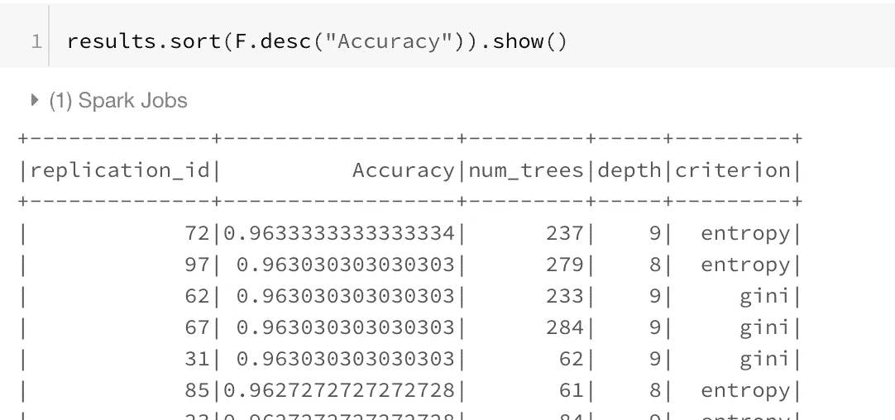

# Pyspark 超参数搜索框架速度提高 100 倍

> 原文：<https://towardsdatascience.com/100x-faster-randomized-hyperparameter-searching-framework-with-pyspark-4de19e44f5e6?source=collection_archive---------13----------------------->


闪电力量。 [Pixabay](https://pixabay.com/?utm_source=link-attribution&utm_medium=referral&utm_campaign=image&utm_content=1539416)

## **现成的、可重用的、快速的代码**

最近我在为一个巨大的机器学习模型调整超参数。

手动调整不是一个选项，因为我必须调整很多参数。 [Hyperopt](/automate-hyperparameter-tuning-for-your-models-71b18f819604) 也不是一个选项，因为它是连续工作的，也就是说，一次只能制造一个模型。所以训练每个模特要花很多时间，而我的时间很紧。

如果我要赶上最后期限，我必须想出一个更好更有效的方法。因此，我想到了在许多这样的场景中帮助我们数据科学家的一件事— ***并行化。***

***我可以并行化我的模型超参数搜索过程吗？***

你可能已经猜到了，答案是肯定的。

***这篇文章是关于使用 scikit-learn/xgboost/lightgbm 和 pySpark 为数据科学建立一个超参数调优框架。***

# 网格 vs 随机化？

在我们开始实现超参数搜索之前，我们有两个选项来设置超参数搜索——网格搜索或随机搜索。



从一个 3×3 的参数网格开始，我们可以看到随机搜索最终会对重要参数进行更多的搜索。

上图给出了为什么随机搜索更好的明确答案。

假设我们必须为我们的机器学习模型调整两个超参数。一个不重要，一个很重要。在网格搜索中，我们查看重要参数的三个设置。在随机搜索中，我们在 9 个设置中搜索重要参数。我们花的时间是一样的。

因为随机化搜索更彻底地搜索整个空间，并为我们提供更好的超参数，所以我们将在我们的示例中使用它。

# 树立我们的榜样

在我的工作场所，我可以访问一个有数百个节点的非常大的集群。这是数据科学家的梦想。但是在这篇文章中，我将使用 Databricks 社区版免费服务器和一个玩具示例。如果你想为自己设置这个小服务器进行练习，请查看我在 Spark 上的[帖子](/the-hitchhikers-guide-to-handle-big-data-using-spark-90b9be0fe89a)。

您可以选择使用 Spark 加载数据，但是在这里，我首先创建我们自己的分类数据，以建立一个我们可以使用的最小示例。

```
X,y = datasets.make_classification(n_samples=10000, n_features=4, n_informative=2, n_classes=2, random_state=1,shuffle=True)train = pd.DataFrame(X)
train['target'] = y# Convert this pandas Data to spark Dataframe. 
train_sp = spark.createDataFrame(train)# Change the column names.
train_sp = train_sp.toDF(*['c0', 'c1', 'c2', 'c3', 'target'])
```

`train_sp` spark 数据集看起来像:



# 这个想法——复制和应用


由[弗兰克·维西亚](https://unsplash.com/@frankvex?utm_source=medium&utm_medium=referral)在 [Unsplash](https://unsplash.com?utm_source=medium&utm_medium=referral) 上拍摄的照片

现在我们在 Spark 中有了我们的训练数据集。我们想在这个数据框架上运行多个模型。

Spark 天生擅长键值对。也就是说，具有特定密钥的所有数据都可以发送到一台机器。我们可以对这些数据应用函数。

但是我们需要每台机器上的所有数据。我们如何做到这一点？

***我们复制我们的数据 n 次，并给我们的数据添加一个 replication_id，这样每个键都有所有的数据。***

好了，现在我们可以使用 replication_id 上的 groupby 将整个数据发送到多台机器。但是我们如何使用熊猫和 scikit 来学习这些数据呢？

***答案是:我们用 pandas_udf。这个功能是在 Spark 版本 2.3.1 中引入的。这让你可以利用 Spark 的熊猫功能。***

如果您还不理解这一点，请查看代码，因为有时理解代码更容易。

# 代码

在这里，我们首先通过将`cross_join`与包含 1–100`replication_id`的列的数据帧一起使用，将我们的训练数据帧复制 100 次。

```
# replicate the spark dataframe into multiple copiesreplication_df = spark.createDataFrame(pd.DataFrame(list(range(1,100)),columns=['replication_id']))**replicated_train_df = train_sp.crossJoin(replication_df)**
```



每一行都用不同的 replication_id 复制 100 次

我们还定义了一个函数，该函数将 pandas 数据帧作为输入，使用 python random 模块获取随机超参数，对数据运行模型(这里我训练的是 scikit 模型，但您也可以用任何模型(如 XGBoost 或 Lightgbm)替换它),并以 Pandas 数据帧的形式返回结果。一定要看看函数和注释。

这里不需要(太多)火花。该函数将熊猫数据框作为输入。

我们现在可以将这个`pandas_udf`函数应用于我们复制的数据帧，使用:

```
results = replicated_train_df.groupby("replication_id").apply(run_model)
```

上面的代码所做的是将具有相同复制 id 的所有数据发送到一台机器上，并将函数`run_model`应用到数据上。上面的调用是延迟发生的，所以在运行下面的操作调用之前，您无法看到结果。

```
results.sort(F.desc("Accuracy")).show()
```



我们的超参数搜索结果

对于这个玩具示例，精度结果可能看起来非常接近，但在嘈杂的真实世界数据集的情况下，它们会有所不同。由于这 100 个模型都是在不同的节点上并行运行的，所以我们在做随机超参数搜索的时候可以节省很多时间。

加速因子当然取决于集群中有多少节点。对我来说，我有 100 台机器可供我使用，所以我获得了大约 100 倍的加速。

你可以从这个数据砖[笔记本](https://databricks-prod-cloudfront.cloud.databricks.com/public/4027ec902e239c93eaaa8714f173bcfc/7664398068420572/3438177909678058/3797400441762013/latest.html)中获得完整的代码，或者从我的 [GitHub](https://github.com/MLWhiz/data_science_blogs/tree/master/spark_hyperparams_tuning) 仓库中获得，我在那里保存了我所有帖子的代码。

# 继续学习

如果你想了解更多关于实用数据科学的知识，请看看 Coursera 的 [**【如何赢得数据科学竞赛】**](https://coursera.pxf.io/yRPoZB) 课程。我从卡格勒教授的这门课程中学到了很多新东西。

谢谢你的阅读。将来我也会写更多初学者友好的帖子。在 [**媒体**](https://medium.com/@rahul_agarwal?source=post_page---------------------------) 关注我，或者订阅我的 [**博客**](http://eepurl.com/dbQnuX?source=post_page---------------------------) 了解他们。一如既往，我欢迎反馈和建设性的批评，可以通过 Twitter [@mlwhiz](https://twitter.com/MLWhiz?source=post_page---------------------------) 联系。

此外，一个小小的免责声明——在这篇文章中可能会有一些相关资源的附属链接，因为分享知识从来都不是一个坏主意。