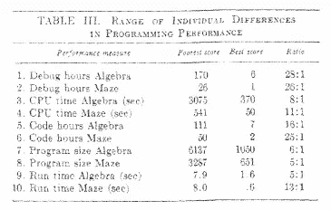
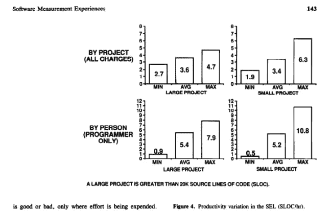
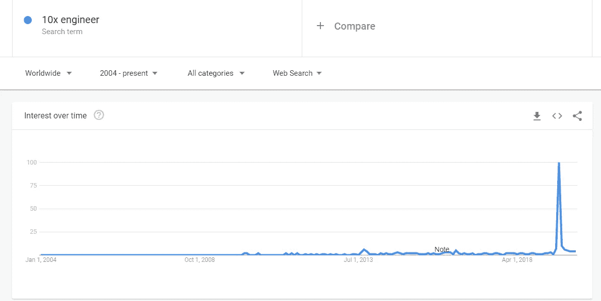

# 幸运的是，10 倍数据科学家不是“一件事”,让我们共同努力保持这种状态

> 原文：<https://towardsdatascience.com/10x-data-scientist-is-luckily-not-a-thing-lets-all-work-to-keep-it-this-way-4aa268790a4d?source=collection_archive---------30----------------------->

## 我们真的不需要那种废话

嘎嘎(摄影:兰迪·欧)

这个周末，Medium 的拜占庭式文章推荐算法决定给我推荐一篇关于成为“10x 数据科学家”的文章。我的第一反应是“绝对 f-？”。我没有链接到它，因为这将奖励一个自我夸大的傻瓜的不良行为(在开放的互联网上宣布自己是 10 倍的任何东西，这需要一个全新的傲慢水平)。如果你必须阅读，搜索并使用谷歌缓存。

我后来意识到，这篇文章发表于 2019 年 10 月，谢天谢地不是最近，但距离写这篇文章还不到 5 个月。这也是 7 月份“10 倍工程师”首次病毒式增长的几个月后。在谷歌上搜索这个词，实际上在互联网上出现了相对少量的使用这个词的帖子，分散在过去 3 年左右。这多少让人松了一口气。它并没有在社区中广泛传播，只是一些博主试图获得廉价的点击率。

按照 2019 年时代精神的理解，整个 10 倍工程师神话是软件工程中可能存在的有毒刻板印象的结晶，我们需要将这种垃圾从数据科学中剔除。如果愚蠢的神话像病毒一样传播开来，并在这个领域之外占据主导地位，比如未来的学生、招聘人员和招聘人员，我们都会因此而遭受损失。

对于那些不熟悉 10x 的人来说，我们将在本文的后面介绍历史和细节。它的要点是，一些非常古老的研究发现，一些程序员在一些指标上比其他人表现得好几个数量级，如编写代码的执行速度、生成的代码行数等。在接下来的研究中，这个观察结果被简化为大约“10 比 1 ”,高性能者产生的代码量是最差性能者的 10 倍。

就其本身而言，观察到在一群人中有更高和更低的表现者并没有特别的争议，幂律分布是一毛钱一打。让整个事情像病毒一样传播的是这个概念是如何与“比其他人都好的孤独的混蛋程序员”的漫画联系在一起的。更糟糕的是，有人宣称这些“10x 工程师”是值得雇佣的，应该积极寻找。从那以后事情就变得疯狂了。

# 瓦特？！

故意找出有毒人格的核心概念是因为他们可以更好地编码，同时有效地让他们周围的每个人牺牲各种事情，这足以令人难以置信。在**数据科学**的背景下，这甚至更没有意义，因为这个领域是如此荒谬地跨职能。一个典型的数据人员将直接与整个组织中的所有人一起工作，通常是上下多层。你绝对不需要让一个拥有如此广泛影响力的人成为一个有毒的个体。在一个相对孤立的开发团队中强加这样的人已经是一种暴行，理论上你可以把他们封闭在一个 1 人的团队中。但是让他们和整个组织保持密切联系？还不如在开放式办公室计划里扔个炸弹。

需要说明的是，最初的 10x 概念的基本事实是，工程师(和数据科学家)之间的表现存在巨大的个体差异，这一点并没有真正的争议。有些人的表现不可避免地会比你想衡量的任何指标中表现最差的人好一个数量级。

互联网抓住并拒绝了这样一种观点，即组织中的每个人都应该忍受这些更有生产力的个人带来的任何有害垃圾，仅仅因为他们是高产的。

提示:有些高效的人不是混蛋，去雇佣他们吧。

# 数据社区非常棒，保持这种状态是我们的共同责任

数据社区是我所知道的最包容和积极的社区之一。我们有来自各行各业的人参加，从博士到高中生。艺术、社会科学和硬科学都有代表。有核心工程师，核心研究人员，各行各业的人，周末散客和学生，他们都对用数据来理解世界感兴趣。看看 datahelpers.org 的[上的所有伟人吧。](https://www.datahelpers.org/)

Twitter 上的数据人群总体上是令人惊讶和开放的。几乎在这个领域的任何地方，你都可以很容易地与人交谈。有很多善意的玩笑，论文和话题的链接和讨论。

还有更广阔的精彩社区。围绕 R 建立了一个巨大的社区，包括用户组、meetup 组和会议。我甚至不知道如何真正使用 R，但仍然高度评价那个社区中的了不起的人。记得 2019 年 R-Ladies 在揭露[巨大的数据营丑闻中发挥了重要作用。我们团结一致，大声疾呼，站出来说我们不会接受这种行为，这是社区的荣誉。](https://www.buzzfeednews.com/article/daveyalba/datacamp-sexual-harassment-metoo-tech-startup)

这也不是说一切都很完美，但你很难找到一个更好的技术团队。仍然有很多[看门人](https://www.reddit.com/r/datascience/comments/bbpgem/gatekeeping_megathread/)看起来更感兴趣的是宣布什么是“真正的”数据科学，而不是对任何人有所帮助。我还确信，在这个巨大而丑陋的世界的某个地方，粗略的骚扰问题正在发生，没有任何独特的情况允许 DataCamp 丑闻像病毒一样传播。

我们有责任大声明确地说出什么是不可接受的。社会规范是一个社会保持稳定控制和自我节制的最佳方式之一。我们得到了一件好事，不能想当然。这东西分解得很快。

# 现在，来看看整个 10 倍的事情

对 10x 工程师概念的引用似乎要归因于 Sackman、Erikson 和 Grant 在 1968 年发表的一篇论文，“比较在线和离线编程性能的探索性实验研究”。(美国计算机学会通讯，1968 年 1 月)这是一篇相当短的论文，你必须把你的大脑包裹在历史背景中。简介中给出的研究的主要动机是这样的:关于传统的批处理或分时系统是否更好存在激烈的争论。当程序员可以一直使用电脑，在更昂贵的支持在线访问的硬件上反复调试代码时，他们会变得更懒吗？难道他们不应该在提交程序之前先在纸上手工推理出他们的代码吗？

> *“现在的孩子！”—最终每个人*

这篇论文描述了分时系统是如何工作的，这对更现代的计算机用户来说听起来是非常基本的:

> 用户程序存储在磁带或磁盘文件存储器中。当用户希望操作他的程序时，他就去几个电传控制台中的一个；这些控制台是 Q-32 的直接输入/输出设备。他通过电传打字机指示计算机装入并启动他的程序。然后，系统将程序从磁盘文件或磁带装入活动存储磁鼓存储器。所有当前运行的程序都存储在磁鼓存储器中，并依次一次一个地传送到磁心存储器中进行处理。在 TSS(分时系统)的调度控制下，每个程序被处理一小段时间(通常是几分之一秒),然后被替换到活动存储器中，等待下一次处理。一个程序只有在需要处理时才被转移到核心；否则，该轮将被拒绝。因此，用户可以花尽可能多的时间来思考下一步做什么，而不会浪费机器的计算时间。

实验是一个 2×2 的设计。受试者(12 名经验丰富的程序员)被要求编写和调试两个问题——一个是“代数”问题，你要编写一个程序来解决输入到电传打字机中的代数方程；另一个是“迷宫”问题，他们必须编写一个程序来打印出通过 20x20 网格迷宫的单条路线。所有的受试者都“参考了公开发表的资料，以获得解决代数问题的可行逻辑建议”。

这些问题是在调试的“在线”条件下给出的，在这种情况下，他们使用 TSS 系统，可以完全访问系统上的所有内容。还有一个模拟的“离线”条件，使用相同的 TSS 系统，但用户必须成批提交他们的工作，并等待 2 小时，等待他们的工作返回。该研究指出，2 小时比典型的批处理系统短，但足够长，大多数受试者抱怨延迟。六名受试者在“在线”条件下接受代数问题，然后在“离线”条件下接受另一个问题，剩下的六名受试者接受在线迷宫。

测试结果表明，分时系统有利于减少用于调试的工时。有趣的是，在线代数问题的平均时间为 34.5 小时(30.5 SD)，而调试问题的平均时间为 50.2 小时(58.9 SD)。平均 35 个人- **小时**来解决一个棘手的问题！还要注意巨大的标准差。

这是那篇论文中的表 III，它将播下最初的种子，这将导致 10 倍的废话:

据观察，最好的程序员和最差的程序员之间的差别可能是巨大的。就花在调试代数问题上的时间而言，高达 28 比 1。研究人员还发现，在对简单问题进行类似实验的情况下，9 名“见习”程序员之间存在类似的巨大个体差异。

然后在“[快速发展](https://mycomputersciencebooks.files.wordpress.com/2017/08/steve-mcconnell-rapid-development-taming-wild-software-schedules.pdf)中，史蒂夫·麦康奈尔在 1996 年说了如下的话:

> *“自 20 世纪 60 年代末以来，一项又一项研究发现，经验水平相似的程序员的生产率确实相差至少 10 比 1 (Sackman，Erikson 和 Grant 1968，Curtis 1981，Mills 1983，DeMarco arid Lister 1985，Curtis 等人 1986，Card 1987，Valett 和 McGarry 1989)。”*

这本书本身正面地**强调了**10 比 1 的理念，试图让读者相信他们也可以将他们的软件开发团队从 1 倍生产力的团队向 10 倍生产力的方向发展。这本书存在的全部原因是教读者(大型软件项目的经理)如何管理他们的团队，使其不像 1x 团队，并表现得更好。

最近引用的来自该段落的论文 [McConnell，Valett 和 McGarry，1989](https://pdfslide.net/documents/a-summary-of-software-measurement-experiences-in-the-software-engineering-laboratory.html) ，查看了 NASA 工程师为各种项目收集的大量项目数据，并显示(大致)最差者和最佳者之间存在 10 倍的差异。但是请注意，以今天的标准来看，这个指标是相当粗略的:源代码行数**/小时**。所以，总而言之，人们发现一些工程师可以像另一个工程师一样粗制滥造出 10 倍数量的代码。我将在以后的文章中更深入地研究这个 SLoC 度量的历史，因为它太大了，无法在这里涵盖。

整个 10x 的历史比我所能理解的还要曲折，因为研究人员 30 多年来发表了一篇又一篇论文。你可以点击[这里](https://www.construx.com/blog/productivity-variations-among-software-developers-and-teams-the-origin-of-10x/)，点击[这里](https://www.construx.com/blog/the-origins-of-10x-how-valid-is-the-underlying-research/)，为了获得更多的综述和引用，我最初把它们作为我的出发点。

# 从枯燥的学术/管理概念到荒谬的模因

自 2010 年以来(根据谷歌趋势)，短语“10 倍工程师”不时会出现，这不是一个非常流行的术语。我想它只是静静地在软件管理文献中飘来飘去，并没有走出去。

[Knowyourmeme](https://knowyourmeme.com/memes/10x-engineer) 链接到许多关于 10x 工程师概念的文章或文章。见鬼，我找到一篇文章，说 10x 工程师的概念正在(令人高兴地)消失……[发表于 2014 年](https://a16z.com/2014/07/30/the-happy-demise-of-the-10x-engineer/)。

直到 2019 年 7 月 11 日某个决定命运的一天:

一位投资者在推特上说，创业公司应该雇用 10 倍的工程师，以增加成功的几率……你如何找到这位 10 倍的工程师？显然你正在寻找某种 90 年代反社会的技术专家的卡通素描:讨厌开会，工作时间奇怪，使用黑屏背景(？！)，知道产品中的每一行代码，拥有完整的堆栈，可以在几个小时内写出代码，很少使用文档，学习新的框架/语言，是糟糕的导师，不黑东西，很少换工作……这几乎够疯狂的了，它会认为这是讽刺，除了没有任何迹象表明这条推文不是认真的。

[讽刺](https://twitter.com/techgirl1908/status/1149844028763983872)和[嘲笑](https://twitter.com/BriannaWu/status/1150087966079049730) [回复](https://twitter.com/EricaJoy/status/1149851513340043264)来得又快又猛。然后火继续燃烧，因为 Shekhar 弯下腰:

博主们当然无法抗拒争议，开始写他们自己对 10x 工程师的看法，一些人进入了[历史等等](https://jasoncrawford.org/10x-engineers)。很快它就传播开来，在[黑客新闻](https://news.ycombinator.com/item?id=20432492)等网站上找到了它的位置。

这种情况现在已经冷却下来，变成了一个彻底被嘲笑的迷因。但即使是现在，这个概念也存在于更广阔的世界中。缺乏经验和信息的人，不了解迷因的人仍然会问一些关于迷因的问题。过去一个月，我在 Quora 上搜索帖子，仍然有几个 10 倍的工程师问题:

数据科学有机会从情境中学习。我们真的应该听听。

*这篇文章最初出现在 Randy 的 Counting Stuff 时事通讯上。通过*[*https://counting.substack.com*](https://counting.substack.com)免费订阅这些文章，并直接放入你的收件箱