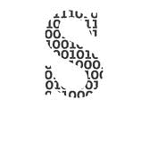
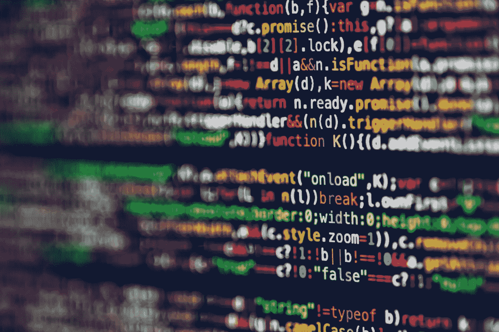
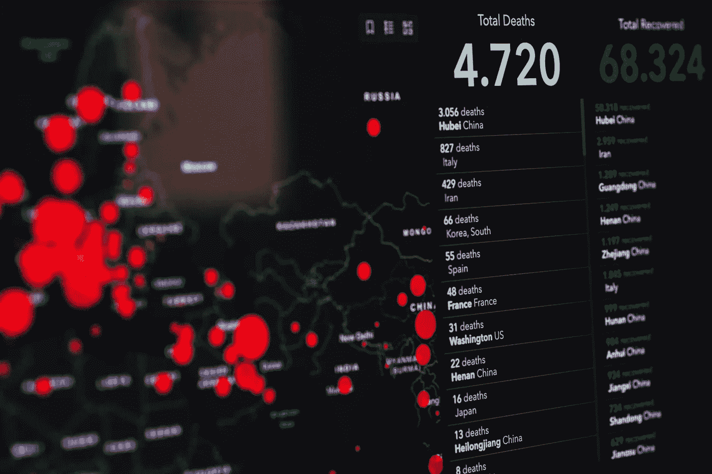

# 如果你因为冠状病毒而被锁在家里，11 堂最好的数据科学课

> 原文：<https://towardsdatascience.com/11-best-data-science-classes-if-youre-locked-home-because-of-coronavirus-ca7d2d74a454?source=collection_archive---------6----------------------->

## 不用花一分钱就可以开始你的职业生涯

如果你在家的时间太多，为什么不投资在你的技能上呢？照片由 [Unsplash](https://unsplash.com/s/photos/programmer?utm_source=unsplash&utm_medium=referral&utm_content=creditCopyText) 上的 [Grzegorz Walczak](https://unsplash.com/@grzegorzwalczak?utm_source=unsplash&utm_medium=referral&utm_content=creditCopyText) 拍摄

  S 哈克斯佩雷在隔离期间写了*李尔王*。牛顿在隔离期间为他的运动定律奠定了基础。人们在隔离期间制造有趣的迷因。

你能做什么？永远改变戏剧世界或彻底改变物理世界——我认为这个标准太高了。但你可以提高你在数据科学方面的技能，并在疫情结束后启动你的职业生涯。

 [## 我如何在 6 个月内从零编码技能成为数据科学家

### 我用来自学数据科学的 4 个工具没有花一美元

towardsdatascience.com](/how-i-went-from-zero-coding-skills-to-data-scientist-in-6-months-c2207b65f2f3) 

这并不是所有职业的完整指南。如果你做一个简单的谷歌搜索，你会发现你一辈子都拿不完的东西…

相反，这是我和其他人发现特别有用的类的概要。哪些课程适合你取决于你目前的编程和统计技能水平。尽管在实践中编程和统计之间的界限是模糊的，但本指南将这两个学科分开，以便于浏览。

编程方面，三种语言必不可少:Python、R 和 shell 脚本。后者往往被初学者低估。但如果你是一名数据科学家，这是你的饭碗。您还会想了解一两件关于 Git 和 GitHub 的事情。

是时候编码了。马库斯·斯皮斯克在 [Unsplash](https://unsplash.com/s/photos/programmer?utm_source=unsplash&utm_medium=referral&utm_content=creditCopyText) 上的照片

关于 Python 和 R，您可能只需要深入了解其中一个就可以了。这取决于你以后想在哪里工作。

你还需要一些关于数据库的知识。*(你想成为一名数据科学家，对吗？SQL 是最先进的语言，所以我建议你在开始申请工作之前开始使用它。*

在统计学方面，任何关于数据科学的普通课程都可以。其中许多还介绍了最重要的语言和技术环境。但我还是建议你也去上专门的语言课。*因为。编程。是。重要！*

由于我们中的许多人都面临着工作和预算的不安全感，我决定只列出免费资源。毕竟，对你的进步来说，你的纪律比你投资的金钱重要一千倍。

# 编程类

根据您当前的技能，您可能需要这里列出的部分或全部课程。我特意为每种语言只列出了一个，最多两个类，以避免混淆哪一个最适合你。

如果你是一个绝对的初学者，我建议你在继续下面列出的数据科学课程之前遵循所有这些。

## 1.计算机编程语言

learnpython.org[的材料是一个很好的起点。这一切都是交互式的，不需要安装任何东西——你可以直接在浏览器中键入你的代码。](https://www.learnpython.org)

几个小时后，你可能会发现你可以摆弄它了。花几天时间，你就能编写自己的 basic 程序了。

迟早，你需要能够安装 Python 和相关的包。如果你觉得已经准备好了，你可以试试 Python 的官方资源。然而，我不鼓励你这样做，如果你以前没有编码经验，因为这可能是相当令人生畏的。

如果你有一些钱可以花，你可以通过 [DataCamp](https://www.datacamp.com/courses/tech:python) 访问 Python 类。你可以以每月 25 美元的价格学习大多数课程，这些课程也是浏览器代码课程。然而，对于大多数目的来说，来自 Python 和 learnpython.org 的免费资源已经足够了。

## 2.稀有

哈佛大学的 edX 课程将为你提供开始学习 r 所需的一切。该课程为期 8 周，但你每周只需投入 1-2 小时。所以，即使你的日程很忙，这也是可行的。

如果你想多付出一点努力，获得更深层次的知识，还有约翰霍普金斯大学的 [coursera class](https://www.coursera.org/learn/r-programming) 。它长达四周，第一周花费 25 小时，之后每周花费 10-12 小时。本课程还包括安装，并为您提供一些背景知识。

 [## R 编程入门

### 使用数据科学中第二常用的编程语言 R 进行端到端的数据分析。

towardsdatascience.com](/getting-started-with-r-programming-2f15e9256c9) 

## 3.结构化查询语言

虽然数据集在 Python 中很容易管理，但 SQL 是处理大数据量的好方法。w3schools.com 的[教程](https://www.w3schools.com/sql/)涵盖了几乎所有的基础知识。

本教程包含大量浏览器代码示例，非常适合初学者。大约需要 10-15 个小时才能完成。

如果你更喜欢视频课程，你也可以试试可汗学院的[课程](https://www.khanacademy.org/computing/computer-programming/sql)。这里有更具挑战性的浏览器文本示例，但整个课程的时间会更短，你需要花 5-10 个小时来完成。

## 4.命令过程

一个很好的开始方式是[艰难地学习代码的书](http://cglab.ca/~morin/teaching/1405/clcc/book/cli-crash-course.html)。它非常系统，没有任何花哨的 UI。但这正是它的好处所在——稍后，您还将坐在命令行上，没有通常的图形颤音。

学习这门课需要一些纪律。但是值得。完成这个过程需要 5-10 个小时，取决于你潜水的深度。

## 5.开源代码库

如果你以前从未使用过 GitHub，我建议你阅读并遵循 Anne Bonner 的指南。它在这里:

 [## Git 和 GitHub 入门:完全初学者指南

### Git 和 GitHub 基础知识，供好奇和完全困惑的人使用(加上最简单的方法来为您的第一次公开…

towardsdatascience.com](/getting-started-with-git-and-github-6fcd0f2d4ac6) 

这是一个 18 分钟的阅读，但我建议你至少花几个小时开始。这是一个好主意，当你阅读指南的时候把所有的东西都准备好，因为你会一遍又一遍地需要这些东西。

如果你已经略知一二，那么 [GitHub 的指南](https://guides.github.com)可以帮你填补空白。

那些统计数据不会自己掌握。由[马库斯·斯皮斯克](https://unsplash.com/@markusspiske?utm_source=unsplash&utm_medium=referral&utm_content=creditCopyText)在 [Unsplash](https://unsplash.com/s/photos/statistics?utm_source=unsplash&utm_medium=referral&utm_content=creditCopyText) 上拍摄的照片

# 数据科学和统计课程

如果你已经掌握了一些编程技巧，你可以利用这些课程来加深你在统计学方面的知识。参加一两门课就足够了——什么最适合你取决于你的时间预算和你喜欢的语言。

## 6.约翰·霍普金斯大学/ coursera:数据科学专业

*时间:~200 小时(或 8 个月每周 6 小时)，自定进度
语言:R，但 Python 是先决条件*

[这个课程](https://www.coursera.org/specializations/jhu-data-science)是最值得推荐给有抱负的数据科学家的课程之一。它由 10 个子课程组成，你可以随意混合搭配。但是如果你想获得一个证书给你未来的雇主看，你必须做所有的事情。

## 7.哈佛工程学院:CS109 课程材料

*时间:~100 小时(或每周 8 小时，共 13 周)，自定进度
语言:Python*

这是哈佛大学约翰·a·保尔森工程和应用科学学院教授的一堂真实的课。尽管它不像 coursera、edX 等网站上的在线课程，但浏览这些丰富的资料是一种享受。

## 8.哈佛大学/ edX:统计和研究

*时间:8-16 小时(或每周 2-4 小时，共 4 周)，自定进度
语言:R，基本编程是先决条件*

鉴于时间有限，[这门课](https://www.edx.org/course/statistics-and-r)涵盖了数据科学的基础知识。它更侧重于数据分析和可视化。如果你时间不多，但仍想学些东西，这是一个选择。

## 9.udacity:数据科学导论

*时间:~100 小时(或 2 个月每周 10 小时)，自定进度
语言:Python*

这门课涵盖了从数据采集、分析到可视化的所有内容。小时数和互动形式可能是那些此刻被困在家里的人的理想选择。如果你以更高的强度工作，你可以在几周内完成！

## 10.德克萨斯大学/ edX:数据分析基础

*时间:18-36 小时(或每周 3-6 小时，共 6 周)，自定进度
语言:R，基本编程是先决条件*

[这门课程](https://www.edx.org/course/foundations-of-data-analysis-part-1-statistics-usi)将自己定位为一门典型的本科统计学课程，并加入了建模元素。然而，由于投入的时间很少，我认为这更像是对统计学和建模的介绍。

## 11.密歇根大学/ coursera:应用数据科学

*时间:~120 小时(或 4 个月每周 8 小时)，自定进度
语言:Python*

[本课程](https://www.coursera.org/specializations/data-science-python?ranMID=40328&ranEAID=OyHlmBp2G0c&ranSiteID=OyHlmBp2G0c-Rg8VXm0VIXkGX0.f9Q6E6A&siteID=OyHlmBp2G0c-Rg8VXm0VIXkGX0.f9Q6E6A&utm_content=10&utm_medium=partners&utm_source=linkshare&utm_campaign=OyHlmBp2G0c)的构成与 6 号课程相似，但实际操作性更强。它由 5 个子课程组成，你可以随意混合搭配。如果你已经知道你想从事什么行业，这可能会特别有用。例如，该课程的两个令人兴奋的部分是机器学习和社交网络分析。

是时候学习新东西了。安妮·斯普拉特在 [Unsplash](https://unsplash.com/s/photos/programmer?utm_source=unsplash&utm_medium=referral&utm_content=creditCopyText) 上拍摄的照片

# 额外收获:统计学入门

6 到 11 级可能对数据科学有点陌生，也许你想先在你的基础上建立。在这种情况下，coursera 上有两个免费的课程，侧重于统计学的基础知识。选择哪一种(或者两者都选)取决于你更喜欢哪种语言。

## 密歇根大学/coursera:Python 专业统计学

*时间:~56 小时(或 2 个月每周 7 小时)，自定进度
语言:Python*

适中的时间量使得[这个过程](https://www.coursera.org/specializations/statistics-with-python)非常适合典型的电晕锁定。它由三个子模块组成，包括理解和可视化数据、推理统计分析和拟合统计模型。

## 杜克大学/coursera:R 专业统计学

*时间:~140 小时(或 7 个月每周 5 小时)，自定进度
语言:R*

这个类比 Python 中的同类类要长一点，因为它需要你完成更多的数学基础。它的五个子模块包括推理统计、线性回归和建模以及贝叶斯统计。如果你想建立一个坚实的数学基础，并享受 R，这是给你的。

# 最后一点:运用你的领域知识。你的网络呢

所有这些课程对所有能上网的人都开放。因此，虽然他们可能会给你打下良好的基础，但他们不会成为将你与其他候选人区分开来的优势。

想想是什么让你成为一名独一无二的数据科学家？你以前在哪些领域工作过——健康、数学、生物、化学、物理或完全不同的领域？

 [## 你永远不会成为数据科学家的 9 个原因

### 你需要改变你的心态

towardsdatascience.com](/9-reasons-why-youll-never-become-a-data-scientist-c8c5b75503cf) 

你的关系网中谁能给你一个好的介绍？谁认识认识数据科学领域其他人的人？让你的人脉发挥作用。

最后，接受建议。不要相信我，相信其他已经转型为数据科学家的人。阅读《走向数据科学》中的故事是一个很好的起点。

但是你的目标也应该是与你所敬仰的人直接接触并安排非正式的面试。这样，你可以直接从他们的经历中学习。

对于那些被隔离的人，我希望这个指南有助于让你保持理智和知情。不管是否被隔离，我希望我们都能利用这些时间来建立一个更光明的未来。学习新的东西只是开始。

 [## 数据科学入门终极指南

### 我是如何在不到 6 个月的时间里获得数据科学工作机会的

towardsdatascience.com](/the-ultimate-guide-to-getting-started-in-data-science-234149684ef7) 

*编辑 2020 年 3 月 23 日:正如*[*Mark M*](https://medium.com/u/c824615b805a?source=post_page-----ca7d2d74a454--------------------------------)*所指出的，本文中没有统计 101 课程。我现在在统计中增加了一个带引子的奖励部分。*