# 掌握熊猫分组功能的 11 个例子

> 原文：<https://towardsdatascience.com/11-examples-to-master-pandas-groupby-function-86e0de574f38?source=collection_archive---------7----------------------->

## 在 EDA 过程中使用的最佳函数。


马库斯·斯皮斯克在 [Unsplash](https://unsplash.com/s/photos/different-colors?utm_source=unsplash&utm_medium=referral&utm_content=creditCopyText) 上的照片

Pandas **Groupby** 函数是一个多功能且易于使用的函数，有助于获得数据的概览。这使得探索数据集和揭示变量之间的潜在关系变得更加容易。

在本帖中，我们将通过 11 个不同的例子来全面理解 **groupby** 函数，并看看它在探索数据时如何有用。

我将使用[客户流失数据集](https://www.kaggle.com/sonalidasgupta95/churn-prediction-of-bank-customers)作为示例。第一步是将数据集读入熊猫数据帧。

```
import pandas as pd
import numpy as npdf = pd.read_csv("/content/Churn_Modelling.csv")df.head()
```

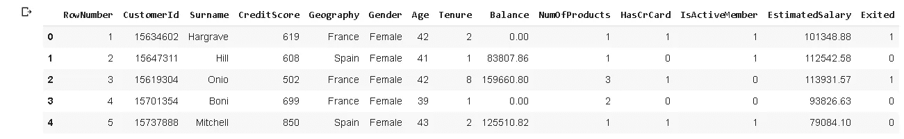

我们有一些关于银行客户及其产品的特征。这里的目标是预测客户是否会使用提供的功能流失(即退出= 1)。

从机器赚的角度来说，这是一个分类问题。Groupby 函数可用于探索特性如何相关或如何对目标变量产生影响(“Exited”)。

下图是 groupby 函数的逻辑和工作原理。


Groupby 函数(图片由作者提供)

让我们从例子开始。

第一个是检查性别对客户流失是否有影响。

```
#example 1
df[['Gender','Exited']].groupby('Gender').mean()
```


我们获取了数据帧的一个子集，它由性别和退出列组成。然后，我们根据性别列中的值(男性和女性)对行进行分组。最后，应用一个集合函数。结果是女性和男性的平均流失率。

除了平均值之外，您可能还想了解数据集中有多少男性和女性。如果存在极端的不平衡，检查平均值可能会导致错误的假设。

解决方案是将 mean 和 count 都用作聚合函数。

```
#example 2
df[['Gender','Exited']].groupby('Gender').agg(['mean','count'])
```

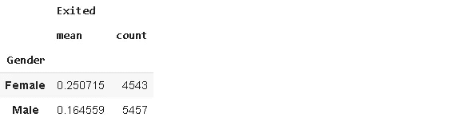

女性和男性的数量接近，所以不存在很大的不平衡。平均而言，女性的流失率高于男性。

你可能会觉得只根据性别来做比较太笼统了。在这种情况下，我们可以通过向 group by 函数传递一个列列表来按多个列进行分组。

```
#example 3
df[['Gender','Geography','Exited']].groupby(['Gender','Geography']).mean()
```

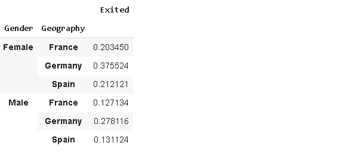

在我们的数据集中，这三个国家的女性流失率较高。

我们也可以对结果进行排序。

```
#example 4
df[['Gender','Geography','Exited']].groupby(['Gender','Geography']).mean().sort_values(by='Exited')
```

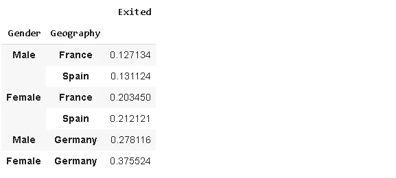

结果按升序排列，但我们可以使用**升序**参数进行更改。

```
#example 5
df[['Gender','Geography','Exited']].groupby(['Gender','Geography']).mean().sort_values(by='Exited', ascending=False)
```

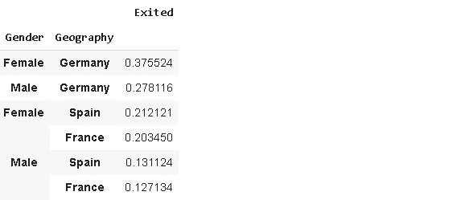

我们还可以基于另一个特征中的组来检查多个特征。让我们来看看不同国家的年龄和任期是如何变化的。

```
#example 6
df[['Geography','Age','Tenure']].groupby(['Geography']).agg(['mean','max'])
```

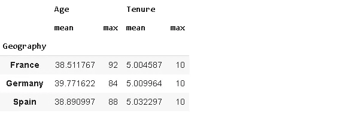

在这三个国家中，年龄和任期列的平均值和最大值非常接近。

让我们也将“Exited”列添加到示例 6 中。

```
#example 7
df[['Exited','Geography','Age','Tenure']].groupby(['Exited','Geography']).agg(['mean','count'])
```

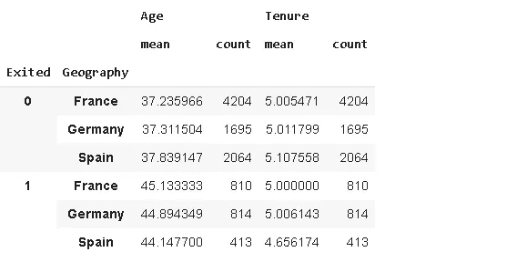

我们可以根据任何列对结果进行排序。但是，由于它是一个多索引，我们需要向 sort_values 函数传递一个元组。

```
#example 8
df[['Exited','Geography','Age','Tenure']].groupby(['Exited','Geography']).agg(['mean','count']).sort_values(by=[('Age','mean')])
```

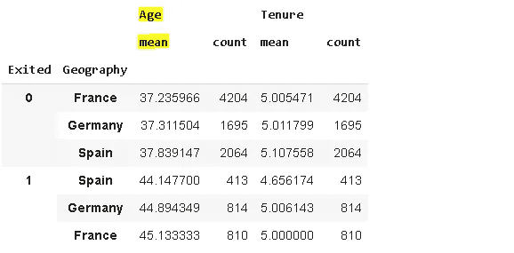

结果按(“年龄”、“平均值”)列排序。

groupby 函数中的变量作为结果数据帧的索引返回。我们可以通过将 **as_index** 参数设置为 false 来改变它。

```
#example 9
df[['Exited','IsActiveMember','NumOfProducts','Balance']].groupby(['Exited','IsActiveMember'], as_index=False).mean()
```

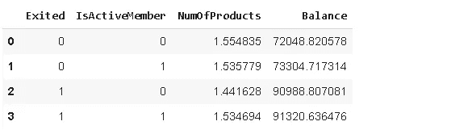

groupby 函数中的每一列都用一个列表示。每个类别组合都有一行。

默认情况下，groupby 函数会删除缺少的值。我们的数据集没有任何缺失值。让我们添加一些缺失的值，看看如何使用 **dropna** 参数。

```
#example 10
df['Geography'][30:50] = np.nandf[['Geography','Exited']].groupby('Geography').mean()
```

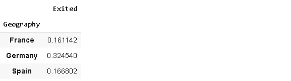

尽管我们在 geography 列中缺少值，但它们被忽略了。我们可以通过将 dropna 参数设置为 false 来更改它。

```
#example 11
df[['Geography','Exited']].groupby('Geography', dropna=False).agg(['mean','count'])
```

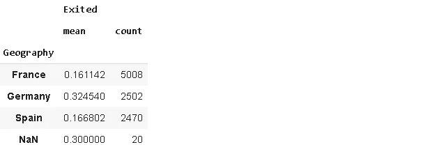

如您所见，还有另一类缺失值。

> **注意**:为了使用 groupby 函数的 dropna 参数，你需要有 pandas 版本 1.1.0 或更高版本。

我们可以多样化的例子，但基本的逻辑是相同的。Groupby 函数可用作探索性数据分析过程的第一步，因为它让我们了解数据集中变量之间的关系。

感谢阅读。如果您有任何反馈，请告诉我。