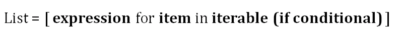
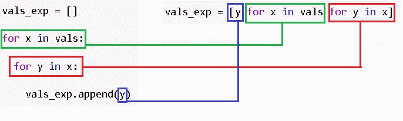
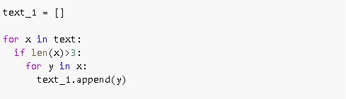
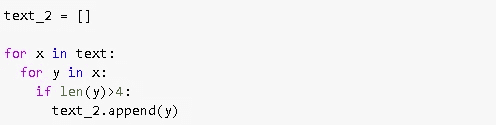
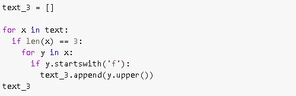

# 掌握 Python 列表理解的 11 个例子

> 原文：<https://towardsdatascience.com/11-examples-to-master-python-list-comprehensions-33c681b56212?source=collection_archive---------7----------------------->

## 如何有效地使用列表理解？


图片由[皮克斯拜](https://pixabay.com/?utm_source=link-attribution&utm_medium=referral&utm_campaign=image&utm_content=2470549)的 Gerd Altmann 提供

**List** 是 Python 中内置的数据结构，方括号中是数据点的集合。列表可用于存储任何数据类型或不同数据类型的混合。

在这篇文章中，我们将通过 11 个例子介绍 python 中的列表理解。我试图根据它们的复杂程度(在我看来)对例子进行排序。

列表理解基本上是基于现有的可重复项创建列表。它还可以被描述为用更简单、更吸引人的语法来表示 for 和 if 循环。列表理解相对来说比循环要快。



Python 列表理解

所以我们迭代一个 iterable 并做一些事情(可选！)，然后将它们放在一个列表中。在某些情况下，我们只取符合特定条件的项目。

让我们从例子开始。

```
#example 1
import numpy as npa = [4,6,7,3,2]b = [x for x in a if x > 5]
b
[6, 7]
```

我们迭代一个列表(iterable)并获取大于 5 的元素(condition)。

for 循环的等价形式是:

```
b = []
for x in a:
  if x > 5:
    b.append(x)
b
[6, 7]
```

在将项目放入新列表之前，我们还可以对其进行一些处理:

```
#example 2
import numpy as npa = [4,6,7,3,2]b = [x*2 for x in a if x > 5]
b
[12, 14]
```

我们将符合条件的项目乘以 2，然后放入一个列表中。

第三个示例是字符串列表:

```
#example 3
names = ['Ch','Dh','Eh','cb','Tb','Td']new_names = [name for name in names if name.lower().startswith('c')]new_names
['Ch', 'cb']
```

条件是 string 以字母“c”开头。因为我们既有大写字母也有小写字母，所以我们首先将所有字母转换成小写字母。

iterable 不一定是列表。它可以是任何 python 可迭代的。例如，我们可以迭代一个二维 NumPy 数组，它实际上是一个矩阵。

```
#example 4
import numpy as np
A = np.random.randint(10, size=(4,4))
A
array([[1, 7, 4, 4],        
       [5, 0, 0, 6],        
       [7, 5, 8, 4],        
       [1, 3, 2, 2]])max_element = [max(i) for i in A]
max_element
[7, 6, 8, 3]
```

我们迭代矩阵 A 中的行并取最大值。

列表可以存储任何数据类型。我们来做一个列表列表的例子。

```
#example 5
vals = [[1,2,3],[4,5,2],[3,2,6]]
vals_max = [max(x) for x in vals]
vals_max
[3, 5, 6]
```

我们在每个列表中创建一个最大值列表。

在列表理解中，我们可以有多个条件。

```
#example 6
names = ['Ch','Dh','Eh','cb','Tb','Td','Chb','Tdb']new_names = [name for name in names if 
name.lower().endswith('b') and len(name) > 2]new_names
['Chb', 'Tdb']
```

我们得到以字母“b”结尾并且长度大于 2 的字符串。

我们可以用其他逻辑运算符组合多个条件:

```
#example 7
names = ['chb', 'ydb', 'thd', 'hgh']new_names = [name for name in names 
if name.endswith('b') | name.startswith('c')]new_names
['chb', 'ydb']
```

我们也可以有更复杂一点的嵌套列表理解。它们表示嵌套的 for 循环。

考虑下面的列表列表:

```
vals = [[1,2,3],[4,5,2],[3,2,6]]
```

我们希望从嵌套列表中取出每个元素，因此期望的输出是:

```
vals = [1,2,3,4,5,2,3,2,6]
```

下面是执行此操作的嵌套列表理解:

```
#example 8
vals = [[1,2,3],[4,5,2],[3,2,6]]vals_exp = [y for x in vals for y in x]vals_exp
[1, 2, 3, 4, 5, 2, 3, 2, 6]
```

语法可能看起来不太直观。与等效的 for 循环相比，这一点就很清楚了。



对于循环和列表理解(图片由作者提供)

我们将嵌套 for 循环的块放入一个列表理解中。

**注**:例 7 中有一个更简单的操作方法，就是熊猫的爆炸功能。我使用列表理解只是为了显示结构。可以使用分解功能完成，如下所示:

```
pd.Series(vals).explode()
```

它返回一个熊猫系列，但是你可以很容易地把它转换成一个列表。

我们也可以在嵌套列表理解中添加条件。考虑下面的字符串列表。

```
text = [['bar','foo','fooba'],['Rome','Madrid','Houston'], ['aa','bb','cc','dd']]
```

我们只需要长度大于 3 的嵌套列表中的字符串。

```
#example 9
text_1 = [y for x in text if len(x)>3 for y in x]text_1
['aa', 'bb', 'cc', 'dd']
```

我们将条件放在嵌套列表上，而不是放在单个元素上。因此，等效的嵌套 for/if 循环语法如下。



我们也可以对单个元素设置条件。

```
#example 10
text_2 = [y for x in text for y in x if len(y)>4]text_2
['fooba', 'Madrid', 'Houston']
```

我们现在有超过 4 个字符的字符串。因为条件是在单个元素上，所以等价的嵌套 for/if 循环:



我们可能还需要在嵌套列表和单个项目上设置条件。

```
#example 11
text_3 = [y.upper() for x in text if len(x) == 3 for y in x if y.startswith('f')]text_3
['FOO', 'FOOBA']
```

我们在长度为 3 的嵌套列表中获取以字母“f”开头的项目，然后将所选项目的所有字母转换为大写。

等效的 for/if 循环:



**提示:**当你不确定并且找不到理解列表的语法时，试着用 for/if 循环来构建。然后，你可以通过在列表理解中添加单独的循环块，将其转换为列表理解。

# 额外收获:何时不使用列表理解

列表理解将整个输出列表加载到内存中。这对于小型或中型的列表来说是可以接受的，甚至是可取的，因为它使操作更快。然而，当我们处理大型列表(例如 10 亿个元素)时，应该避免理解列表。这可能会导致您的计算机崩溃，由于内存需求的极端数额。

对于这种大型列表，更好的替代方法是使用一个**生成器**，它实际上不会在内存中创建大型数据结构。生成器在使用项目时创建项目。物品用完后，生成者会将它们扔掉。使用生成器，我们可以请求 iterable 中的下一项，直到到达末尾，每次存储一个值。

感谢您的阅读。如果您有任何反馈，请告诉我。