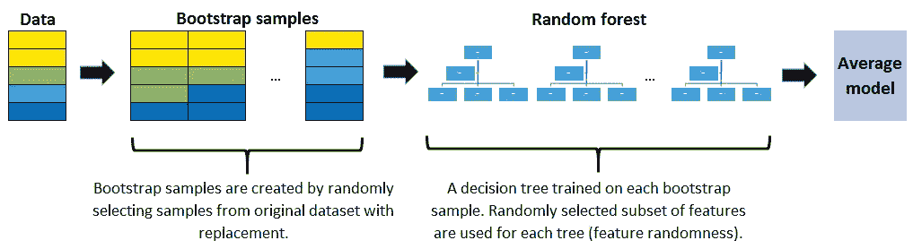

# 简单解释 11 种最常见的机器学习算法

> 原文：<https://towardsdatascience.com/11-most-common-machine-learning-algorithms-explained-in-a-nutshell-cc6e98df93be?source=collection_archive---------1----------------------->

## 常用机器学习算法综述。

圣地亚哥·拉卡尔塔在 [Unsplash](https://unsplash.com/s/photos/common?utm_source=unsplash&utm_medium=referral&utm_content=creditCopyText) 上拍摄的照片

近年来，由于高需求和技术进步，机器学习的流行程度已经大大增加。机器学习从数据中创造价值的潜力使其对许多不同行业的企业具有吸引力。大多数机器学习产品都是用现成的机器学习算法设计和实现的，只做了一些调整和微小的更改。

有各种各样的机器学习算法，可以分为三个主要类别:

*   **监督学习**算法在给定一组观察值的情况下，对特征(独立变量)和标签(目标)之间的关系进行建模。然后，该模型被用于使用这些特征来预测新观察的标签。根据目标变量的特性，可以是**分类**(离散目标变量)或**回归**(连续目标变量)任务。
*   **无监督学习**算法试图在无标签数据中找到结构。
*   **强化学习**基于行动奖励原则工作。一个**代理**通过迭代计算其行动的**回报**来学习达到一个目标。

在这篇文章中，我将讨论前两类中最常见的算法。

**注**:虽然深度学习是机器学习的一个子领域，但我不会在本帖中包含任何深度学习算法。我认为深度学习算法由于复杂性和具有明显的动态性，应该单独讨论。此外，我不想把这篇文章写得太长，让读者感到厌烦。

我们开始吧。

# **1。线性回归**

线性回归是一种**监督的**学习算法，它试图通过将线性方程拟合到数据上来模拟**连续**目标变量和一个或多个独立变量之间的关系。

线性回归是一个好的选择，自变量和目标变量之间需要有线性关系。有许多工具可以探索变量之间的关系，如散点图和相关矩阵。例如，下面的散点图显示了自变量(x 轴)和因变量(y 轴)之间的正相关关系。一个增加，另一个也增加。

线性回归模型试图将回归线拟合到最能代表关系或相关性的数据点。最常用的技术是**普通最小二乘法** (OLE)。使用这种方法，通过最小化数据点和回归线之间距离的平方和来找到最佳回归线。对于上面的数据点，使用 OLE 获得的回归线看起来像:

# 2.支持向量机

支持向量机(SVM)是一种**监督的**学习算法，主要用于分类任务，但也适用于回归任务。

SVM 通过画一个**决定边界来区分阶级。**如何绘制或确定决策边界是 SVM 算法中最关键的部分。在创建决策边界之前，在 n 维空间中绘制每个观察值(或数据点)。“n”是使用的特征数量。例如，如果我们使用“长度”和“宽度”来对不同的“细胞”进行分类，则观察值被绘制在二维空间中，而决策边界是一条线。如果我们使用 3 个特征，则判定边界是三维空间中的平面。如果我们使用 3 个以上的特征，决策边界就变成了一个超平面，很难可视化。

2D 空间中的决策边界是一条线

以到支持向量的距离最大化的方式绘制决策边界。如果决策边界离支持向量太近，会对噪声高度敏感，不能很好地泛化。即使独立变量非常小的变化也可能导致错误分类。

数据点并不总是线性可分的，如上图所示。在这些情况下，SVM 使用**核技巧**，它测量高维空间中数据点的相似性(或接近度)以使它们线性可分。

核函数是一种相似性度量。输入是原始特征，输出是新特征空间中的相似性度量。这里的相似性是指接近的程度。将数据点实际转换到高维特征空间是一个代价很高的操作。该算法实际上并不将数据点转换到新的高维特征空间。内核化 SVM 根据高维特征空间中的相似性度量来计算决策边界，而不实际进行变换。我想这也是为什么又叫**内核绝招**的原因吧。

SVM 在维数大于样本数的情况下特别有效。当寻找决策边界时，SVM 使用训练点的子集，而不是所有点，这使得它的记忆效率。另一方面，对于大型数据集，训练时间会增加，这会对性能产生负面影响。

# **3。朴素贝叶斯**

朴素贝叶斯是一种用于分类任务的**监督**学习算法。因此，它也被称为朴素贝叶斯分类器。

朴素贝叶斯假设**特征相互独立**和**特征**之间没有相关性。然而，现实生活中并非如此。这种特征不相关的天真假设是这种算法被称为“天真”的原因。

朴素贝叶斯算法背后的直觉是贝叶斯定理:

p(A|B):给定事件 B 已经发生的概率

p(B|A):给定事件 A 已经发生，事件 B 发生的概率

p(A):事件 A 的概率

p(B):事件 B 的概率

朴素贝叶斯分类器计算给定一组特征值(即 p(yi | x1，x2，…，xn))的类的概率。把这个输入到贝叶斯定理中:

**p(x1，x2，…，xn | yi)** 表示给定类别标签的特定特征组合(数据集中的一个观察值/行)的概率。我们需要非常大的数据集来估计所有不同特征值组合的概率分布。为了克服这个问题，**朴素贝叶斯算法假设所有特征都是相互独立的。**此外，分母(p(x1，x2，…，xn))可以被移除以简化方程，因为它仅归一化给定观察值的类的条件概率的值(p(yi | x1，x2，…，xn))。

一个类的概率(p(yi))很容易计算:

在特征相互独立的假设下， **p(x1，x2，…，xn | yi)** 可以写成 **:**

给定类标签(即 p(x1 | yi))的单个特征的条件概率可以更容易地从数据中估计出来。该算法需要独立地存储每个类别的特征的概率分布。例如，如果有 5 个类别和 10 个特征，则需要存储 50 个不同的概率分布。

将所有这些加起来，对于朴素贝叶斯算法来说，计算观察一类给定值的特征的概率( **p(yi | x1，x2，…，xn) )** 变得很容易

所有特征都是独立的假设使得朴素贝叶斯算法**比复杂算法**更快。在某些情况下，速度优先于更高的精度。另一方面，相同的假设使得朴素贝叶斯算法不如复杂算法准确。速度是有代价的！

# **4。逻辑回归**

逻辑回归是一种**监督**学习算法，主要用于**二元** **分类**问题。虽然“回归”与“分类”相矛盾，但这里的重点是“逻辑”一词，指的是在该算法中执行分类任务的逻辑函数**。逻辑回归是一种简单但非常有效的分类算法，因此它通常用于许多二元分类任务。客户流失、垃圾邮件、网站或广告点击预测是逻辑回归提供强大解决方案的一些领域的例子。**

逻辑回归的基础是逻辑函数，也称为 sigmoid 函数，它接受任何实数值并将其映射到 0 到 1 之间的值。

假设我们要求解以下线性方程:

逻辑回归模型将线性方程作为输入，并使用逻辑函数和对数比值来执行二元分类任务。然后，我们会得到著名的逻辑回归 s 形图:

我们可以“原样”使用计算出的概率。例如，输出可以是“此电子邮件是垃圾邮件的概率是 95%”或“客户点击此广告的概率是 70%”。然而，在大多数情况下，概率被用来分类数据点。例如，如果概率大于 50%，则预测为正类(1)。否则，预测为负类(0)。

并不总是希望为所有高于 50%的概率值选择正类。关于垃圾邮件的情况，为了将一封邮件归类为垃圾邮件，我们必须几乎确定。由于被检测为垃圾邮件的电子邮件会直接进入垃圾邮件文件夹，我们不希望用户错过重要的电子邮件。除非我们几乎确定，否则电子邮件不会被归类为垃圾邮件。另一方面，当健康相关问题的分类需要我们更加敏感时。即使我们有点怀疑一个细胞是恶性的，我们也不想错过它。因此，作为正类和负类之间的阈值的值取决于问题。好的一面是，逻辑回归允许我们调整这个阈值。

# 5.k 最近邻(kNN)

k-最近邻(kNN)是一种**监督的**学习算法，可用于解决分类和回归任务。kNN 背后的主要思想是，数据点的值或类是由其周围的数据点决定的。

kNN 分类器通过多数表决原则确定数据点的类别。例如，如果 k 设置为 5，则检查 5 个最近点的类。根据多数类进行预测。类似地，kNN 回归取 5 个最近点的平均值。让我们看一个例子。考虑以下属于 4 个不同类别的数据点:

让我们看看预测类如何根据 k 值变化:

确定最佳 k 值是非常重要的。如果 k 太低，模型太具体，不能很好地概括。它对噪音也很敏感。该模型在训练集上实现了高精度，但是在新的、以前看不到的数据点上将是差的预测器。因此，我们很可能以一个过度拟合的模型而告终。另一方面，如果 k 太大，则该模型太一般化，并且在训练集和测试集上都不是好的预测器。这种情况被称为欠适配。

kNN 简单且易于解释。它不做任何假设，因此可以在非线性任务中实现。随着数据点数量的增加，kNN 变得非常慢，因为模型需要存储所有的数据点。因此，它也不是内存高效的。kNN 的另一个缺点是它对异常值很敏感。

# 6.决策树

决策树建立在反复询问问题以划分数据的基础上。用决策树的可视化表示来概念化分区数据更容易:

这代表了预测客户流失的决策树。第一次拆分基于每月费用金额。然后算法不断提问分离类标签。随着树越来越深，问题也越来越具体。

决策树算法的目标是在每次分区时尽可能提高预测性，以便模型不断获得有关数据集的信息。随机分割要素通常不会让我们对数据集有有价值的了解。增加节点纯度的分割更能提供信息。节点的纯度与该节点中不同类的分布成反比。要问的问题是以增加纯度或减少杂质的方式选择的。

我们要问多少问题？我们什么时候停止？什么时候我们的树足以解决我们的分类问题？所有这些问题的答案将我们引向机器学习中最重要的概念之一:**过拟合**。模型可以一直提问，直到所有节点都是纯的。然而，这将是一个过于具体的模型，不能很好地概括。它在训练集上实现了高精度，但在新的、以前看不到的数据点上表现不佳，这表明过拟合。树的深度由 scikit-learn 中决策树算法的 **max_depth** 参数控制。

决策树算法通常不需要归一化或缩放特征。它也适用于处理混合的要素数据类型(连续、分类、二进制)。消极的一面是，它容易过度拟合，需要集合才能很好地概括。

# 6.随机森林

随机森林是许多决策树的集合。随机森林是用一种叫做**装袋**的方法建立的，在这种方法中，决策树被用作并行估计器。如果用于分类问题，结果基于从每个决策树接收的结果的多数投票。对于回归，叶节点的预测是该叶中目标值的平均值。随机森林回归取决策树结果的平均值。

随机森林降低了过度拟合的风险，并且准确性比单个决策树高得多。此外，随机森林中的决策树并行运行，因此时间不会成为瓶颈。

随机森林的成功高度依赖于使用不相关的决策树。如果我们使用相同或非常相似的树，总体结果将不会比单个决策树的结果有太大的不同。随机森林通过**自举**和**特征随机性**实现不相关的决策树。

**bootstrapping**是从带有替换的训练数据中随机选择样本。它们被称为 bootstrap 样本。

自举样本([图源](https://www.researchgate.net/figure/An-example-of-bootstrap-sampling-Since-objects-are-subsampled-with-replacement-some_fig2_322179244))

**特征随机性**通过为随机森林中的每个决策树随机选择特征来实现。随机森林中每棵树使用的特征数量可以通过 **max_features** 参数控制。

特征随机性

随机森林是许多不同问题的高度精确的模型，不需要标准化或缩放。但是，与快速线性模型(即朴素贝叶斯)相比，它不是高维数据集(即文本分类)的好选择。

# 7.梯度推进决策树(GBDT)

**GBDT** 是一种集成算法，使用 **boosting** 方法来组合个体决策树。

Boosting 是指将一个学习算法串联起来，从许多顺序连接的弱学习器中实现一个强学习器。在 GBDT 的例子中，弱学习器是决策树。

每棵树都试图最小化前一棵树的错误。boosting 中的树是弱学习器，但是连续添加许多树，并且每个树集中于前一个树的错误，使得 boosting 成为高效且准确的模型。与装袋不同，增压不涉及自举取样。每次添加新树时，它都适合初始数据集的修改版本。

由于树是按顺序添加的，boosting 算法学习起来很慢。在统计学习中，学习速度慢的模型表现更好。

损失函数用于检测残差。例如，均方误差(MSE)可用于回归任务，对数损失(log loss)可用于分类任务。值得注意的是，当添加新的树时，模型中现有的树不会改变。添加的决策树符合当前模型的残差。

**学习率**和 **n_estimators** 是梯度推进决策树的两个关键超参数。学习率，表示为α，简单地表示模型学习的速度。每个新的树修改整个模型。修改的幅度由学习速率控制。 **n_estimator** 是模型中使用的树的数量。如果学习率低，我们需要更多的树来训练模型。然而，我们需要非常小心地选择树的数量。使用太多的树会产生过度适应的高风险。

与随机森林相比，GBDT 在分类和回归任务上都非常高效，并且提供了更准确的预测。它可以处理混合类型的特征，并且不需要预处理。GBDT 要求仔细调整超参数，以防止模型过度拟合。

GBDT 算法非常强大，已经实现了许多升级版本，如 XGBOOST、LightGBM、CatBoost。

**关于过度配合的注意事项**

随机森林和梯度推进决策树之间的一个关键区别是模型中使用的树的数量。增加随机森林中的树木数量不会导致过度拟合。在某个点之后，模型的准确性不会因为添加更多的树而增加，但是也不会因为添加过多的树而受到负面影响。由于计算原因，您仍然不希望添加不必要数量的树，但是没有与随机森林中的树的数量相关联的过度拟合的风险。

然而，梯度提升决策树中的树的数量在过度拟合方面非常关键。添加太多的树会导致过度拟合，所以在某个时候停止添加树是很重要的。

# **8。k-均值聚类**

聚类是一种对一组数据点进行分组的方法，将相似的数据点分组在一起。因此，聚类算法寻找数据点之间的相似或相异之处。聚类是一种无监督的学习方法，因此没有与数据点相关联的标签。聚类算法试图找到数据的底层结构。

> *聚类不是分类。*

分类任务中的观察值(或数据点)有标签。根据一些测量值对每个观察值进行分类。分类算法试图对观测值的测量值(特征)和它们的指定类别之间的关系进行建模。然后，模型预测新观察的类别。

**K 均值聚类**旨在将数据划分为 K 个聚类，使得同一聚类中的数据点相似，而不同聚类中的数据点相距较远。因此，它是一种基于**划分的**聚类技术。两点的相似性由它们之间的距离决定。

K-means 聚类试图最小化一个类内的距离，最大化不同类之间的距离。K-means 算法不能确定聚类数。我们需要在创建 KMeans 对象时定义它，这可能是一项具有挑战性的任务。

考虑以下数据集的 2D 可视化:

它可以分为以下 4 个不同的集群:

现实生活中的数据集要复杂得多，其中的聚类没有明显的区分。但是，算法的工作方式是一样的。K-means 是一个迭代过程。它基于[期望最大化](https://en.wikipedia.org/wiki/Expectation%E2%80%93maximization_algorithm)算法。确定集群数量后，它通过执行以下步骤来工作:

1.  为每个簇随机选择质心(簇的中心)。
2.  计算所有数据点到质心的距离。
3.  将数据点分配给最近的聚类。
4.  通过取聚类中所有数据点的平均值，找到每个聚类的新质心。
5.  重复步骤 2、3 和 4，直到所有点收敛并且聚类中心停止移动。

K-Means 聚类相对较快且易于解释。它还能够以一种智能的方式选择初始质心的位置，从而加快收敛速度。

k-means 的一个挑战是必须预先确定聚类的数量。K-means 算法无法猜测数据中存在多少个聚类。如果数据中存在非线性结构来分隔组，k-means 将不是一个好的选择。

# **9。层次聚类**

分层聚类意味着通过迭代分组或分离数据点来创建聚类树。有两种类型的分层聚类:

*   凝聚聚类
*   分裂聚类

> 分层聚类的优点之一是我们不必指定聚类的数量(但是我们可以)。

聚集聚类是一种自下而上的方法。每个数据点首先被假定为一个单独的聚类。然后迭代地组合相似的聚类。

上图称为**树状图**，这是一个表示基于树的方法的图表。在层次聚类中，树状图用于可视化聚类之间的关系。

层次聚类的优点之一是我们不必预先指定聚类的数量。但是，将所有数据点合并到一个聚类中是不明智的。我们应该在某个时候停止组合集群。Scikit-learn 为此提供了两个选项:

*   达到一定数量的簇后停止( **n_clusters** )
*   设置联动的阈值(**距离 _ 阈值**)。如果两个聚类之间的距离超过阈值，这些聚类将不会被合并。

分裂聚类在现实生活中并不常用，所以我将简单地提到它。简单而清晰的解释是**分裂集群**是凝聚集群的反义词。我们从一个包含所有数据点的巨大集群开始。然后数据点被分成不同的簇。这是一种自上而下的方法。

分层聚类总是生成相同的聚类。k-均值聚类可能会产生不同的聚类，这取决于质心(聚类的中心)是如何开始的。然而，与 k-means 相比，它是一种较慢的算法。分层聚类需要很长时间来运行，尤其是对于大型数据集。

# **10。数据库扫描聚类**

基于分区和层次聚类技术对于正常形状的聚类非常有效。然而，当涉及到任意形状的聚类或检测异常值时，基于密度的技术更有效。

任意形状的簇

任意形状的簇

DBSCAN 代表**d**en sity-**b**as**s**s**c**lustering of**a**应用与 **n** oise。它能够找到任意形状的聚类和带有噪声的聚类(即异常值)。

DBSCAN 背后的主要思想是，如果一个点靠近来自该簇的许多点，则该点属于该簇。

DBSCAN 有两个关键参数:

*   **eps** :指定邻域的距离。如果两点之间的距离小于或等于 eps，则认为这两点是相邻的。
*   **minPts:** 定义一个聚类的最小数据点数。

基于这两个参数，点被分类为核心点、边界点或异常点:

*   **核心点:**如果一个点在其半径为 eps 的周围区域内至少有 minPts 个数的点(包括该点本身)，则该点为核心点。
*   **边界点:**如果一个点可以从一个核心点到达，并且其周围区域内的点数少于 minPts，那么这个点就是边界点。
*   离群点:如果一个点不是核心点，并且从任何核心点都不可达，那么这个点就是离群点。

DBSCAN 不需要预先指定簇的数量。它对异常值是鲁棒的，并且能够检测异常值。

在某些情况下，确定适当的邻域距离(eps)并不容易，这需要领域知识。

# 11。主成分分析

PCA 是一种降维算法，它基本上从现有的特征中获得新的特征，同时尽可能多地保留信息。PCA 是一种非监督学习算法，但它也广泛用作监督学习算法的预处理步骤。

PCA 通过查找数据集中要素之间的关系来获取新要素。

> **注** : PCA 是一种线性降维算法。也有非线性方法可用。

PCA 的目的是通过使用较少的特征(或列)尽可能多地解释原始数据集中的差异。新的衍生特征称为**主成分。**主成分的顺序是根据它们所解释的原始数据集的方差分数来确定的。

> 主成分是原始数据集特征的线性组合。

PCA 的优点是使用比原始数据集少得多的特征保留了原始数据集的大量差异。主成分是根据它们解释的方差大小排序的。

感谢您的阅读。如果您有任何反馈，请告诉我。