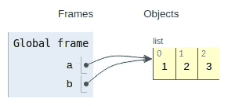
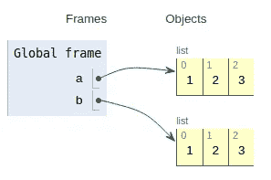
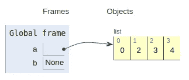
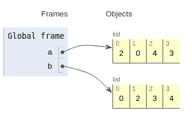
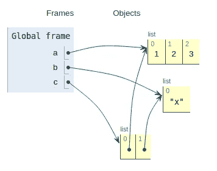
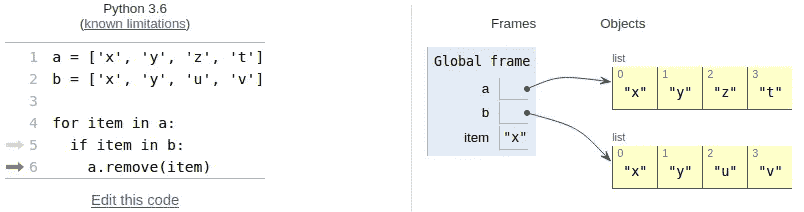
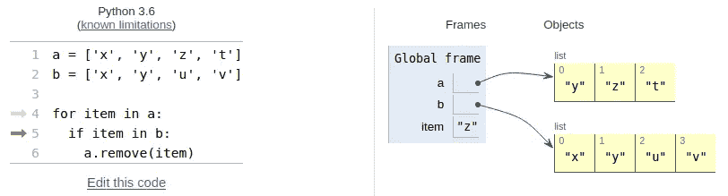
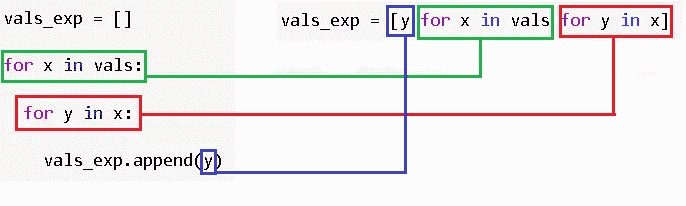
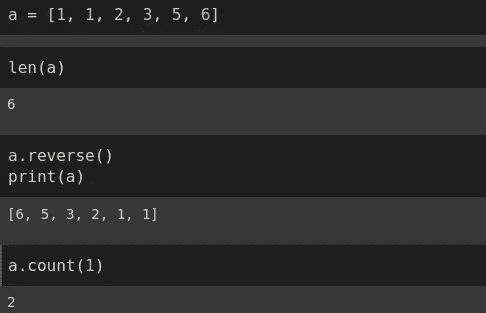

# 掌握 Python 列表的 11 个必知操作

> 原文：<https://towardsdatascience.com/11-must-know-operations-to-master-python-lists-f03c71b6bbb6?source=collection_archive---------18----------------------->

## 附有示例的综合实践指南。


照片由[恒电影](https://unsplash.com/@hengfilms?utm_source=unsplash&utm_medium=referral&utm_content=creditCopyText)在 [Unsplash](https://unsplash.com/@hengfilms?utm_source=unsplash&utm_medium=referral&utm_content=creditCopyText) 拍摄

**List** 是 Python 中内置的数据结构。它表示为方括号中的数据点集合。列表可用于存储任何数据类型或不同数据类型的混合。

列表是可变的，这也是它们被广泛使用的原因之一。然而，在某些情况下，可变性需要格外小心。

在本帖中，我们将介绍 11 个非常重要的操作，几乎涵盖了你需要了解的关于 Python 列表的所有内容。

## 1.从列表中删除元素的三种方法

第一种方法是 del 函数。我们刚刚经过了要删除的元素的索引。

```
a = [1, 2, 'x', 4, 5]
del(a[0])
print(f'a is {a}')a is [2, 'x', 4, 5]
```

我们可以使用 remove 函数来查找要删除的值。

```
a = [1, 2, 'x', 4, 5]
a.remove('x')
print(f'a is {a}')a is [1, 2, 4, 5]
```

第三种方法是 pop 函数，默认情况下它删除列表的最后一个元素。与其他两个函数不同，pop 返回被删除的值。因此，我们可以选择将它赋给不同的变量。

```
a = [1, 2, 'x', 4, 5]
b = a.pop()
print(f'a is {a}')
print(f'b is {b}')a is [1, 2, 'x', 4]
b is 5
```

**Edit** : Pop 常用于弹出(或移除)列表的最后一个元素。但是，它也可以通过提供索引来删除任何元素。感谢 Keethesh 在评论中的提醒。

```
a.pop(-1) #removes the last element
a.pop(2) #removes the third element
```

**注意**:列表有两种索引方式:

*   从开始到结束:0，1，2，3
*   从结束到开始:-1，-2，-3

```
a = ['x','y','z','t','u','v']print(a[-1])
vprint(a[2])
z
```

## 2.追加 vs 扩展 vs 插入

Append 用于将项目添加到列表中。

```
a = [1, 2]
a.append(3)
a
[1, 2, 3]
```

无论你在列表中添加什么，它都将成为列表中的一项。

```
a = [1, 2]
b = [3, 4, 5]
a.append(b)
a
[1, 2, [3, 4, 5]]
```

列表 b 成为列表 a 的第三个项目。如果您想要创建一个列表，该列表是 a 和 b 中的项目的组合([1，2，3，4，5])，您需要使用 extend 函数或“+”运算符。

```
a = [1, 2]
b = [3, 4, 5]a.extend(b)
a
[1, 2, 3, 4, 5] # a + b will give the same result 
```

insert 函数也用于向列表中添加元素。但是，它允许指定新元素的索引。例如，我们可以在列表的开头添加一个新元素(index=0)。

```
a = [1, 2, 3, 4, 5]
a.insert(0, 'a')
a
['a', 1, 2, 3, 4, 5]
```

第一个参数是索引，第二个参数是值。

## 3.通过“=”复制列表

我们可以复制一个列表并创建一个新的变量。

```
a = [1, 2, 3]
b = a
```



创建于 [pythontutor](http://pythontutor.com/) (图片由作者提供)

然而，新变量“b”只是指向“a”的值的指针。因此，a 的任何变化也会改变 b。让我们通过给 a 加一个值来确认。

```
a.append(4)
print(f'a is {a}')
print(f'b is {b}')a is [1, 2, 3, 4]
b is [1, 2, 3, 4]
```

## 4.使用索引复制列表

我们可以通过选择列表的所有索引来复制列表。

```
a = [1, 2, 3]
b = a[:]
```



创建于 [pythontutor](http://pythontutor.com/) (图片由作者提供)

新列表 b 包含与 a 相同的值，但是在不同的存储位置。如果我们改变 a，b 不会受到影响。

```
a.append(4)
print(f'a is {a}')
print(f'b is {b}')a is [1, 2, 3, 4]
b is [1, 2, 3]
```

使用 copy 函数复制列表的工作原理与复制索引相同。

```
a = [1, 2, 3]
b = a.copy()
a.append(4)print(f'a is {a}')
print(f'b is {b}')
a is [1, 2, 3, 4]
b is [1, 2, 3]
```

## 5.使用 sort()和 sorted()对列表进行排序

sort 和 sorted 函数都可以用来对列表进行排序:

*   sort():对列表进行排序，但不返回任何内容。
*   sorted():返回列表的排序副本，但不对原始列表进行排序。

```
a = [2, 0, 4, 3]
b = a.sort()
print(f'a is {a}')
print(f'b is {b}')a is [0, 2, 3, 4]
b is None
```



创建于 [pythontutor](http://pythontutor.com/) (图片由作者提供)

让我们用排序函数做同样的例子。

```
a = [2, 0, 4, 3]
b = sorted(a)
print(f'a is {a}')
print(f'b is {b}')a is [2, 0, 4, 3]
b is [0, 2, 3, 4]
```



创建于 [pythontutor](http://pythontutor.com/) (图片由作者提供)

## 6.通过复制创建嵌套列表

当通过复制创建嵌套列表时，我们需要小心修改。原始列表中的任何更改都会更改复制的列表。

```
a = [1, 2]
b = [4, 5, 6]
c = [a, b]a.append(3)
b.pop()
```

列表 c 由列表 a 和 b 组成。我们通过添加和删除一个元素更新了列表 a 和 b。结果，列表 c 也被更新。

```
print(f'a is {a}')
print(f'b is {b}')
print(f'c is {c}')a is [1, 2, 3]
b is [4, 5]
c is [[1, 2, 3], [4, 5]]
```



创建于 [pythontutor](http://pythontutor.com/) (图片由作者提供)

## 7.在迭代过程中修改列表

列表是可迭代的对象，所以在循环中使用它们是很常见的。迭代是基于索引的，所以如果我们在迭代时更新列表，我们需要小心。

考虑下面的代码。如果项目也在列表 b 中，则它从列表 a 中移除项目。

```
a = ['x', 'y', 'z', 't']
b = ['x', 'y', 'u', 'v']for item in a:
   if item in b:
      a.remove(item)
```

当代码被执行时，我们期望列表 a 变成['z '，' t']。让我们看看实际发生了什么。

```
print(f'a is {a}')
print(f'b is {b}')a is ['y', 'z', 't']
b is ['x', 'y', 'u', 'v']
```

虽然' y '存在于列表 b 中，但它仍然在列表 a 中。原因是当第一个项目(' x ')从列表 a 中移除时，索引也会更新。下一项 a[1]变成了‘z ’,但它应该是‘y’。因此，for 循环每隔一项进行比较。

下面是从列表 a 中删除第一项的步骤:



创建于 [pythontutor](http://pythontutor.com/) (图片由作者提供)

这是下一个比较的项目。如你所见，它是“z ”,所以“y”永远不会被比较。



创建于 [pythontutor](http://pythontutor.com/) (图片由作者提供)

## 8.列出理解

列表理解基本上是基于现有的可重复项创建列表。它以更快的方式实现了 for 循环所能实现的功能。列表理解的语法也比 for 循环的语法更简单、更吸引人。


列表理解的语法(图片由作者提供)

我们来做一个简单的例子。

```
a = [1, 2, 4, 5, 7, 9, 11]
b = [x for x in a if x % 2 == 0]print(b)
[2,4]
```

列表 b 仅包含列表 a 的偶数元素。使用 for 循环可以完成相同的操作，如下所示:

```
for item in a:
   if item % 2 == 0:
      b.append(item)
```

如你所见，列表理解更简单。

> **注意** : List comprehension 将整个输出列表加载到内存中，这比 for 循环更快。在处理小型或中型列表时，最好使用列表理解。然而，当我们处理大型列表(例如 10 亿个元素)时，应该避免理解列表。这可能会导致您的计算机崩溃，由于内存需求的极端数额。

## 9.列出修改元素的理解

我们还可以对列表理解中的每一项进行操作。考虑下面的列表 a:

```
a = ['john', 'emily', 'julia']
```

我们想要创建一个列表 b，其中包含以字母“j”开头的名字。我们还想大写的名字。

```
b = [item.capitalize() for item in a if item.startswith('j')]print(b)
['John', 'Julia']
```

## 10.嵌套列表上的列表理解

我们可以在列表理解中迭代嵌套列表。考虑下面的列表列表:

```
vals = [[1,2,3],[4,5,2],[3,2,6]]
```

我们希望从嵌套列表中取出每个元素，因此期望的输出是:

```
vals_exp = [1,2,3,4,5,2,3,2,6]
```

以下是完成这项任务的理解列表:

```
vals_exp = [y for x in vals for y in x]
vals_exp
[1,2,3,4,5,2,3,2,6]
```

如果你对语法不清楚，先用 for 循环试试。然后，您可以将 for 循环块移动到列表理解中。下图将帮助你理解我的意思:



对于循环和列表理解(图片由作者提供)

## 11.Len、reverse 和 count

这些都是非常简单却非常有用的操作。

*   len:返回列表的长度(项目数)
*   反转:反转列表中项目的顺序
*   count:统计特定项目在列表中出现的次数



(图片由作者提供)

## 奖金

在例 10 中有一个更简单的方法来完成这个任务。这涉及到熊猫的爆炸功能。

我们需要将嵌套列表(val)转换为 Pandas 系列，然后应用 explode 函数。为了将它转换回列表，我们可以使用 list 函数。

```
import pandas as pd
list(pd.Series(vals).explode())[1, 2, 3, 4, 5, 2, 3, 2, 6]
```

感谢您的阅读。如果您有任何反馈，请告诉我。