# 从图像处理开始的 11 个步骤

> 原文：<https://towardsdatascience.com/11-steps-to-start-with-image-processing-9f88f16b170c?source=collection_archive---------18----------------------->

## OpenCV 和 Python:超级流行的图像处理库的基础

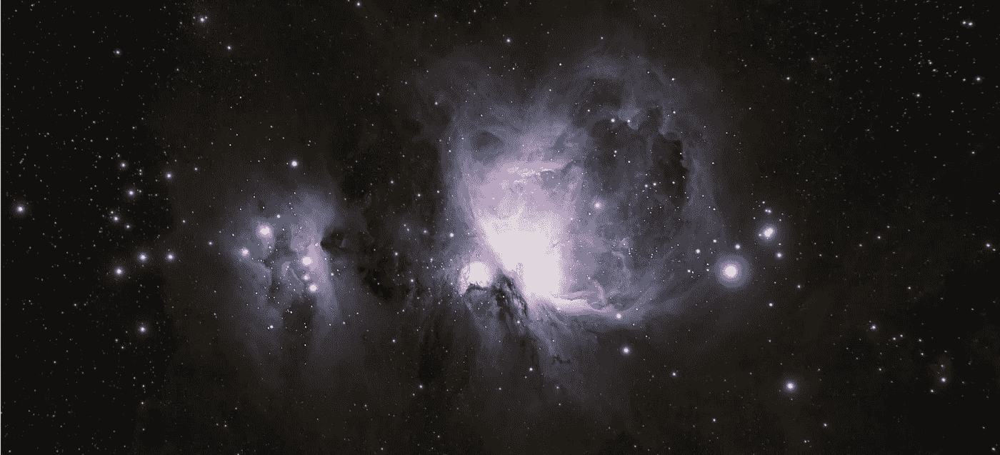

*猎户座星云(又名 M42)* 由作者拍摄*。【天竺葵】*

*Python 现在是世界上用于任何目的的最广泛使用的编程语言之一。与此同时，图像已经成为大多数深度学习算法的基础，用于与自动驾驶、地球观测或人脸检测等相关的显然遥远的任务。*

***OpenCV*** 是用 C++编写的多平台库，为 ***处理图像*** 而生。你可以用它做 ***几乎所有的*** :从 ***蒙版*** 到 ***人脸检测*** 。

幸运的是，有 ***API*** 比允许你用 C、Java，当然还有 ***Python*** 。

在本文中，我们将通过 ***10*** ***的步骤来学习成像的基础知识*** 。

# 0.安装 OpenCV

要安装***OpenCV Python 3 API***我们可以简单地使用 ***pip*** 。所以在 ***命令行*** 或 ***Anaconda 提示符*** 中我们可以写:

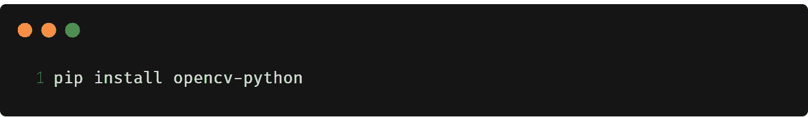

# 1.导入图像

安装完成后，我们可以 ***导入名为`cv2`的*** 包。我们还将导入`matplotlib`来显示我们的实验结果。

# 2.阅读图像

现在让我们定义一下我们想玩的 ***图像路径*** 。我们可以使用函数`**cv.imread()**`将图像作为 *Numpy 数组*导入和读取。

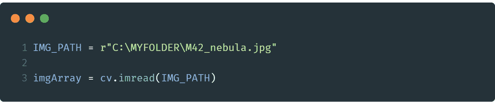

认识我最久的人都注意到了我是多么热爱天体摄影。所以，我们来玩一张美丽的 ***猎户座星云的照片吧！*** (更多信息*[*此处*](https://alessiovaccaro.com) *和* [*此处*](https://bluejourneyastro.com) *为 astro-addicteds)。**

*让我们使用`**matplotlib**`立即显示该图像的内容:*

*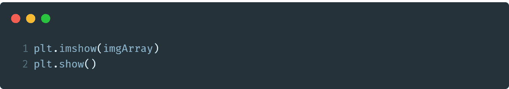**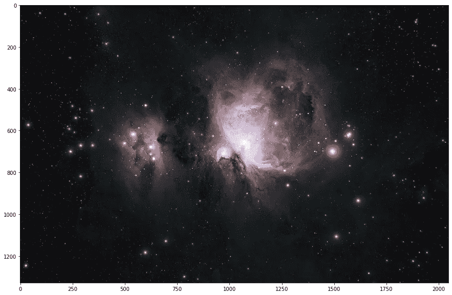*

*图 1-假彩色的猎户座星云(又名 M42)。[瓦卡罗]*

*这张 ***8 bit*** ( *压缩* ) ***JPEG*** 图像是用我的 ***80/480 折光仪*** 和一台 ***佳能 EOS 60D 采集的。*** 它有*(R、G、B)三个通道，分辨率约为***2048 x 1328***。**

**不幸的是，正如我们所看到的，图像 ***的颜色绝对是交错的*** ( *图 1* )。**

**OpenCV 实际上使用了 ***BGR 三合*** ***而不是 RGB*** 作为标准。
因此，有必要转换图像并将通道放在正确的位置: ***从 BGR 到 RGB*** 。**

# **4.重新排列频道:从 BGR 到 RGB**

**为了将通道按正确的顺序排列，并使它们适应 ***RGB 颜色空间*** ，我们可以使用`**cv.cvtColor()**`函数将`**COLOR_BGR2RGB**`作为转换参数。**

******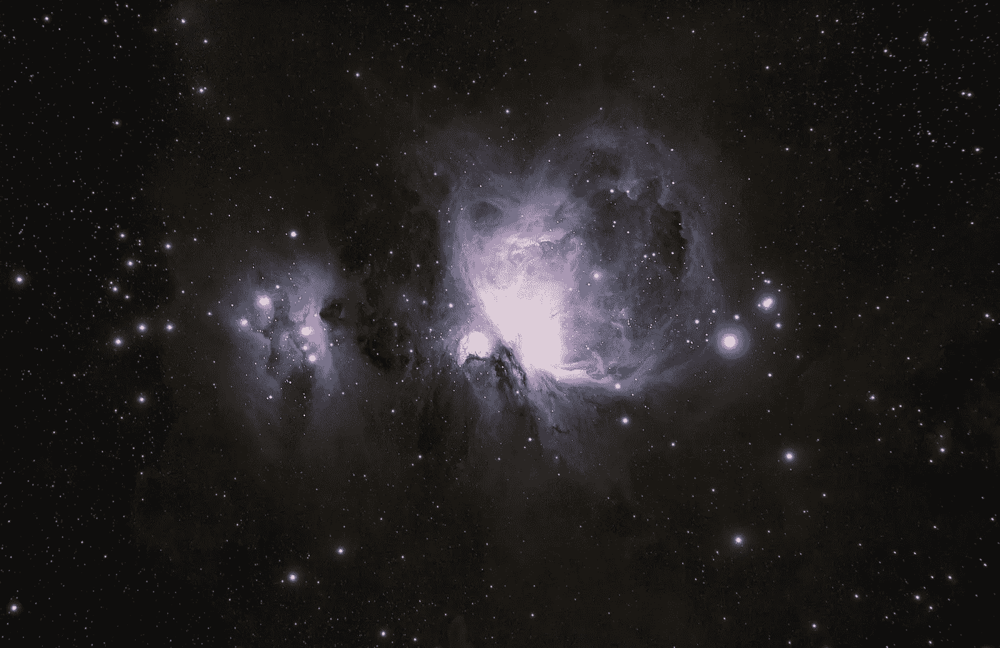**

**图 2——真实颜色的猎户座星云(又名 M42)。稍微好一点，不是吗？[瓦卡罗]**

*****颜色都是*** 现在肯定 ***比较均衡*** ( *图 2* )。**

# **5.分别显示频道**

**由于我们的图像实际上是 3 个不同矩阵*的 ***堆栈(每个颜色通道 R、G 和 B* 一个矩阵)，我们可以考虑分别显示每个矩阵。*****

*我们可以使用`numpy` 语法来对立方体*进行切片。**

**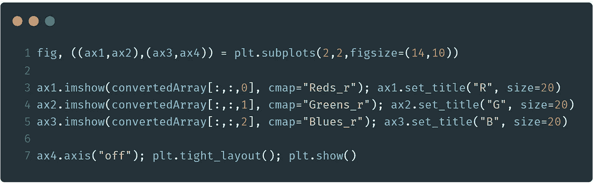****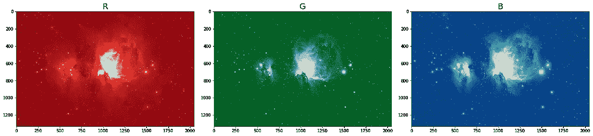**

**图 3 — RGB 图像通道[A.Vaccaro]**

**我们到了！ ***分割三个通道*** 可以让我们从 ***光谱角度*** *(图 3)注意到表征我们主题的有趣细节。***

**例如，猎户座星云的中心富含 ***氢气，它发出的光(能量)主要是红色和近红外*** 。
相反，旁边的反射星云(*跑男星云，左边*)反射周围年轻恒星的光(*通常趋向蓝色*)。**

**拆分渠道 ***我们实现*** ，不出所料，准确的说是 ***这些*** 前面提到的 ***方面*** 。**

**红色通道中的白色代表猎户座星云的中心，而蓝色通道则更多地出现在小跑步者星云中。**

# **6.可视化直方图**

> **直方图和图像。不可避免的结合！**

**一个通道 的 ***直方图可以告诉我们 ***数字在每个通道*** 内是如何分布的。例如，通过分析单个直方图，我们能够知道 ***是深色区域还是浅色区域占优势*** 。*****

*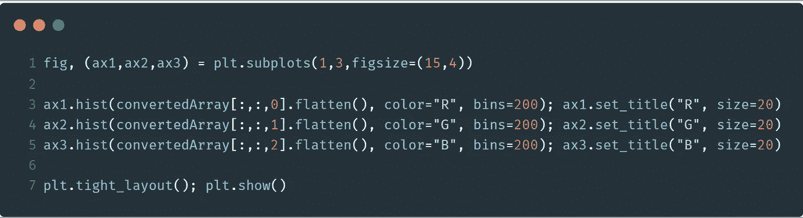**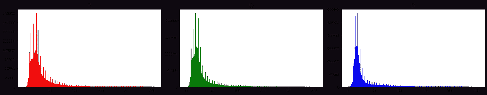*

*图 4 — RGB 图像直方图[A.Vaccaro]*

**注意:* `***flatten()***` *这里使用的是展开数组的函数。**

****天空背景像素是暗的*** ，由于它们占优势，它们将直方图(*图 4* )向相对 ***低动态值*** ( *例如 25* )移动。*

# *7.提取位深度*

*每个像素具有预定的容器大小。不，我说的不是图像几何(*例如分辨率*)。*

*我指的是图像 ***信息内容*** :其通道灰度 的种类、丰富度和 ***动态。****

*例如，我们可以选择将收集到的信息保存在一个 ***2 位*** 容器中的每个像素内:我们会发现自己拥有一个只有白色或黑色像素*(*0，1* )的图像。**

**如果我们决定切换到 ***8 位*** 呢？我们将有一个从 ***0 到 255*** 的灰度(*用于每个通道*)。信息，就这样， ***开始有了自己的动态*** 。你明白了！**

**我们正在玩的物体是一个`**numpy**` `**ndarray**`。让我们来看看它们的像素有多大。**

****

**所以它有经典的`**dtype**`属性，我们可以用它来知道图像 的 ***位深度。*****

****

**不错！这是 ***的 8 位*** 图像。这是我们可以预料到的事情，因为它是一个 JPEG 文件。**

**这意味着图像中最清晰的像素*的值为****最暗的像素为 0*** 。****

**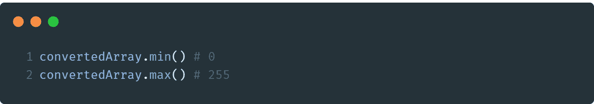**

**一个 ***16 位*** 通道图像将允许我们保留高达 ***65536 级*** 的灰度( *0，65535* )而不是只有 256 级。这一切，显然是以 ***为代价，其大小在*** 盘上。**

# **8.裁剪图像**

**在我们 ***裁剪图像*** 之前，让我们利用`**shape**`属性找出它的(*几何* ) ***尺寸*** :**

****

*****输出元组*** 告诉我们图像有***1328 行******2048 列******3 个通道*** ( *RGB* )。为了 ***裁剪图像*** 我们可以简单地使用`**numpy**`索引方法。**

**例如，取 ***的前 200 行*** 和 ***的前 300 列*** (所有通道的*)我们可以简单地这样写:***

**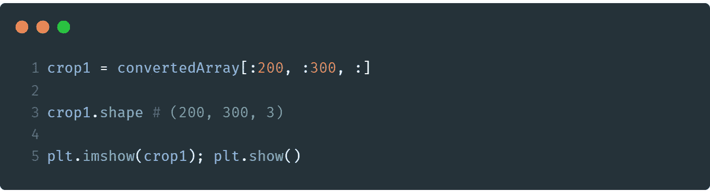****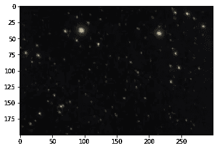**

**图 5 —图像左上角的裁剪部分。**

***瞧！*如果我们想从 600 到 900 行、350 到 1250 列和所有通道中进行选择:**

**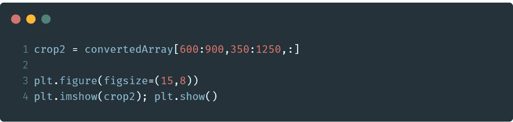****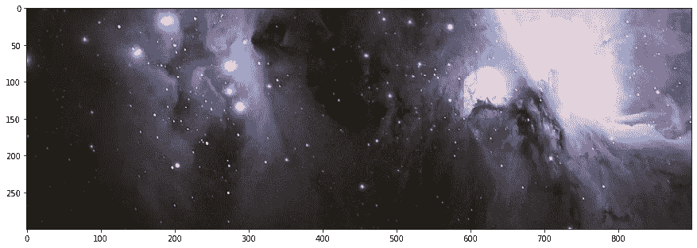**

**图 6 —图像的中央裁剪部分。**

**如果相反，我们想 ***只裁剪一个通道*** ( *第一个*)我们只需要写:**

**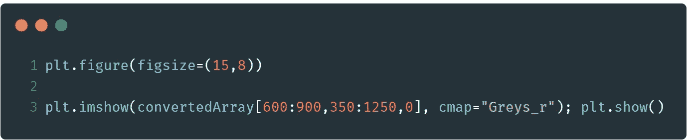****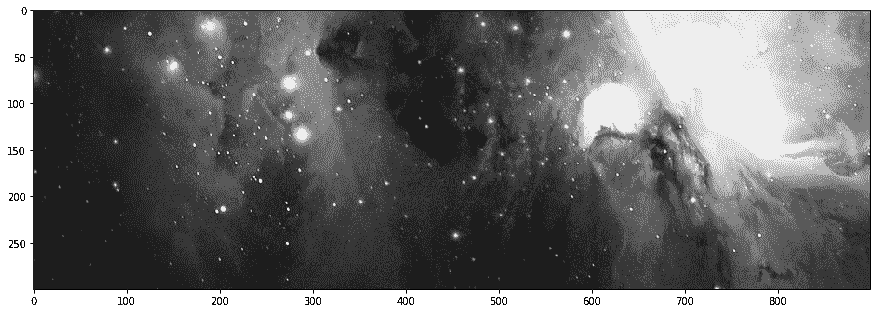**

**图 7 —图像的中心单色裁剪。**

***超级简单！***

# **9.像素数量**

**图像中有多少像素？要回答这个很简单的问题，只需 ***将长边的像素数*** 乘以短边的像素数即可。**

**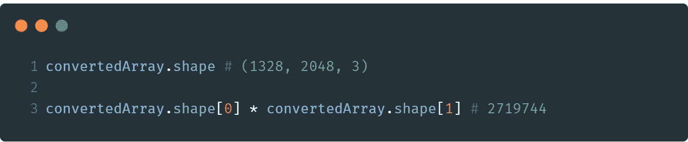**

**2,719,744.大约对应***270 万像素*** 。**

# **10.剖析图像**

**假设你想 ***从图像中提取一个垂直和一个水平截面*** 。**

**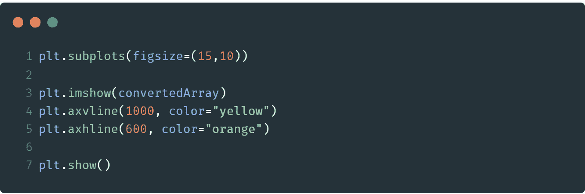****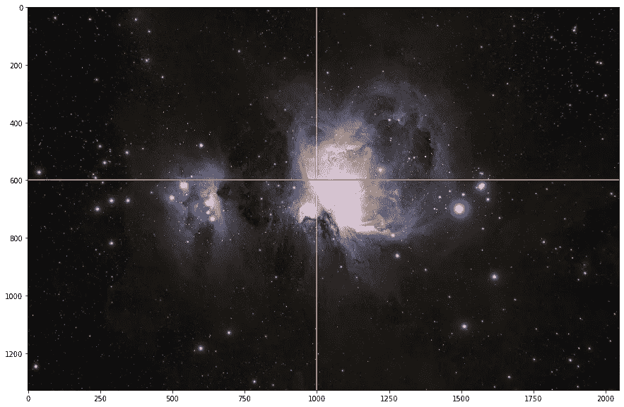**

**图 7——如果我们想剖析图像，该怎么办？**

**我们要 ***提取这两个轮廓*** 。我们如何做到这一点？很简单。**

**我们可以按照这种方式对第 600 行的 ***水平段*** 进行操作。**

**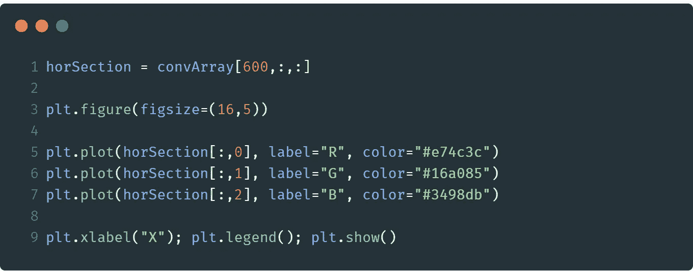****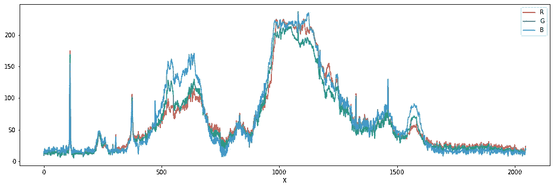**

**图 8-第 600 排的水平剖面图。**

**对于列#1000 处的 ***垂直的一个*** 也是如此。**

**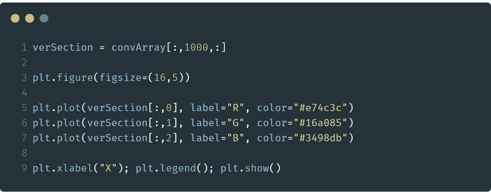****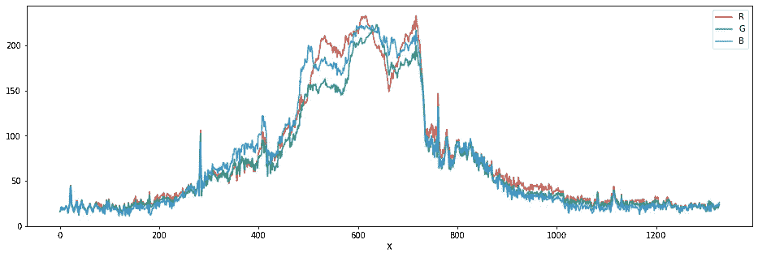**

**图 9-立柱#1000 的垂直剖面图。**

*****图形中的每条曲线*** 对应每个 RGB 通道 的 ***段。*****

**有了这样的简介(*图 8，9* )就很容易验证*，并且有 ***的证据*** 证明我们仅仅通过看图像就能读到的东西。***

# **-1.结论**

**我们可以暂时停在这里。OpenCV 是一头贪得无厌的野兽:这只是冰山一角。欢迎来到这个 ***无比广阔的世界*** 。**

**🤝*如有任何疑问、反馈或协作要求，请随时* ***联系我***[***Linkedin***](https://www.linkedin.com/in/alessio-vaccaro/?lipi=urn%3Ali%3Apage%3Ad_flagship3_feed%3Bm6wy3IpeQb22IUmuzeXutg%3D%3D)*。我会很高兴和你聊天！***

**[👉](https://emojipedia.org/backhand-index-pointing-right/)要获得更多类似的内容，并关注即将发布的文章，请不要忘记在 Medium***上关注我。*****

**[👉如需参考本文，请联系我。谢谢你。](https://emojipedia.org/backhand-index-pointing-right/)**