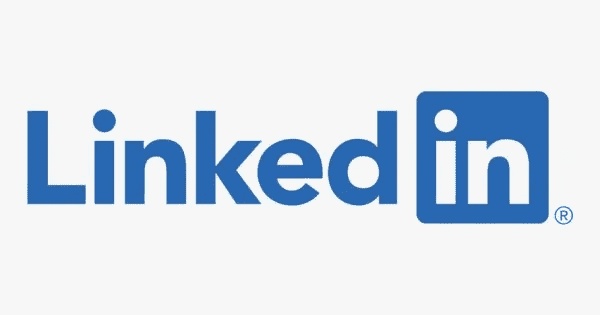
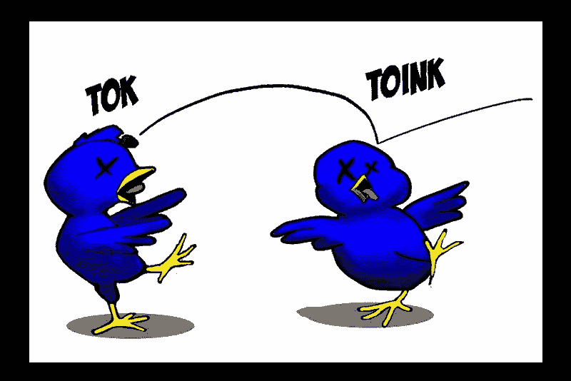

# 我的数据科学之旅给你的 11 条建议

> 原文：<https://towardsdatascience.com/11-tips-for-you-from-my-data-science-journey-df884faa9f3?source=collection_archive---------35----------------------->

## 帮助您更成功地进入数据科学的提示。

本杰明·戴维斯在 [Unsplash](https://unsplash.com?utm_source=medium&utm_medium=referral) 上拍摄的照片

我做到了！大约两年半后，我转行进入了数据科学领域。如果你正计划将职业生涯转向数据科学，并担心这会花费你这么长的时间，不要这样做。我并不完美，可能和你有不同的生活境遇。但是我会和你分享一些我希望我做了(或者更快做了)的事情来帮助你在更短的时间内成功。

为我的情况做好准备:

a)我是一个蹒跚学步的孩子的丈夫和父亲。

b)我有数学硕士学位，刚开始的时候几乎没有编码经验。

c)我是一名高中数学老师，开车上班要花一个小时。

解决了这个问题，让我们来看看这些技巧吧！

# 1.如果你要转行，寻找在当前领域应用数据科学技能的机会。

由[元素 5 数码](https://unsplash.com/@element5digital?utm_source=medium&utm_medium=referral)在 [Unsplash](https://unsplash.com?utm_source=medium&utm_medium=referral) 上拍摄

请记住，作为一名数据科学家，你是一名问题解决者。当你培养了一种分析思维，开始把它应用到你领域的问题中。这可能意味着做你自己的副业。更好的是，你可以在你目前的职业中找到一个你可以用数据科学解决的问题。我在学校这样做是为了影响为学生雇佣额外支持的决定。也许在你的公司里，如果你能经常展示使用数据科学解决公司问题的益处，就能创造一个机会。

# 2.如果你参加课程，立即应用你学到的技能。

Jonathan Chng 在 [Unsplash](https://unsplash.com?utm_source=medium&utm_medium=referral) 上拍摄的照片

所以你已经参加了几门课程来增强基本技能。这很好，但不要陷入所谓的“教程炼狱”。这是你一门接一门地学习，仅此而已。立即应用您的技能！课程使用的数据是为了教学目的，但不会总是让你准备好面对真正杂乱的数据。尝试一两项新技能，感受在未知情况下使用它们的感觉。说到实验…

# 3.经常实验。

照片由 [Unsplash](https://unsplash.com?utm_source=medium&utm_medium=referral) 上的 battle creek 咖啡烘焙师拍摄

玩你所学的。尝试新功能。获取一些新数据以使用新的可视化。将你从未想过会接触到的数据可视化。将您的工作流程转换成可重复使用的脚本。根据你的分析写一份报告。尝试设置一个基本的 web 应用程序。做所有这些将有助于引导你走向你真正喜欢的数据科学。

# 4.尝试公开分享你的作品。

照片由[马库斯·温克勒](https://unsplash.com/@markuswinkler?utm_source=medium&utm_medium=referral)在 [Unsplash](https://unsplash.com?utm_source=medium&utm_medium=referral) 上拍摄

你需要一种方式来展示你的能力。找一个平台来做这件事。我在用 Squarespace 制作的个人网站上写过博客，在 Medium 上也写过博客(当然是在 Medium 上)，制作过 [Youtube 视频](https://www.youtube.com/channel/UCvEifVQc2PU0SEqYw5FrbUA)，在 [Twitter](https://twitter.com/JohnnyData22) 和 [Linkedin](https://www.linkedin.com/in/jdejesus22/) 上分享过可视化效果和我正在做的事情。无论你决定哪一个，坚持一个，并试着每月至少做一次以上的事情。这样做实际上引起了一家出版公司的注意，他们让我做一个关于 [Tensorflow](https://www.tensorflow.org/) 的在线课程。

# 5.迅速决定你想在数据科学领域做什么。

由 [Jens Lelie](https://unsplash.com/@leliejens?utm_source=medium&utm_medium=referral) 在 [Unsplash](https://unsplash.com?utm_source=medium&utm_medium=referral) 上拍摄的照片

有句谚语说“万事通，无所不能”。如果你的时间像我一样被限制在每天一个小时，你就无法掌握 Python、R、SQL、统计学、机器学习、数据可视化、AI 以及有效沟通上述任何一项的能力。你可以根据你喜欢使用的东西和/或你做过的项目来选择你想要专注的技能。对我来说，我坚持使用 Python，因为它可以灵活地访问数据科学的任何部分，并允许我构建 web 应用程序。我对使用什么工具的关注是基于我正在做的与教育相关的项目，因为那是我的领域。

# 6.不要放弃锻炼。

[布鲁诺·纳西门托](https://unsplash.com/@bruno_nascimento?utm_source=medium&utm_medium=referral)在 [Unsplash](https://unsplash.com?utm_source=medium&utm_medium=referral) 上拍照

当我开始这段旅程时，我正开始完全摆脱我的父亲。但当我如此沉迷于数据科学世界时，我开始否定我在锻炼方面的兴趣和健康。我在中途意识到这一点，不得不重新获得我失去的所有健康进步。我的武术练习也落后了一点。即使每天只做 5 到 10 分钟的小运动量训练，也要做些事情让你的身体保持运动。虽然我们是有伟大思想能力的生物，但我们最初是被设计来移动的

# 7.让你的 LinkedIn 个人资料迅速脱颖而出

在[广告周刊](https://www.adweek.com/digital/2-years-in-the-making-linkedins-brand-refresh-aims-to-make-the-platform-more-inviting/)上发现 Linkedin 标志

不管你在旅程的哪个阶段，清理你的 LinkedIn 个人资料。有很多方法可以让你修改这份资料，以引起他人的注意，并找到潜在的雇主。我的简介让一位脸书招聘人员联系我，希望得到一份起薪超过 13 万美元的工作。根据我所学的一些快速修改是:

a)将“数据科学家”和“机器学习”等词放在你要陈述的地方。

b)如果您做过数据科学相关的工作或项目，请将它们添加到您的个人资料中，强调某人如何从您的工作中受益。

这里是我的 LinkedIn 个人资料，给你一些关于以上的想法。

# 8.寻找导师。

照片由 [NeONBRAND](https://unsplash.com/@neonbrand?utm_source=medium&utm_medium=referral) 在 [Unsplash](https://unsplash.com?utm_source=medium&utm_medium=referral) 上拍摄

或者至少是对你的工作和进步的第二种意见。你需要有人来帮助你调整你的技能。有一个导师当然是很好的。鉴于我的情况，我不能放弃我的工作去全职的新兵训练营。这就是我选择[sharpes minds](https://www.sharpestminds.com/)的原因。无论你在哪里，他们都会为你安排一位来自该领域的导师，时间灵活，有大量的招聘支持，并且在你被聘用之前不会收取任何费用。

# 9.不要得寸进尺。

瑞安·弗兰科在 [Unsplash](https://unsplash.com?utm_source=medium&utm_medium=referral) 上拍摄的照片

有了正确的支持系统，事情当然会变得容易得多。对我来说，那是我的妻子。她每天给我一个小时的时间学习，做项目，申请职位。我本可以拿更多，但除非绝对必要，否则我尽量不拿。但它确实有负面影响，让我牺牲了和她在一起的宝贵时间。除此之外，我有时还会抱怨转行花了这么长时间，我一度把她推得太远了。过了一段时间，我的妻子原谅了我，并暂停了其他一切。在追求新职业的同时，记得平衡你的生活。它对别人的影响比你想象的要大。

# 10.开始写博客

照片由[格伦·卡斯滕斯-彼得斯](https://unsplash.com/@glenncarstenspeters?utm_source=medium&utm_medium=referral)在 [Unsplash](https://unsplash.com?utm_source=medium&utm_medium=referral) 拍摄

我之前提到过这一点，但我特别强调这一点是因为书面交流的重要性。到目前为止，我需要我的写作技巧来传达项目提案的请求，为上周发布的用户创建一个使用/解释仪表板的教程，用于与同事就任务进行日常交流，以及起草电子邮件以澄清临时请求。博客有助于培养这些技能。如果你需要更多关于为什么你应该写博客的影响，请阅读[大卫·罗宾逊的这篇文章](http://varianceexplained.org/r/start-blog/)，它与我分享来影响这个决定。

# 11.做能完成以上 2 条以上建议的事情

图片来自[financialish.com](https://www.financialish.com/article/credit-suisse-securities-kills-2-birds-with-one-stone)

如果你想做我之前提到的 2+个想法，试着做能完成多件事的项目。例如，当我必须为一个项目做点双列相关时，我必须了解它，然后应用它。为了加深我对它的理解，我写了一篇博文。

 [## 与 Python 的点双列相关

### 线性回归是确定数据的两个或多个连续特征之间相关性的经典技术…

towardsdatascience.com](/point-biserial-correlation-with-python-f7cd591bd3b1) 

因此，这个项目让我解决了我在数据科学工作中的问题，并产生了一篇博文，增加了我在公众面前的曝光率。通过在 youtube 视频中演练代码，可以更进一步。

通过写这篇博客，我实际上同时完成了两项任务。我将与 SharpestMinds 学员进行一次私人网络研讨会，分享我获得数据科学职位的经验。在这篇博文中，我总结了我将分享的技巧，并创建了一篇对你和他们都有帮助的博文。谁说你不能一心多用。

# **最终想法**

这不是一个详尽的列表。如果你对我提到的更多技巧感兴趣，我会非常乐意和你聊天。我已经不怎么用 Linkedin 了。在 [Twitter](https://twitter.com/JohnnyData22) 上直接给我发消息，告诉我你是通过这篇博客找到我的，我们可以约个时间。

如果你想根据我的经验得到更深入的建议，看看下面这些帖子:

 [## 数学背景的潜在数据科学基础

### 帮助您开始学习数据科学的课程指南

towardsdatascience.com](/a-potential-data-science-foundation-for-math-backgrounds-188b03b9f1ff)  [## 为什么专注对您的数据科学之旅至关重要

### 以及它将如何节省您进入该领域的时间

towardsdatascience.com](/why-focus-is-key-for-your-data-science-journey-b62715b2a1c) 

再次感谢您的阅读！如果你是一名数据科学家，正在阅读这篇文章，请在下面的评论中添加我遗漏的任何建议。

直到下一次，

约翰·德杰苏斯