# 实践 Matplotlib 的 11 个可视化示例

> 原文：<https://towardsdatascience.com/11-visualization-examples-to-practice-matplotlib-4fe4c7dd665c?source=collection_archive---------14----------------------->

## 综合实践指南


韦斯利·廷吉在 [Unsplash](https://unsplash.com/s/photos/flexible?utm_source=unsplash&utm_medium=referral&utm_content=creditCopyText) 上拍摄的照片

数据可视化在数据科学领域非常重要。它不仅用于交付结果，也是探索性数据分析的重要组成部分。

Matplotlib 是一个广泛使用的 Python 数据可视化库。事实上，许多其他库都是构建在 Matplotlib 之上的，比如 Seaborn。

Matplotlib 的语法通常比 Python 的其他可视化库更复杂。但是，它为您提供了灵活性。你可以自由定制剧情。

这篇文章可以被认为是一个 Matplotlib 教程，但主要集中在实践方面。在每个示例中，我将尝试生成一个不同的图，指出 Matplotlib 的重要特性。

我将在 Kaggle 上的[客户流失数据集](https://www.kaggle.com/shubh0799/churn-modelling)上做例子。我经常使用这个数据集，因为它很好地混合了分类变量和数字变量。此外，它带有目的性，因此示例构成了探索性的数据分析过程。

让我们首先安装依赖项:

```
import numpy as np
import pandas as pdimport matplotlib.pyplot as plt
%matplotlib inline
```

Matplotlib 由 3 层组成，分别是后端、艺术家和脚本层。脚本层是 matplotlib.pyplot 接口。

脚本层使得创建情节相对容易，因为它自动化了将所有东西放在一起的过程。因此，它是数据科学家使用最广泛的图层。

我们将把数据集读入熊猫数据帧。

```
cols = ['CreditScore', 'Geography', 'Gender', 'Age', 'Tenure', 'Balance', 'NumOfProducts', 'IsActiveMember', 'EstimatedSalary',
'Exited']churn = pd.read_csv("/content/Churn_Modelling.csv", usecols=cols)churn.head()
```

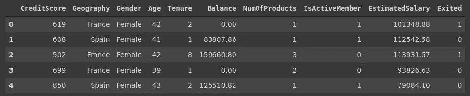

(图片由作者提供)

数据集包含一些关于银行客户及其银行账户的特征。“退出”栏表明客户是否发生了搅动(即离开了银行)。

我们准备好出发了。

## 1.每个国家的客户数量

这个很简单，但是对于柱状图来说是一个很好的例子。

```
plt.figure(figsize=(8,5))
plt.title("Number of Customers", fontsize=14)plt.bar(x=churn['Geography'].value_counts().index,
        height=churn.Geography.value_counts().values)
```

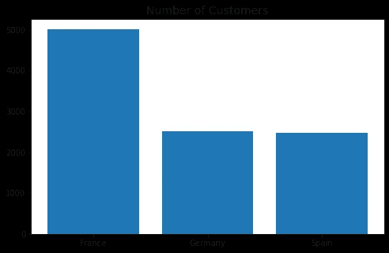

(图片由作者提供)

在第一行中，我们创建了一个特定大小的人物对象。下一行向 Figure 对象添加一个标题。bar 函数绘制实际数据。

## 2.调整 xticks 和 yticks

默认设置通常是合适的，但在某些情况下可能需要进行细微的调整。例如，我们可以增加字体大小，也可以调整 y 轴的取值范围。

```
plt.xticks(fontsize=12, rotation=45)
plt.yticks(ticks=np.arange(0, 7000, 1000), fontsize=12)
```

将这两行代码添加到前面的图中将产生:

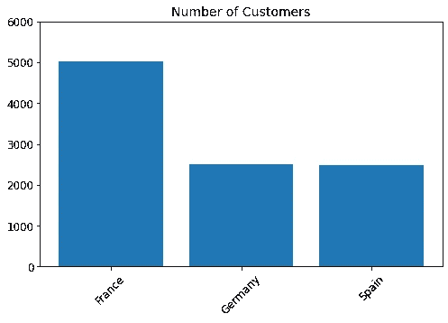

(图片由作者提供)

## 3.更改默认体形大小

默认的图形大小是(6，4)，我认为这是非常小的。如果您不想明确定义每个图形的大小，您可能需要更改默认设置。

matplotlib 的 rcParams 包用于存储和更改默认设置。

```
plt.rcParams.get('figure.figsize')
[6.0, 4.0]
```

如您所见，默认大小为(6，4)。我们把它改成(8，5):

```
plt.rcParams['figure.figsize'] = (8,5)
```

我们还可以更改其他参数的默认设置，如线条样式、线条宽度等。

我还将 xtick 和 yticks 的字体大小更改为 12。

```
plt.rc('xtick', labelsize=12)
plt.rc('ytick', labelsize=12)
```

## 4.创建简单的直方图

直方图用于可视化变量的分布。

下面的语法将创建一个简单的客户余额直方图。

```
plt.hist(x=churn['Balance'])
```

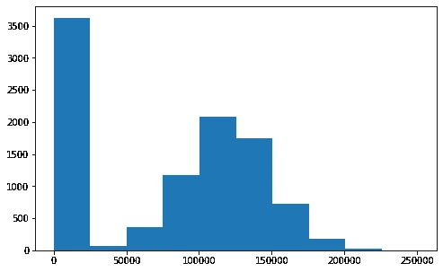

(图片由作者提供)

大多数顾客的账户余额为零。当排除零平衡时，分布接近正态(高斯)分布。

## 5.自定义直方图

定义直方图的两个基本特征是仓的数量和值的范围。

箱数的默认值为 10，因此值范围将被分成 10 个相等的箱。例如，先前直方图中的第一个柱是 0–25000。增加容器大小就像提高分辨率一样。在某种程度上，我们会对分布有更准确的了解。

取该列的最小值和最大值来定义值范围。我们可以调整它以排除异常值或特定值。

```
plt.hist(x=churn['Balance'], bins=12, color='darkgrey',
         range=(25000, 225000))plt.title("Distribution on Balance (25000 - 225000)", fontsize=14)
```

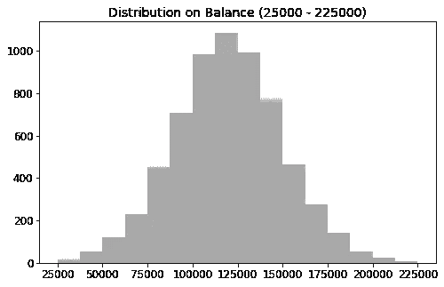

(图片由作者提供)

低于 25000 或高于 225000 的值被排除，并且箱的数量从 10 增加到 16。我们现在看到一个典型的正态分布。

## 6.创建简单的散点图

散点图通常用于绘制数值变量之间的关系。我们可以用散点图来显示变量之间的相关性。

```
sample = churn.sample(n=200, random_state=42) #small sampleplt.scatter(x=sample['CreditScore'], y=sample['Age'])
```

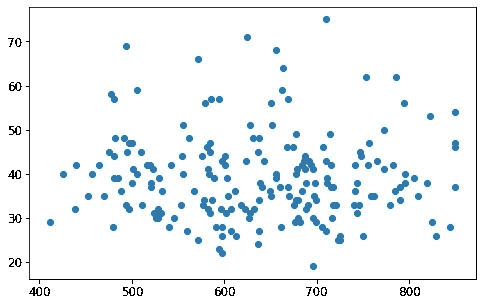

(图片由作者提供)

年龄和信用评分之间似乎没有关联。

## 7.带支线剧情的散点图

我们可以在同一个图形对象上放置多个散点图。虽然语法比其他一些库(例如 Seaborn)长，但 Matplotlib 在子情节方面非常灵活。我们将做几个由支线剧情组成的例子。

支线剧情函数创建一个图形和一组支线剧情:

```
fig, ax = plt.subplots()
```

我们可以在图上创建多个图，并用图例来标识它们。

```
plt.title("France vs Germany", fontsize=14)ax.scatter(x=sample[sample.Geography == 'France']['CreditScore'], y=sample[sample.Geography == 'France']['Age'])ax.scatter(x=sample[sample.Geography == 'Germany']['CreditScore'], y=sample[sample.Geography == 'Germany']['Age'])ax.legend(labels=['France','Germany'], loc='lower left', fontsize=12)
```

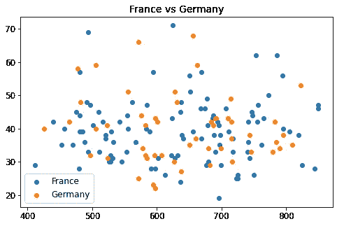

(图片由作者提供)

## 8.支线剧情网格

支线剧情不一定要一个接一个。subplots 函数允许使用 nrows 和 ncols 参数创建一个 subplots 网格。

```
fig, (ax1, ax2, ax3) = plt.subplots(nrows=3, ncols=1)
```

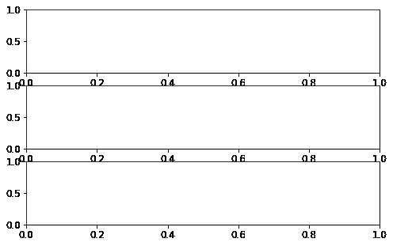

(图片由作者提供)

我们有一个空的支线剧情网格。在下面的例子中，我们将看到如何填充这些支线剧情，并做一些小的调整，使它们看起来更好。

## 9.重新安排和访问支线剧情

在添加标题之前，让我们在支线剧情之间留出一点空间，这样它们会看起来更好。我们将使用 tight_layout 函数来实现这一点。

我们也可以去掉中间的 x 记号，只保留底部的。这可以通过 sharex 参数来完成。

```
fig, (ax1, ax2, ax3) = plt.subplots(nrows=3, ncols=1, figsize=(9,6), sharex=True)fig.tight_layout(pad=2)
```

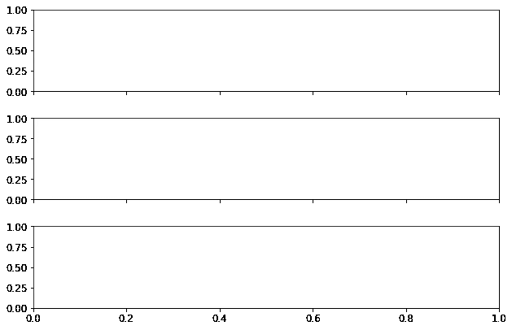

(图片由作者提供)

有两种方法可以进入支线剧情。一种方法是显式定义它们，另一种方法是使用索引。

```
# 1
fig, (ax1, ax2) = plt.subplots(nrows=2, ncols=1)
first subplot: ax1
first subplot: ax2# 2
fig, axs = plt.subplots(nrows=2, ncols=1)
first subplot: axs[0]
second subplot: axs[1]
```

## 10.绘制支线剧情

我们将创建一个包含两列的网格，并为每一列添加条形图。

```
fig, (ax1, ax2) = plt.subplots(nrows=1, ncols=2, sharey=True,
figsize=(8,5))countries = churn.Geography.value_counts()
products = churn.NumOfProducts.value_counts()ax1.bar(x=countries.index, height=countries.values)
ax1.set_title("Countries", fontsize=12)ax2.bar(x=products.index, height=products.values)
ax2.set_title("Number of Products", fontsize=12)
```

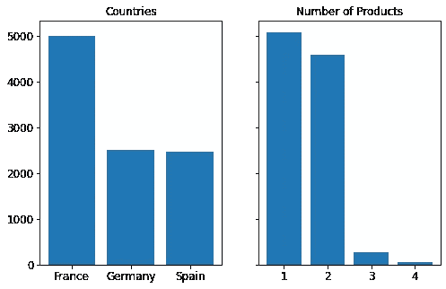

(图片由作者提供)

## 11.创建二维直方图

2D 直方图显示了一对变量的分布。我们得到了两个变量的值如何一起变化的概述。

让我们创建一个信用评分和年龄的 2D 直方图。

```
plt.title("Credit Score vs Age", fontsize=15)
plt.hist2d(x=churn.CreditScore, y=churn.Age)
```

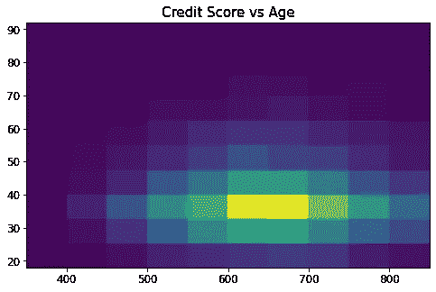

(图片由作者提供)

人口最多的群体由年龄在 30 到 40 岁之间的客户组成，他们的信用评分在 600 到 700 之间。

## 结论

我们在这篇文章中介绍的只是 Matplotlib 功能的一小部分。我分享的一些信息可以被认为是细节，而其中一些是非常基本的。然而，它们都有助于充分利用 Matplotlib。

和其他学科一样，掌握 Matplotlib 的最好方法是实践。一旦您熟悉了基本功能，就可以继续使用更高级的功能。

感谢您的阅读。如果您有任何反馈，请告诉我。