# 12 台重要的 Colab 笔记本电脑

> 原文：<https://towardsdatascience.com/12-colab-notebooks-that-matter-e14ce1e3bdd0?source=collection_archive---------5----------------------->

## StyleGAN、GPT-2、StyleTransfer、DeOldify、Magenta 等。参加选拔

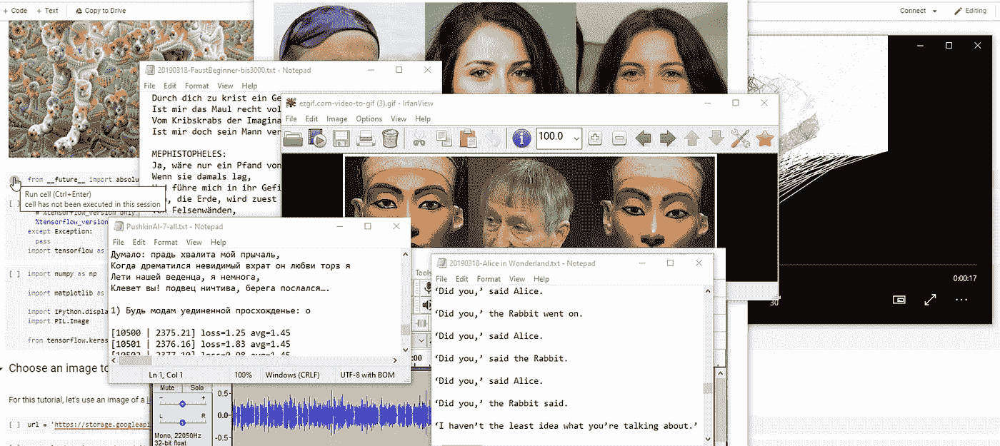

我喜欢 Colab 笔记本。作曲:Merzmensch(本文作者)

# 打开手机。

它至少花了**两个**[艾特斯](https://en.wikipedia.org/wiki/AI_winter) 才活下来。故事很明显:*理论上*，人工智能作为一个概念已经在这里了。**神经元网络**(作为一个概念:1943 — [麦卡洛克&皮茨](https://rd.springer.com/article/10.1007%2FBF02478259)/泛函:1965 — [伊瓦赫年科/帕拉](https://books.google.de/books?id=rGFgAAAAMAAJ&redir_esc=y))，**机器学习** ( [塞缪尔](https://citeseerx.ist.psu.edu/viewdoc/summary?doi=10.1.1.368.2254)，1959)，**反向传播** ( [沃博斯](https://books.google.de/books?id=z81XmgEACAAJ&redir_esc=y) — 1975)，仅举几个重点研究。*理论上*。但实际上，计算能力仍然是这样的:

人工智能的研究还有待于实际实现。最后，在 2000 年代，每一个拥有个人电脑的人都能够用机器和深度学习做实验。

我记得 2016 年，随着谷歌深度梦想的出现(感谢[亚历山大·莫尔德温采夫](https://medium.com/u/b8f772259bab?source=post_page-----e14ce1e3bdd0--------------------------------))。我花了很长时间来设置和运行它。但是结果是惊人的:

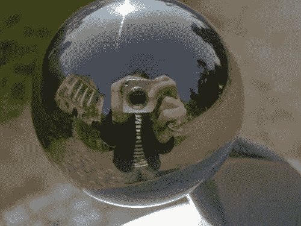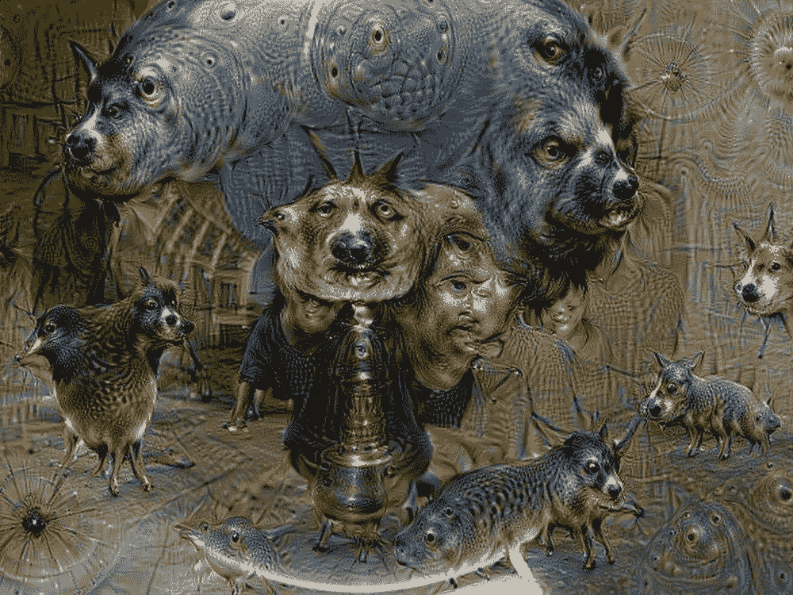

左边:Merzmensch 的照片，我平时的“Merzmensch userpic”。右边:这张被 DeepDream 改造的照片，截图:Merzmensch

我爱上了艾。我想尝试更多。后来我发现了 Colab 笔记本。他们改变了我的生活。

Google Colab 笔记本实现了数据科学的民主化。它们允许每个人——人工智能研究员、艺术家、数据科学家等——在每个设备上(甚至在智能手机上)享受机器和深度学习的力量。只需运行细胞，改变参数、值和来源，享受 AI 的多样性。

我想和你分享一些我喜欢的笔记本。试试吧！你可以在这里找到许多关于背景和使用 Colab 笔记本的优秀文章。

# 图像和视频

## 01)谷歌深梦

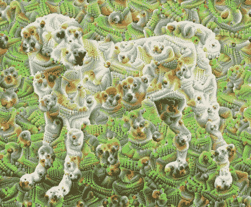

来源:【TensorFlow.org[//图片抄送:Von.grzanka](https://www.tensorflow.org/tutorials/generative/deepdream)

**这是怎么回事？**

DeepDream 通过神经网络可视化模式识别、解释和迭代生成。通过增加这种创造性的解释，你可以产生梦一样的意象。

神经网络就像我们的大脑一样:它寻找熟悉的模式，这些模式来自它们被训练的数据集。

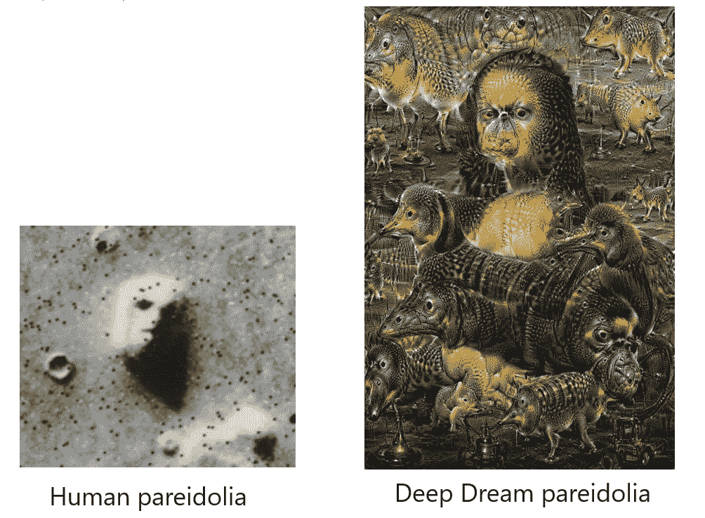

资料来源——左边:美国国家航空航天局，公共领域，1976 //右边:蒙娜丽莎，[带着深深的梦想](https://imgur.com/NthTJOb)，CC-by [nixtown](https://imgur.com/NthTJOb) ，2016

上面的例子(*我在 2019 年 11 月法兰克福 AI Meetup 上的一个* *屏幕)展示了我们的大脑如何在火星 **Cydonia 地区的岩层中识别一张脸**。一位用户 Nixtown 通过连续的 DeepDream 迭代改变了达芬奇的**蒙娜丽莎**——AI 识别出了奇怪的模式。*

通常我们的大脑会识别不存在的模式或物体。但是如果我们人类的感知做到了，为什么 AI 不应该呢？

**链接:**

*   [Alexander Mordvintsev 的原创博文](https://ai.googleblog.com/2015/06/inceptionism-going-deeper-into-neural.html)
*   [GitHub](https://github.com/tensorflow/docs/blob/master/site/en/tutorials/generative/deepdream.ipynb)
*   [**Colab 笔记本**](https://colab.research.google.com/github/tensorflow/docs/blob/master/site/en/tutorials/generative/deepdream.ipynb)

**要尝试的东西:**

尝试生成不同的图案并调整图像大小(*八度*)。使用更多迭代。不要害怕疯狂——结果可能会令人不安。

**有趣的事实:**

最初，DeepDream 习惯于在每个图案中识别大部分是狗脸。据 FastCompany 称，该网络是在…

> ImageNet 数据库的一个更小的子集，于 2012 年发布，用于一场比赛…该子集包含“120 个狗子类的细粒度分类( [FastCompany](https://www.fastcompany.com/3048941/why-googles-deep-dream-ai-hallucinates-in-dog-faces) )。

**阅读** [**更多关于我与 DeepDream**](https://medium.com/merzazine/deep-dream-comes-true-eafb97df6cc5?source=friends_link&sk=6d50ebb59584b487183385009ba50f54) **的实验。**

## **02)比根**

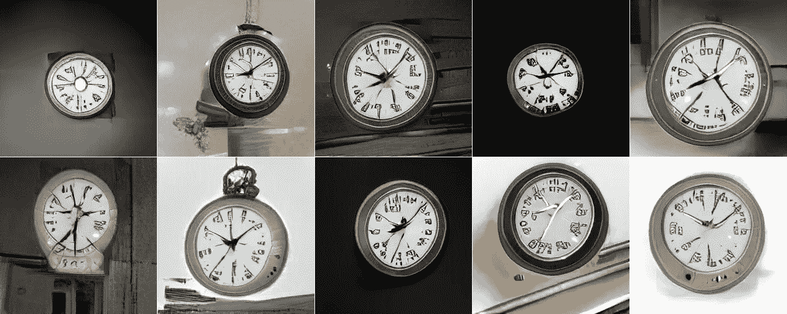

模拟时钟(#409)，由比根创造。我截图。

**这是怎么回事？**

比格根是第一批著名的生成对抗网络之一。在 ImageNet 上以现在不起眼的 128x128 分辨率训练，这个网络因其多方面的生成能力而成为一个标准。

在这个笔记本中，您可以从一长串类别中生成样本。

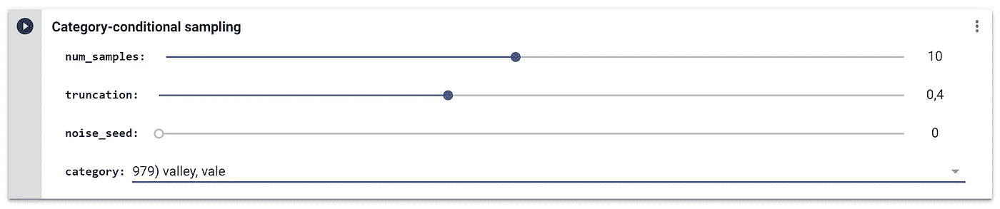

选择类别“山谷”……(截图:Merzmensch)

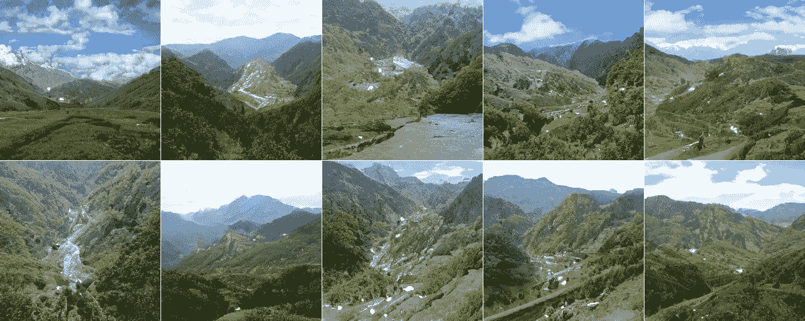

…生成照片般逼真的山谷图像系列(由:Merzmensch 生成)

**链接:**

*   比根关于 arXiv 的论文(安德鲁·布洛克，杰夫·多纳休，卡伦·西蒙扬。[高保真自然图像合成的大规模 GAN 训练](https://arxiv.org/abs/1809.11096)。 *arxiv:1809.11096* ，2018)
*   [**Colab 笔记本**](https://colab.research.google.com/github/tensorflow/hub/blob/master/examples/colab/biggan_generation_with_tf_hub.ipynb)

**要尝试的东西:**

同一个笔记本可以让你创建图像之间的插值。这种方法过去是——现在也是——令人兴奋和创新的，因为以前只有超现实主义者和抽象艺术家才有勇气把不相容的东西结合起来。现在你可以用照片级的结果来做这件事，例如，在**约克夏犬**和**航天飞机**之间生成插值。

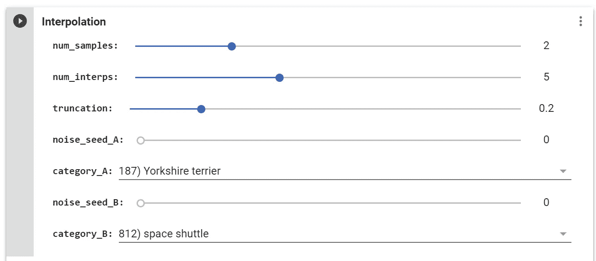

截图:Merzmensch

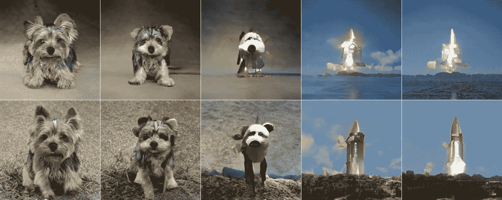

生成人:Merzmensch

**参见:**

*   [作为创意引擎的比根](https://medium.com/merzazine/biggan-as-a-creative-engine-2d18c61e82b8?source=friends_link&sk=498b6f23dfa37347ac952e9d209710c4)
*   [比根和万物的蜕变](https://medium.com/merzazine/biggan-and-metamorphosis-of-everything-abc9463125ac?source=friends_link&sk=fde32a2f24a97d0a651c087709fb8a53)

## 03)样式转移

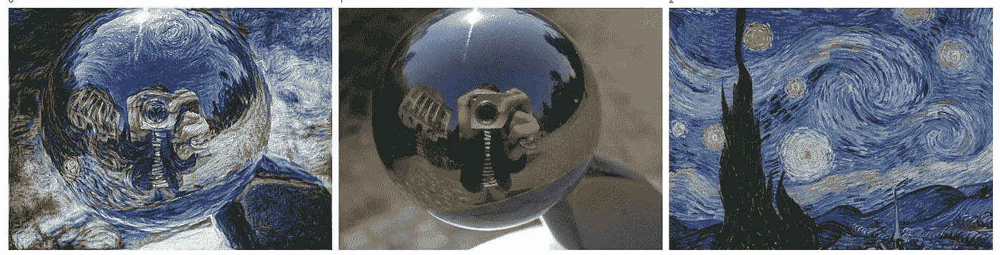

我的用户 pic，正在被梵高画//生成人:Merzmensch //右边来源:梵高，文森特·凡:星夜，1889

**这是怎么回事:**

在这个实验中，深度学习系统检查了两幅源图像——并转换了它们的风格:不仅是颜色，还有形状和图案。

**链接:**

*   [Lucid (TensorFlow)](https://github.com/tensorflow/lucid)
*   [Colab 笔记本](https://colab.research.google.com/github/tensorflow/lucid/blob/master/notebooks/differentiable-parameterizations/style_transfer_2d.ipynb)

**请参阅:**

*   [风格转移(你也可以这样做)](https://medium.com/merzazine/ai-creativity-style-transfer-and-you-can-do-it-as-well-970f5b381d96?source=friends_link&sk=258069284f2cca23ff929283c90fba0e)
*   [艾&创意:风格迥异的元素](https://medium.com/merzazine/ai-creativity-alien-elements-with-style-27ee7e45df92?source=friends_link&sk=4f8bf8dd08b1e76b3fcaa88676add697)

## 人工智能中的艺术

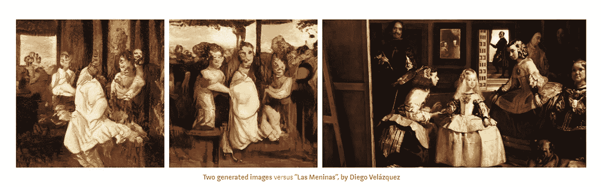

截图来自我的文章“ [14 种深度和机器学习的使用使 2019 年成为一个新的人工智能时代](/14-deep-learning-uses-that-blasted-me-away-2019-206a5271d98?source=friends_link&sk=4ac313764b2ca90e765566714dd2c88e)”//右边是迭戈·贝拉斯克斯的《拉斯梅尼亚斯》

有许多方法可以在艺术品上训练人工智能。

其中一个是通过 Reddit 提供的:StyleGAN 在艺术数据集上用 Kaggle 的 24k 图像进行了训练。

[你会得到有趣的结果](https://medium.com/merzazine/how-to-train-your-artist-cb8f188787b5?source=friends_link&sk=868a3a57d4200faae23c973463645c66)，甚至有可能追踪到模型被训练的原始艺术品。(美术新游戏，各位？**视觉词源**”:

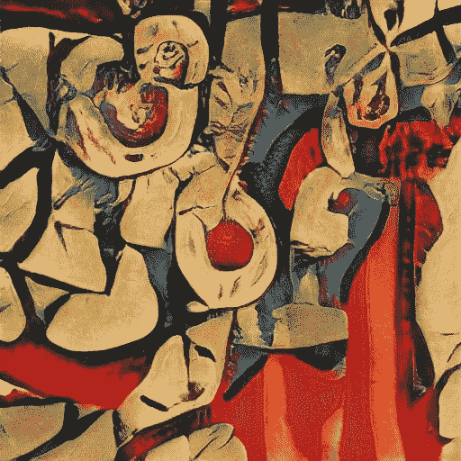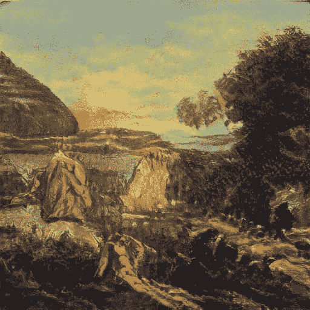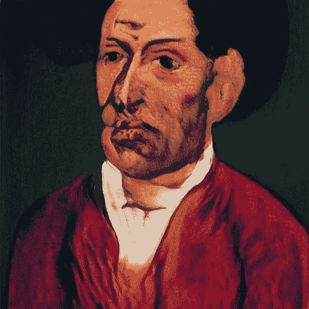

我用 StyleGAN 生成的图像，在 Kaggle 上训练(截图:Merzmensch)

另一个是 [WikiART StyleGAN2 条件模型](https://archive.org/details/wikiart-stylegan2-conditional-model)，由[彼得·贝勒斯](https://medium.com/u/71258452a7fb?source=post_page-----e14ce1e3bdd0--------------------------------)(等人)提供，由[多伦·阿德勒](https://medium.com/u/59c46d66b5f1?source=post_page-----e14ce1e3bdd0--------------------------------)打包成笔记本:

这个模型是在维基图片上训练出来的。它甚至允许在艺术家、流派和风格之间进行选择。

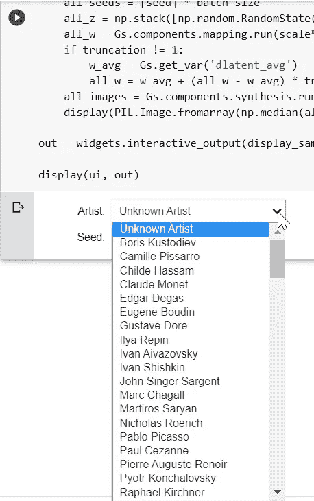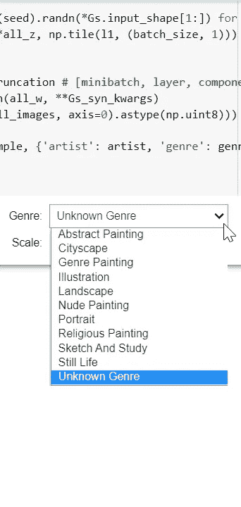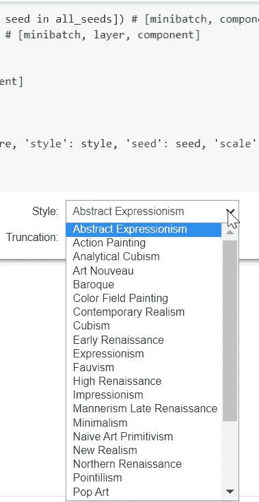

Merzmensch 截图

这些图像令人印象深刻:

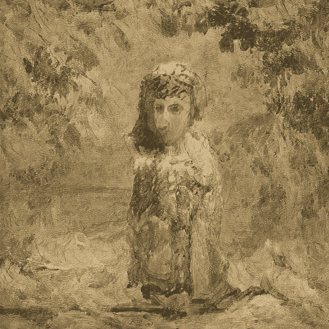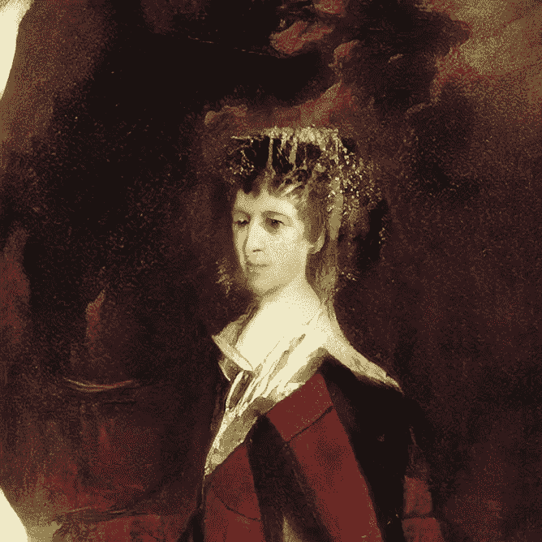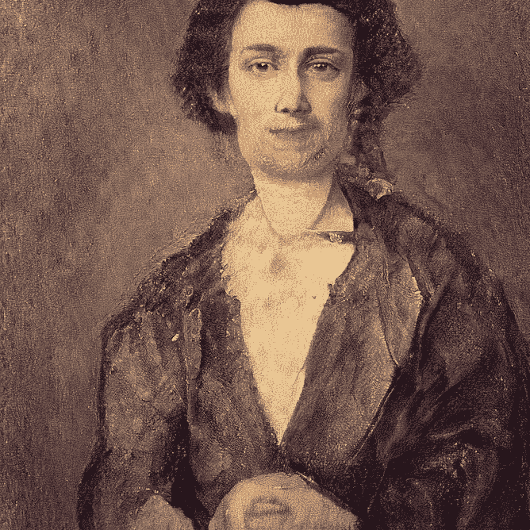

Merzmensch 使用 WikiART 模型生成的图像。

**要尝试的东西:**

*   每一种新的组合都会产生有趣的艺术品。尽量选择不同时代风格不典型的艺术家。像**毕加索**&文艺复兴或者**希什金** & **波普艺术**。结果有时出乎意料，也不总是容易理解，但这毕竟是艺术。

**链接:**

*   [_C0D32_ Colab 笔记本(24k 艺术品培训)](https://colab.research.google.com/drive/1cFKK0CBnev2BF8z9BOHxePk7E-f7TtUi)
*   [WikiART StyleGAN2 Colab 笔记本](https://colab.research.google.com/github/Norod/my-colab-experiments/blob/master/WikiArt_Example_Generation_By_Peter_Baylies.ipynb)

**参见:**

*   [如何培养自己的艺人](https://medium.com/merzazine/how-to-train-your-artist-cb8f188787b5?source=friends_link&sk=868a3a57d4200faae23c973463645c66)。
*   数据集的不可背叛性。

## 06)样式 2

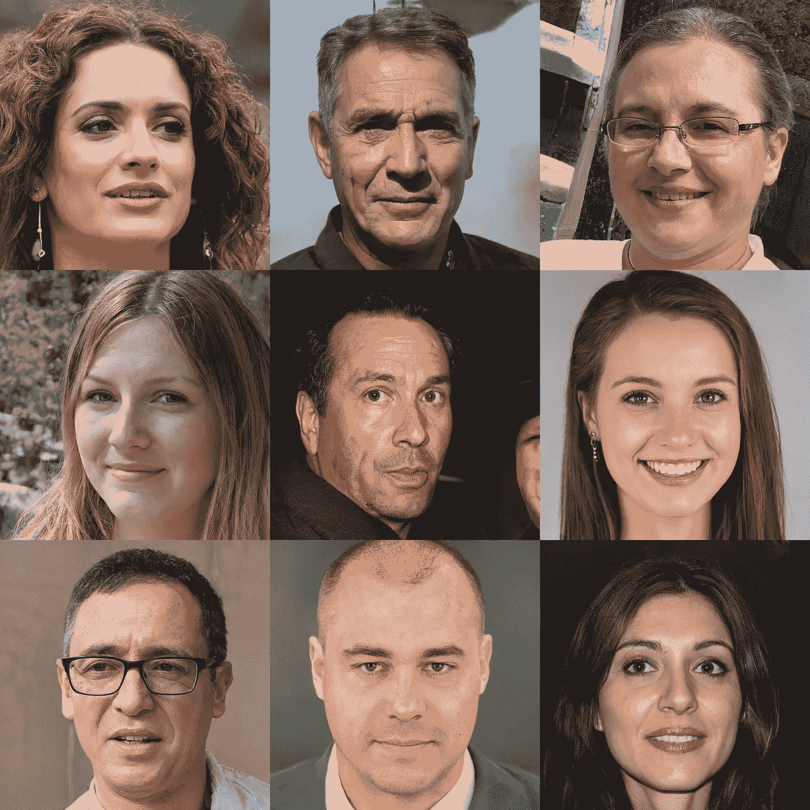

StyleGAN2 生成的图片(数据集 FFHQ，Flickr-Faces-HQ)，截图由 Merzmensch 提供

这是怎么回事？

由 NVidia 开发的这个网络是目前(*2020 年 3 月 6 日下午 4:27*)最先进的图像生成网络。它在高清数据集上进行了训练(例如，来自 Flickr-Faces-HQ 的人脸)。StyleGAN2 提供自动学习、无监督的高级属性分离、随机变化和具有视觉特征的层控制。

有各种各样的笔记本(众包研究的好处)，但我最喜欢的是 Mikael Christensen 设计的。

**链接:**

*   论文:[https://arxiv.org/abs/1812.04948](https://arxiv.org/abs/1812.04948)
*   视频:[https://youtu.be/kSLJriaOumA](https://youtu.be/kSLJriaOumA)
*   代号:[https://github.com/NVlabs/stylegan](https://github.com/NVlabs/stylegan)/[https://github.com/NVlabs/stylegan2](https://github.com/NVlabs/stylegan2)
*   [**Colab 笔记本**](https://colab.research.google.com/drive/1ShgW6wohEFQtqs_znMna3dzrcVoABKIH)

**要尝试的东西:**

*   笔记本电脑中有各种 NVidia 默认数据集(注意分辨率):

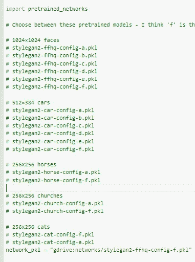

各种数据集，由 NVidia 提供。Merzmensch 截图

*   尝试新的数据集。训练你自己的模型或者使用那些由各种艺术家和研究人员提供的模型，比如[迈克尔·弗里森](https://twitter.com/MichaelFriese10)(关注他的推特以获得新的更新)。

细菌类型 g

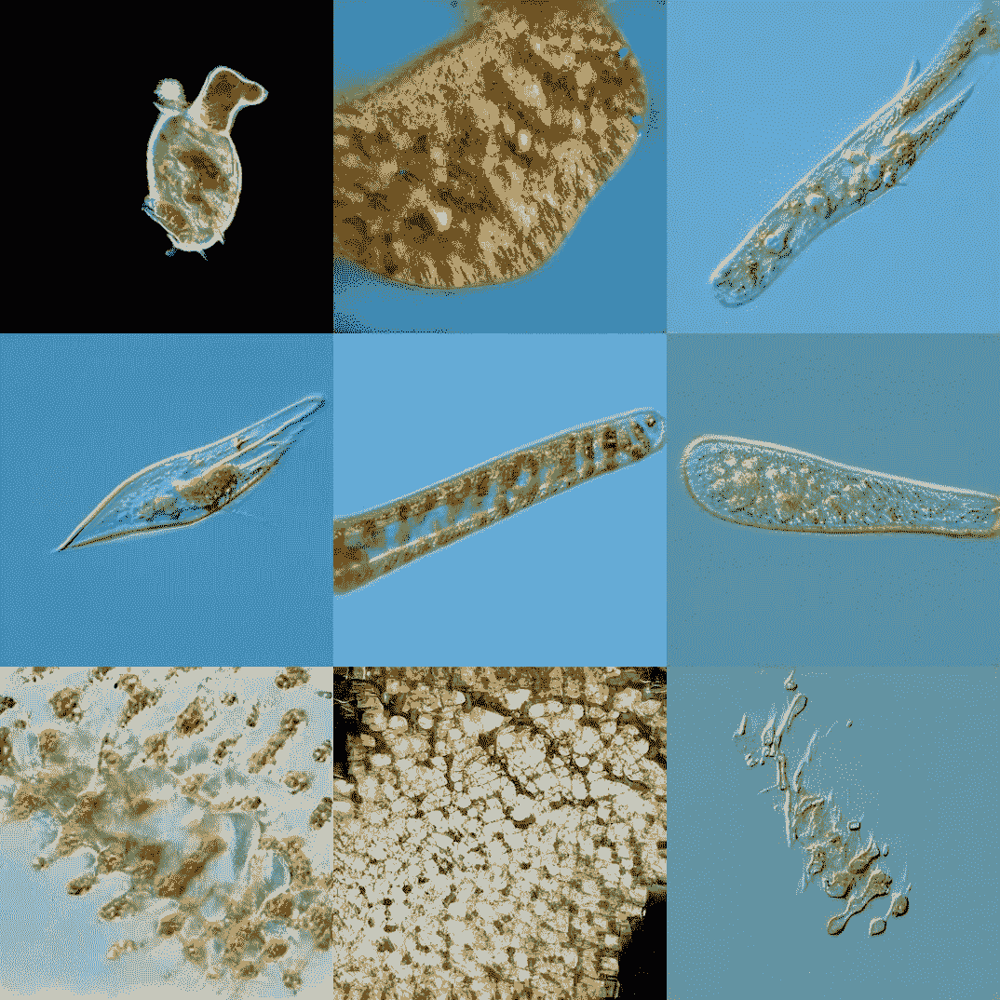

我用细菌样式生成的一些图片，截图来自 Merzmensch

艺术风格:

麦克·埃舍尔-斯泰勒根:

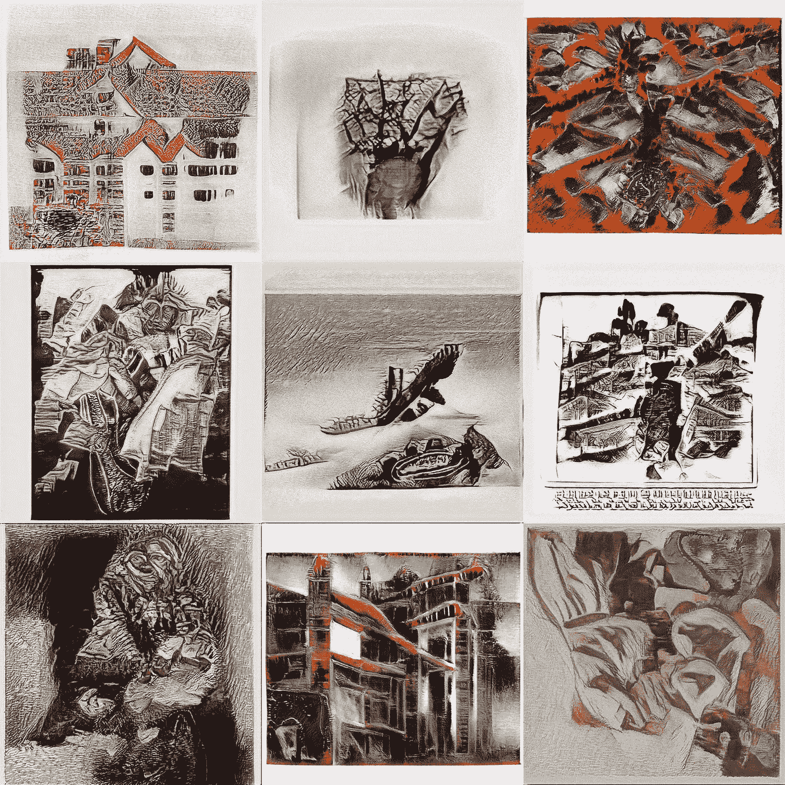

我用 Merzmensch 的数据集/截图生成的一些图像

*   制作插值视频:

我的插值实验

*   试用 [StyleGAN2 投影](/stylegan2-projection-a-reliable-method-for-image-forensics-700922579236?source=friends_link&sk=52f792fa0bd8913c7abf184b5b1f9513)。使用 StyleGAN2 笔记本，您会发现(或者更好:重新覆盖)隐藏在网络的**潜在空间中的图像。StyleGAN Projection 是一种追溯 StyleGAN2 生成的图像的方法——所以你可以将一张照片检测为人工智能生成的产品(# deep fake decide)。它仍然有一些缺点:你必须知道特定图像的具体数据集；图像的每一个变化都会使投影的过程不可行。**

这是一个成功的预测:

我的投影实验，两幅图像都是 StyleGAN2 生成的

这个可能会让你第二天晚上睡不着觉:

我的投影实验，图片在左边

阅读更多信息:

*   [StyleGAN2 投影。可靠的图像取证方法](/stylegan2-projection-a-reliable-method-for-image-forensics-700922579236?source=friends_link&sk=52f792fa0bd8913c7abf184b5b1f9513)？

如果你想尝试更多样的动机，试试[**art breader**](http://artbreeder.com/)，这是由[乔尔·西蒙](http://www.joelsimon.net/)设计的[强大的图像生成器](/artbreeder-draw-me-an-electric-sheep-841babe80b67?source=friends_link&sk=2fff2b9e102ce632d725e58bfa4c67dd):

[](https://artbreeder.com/) [## 艺术育种家

### 发现图像的协作工具。

artbreeder.com](https://artbreeder.com/) 

## 07)#解除锁定

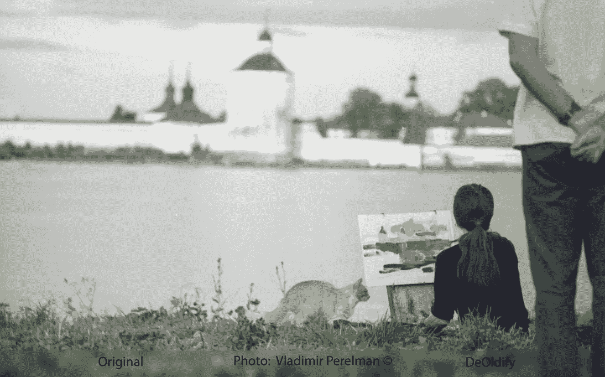

摄影:弗拉基米尔·佩雷尔曼

**那是怎么回事:**

由[杰森·安蒂奇](https://medium.com/u/13ad5d836603?source=post_page-----e14ce1e3bdd0--------------------------------)设计的去彩色模型允许对照片和视频进行有机着色。你可以把古老的历史片段带回到生动的生活中。同时，在 MyHeritage.org[实施](https://www.myheritage.com/incolor)。

方法是强大的。它可以识别图案和物体，并在其上应用经过训练的视觉数据库的颜色。

例如，这些 1950 年代的花:

它也适用于视频。在这里观看#著名的"*火车到达拉乔塔特(卢米埃尔兄弟，1896)* 的简化和升级版本

**建议:**

上传你的黑白影片到你的谷歌硬盘。所以你可以保护隐私(当然，如果你信任谷歌云的话)。

**链接:**

*   [GitHub](https://github.com/jantic/DeOldify)
*   [图像去模糊](https://colab.research.google.com/github/jantic/DeOldify/blob/master/ImageColorizerColab.ipynb)
*   [解除视频锁定](https://colab.research.google.com/github/jantic/DeOldify/blob/master/VideoColorizerColab.ipynb)(支持各种视频平台)

阅读更多信息:

*   [去模糊:基于 GAN 的图像彩色化](/deoldify-gan-based-image-colorization-d9592704a57d?source=friends_link&sk=925195b692f4922b90814ff8cc537e1b)
*   历史重演

## 8) 3D 本·伯恩斯效应

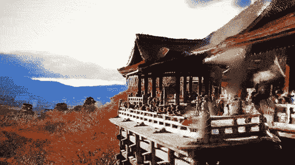

3D 本·伯恩斯版我的照片(Merzmensch)，[来源](https://medium.com/narrative/beyond-the-boundaries-9cd4574133dc?source=friends_link&sk=bcacdc660d30c2dd482d7444bfe0206e)

**这是怎么回事:**

3D 本·伯恩斯效果(由西蒙·尼克劳斯等人开发)允许生成单张照片的动画 3D 视频片段。

**要尝试的东西:**

在 Colab 笔记本中你会找到组件 **autozoom.py** 。尝试使用以下参数对其进行微调:

```
objectTo = process_autozoom({**'dblShift': 10.0,****'dblZoom': 10000000000000000000000000000000000000000000000000000000,**'objectFrom': objectFrom})numpyResult = process_kenburns({'dblSteps': numpy.linspace(0.0, **8.0, 400**).tolist(),'objectFrom': objectFrom,'objectTo': objectTo,'boolInpaint': True})
```

这将会夸大相机的运动——你会飞过整个场景。就像这个例子:

做一些参数的实验，你会从一个全新的角度体验你的照片。该笔记本提供了许多有用的功能，如串行图像= >视频传输。

**链接:**

*   [ArXiv 上单幅图像的 3D 本·伯恩斯效果](https://arxiv.org/abs/1909.05483)
*   [Colab 笔记本](https://colab.research.google.com/drive/1hxx4iSuAOyeI2gCL54vQkpEuBVrIv1hY)(由 [Andi Bayo](https://waxy.org/) 提供，由 [Manuel Romero](https://twitter.com/mrm8488) 改进)

**阅读更多:**

*   [很空间感！来自照片的基于 AI 的视差 3D 视频](/very-spatial-507aa847179d?source=friends_link&sk=dc49882dea2a713647ba0acc4189be95)。
*   [重新制作的历史动画](/re-animated-history-6b5eb1a85efa?source=friends_link&sk=0ebb60823325c5b60563d36beee4f217)
*   [超越界限](https://medium.com/narrative/beyond-the-boundaries-9cd4574133dc?source=friends_link&sk=bcacdc660d30c2dd482d7444bfe0206e)
*   观看我的系列[dreams](https://medium.com/merzazine/dreaims-in-black-white-a54de34fa99f?source=friends_link&sk=34632f2035791e9cc398360b18a3fc65)

[](/very-spatial-507aa847179d) [## 很有空间感！

### 3D 本·伯恩斯效应。在人工智能的帮助下赋予照片新的维度。

towardsdatascience.com](/very-spatial-507aa847179d) 

## 9)一阶运动模型


娜芙蒂蒂半身像([来源](https://collections.artsmia.org/art/14768/bust-of-nefertete-ancient-egyptian))结合杰弗瑞·辛顿的演讲([来源](https://www.youtube.com/watch?v=XG-dwZMc7Ng))，部分模型库

**这是怎么回事:**

Aliaksandr Siarohin 等人的一阶运动模型将面部运动从视频片段转换成图像。

**要尝试的东西:**

选择您的视频素材和源图像！这么多可能性。说句公道话，不要#DeepFake。

**链接:**

*   [项目页面](https://aliaksandrsiarohin.github.io/first-order-model-website/)
*   [GitHub](https://github.com/AliaksandrSiarohin/first-order-model) / [纸](http://papers.nips.cc/paper/8935-first-order-motion-model-for-image-animation)
*   [Colab 笔记本](https://colab.research.google.com/github/AliaksandrSiarohin/first-order-model/blob/master/demo.ipynb#scrollTo=UCMFMJV7K-ag)

# 神经语言处理

## 10，11)GPT 2

这个由 [OpenAI](https://openai.com/) 在 2019 年发布的语言模型是在各种来源的 40 GB 文本上训练的。有几个 GPT-2 Colab 笔记本，其工作方式类似:你输入句子的开头，GPT-2 继续(或者你向提供的文本提问)。变压器驱动模式与“自我关注”一起工作，将*的注意力*放在指定邻近的文本部分，这允许生成连贯的故事，而不是杂乱无章的胡言乱语。

我更喜欢两个 GPT-2 笔记本:

*   [“训练一个 GPT-2 文本生成模型”作者 Max Woolf](https://colab.research.google.com/drive/1VLG8e7YSEwypxU-noRNhsv5dW4NfTGce)
*   [带 Javascript 接口的 GPT-2](https://colab.research.google.com/github/gpt2ent/gpt2colab-js/blob/master/GPT2_with_Javascript_interface_POC.ipynb)由 gpt2ent

**马克斯·伍尔夫的笔记本允许:**

*   通过 GPT-2 生成各种文本
*   训练您自己的文本(高达 355m 型号)

我用了三种语言:

1.  **英文**(关于《爱丽丝梦游仙境》)
2.  **德语**(关于歌德的《浮士德 I》)
3.  俄语(论普希金的早期诗歌)

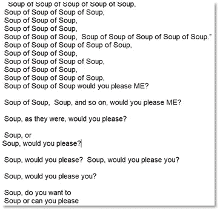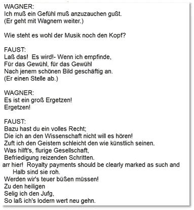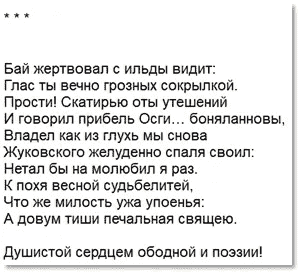

Merzmensch 截图

如您所见，它在某种程度上适用于所有语言。当然，GPT-2 是在英语资源上训练的。对于外语，我们应该应用微调和其他资产，但这个概念证明对我来说是有说服力的。有一些有趣的观察:

*   我对《浮士德》的德语训练越多，这些课文就越接近原著。原因可能是在一个小的数据集中(只有一个单一的文本)。如果你想训练你的文本，提供更广泛的数据量。
*   俄语文本不是很容易理解，但是你仍然可以从普希金的诗歌中辨认出风格甚至形式。和新词是完美的，每个文学先锋都会为这样的发明感到自豪。

**《带 Javascript 接口的 GPT-2》——笔记本允许:**

文字生成，不多不少。但是你可以控制文本长度(这是一个非常相关的因素):

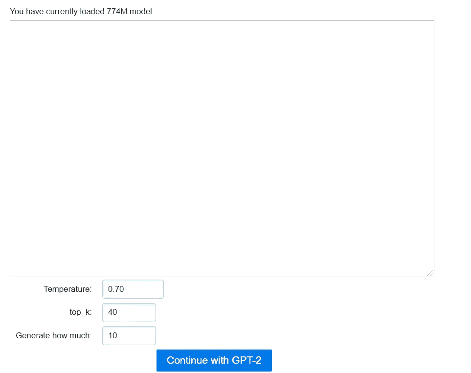

使用**温度**和 **top_k** 可以修改文本的随机性、重复性和“怪异性”。

用**生成多少**可以生成更长的文本(我用的是值 1000)。

**链接:**

*   [关于 GPT2 的第一个 OpenAI 帖子](https://openai.com/blog/better-language-models/)
*   [GPT-2: 1.5B 发布](https://openai.com/blog/gpt-2-1-5b-release/)
*   马克斯·伍尔夫的博客
*   [马克斯·伍尔夫的《柯拉布笔记本》](https://colab.research.google.com/drive/1VLG8e7YSEwypxU-noRNhsv5dW4NfTGce)
*   [带 Javascript 接口的 GPT 2 号](https://colab.research.google.com/github/gpt2ent/gpt2colab-js/blob/master/GPT2_with_Javascript_interface_POC.ipynb)

你也可以使用亚当·金的《GPT 2》的网络实现:

*   [TalkToTransformer.com](https://talktotransformer.com/)

我问这个应用关于生命的意义。这个回答非常明智和成熟。

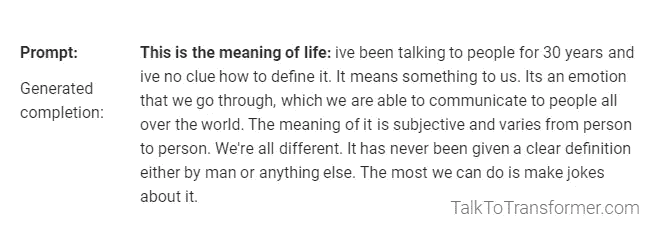

确实很明智！(截图[TalkToTransformer.com](https://talktotransformer.com)作者:Merzmensch)

另请阅读:

*   [拉克鲁奇](https://medium.com/merzazine/lakrobuchi-part-1-gpt-2-artificial-intelligence-literature-fake-news-and-the-rest-77997f52c8c3?source=friends_link&sk=0d241647785c7aa2efd0edd8ebbe8209)！(我的 GPT 三部曲-2)

# 音乐

## 12)洋红色:带变形金刚的音乐

AI 也可以写音乐。在基于张量流的[洋红色](https://magenta.tensorflow.org/)的情况下，它使用变压器，如 GPT-2，具有自我关注，以允许谐波相干和一致的组成。

这是一个用洋红色生成的示例:

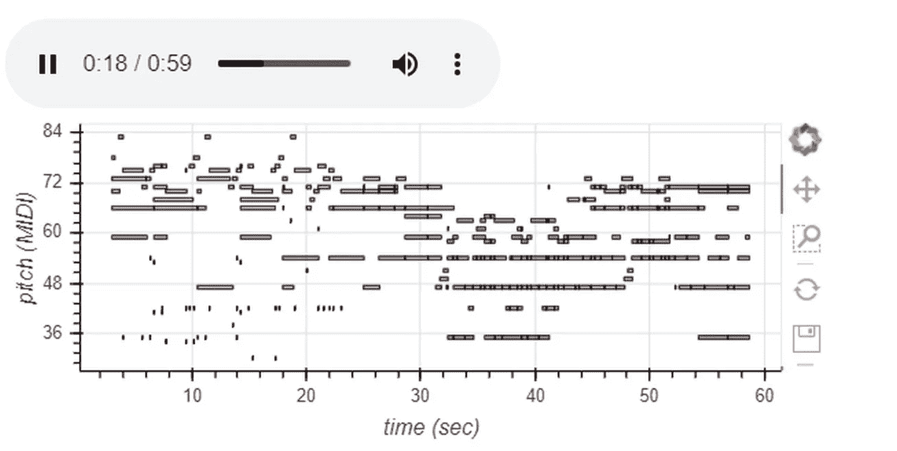

Merzmesch 从 Magenta Colab 笔记本上截取的截图

**要尝试的东西:**

笔记本提供了很多可能性，比如说对于延续，调制，它都允许。wav 和。midi 导出。Magenta 是 GoogleAI 的一个项目。巨大的东西，它甚至包括[硬件](https://magenta.tensorflow.org/demos/hardware/)。

如果你只是想听，这里是洋红色电台:

[](https://magenta.github.io/listen-to-transformer) [## 聆听变形金刚

### Music Transformer 是谷歌 Magenta 研究小组的一个开源机器学习模型，可以生成…

magenta.github.io](https://magenta.github.io/listen-to-transformer) 

链接:

*   [Google . ai 出品的洋红色](https://magenta.tensorflow.org/)
*   [Colab 笔记本](https://colab.research.google.com/notebooks/magenta/piano_transformer/piano_transformer.ipynb)
*   [洋红色-收音机](https://medium.com/merzazine/icymi-002-on-mondrian-mice-ai-pok%C3%A9mon-and-shakesperian-geekness-34d1c3ba579c)

## 人工智能的民主化

这就是 Colab 笔记本的使命——为广大读者提供使用 ML/DL 的可能性。让人工智能变得触手可及。提高数字意识和能力。

而这仅仅是**艾春天**的开始。经过多年的冰雪覆盖。冷冻系统之后。

在这些图书馆中，您可以找到更多笔记本:

[](https://github.com/tugstugi/dl-colab-notebooks) [## tugstugi/dl-colab-笔记本

### 在 Google cola b-tugstugi/dl-cola b-notebooks 上在线尝试深度学习模型

github.com](https://github.com/tugstugi/dl-colab-notebooks) [](https://github.com/mrm8488/shared_colab_notebooks) [## MRM 8488/shared _ colab _ 笔记本

### 存储我创建和共享的 Google 协作笔记本的回购-MRM 8488/shared _ colab _ Notebooks

github.com](https://github.com/mrm8488/shared_colab_notebooks) 

**让我们实验，探索，创造！**

你最喜欢的 Colab 笔记本有哪些？在评论中分享吧！