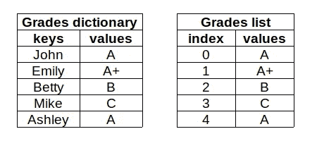
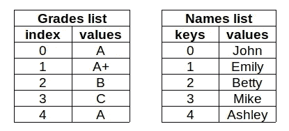
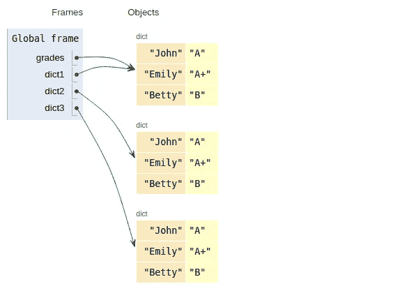

# 掌握 Python 词典的 12 个例子

> 原文：<https://towardsdatascience.com/12-examples-to-master-python-dictionaries-5a8bcd688c6d?source=collection_archive---------7----------------------->

## 学习词典的综合实用指南


照片由[皮斯特亨](https://unsplash.com/@pisitheng?utm_source=unsplash&utm_medium=referral&utm_content=creditCopyText)在 [Unsplash](https://unsplash.com/s/photos/dictionary?utm_source=unsplash&utm_medium=referral&utm_content=creditCopyText) 上拍摄

数据结构是任何编程语言的关键部分。为了创建健壮且性能良好的产品，人们必须非常了解数据结构。

在这篇文章中，我们将研究 Python 编程语言的一个重要数据结构，那就是*字典*。

Dictionary 是一个无序的键值对集合。每个条目都有一个键和值。字典可以被认为是一个有特殊索引的列表。

这些键必须是唯一且不可变的。所以我们可以使用字符串、数字(int 或 float)或元组作为键。值可以是任何类型。

考虑这样一种情况，我们需要存储学生的成绩。我们可以将它们存储在字典或列表中。



(图片由作者提供)

使用字典，我们可以通过提供学生的姓名(答案)来访问每个学生的成绩。另一方面，为了能够访问特定学生的成绩，我们需要一个额外的列表。

新列表包含学生的姓名，并且与成绩列表具有完全相同的顺序。



(图片由作者提供)

因此，对于这种情况，字典比列表更好。

在这个简短的介绍之后，让我们从例子开始深入字典。这些例子将涵盖字典的特性以及对它们进行操作的功能和方法。

## 1.创建字典

我们可以通过在花括号之间提供 0 个或更多的键值对来创建一个字典。

```
empty_dict = {}grades = {'John':'A', 'Emily':'A+', 'Betty':'B', 'Mike':'C', 'Ashley':'A'}grades
{'Ashley': 'A', 'Betty': 'B', 'Emily': 'A+', 'John': 'A', 'Mike': 'C'}
```

## 2.访问值

我们通过提供索引来访问列表中的值。类似地，在字典中，通过使用键来访问值。

```
grades['John']
'A'grades.get('Betty')
'B'
```

## 3.所有值和/或所有键

keys 方法用于获取所有的密钥。

```
grades.keys()dict_keys(['John', 'Emily', 'Betty', 'Mike', 'Ashley'])
```

返回对象是一个可迭代的 dict_keys 对象。因此，我们可以在 for 循环中迭代它。

同样，values 方法返回所有值。

```
grades.values()dict_values(['A', 'A+', 'B', 'C', 'A'])
```

我们不能对 dict_keys 或 dict_values 进行索引，但是我们可以将它们转换成一个列表，然后使用索引。

```
list(grades.values())[0]
'A'
```

items 方法返回元组中的键值对。

```
grades.items()dict_items([('John', 'A'), ('Emily', 'A+'), ('Betty', 'B'), ('Mike', 'C'), ('Ashley', 'A')])
```

## 4.更新或添加项目

字典是可变的，所以我们可以更新、添加或删除条目。更新或添加项目的语法是相同的。如果字典中存在给定的键，则更新现有项的值。否则，将创建一个新项目(即键值对)。

```
grades['Edward'] = 'B+'
grades['John'] = 'B'grades
{'Ashley': 'A',
 'Betty': 'B',
 'Edward': 'B+',
 'Emily': 'A+',
 'John': 'B',
 'Mike': 'C'}
```

## 5.用新字典更新

我们还可以将字典传递给更新函数。该词典将根据新词典中的项目进行更新。用一个例子会更清楚。

考虑以下年级和年级 _ 新词典:

```
grades = {'John':'A', 'Emily':'A+', 'Betty':'B', 'Mike':'C'}
grades_new = {'John':'B', 'Sam':'A', 'Betty':'A'}
```

如果我们基于 grades_new 更新成绩，John 和 Betty 的值也将被更新。此外，一个新的项目('山姆':' A ')将被添加。

```
grades.update(grades_new)grades
{'Betty': 'A', 'Emily': 'A+', 'John': 'B', 'Mike': 'C', 'Sam': 'A'}
```

## 6.删除项目

我们可以使用 del 或 pop 函数来删除一个项目。我们只是传递要删除的条目的键。

```
del(grades['Edward'])grades.pop('Ashley')
'A'grades
'Betty': 'B', 'Emily': 'A+', 'John': 'B', 'Mike': 'C'}
```

与 del 函数不同，pop 函数返回被删除项的值。因此，我们可以选择将它赋给一个变量。

## 7.可重复的字典

我们可以迭代字典。默认情况下，迭代是基于键的。

```
for i in grades:
    print(i)John
Emily
Betty
Mike
```

我们还可以迭代值(grades.values())或键值对(grades.items())。

## 8.词典理解

它类似于列表理解。词典理解是一种基于可重复项创建词典的方法。

```
{x: x**2 for x in range(5)}
{0: 0, 1: 1, 2: 4, 3: 9, 4: 16}{word: len(word) for word in ['data','science','is','awesome']}
{'awesome': 7, 'data': 4, 'is': 2, 'science': 7}
```

iterable 中的元素成为字典的键。这些值是基于字典理解中的赋值来确定的。

## 9.从列表列表中创建字典

我们可以使用列表或元组列表来创建字典。

```
a = [['A',4], ['B',5], ['C',11]]dict(a)
{'A': 4, 'B': 5, 'C': 11}b = [('A',4), ('B',5), ('C',11)]dict(b)
{'A': 4, 'B': 5, 'C': 11}
```

## 10.从字典到数据框架

Pandas 的 dataframe 函数可用于使用字典创建数据帧。键成为列名，值成为行。

到目前为止，我们已经用值是字符串的字典做了例子。然而，字典中的值可以是任何类型，比如列表、numpy 数组、其他字典等等。

在从字典创建数据帧的情况下，值由数组组成(例如 list、numpy 数组)。

```
import numpy as np
import pandas as pddict_a = {'names':['Amber','John','Edward','Emily'],
         'points':np.random.randint(100, size=4)}df = pd.DataFrame(dict_a)
df
```


## 11.清澈透亮

len 函数返回字典中条目的数量(即长度)。clear 方法用于删除字典中的所有条目，因此我们将得到一个空字典。

```
len(grades)
4grades.clear()len(grades)
0
```

## 12.抄写字典

```
grades = {'John':'A', 'Emily':'A+', 'Betty':'B'}dict1 = gradesdict2 = grades.copy()dict3 = dict(grades)
```

所有 dict1、dict2 和 dict3 都包含与 grades 完全相同的键值对。然而，dict1 只是一个指向等级中的键值对的指针。因此，成绩的任何变化也会改变字典 1。

Dict2 和 dict3 在内存中是独立的对象，因此它们不会受到成绩变化的影响。



创建于 [pythontutor](http://pythontutor.com/) (图片由作者提供)

我们需要特别注意如何抄写字典。

## 额外收获:使用 Python 3.9 合并和更新操作符

Python 3.9 为字典提供了 merge(“|”)和 update(“| =”)操作符。我还没有安装 Python 3.9，所以我将使用来自 [python 文档](https://docs.python.org/3/whatsnew/3.9.html)的例子:

```
>>> x = {"key1": "value1 from x", "key2": "value2 from x"}
>>> y = {"key2": "value2 from y", "key3": "value3 from y"}
>>> x | y
{'key1': 'value1 from x', 'key2': 'value2 from y', 'key3': 'value3 from y'}
>>> y | x
{'key2': 'value2 from x', 'key3': 'value3 from y', 'key1': 'value1 from x'}
```

字典是 Python 中非常重要的数据结构，在很多情况下都会用到。我们在这篇文章中所举的例子将涵盖你需要了解的关于字典的大部分内容。它们会让你在使用字典时感到舒适。

然而，当然还有更多。就像任何其他科目一样，熟能生巧，你会在不断练习中掌握。

感谢您的阅读。如果您有任何反馈，请告诉我。