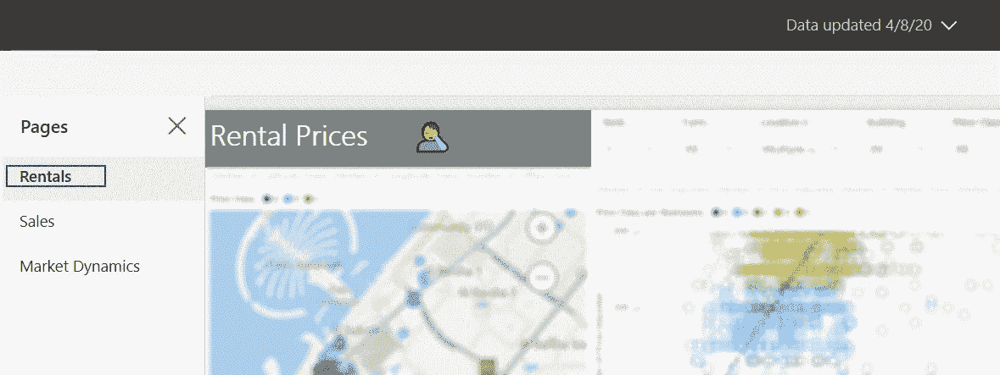

# 仪表板的 12 条不太明显的规则

> 原文：<https://towardsdatascience.com/12-less-obvious-rules-for-your-dashboard-4d7c35a1cee9?source=collection_archive---------33----------------------->

## 开始可视化之旅时的常见陷阱

挪威厄斯峡湾。作者照片。

既然您已经找到了这里的方法，那么您可能是一名试图理解您的数据以传递信息的分析师，或者是一名试图帮助分析师实现这一目标的设计师/开发人员。我主要在后一个联盟中工作，所以我日常工作的一部分包括让商业用户能够通过数据自助服务他们的决策过程。在这里，我将分享一些对*业务分析师*有用的精选技巧(我在许多项目中反复看到这些东西)。开发者社区应该也非常好。不过，DataViz 的人在这里可能看不到太多新东西。

你可能已经读过关于数据可视化的最重要和最通用的建议，比如:*一个观众*、*一个目的*、*一个故事*、*区域*和*一个流程*。我们将在这里跳过它。如果你想冒险，请查阅一些组织良好的快速阅读材料来开始你的冒险之旅:

[仪表盘设计的 10 条法则](https://medium.muz.li/10-rules-of-dashboard-design-f1a4123028a2)
[如何设计和打造一个伟大的仪表盘](https://www.geckoboard.com/best-practice/dashboard-design/)

所以。你已经得到了数据，*你理解了它*你准备好上场了。让我们记住几个核心思想:

*   **可视化是关于形状的。数字对人脑来说是不自然的。我们生来就没有数字、数字和数学的概念。然而，我们有一个预先训练好的神经网络来进行形状识别。**
*   **少即是多。如果你能用更少的形状和顶点来展示一些东西，那就去做吧。视觉障碍减缓了感知。最重要的是，有些模式会触发你的潜意识背景威胁分析，应该避免。**

# 条形图和折线图

1.簇状条形图最擅长创造一种令人不安的斑马效果。使用条形图+折线图或折线图/面积图，可以用较少的形状和顶点来传达相同的信息。

聚类图(左上角)具有最高的视觉复杂度(形状和顶点的数量)。面积图(右下角)的视觉复杂度最低。

2.永远不要用堆积图来表示不能自然总结的事物。

典型的错误是将“总计”(即收入)或“小计”包括在你累加的东西中。第二个最常见的错误——累加平均值(平均值不能相加！).

3.避免自然总结的事物的未堆叠图表(除非你知道你在做什么)

除非你想比较上例中城市之间的数字，否则你应该累加。即使你想比较城市之间的数据，那也是骗人的，因为一个城市市场份额的减少并不意味着这个城市的表现不好。只能说明另一个城市表现更好。

4.避免长尾条形图(以及随之而来的未使用的空白空间)。使用树形图或“Top *N* 条形图可能会更好。

长尾不仅带来大量的空白空间；它们还造成了一种错误的印象，即前 10 根棒线很重要(而在上面的例子中，它们总共只占总量的 12%，88%的交易量来自小棒线)。

好了，今天的条形图已经足够了；让我们继续我们的下一个最爱…

# 饼图

让我们重复一下:*饼图的分析值*(您无法直观地感知“这个切片”比“那个切片”大多少，因此您最终会检查每个有问题的切片的数字，并手动计算)。

除了其他问题，香草饼图往往有尖锐的边缘靠近中心。圆环图看起来更轻，内部有一个数字空间。

5.这伴随着一个“但是”:作为哺乳动物，我们在出生时就锁定了圆形，所以当我们看到圆形时，它自然会吸引我们。使用甜甜圈图来美化事物，并把注意力吸引到最重要的数字上。我们不想要一个全条形图的无聊仪表盘，对吧？

# 轴线

6.条形图更适合于分类轴。对于时间线，折线图效果更好。

然而，这不是一个规则。如果你打算用时间作为交叉过滤器，条形图会更有意义(因为条形图更容易点击)。反之亦然，如果你的条形图有太多的条，你可以通过切换到面积图来释放视觉压力。

7.如果您必须有多个时间线图表，请将它们叠放在一起，使它们的轴对齐。

也尽量有相同的时间框架。

8.确实有秤。它们可以让您避免在每个数据点显示太多值的混乱。

你的观众可能以前看过图表。有些人见过很多。他们的大脑被训练通过在特定的地方寻找特定的元素来阅读图表。缺少轴线会破坏这种阅读过程，引起烦恼。

# 颜色；色彩；色调

9.简单。图表中的相同事物使用相同的颜色。

你也可以用浅色表示计划(没有发生的事情)，纯色表示事实(发生的事情)。

# 过滤

10.如今，大多数工具都带有可折叠的过滤板。使用它，而不是消耗仪表板的宝贵空间。

我们都不喜欢躲不开的讨厌广告。那么为什么我们喜欢全屏消费内容时无法隐藏的切片器呢？

# 文本、数字和表格

11.理想情况下，这些不应该太多。如果已经在其他地方显示了页面标题或数据日期，则不需要在报告中重复它(除非您试图创建一个可打印的报告，在这种情况下:为什么呢？).

可视化应该是不言自明的。如果没有，可能即使是文本也无济于事。

12.真的需要那么多*裸*号吗？都是关于形状的，记得吗？

如果数字在图表中非常明显，就没有必要把它复制成文本。在多个地方显示相同的数字会使人困惑并浪费空间。

# 额外收获:统计技巧

与简单平均值不同，中位数可以抵抗异常值和偏态。

在真实的数据中，你会不时地遇到偏差很大的值，它们会极大地影响平均值。这就是为什么我们使用中值收入/价格/持续时间，而不是平均值。

分布形状告诉你的不仅仅是简单的平均值/最小值/最大值。看起来也很花哨。

在你的生活中，比你想象的更多的时候，你会对非一般事物感兴趣。

对数标度适用于指数。如果你需要操纵你的观众做些什么，他们也是一个很好的工具。

“我们的销售额在 4 月份有所下降，但我们预计会很快恢复，现在完全不会打包我们的东西”。很酷很正常！

你猜对了。请不要这样做。

还有…奖金奖金！从这个故事开始，还有更多吸引人的角色:

干杯！