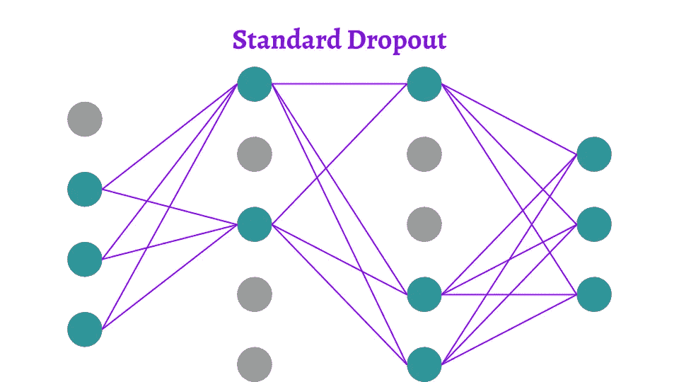

# 12 种主要的退出方法:DNNs、CNN 和 RNNs 的数学和视觉解释

> 原文：<https://towardsdatascience.com/12-main-dropout-methods-mathematical-and-visual-explanation-58cdc2112293?source=collection_archive---------12----------------------->

## 深入研究用于正则化、蒙特卡罗不确定性和模型压缩的 DNNs、CNN 和 RNNs 丢弃方法

# 动机

在**(深度)机器学习**中训练模型的**重大挑战**之一就是**协同改编**。这意味着神经元非常依赖彼此。它们在很大程度上相互影响，并且在输入方面不够独立。同样常见的情况是，一些神经元具有比其他神经元更显著的预测能力。换句话说，我们的输出过度依赖于一个神经元。

这些影响**必须避免**并且重量必须分配给**以防止过度配合**。一些神经元的共同适应性和高预测能力可以用不同的**正则化**方法来调节。最常用的一种是**辍学**。然而，辍学方法的全部能力很少被使用。

根据是 **DNN** ，还是 **CNN** 还是 **RNN** ，可以采用不同的**退出方式**。实际操作中，**我们只用一个**(或者差不多)。我认为这是一个可怕的陷阱。所以在这篇文章中，我们将从数学上**和视觉上**深入到辍学者的世界中去理解:

*   标准辍学方法
*   标准辍学的变体
*   应用于 CNN 的退出方法
*   应用于 RNNs 的退出方法
*   其他压差应用(蒙特卡罗和压缩)

(不好意思停不下来，所以是 12 法多一点…😄)

# 记号

# 标准辍学

最广为人知和使用的**退出方法是 Hinton 等人在 2012 年推出的**标准退出**【1】..通常简称为“**辍学”**，出于显而易见的原因，在本文中我们将称之为标准辍学。**

p=0.5 时的辍学

为了**防止过拟合**在**训练**阶段，神经元被**随机省略**。在密集(或全连接)网络中引入，**对于每一层**我们给出了**丢失**的概率`p`。在每次迭代中，每个神经元都有被忽略的概率`p`。Hinton 等人的论文推荐了输入层上的丢失概率`p=0.2`和隐藏层上的概率`p=0.5`。显然，我们对输出层感兴趣，这是我们的预测。因此，我们不在输出层应用辍学。

在数学上，我们说每个神经元的遗漏概率遵循一个**伯努利**概率分布`p`。因此，我们在神经元(层)的向量与**掩码之间进行**元素方式的**乘法，其中每个元素都是遵循伯努利分布**的随机变量。

在**测试**(或推断)阶段，没有**没有脱落**。所有的神经元都是活跃的。为了补偿与训练阶段相比的额外信息，我们**根据出现的概率**进行加权。所以一个神经元不被忽略的概率。是`1-p`。

# 下拉连接

也许你已经熟悉了标准的辍学方法。但是有很多变化。要调整密集网络的前向传递，您可以对神经元应用下降。L. Wan 等人介绍的**drop connect**【2】不是**而是**直接在神经元上施加压降，而是在连接这些神经元的权重和偏置**上施加压降。**

p=0.5 时的辍学

因此，我们发现了与标准辍学方法相同的机制。除了掩模(其元素是遵循分布的随机变量)不是应用于**神经元** **向量** **而是应用于将该层连接到前一层的权重矩阵**。

对于测试阶段，可以使用与标准退出方法相同的逻辑。我们可以乘以**出现的概率**。但这不是 L. Wan 等人提出的方法。这很有趣，因为他们提出了**一种即使在测试阶段**也能通过应用 DropConnect 的**高斯近似**来处理 dropout】的随机方法。然后通过**从该高斯表示中随机抽取样本**。我们将在突出部分之后回到高斯近似。

# 杰出的人

L. J. Ba 和 B. Frey 介绍的**脱颖而出**【3】作为一种标准的脱颖而出方法，是基于一个**伯努利**面具(我会根据这些面具所遵循的分布来称呼它们，这样会更简单)。不同之处在于，在层上，省略神经元的概率`p`是**而不是常数。根据重量**的**值**自适应**。**

这可以用于任何`g`激活函数，甚至可以是一个单独的神经网络。同样，对于`Ws`，它可以是`W`的函数。然后对于测试阶段，我们通过出现的概率来平衡。

## 例子

有点晦涩，举个例子吧。在他们的论文中，他们表明在实践中**信任网络权重**可以近似为权重的**仿射函数**。又比如我会把乙状结肠的**绝对值作为**激活函数**。**

与突出示例相比，p=0.5 时的标准压差

因此，我们可以看到**权重**越大，神经元被忽略的**概率**就越大。这有力地限制了某些神经元可能具有的高预测能力。

# 高斯漏失

应用于神经网络的退出方法的列表继续增长。因此，在继续讨论 DNNs 之外的其他内容之前，我想谈谈一类辍学方法，这无疑是最令人着迷的。

仅举几个例子，**快速辍学**【4】，**变化辍学**【5】或**具体辍学**【6】是从**贝叶斯角度**解释辍学的方法。具体地说，我们有一个掩码，其元素是遵循高斯分布 ( **正态**分布)的随机**变量，而不是伯努利掩码。这里不赘述**大数定律**的论证，那不是重点。所以我们试着直观的理解一下这个**。****

****

**p=0.5 时的辍学**

**论文[4]、[5]和[6]表明我们可以用正态定律 T20 为我们的辍学者模拟 T17 伯努利面具 T18。但这有什么区别。**万物与虚无同时存在。由于**共同适应**和/或我们神经元的**预测能力**，它不会改变任何关于这些方法与**过度拟合**的相关性的事情。但是与之前介绍的方法相比，它改变了训练阶段所需的执行时间。****

**从逻辑上讲，通过在每次迭代中省略掉丢失的神经元，**那些在迭代中被省略的神经元在反向传播期间不被更新**。他们不存在。所以训练阶段是**放慢了**。另一方面，通过使用高斯丢弃方法，**所有神经元在每次迭代**和每个训练样本中暴露。这样就避免了减速。**

****

**在数学上，存在与高斯掩码的乘法(例如以 1 为中心，具有伯努利定律标准偏差`p(1-p)`)。这个**通过在每次迭代中保持所有神经元**活动**来随机**加权它们的预测能力**来模拟**退出。这种方法的另一个实际优势集中在 1:在测试阶段，与没有脱落的模型相比，不需要进行修改。**

# **集体辍学**

**本文的“难”理解部分结束了。保留更多的**直观的**部分给我们**更好的性能**。**

****

****图像**或**特征图**的问题是像素非常**依赖于它们的邻居**。简而言之，在一张猫的图片上，如果你取一个对应于它皮毛的像素，那么所有相邻的像素都将对应于同一皮毛。几乎没有或者**没有区别**。**

**所以我们理解标准辍学方法的**极限**。我们甚至可以说它是**低效的**，它带来的唯一改变是**额外的计算时间**。如果我们随机忽略图像上的像素，那么几乎没有信息被删除。**省略的像素与其周围的像素**几乎相同。表示**性能差**防止过拟合。**

****

**为什么不利用**适当的**并且经常在**CNN**中使用的层。例如**最大池层**。对于那些不知道的人:最大池层是一张图片上传递的过滤器或(特征图)选择重叠区域的最大激活。**

****

****Max-Pooling Dropout**【7】是 H. Wu 和 X. Gu 提出的一种应用于细胞神经网络的退出方法。在执行池化操作之前，它将伯努利遮罩直接应用于**最大池化层**内核**。直觉上，这使得高活化剂的聚集最小化。限制某些神经元沉重的预测能力是一个非常好的观点。在测试阶段，您可以像前面的方法一样，根据出现的概率进行加权。****

****

**最大池层已被作为一个例子，但同样可以用**其他池层**来完成。例如，对于**平均池层**，我们可以在培训阶段以同样的方式应用退出。然后在测试阶段，将不会有变化，因为它已经是一个加权平均。**

# ****空间缺失****

**对于 CNN，我们可以利用池层。但是，我们也可以通过遵循 J. Tompson 等人提出的**空间丢失**【8】方法来变得更聪明。他们建议**克服经典丢失方法的问题**，因为**相邻像素**与**高度相关**。**

****

**我们可以考虑**对每个特征映射**应用一个丢弃，而不是随机地对像素应用一个丢弃。如果我们以我们的猫为例，那么这就像从图像中移除红色，并迫使它对图像的蓝色和绿色进行概括。然后，在下一次迭代中随机丢弃其他特征图。**

**我不知道如何恰当地用数学来表达，使它变得易懂。但是如果你理解了前面的方法，你就不会有任何问题了。在**训练**阶段，按照具有遗漏概率`p`的特征图应用**伯努利掩码****。然后，在**测试**阶段，没有丢失，而是通过出现概率`1-p`对**进行**加权。****

# **断流器**

****

**让我们**深入**我们的方法，以克服相邻像素高度相关的事实。代替对每个特征图应用伯努利掩模，它们可以在区域中**应用。这就是 T. DeVries 和 G. W. Taylor 提出的**剪切**方法【9】。****

**通过最后一次以我们的猫图像为例:这种方法可以通过**隐藏图像的区域**来进行归纳，从而限制过度拟合。我们最终得到猫的头垂下的图像。这迫使 CNN 去识别描述一只猫的不太明显的属性。**

**这一节也没有数学。这种方法在很大程度上取决于我们的想象力:正方形区域、长方形、圆形、所有的特征地图、一次一个或者可能几个……这由你**决定**。😃**

# **最大落差**

**最后，在结束关于 CNN 的这一节之前，我必须指出，显然可以将几种**方法结合起来**。当我们知道不同的方法时，这就是让我们强大的原因:我们可以同时利用它们的好处。这就是 S. Park 和 N. Kwak 提出的他们的**最大落差**方法【10】。**

****

**这种方法在某种程度上是池丢失和高斯丢失的混合。在**最大池层**上执行退出，但是使用**贝叶斯方法**。**

****

**在他们的论文中，他们展示了这种方法给出的结果与**一样有效**与空间丢失一样。此外，在每次迭代中，所有神经元都保持激活，这**限制了训练阶段的减速**。
这些结果是在= 0.02 和σ = 0.05 时获得的。**

# **RNNDrop**

********

**嗯，我们已经看到了 DNNs 和 CNN 的一些退出方法。该研究还试图找出哪些方法对循环神经网络 (RNNs)有效。他们通常依赖于 LSTMs，所以我将采用 RNNs 的这种特殊情况。它将**推广**到其他 rnn。**

**问题很简单:对 RNN 申请退学是危险的。从这个意义上来说，RNN 的目的是**保持对事件的长期记忆**。但是传统的辍学方法效率不高，因为它们**会产生噪音**，阻止这些模型保持长期记忆。将要介绍的方法允许**长期保存这种记忆**。**

********

**T. Moon 等人提出的**RNNDrop**【11】是最简单的方法。一个**伯努利**掩码仅应用于隐藏的**单元状态**。但是这个屏蔽从序列到另一个保持**相同。这被称为**丢失**的每序列采样。这仅仅意味着在每次迭代中，我们创建一个随机掩码。然后从一个序列到另一个序列，该**屏蔽保持不变**。因此被丢弃的元素保持被丢弃，而当前的元素保持存在。所有的序列都是这样。****

# **经常辍学**

********

**S. Semeniuta 等人提出的**复发性辍学**【12】是一个有趣的变体。单元状态保持不变。下降仅适用于更新单元状态的**部分。所以在每次迭代中，伯努利掩模使得一些元素不再对长期记忆有贡献。但是**内存没有改变**。****

# **变化的 RNN 辍学**

********

**最后，Y. Gal 和 Z. Ghahramani 介绍的 **RNN 丢弃**【13】是在**内部门**之前应用基于序列的丢弃。这导致 LSTM 的**不同点**上的信号丢失。**

# ****打开我们的思维****

**仍然有许多不同的辍学方法，但是我们将在这里停止这篇文章。完成它，我发现知道**辍学方法不仅仅是正规化方法**非常有趣。**

## **蒙特卡洛辍学**

****

**退出方法还可以提供模型**不确定性**的**指标**。让我解释一下。对于相同的输入，经历退出的模型将在每次迭代中拥有**不同的架构**。这导致**输出**中的**差异**。如果网络**相当一般化**并且如果**共同适应**受限，则预测**分布**在整个模型中。这导致在具有相同输入的每次迭代中输出的**较低的方差**。研究这个方差可以给出分配给模型的**置信度**的概念。这可以从 Y. Gal 和 Z. Ghahramani 的方法中看出[14]。**

## **模型压缩**

**最后**直观的**，通过随机应用漏失，我们可以看到给定神经元甚至层的**效率或无效率**进行预测。根据这一观察，我们可以通过减少参数数量来压缩模型，同时将性能下降最小化。K. Neklyudov 等人[15]已经提出了这样一种方法，该方法使用变分丢失来修剪 DNNs 和 CNN。**

****

> **知识就是分享。
> **支持**我，一键获得**访问 [**中我所有文章的**。](https://axel-thevenot.medium.com/membership)****

****

# **来源和参考**

**[1] G. E. Hinton，N. Srivastava，A. Krizhevsky，I. Sutskever 和 R. R. Salakhutdinov，**通过防止特征检测器的共同适应来改进神经网络****

**[2] L. Wan，m .，S. Zhang，Y. LeCun 和 R. Fergus，**使用 dropconnect 调整神经网络****

**[3] L. J. Ba 和 B. Frey，**用于训练深度神经网络的自适应退出****

**[4] S .王和 c .曼宁，**快速辍学训练****

**[5] D. P .金玛、t .萨利曼斯和 m .韦林，**变分退出和局部重新参数化技巧****

**[6] Y. Gal，J. Hron，A. Kendall，**混凝土脱落****

**[7] H. Wu 和 X. Gu，**卷积神经网络的丢失训练****

**[8] J. Tompson、R. Goroshin、A. Jain、Y. LeCun 和 C. Bregler，**使用卷积网络的有效目标定位****

**[9] T. DeVries 和 G. W. Taylor，**改进了截断卷积神经网络的正则化****

**[10] S. Park 和 N. Kwak，**卷积神经网络中的丢包效应分析****

**[11] T. Moon，H. Choi，H. Lee 和 I. Song， **Rnndrop****

**[12]s . semen uita，A. Severyn 和 E. Barth，**无记忆丧失的经常性辍学****

**[13] Y. Gal 和 Z. Ghahramani，**递归神经网络中辍学的理论基础应用****

**[14] Y. Gal 和 Z. Ghahramani，**辍学作为贝叶斯近似:表示深度学习中的模型不确定性****

**[15] K. Neklyudov、D. Molchanov、A. Ashukha 和 D. P. Vetrov，**通过对数正态乘法噪声进行结构化贝叶斯修剪****

**[16] A. Labach，H. Salehinejad，**深度神经网络退出方法调查****

****所有图片和 gif 都是自制的，可以免费使用****