# 你应该阅读的 12 篇论文，以了解深度学习时代的对象检测

> 原文：<https://towardsdatascience.com/12-papers-you-should-read-to-understand-object-detection-in-the-deep-learning-era-3390d4a28891?source=collection_archive---------1----------------------->

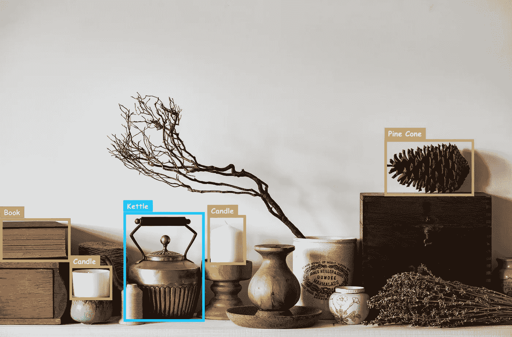

免费图片来自 [Unsplash](https://unsplash.com/photos/qcqmS0JG58Q) 。摄影来自[乔安娜·科辛斯卡](https://unsplash.com/@joannakosinska)，并由本人编辑。

# 序

作为“您应该阅读的论文”系列的第二篇文章，我们将回顾计算机视觉研究中一个更困难的领域:对象检测的历史和一些最近的发展。在深度学习时代之前，像 HOG 和特征金字塔这样的手工制作的特征被普遍用于捕捉图像中的定位信号。然而，这些方法通常不能很好地扩展到一般的目标检测，因此大多数应用仅限于人脸或行人检测。借助深度学习的力量，我们可以训练网络来学习捕捉哪些特征，以及预测对象的坐标。这最终导致了基于视觉感知的应用的繁荣，如商用人脸识别系统和自动驾驶汽车。在这篇文章中，我为想学习物体检测的新人挑选了 12 篇必读论文。尽管构建对象检测系统最具挑战性的部分隐藏在实现细节中，但是阅读这些论文仍然可以让您很好地从高层次理解这些想法的来源，以及对象检测在未来将如何发展。

作为阅读本文的先决条件，您需要了解卷积神经网络的基本思想和常用的优化方法，如带反向传播的梯度下降。也强烈推荐阅读我之前的文章《[你应该阅读的 10 篇论文了解深度学习时代的图像分类](/10-papers-you-should-read-to-understand-image-classification-in-the-deep-learning-era-4b9d792f45a7)》首先是因为很多很酷的物体检测想法都源于一个更基础的图像分类研究。

# 2013 年:暴饮暴食

> OverFeat:使用卷积网络的综合识别、定位和检测

出自“[*《over fat:利用卷积网络的综合识别、定位和检测》*](https://arxiv.org/abs/1312.6229)*”*

受 AlexNet 在 2012 年 ImageNet 比赛中的早期成功的启发，基于 CNN 的特征提取击败了所有手工制作的特征提取器，OverFeat 很快将 CNN 引入了对象检测领域。这个想法非常直接:如果我们可以使用 CNN 对一幅图像进行分类，那么用不同大小的窗口贪婪地滚动整个图像，并尝试使用 CNN 对它们逐一进行回归和分类，怎么样？这利用了 CNN 用于特征提取和分类的能力，并且还通过预定义的滑动窗口绕过了硬区域提议问题。此外，由于附近的卷积核可以共享部分计算结果，因此没有必要为重叠区域计算卷积，从而大大降低了成本。OverFeat 是一级物体探测器的先驱。它试图在同一个 CNN 中结合特征提取、位置回归和区域分类。不幸的是，由于使用的先验知识较少，这种一步方法的准确性相对较差。因此，OverFeat 未能引领一阶段探测器研究的热潮，直到两年后一个更优雅的解决方案问世。

# 2013 年:美国有线电视新闻网

> 用于精确目标检测和分割的基于区域的卷积网络

同样是 2013 年提出的，R-CNN 和 OverFeat 相比有点晚。然而，这种基于区域的方法最终以其两阶段框架，即区域提议阶段和区域分类和细化阶段，导致了一波大的对象检测研究。

从 [*基于区域的卷积网络进行精确的对象检测和分割*](http://islab.ulsan.ac.kr/files/announcement/513/rcnn_pami.pdf)

在上图中，R-CNN 首先使用一种称为选择性搜索的技术从输入图像中提取潜在的感兴趣区域。选择性搜索并不真正试图理解前景对象，相反，它通过依赖一种启发式方法对相似的像素进行分组:相似的像素通常属于同一对象。所以选择性搜索的结果有非常高的概率包含有意义的东西。接下来，R-CNN 将这些区域提议扭曲成具有一些填充的固定大小的图像，并将这些图像馈送到网络的第二级，以进行更细粒度的识别。与那些使用选择性搜索的旧方法不同，R-CNN 在第二阶段用 CNN 代替 HOG 来从所有区域提议中提取特征。这种方法的一个警告是，许多地区提案并不是真正的完整对象，因此 R-CNN 不仅需要学会对正确的类别进行分类，还需要学会拒绝负面的类别。为解决这一问题，R-CNN 将所有 IoU 重叠≥ 0.5 的地区提案视为积极提案，其余视为消极提案。

来自选择性搜索的区域提议高度依赖于相似性假设，因此它只能提供位置的粗略估计。为了进一步提高定位精度，R-CNN 借鉴了“用于对象检测的深度神经网络”(又名 DetectorNet)的思想，引入了额外的包围盒回归来预测盒子的中心坐标、宽度和高度。这种回归器广泛应用于未来的目标探测器中。

然而，像 R-CNN 这样的两级检测器有两个大问题:1)它不是完全卷积的，因为选择性搜索不是 E2E 可训练的。2)与其它单阶段检测器(如 OverFeat)相比，区域建议阶段通常非常慢，并且单独运行每个区域建议会使其更慢。稍后，我们将看到 R-CNN 如何随着时间的推移发展来解决这两个问题。

# 2015:快速 R-CNN

> 快速 R-CNN

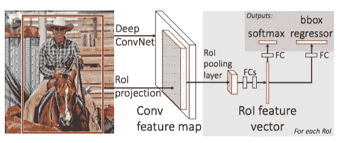

来自"[快速 R-CNN](https://arxiv.org/abs/1504.08083) "

R-CNN 的快速跟进是减少多个区域提议上的重复卷积。由于这些区域提议都来自一幅图像，自然要通过在整个图像上运行一次 CNN 来改进 R-CNN，并在许多区域提议之间共享计算。然而，不同的区域提议具有不同的大小，如果我们使用相同的 CNN 特征提取器，这也导致不同的输出特征图大小。这些具有不同大小的要素地图将阻止我们使用完全连接的图层进行进一步分类和回归，因为 FC 图层仅适用于固定大小的输入。

幸运的是，一篇名为“用于视觉识别的深度卷积网络中的空间金字塔池”的论文已经解决了 FC 层的动态规模问题。在 SPPNet 中，在卷积层和 FC 层之间引入了特征金字塔池，以创建特征向量的词袋样式。该矢量具有固定的大小，并对不同尺度的特征进行编码，因此我们的卷积层现在可以将任何大小的图像作为输入，而不用担心 FC 层的不兼容性。受此启发，Fast R-CNN 提出了一个类似的层，称为 ROI Pooling 层。该池图层将不同大小的要素地图缩减采样为固定大小的矢量。通过这样做，我们现在可以使用相同的 FC 层进行分类和盒回归，无论 ROI 是大是小。

通过共享特征提取器和比例不变 ROI 池层，快速 R-CNN 可以达到类似的定位精度，但训练速度快 10 ~ 20 倍，推理速度快 100 ~ 200 倍。接近实时的推理和用于检测部分的更简单的 E2E 训练协议使得快速 R-CNN 也成为业内的流行选择。

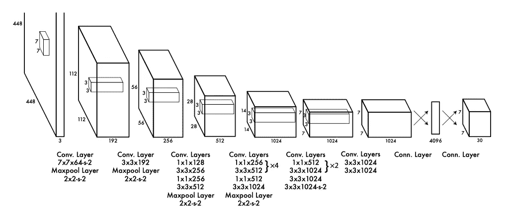

从 [*你只看一次:统一、实时的物体检测*](https://arxiv.org/abs/1506.02640)

*这种对整个图像的密集预测会导致计算成本方面的问题，所以 YOLO 从 GooLeNet 中提取了瓶颈结构来避免这个问题。YOLO 的另一个问题是，两个对象可能会落入同一个粗网格单元中，因此它不能很好地处理像一群鸟这样的小对象。尽管精确度较低，但 YOLO 的直接设计和实时推理能力使一阶段对象检测在研究中再次流行，也是行业的首选解决方案。*

# *2015 年:更快的 R-CNN*

> *更快的 R-CNN:用区域提议网络实现实时目标检测*

*正如我们在上面介绍的，在 2015 年初，Ross Girshick 通过对提议的区域使用共享特征提取器，提出了一种称为快速 R-CNN 的 R-CNN 的改进版本。仅仅几个月后，罗斯和他的团队再次带来了另一项改进。这个新的网络更快的 R-CNN 不仅比以前的版本更快，而且标志着用深度学习方法进行对象检测的里程碑。*

*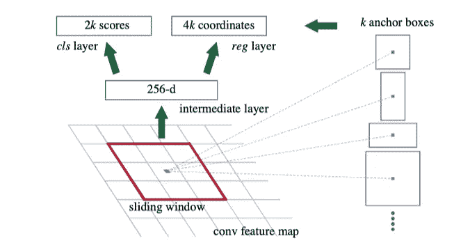*

*从" [*更快的 R-CNN:用区域建议网络实现实时目标检测*](https://arxiv.org/abs/1506.01497)*

**对于快速 R-CNN，网络的唯一非卷积部分是选择性搜索区域提议。截至 2015 年，研究人员开始意识到深度神经网络是如此神奇，它可以学习任何给定足够数据的东西。那么，有没有可能也训练一个神经网络来建议区域，而不是依赖于启发式和手工制作的方法，如选择性搜索？更快的 R-CNN 遵循这一方向和思路，成功创建了地区提案网(RPN)。简单来说，RPN 就是一个 CNN，它以一个图像为输入，输出一组矩形的物体提议，每个提议都有一个客观分数。该报最初使用的是 VGG，但后来像 ResNet 这样的主干网变得更加普及。为了生成区域提议，在 CNN 特征地图输出上应用 3×3 滑动窗口，以生成每个位置的 2 个分数(前景和背景)和 4 个坐标。实际上，这个滑动窗口是用 3×3 卷积核和 1×1 卷积核实现的。**

**虽然滑动窗口有固定的大小，但我们的对象可能会以不同的比例出现。因此，更快的 R-CNN 引入了一种叫做锚箱的技术。锚定框是预先定义的具有不同纵横比和大小但共享相同中心位置的先前框。在更快的 R-CNN 中，每个滑动窗口位置有 k=9 个锚，每个锚覆盖 3 个比例的 3 个纵横比。这些在不同尺度上重复的锚盒给网络带来了良好的平移不变性和尺度不变性特征，同时共享相同特征图的输出。注意，边界框回归将从这些锚框而不是整个图像来计算。**

**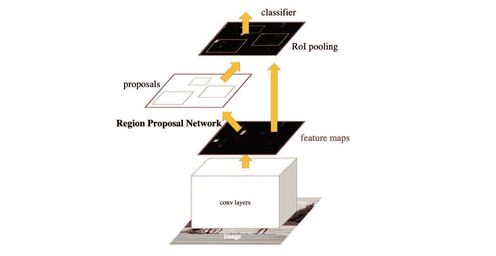**

**从" [*更快的 R-CNN:用区域建议网络实现实时目标检测*](https://arxiv.org/abs/1506.01497)**

***到目前为止，我们讨论了新的区域提议网络来取代旧的选择性搜索区域提议。为了进行最终检测，Fast R-CNN 使用来自 Fast R-CNN 的相同检测头来进行分类和细粒度定位。还记得 Fast R-CNN 也是用共享的 CNN 特征提取器吗？现在 RPN 本身也是一个特征提取 CNN，我们可以像上图一样只和探测头分享。这种共享设计并没有带来一些麻烦。如果我们一起训练 RPN 和快速 R-CNN 检测器，我们会将 RPN 建议视为 ROI pooling 的恒定输入，并且不可避免地忽略 RPN 的包围盒建议的梯度。一次走动被称为交替训练，你轮流训练 RPN 和快速 R-CNN。在后来的一篇论文“通过多任务网络级联的实例感知语义分割”中，我们可以看到 ROI 池层也可以变得可区分。***

# ***2015 年:YOLO v1***

> ***您只需查看一次:统一的实时对象检测***

***虽然 R-CNN 系列在研究社区对两阶段对象检测进行了大肆宣传，但其复杂的实现给维护它的工程师带来了许多头痛。物体检测需要这么繁琐吗？如果我们愿意牺牲一点准确性，我们能换来更快的速度吗？带着这些问题，Joseph Redmon 在 fast R-CNN 提交后仅四天就向 arxiv.org 提交了一个名为 YOLO 的网络，并最终在 OverFeat 首次亮相两年后将人气带回了一阶段物体检测。***

******

***从 [*你只看一次:统一、实时的物体检测*](https://arxiv.org/abs/1506.02640)***

***与 R-CNN 不同，YOLO 决定在同一个 CNN 中同时处理区域提议和区域分类。换句话说，它将对象检测视为回归问题，而不是依赖于区域建议的分类问题。总的想法是将输入分割成 SxS 网格，并且如果对象中心落入每个单元中，则让每个单元直接回归边界框位置和置信度得分。因为对象可能有不同的大小，每个单元将有多个边界框回归量。在训练过程中，具有最高 IOU 的回归变量将被分配与真实标签进行比较，因此同一位置的回归变量将随着时间的推移学习处理不同的尺度。同时，每个单元也将预测 C 类概率，条件是网格单元包含对象(高置信度得分)。这种方法后来被称为密集预测，因为 YOLO 试图预测图像中所有可能位置的类别和边界框。相比之下，R-CNN 依赖于区域提议来过滤掉背景区域，因此最终的预测要稀疏得多。***

# ***2015 年:固态硬盘***

> ***SSD:单次多盒探测器***

***YOLO v1 展示了一阶段检测的潜力，但两阶段检测的性能差距仍然明显。在 YOLO v1 中，多个对象可以被分配给同一个网格单元。当检测小物体时，这是一个巨大的挑战，并且为了将一级检测器的性能提高到与两级检测器相当，这成为一个需要解决的关键问题。SSD 就是这样一个挑战者，从三个角度攻击这个问题。***

***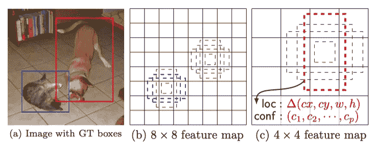***

***来自“ [*SSD:单次多盒探测器*](https://arxiv.org/abs/1512.02325)*”****

**首先，来自更快的 R-CNN 的锚箱技术可以缓解这个问题。同一区域中的对象通常具有不同的纵横比才可见。引入锚盒不仅增加了每个单元要检测的对象数量，还帮助网络更好地区分具有这种纵横比假设的重叠小对象。**

****

**来自 [*SSD:单次多盒探测器*](https://arxiv.org/abs/1512.02325)**

***SSD 通过在检测之前聚合多尺度特征，在这条路上走得更远。这是一种非常常见的方法，可以在 CNN 中提取细粒度的局部特征，同时保留粗略的全局特征。比如 CNN 语义分割的开创者 FCN，也从多个层面融合特征，细化分割边界。此外，多尺度特征聚合可以很容易地在所有常见的分类网络上执行，因此用另一个网络替换主干非常方便。***

***最后，SSD 利用了大量的数据增强，尤其是针对小对象的数据增强。例如，在随机裁剪之前，图像被随机扩展到大得多的尺寸，这给训练数据带来了缩小效果，以模拟小对象。此外，大包围盒通常很容易学习。为了避免这些简单的例子支配损失，SSD 采用了硬负挖掘技术来为每个锚盒挑选具有最高损失的例子。***

# ***2016 年:FPN***

> ***用于目标检测的特征金字塔网络***

***随着 fast-RCNN、YOLO 和 SSD 在 2015 年的推出，似乎一个物体探测器的总体结构已经确定。研究人员开始着眼于改善这些网络的各个部分。特征金字塔网络是通过使用来自不同层的特征形成特征金字塔来改进检测头的尝试。这种特征金字塔的想法在计算机视觉研究中并不新奇。当特征仍然是手动设计的时候，特征金字塔已经是识别不同尺度模式的非常有效的方法。在深度学习中使用特征金字塔也不是一个新想法:SSPNet、FCN 和 SSD 都证明了在分类前聚合多层特征的好处。然而，如何在 RPN 和基于区域的检测器之间共享特征金字塔仍有待确定。***

***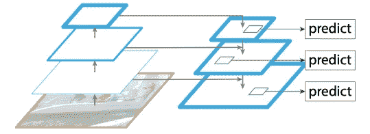***

***从 [*特征金字塔网络进行物体检测*](https://arxiv.org/abs/1612.03144)***

***首先，要使用如上图所示的 FPN 结构重建 RPN，我们需要一个在多个不同比例的要素输出上运行的区域方案。此外，我们现在每个位置只需要 3 个不同纵横比的锚点，因为不同大小的对象将由不同级别的特征金字塔处理。接下来，为了在快速 R-CNN 检测器中使用 FPN 结构，我们还需要对其进行调整，以在多个尺度的特征图上进行检测。由于区域提案也可能有不同的规模，我们也应该在 FPN 的相应级别使用它们。简而言之，如果更快的 R-CNN 是一对在一个尺度上运行的 RPN 和基于区域的检测器，FPN 将其转换为在不同尺度上运行的多个并行分支，并最终从所有分支收集最终结果。***

# ***2016 年:YOLO v2***

> ***更好、更快、更强***

***当明凯·何、罗斯·吉斯克和他们的团队不断改进他们的两级 R-CNN 探测器时，另一方面，约瑟夫·雷德蒙也在忙于改进他的一级 YOLO 探测器。最初版本的 YOLO 有许多缺点:基于粗网格的预测带来了较低的定位精度，每个网格单元两个比例不可知的回归器也使得识别小包装对象变得困难。幸运的是，我们在 2015 年在许多计算机视觉领域看到了太多伟大的创新。YOLO v2 只需要找到一种方法来整合它们，以变得更好、更快、更强。以下是修改的一些亮点:***

*   ***YOLO v2 从一篇名为“*批处理规范化:通过减少内部协变量转移来加速深度网络训练”的论文中添加了批处理规范化层。****

***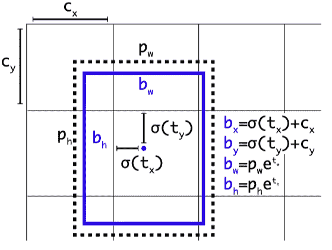***

***锚箱来自“ [*YOLO9000:更好、更快、更强*](https://arxiv.org/abs/1612.08242)***

*   ***就像 SSD 一样，YOLO v2 也为边界框回归引入了更快的 R-CNN 的锚框思想。但是 YOLO v2 为它的锚盒做了一些定制。YOLOv2 不是预测锚定框的偏移，而是将对象中心回归 *tx* 和 *ty* 约束在负责的网格单元内，以稳定早期训练。此外，锚的大小由目标数据集的 K-means 聚类来确定，以更好地与对象形状对齐。***
*   ***一种称为暗网的新型骨干网络用于特征提取。这是受“*网络中的网络*”和 GooLeNet 的瓶颈结构的启发。***
*   ***为了提高对小物体的检测，YOLO v2 增加了一个穿透层来合并早期层的特征。这部分可以看做是 SSD 的简化版。***
*   ***最后但同样重要的是，Joseph 意识到输入分辨率是小物体检测的银弹。它不仅将主干网的输入从 224x224 增加了一倍，达到 448x448，而且还发明了一种多尺度训练模式，在训练的不同阶段采用不同的输入分辨率。***

***请注意，YOLO v2 还试验了一个在 9000 类分层数据集上训练的版本，这也代表了在对象检测器中多标签分类的早期尝试。***

# ***2017 年:RetinaNet***

> ***密集物体探测的聚焦损失***

***为了理解为什么一级检测器通常不如两级检测器，RetinaNet 从一级检测器的密集预测中研究了前景-背景类别不平衡问题。以 YOLO 为例，它试图同时预测所有可能位置的类和包围盒，因此在训练期间大多数输出都与负类匹配。SSD 通过在线硬例挖掘解决了这个问题。在训练的早期阶段，YOLO 使用客观性分数来隐式地训练前景分类器。RetinaNet 认为他们都没有得到问题的关键，所以它发明了一个新的损失函数，称为焦点损失，以帮助网络了解什么是重要的。***

******

****从* [*到*](https://arxiv.org/abs/1708.02002)*对密集物体进行焦损检测****

***焦点损失给交叉熵损失增加了一个幂γ(他们称之为聚焦参数)。自然地，随着置信度得分变得更高，损失值将变得比正常的交叉熵低得多。α参数用于平衡这种聚焦效果。***

******

***从[到*焦散密集物体检测*](https://arxiv.org/abs/1708.02002)***

***这个想法很简单，连一个小学生都能理解。因此，为了进一步证明他们的工作，他们修改了他们之前提出的 FPN 模型，并创造了一种新的一级探测器，称为 RetinaNet。它由一个 ResNet 主干，一个 FPN 检测颈以引导不同尺度的特征，以及两个用于分类和作为检测头的盒回归的子网组成。与 SSD 和 YOLO v3 类似，RetinaNet 使用锚盒来覆盖各种规模和纵横比的目标。***

***有点跑题了，RetinaNet 使用了 ResNeXT-101 和 800 输入分辨率变体的 COCO 精度来对比 YOLO v2，后者只有轻量级的 Darknet-19 主干和 448 输入分辨率。这种不真诚显示了团队对获得更好的基准测试结果的重视，而不是解决一个实际问题，如速度-精度的权衡。这可能是 RetinaNet 在发布后没有起飞的部分原因。***

# ***2018: YOLO v3***

> ***YOLOv3:增量改进***

***YOLO v3 是官方 YOLO 系列的最后一个版本。遵循 YOLO v2 的传统，YOLO v3 从以前的研究中借鉴了更多的想法，得到了一个像怪物一样令人难以置信的强大的一级探测器。YOLO v3 很好地平衡了速度、准确性和实现复杂性。由于速度快、组件简单，它在业界非常受欢迎。如果你感兴趣，我在之前的文章《[深入了解 YOLO v3:初学者指南](/dive-really-deep-into-yolo-v3-a-beginners-guide-9e3d2666280e)》中对 YOLO v3 的工作原理做了非常详细的解释。***

***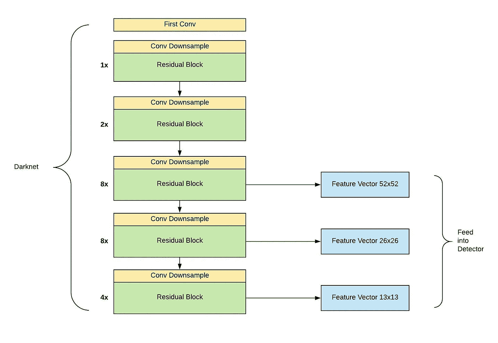***

***来自“[深入 YOLO v3:初学者指南](/dive-really-deep-into-yolo-v3-a-beginners-guide-9e3d2666280e)”***

***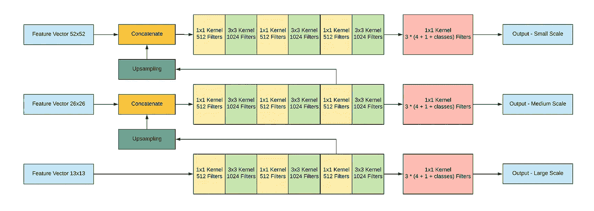***

***来自“[深入 YOLO v3:初学者指南](/dive-really-deep-into-yolo-v3-a-beginners-guide-9e3d2666280e)”***

***简单地说，YOLO v3 的成功来自其更强大的骨干特征提取器和一个类似 RetinaNet 的 FPN 颈检测头。新的主干网络 Darknet-53 利用 ResNet 的 skip 连接实现了与 ResNet-50 相当但更快的精度。此外，YOLO v3 抛弃了 v2 的穿越层，完全接受了 FPN 的多尺度预测设计。自此，YOLO v3 终于扭转了人们对其处理小物件时性能不佳的印象。***

***此外，还有一些关于 YOLO v3 的有趣事实。它剖析了 COCO mAP 0.5:0.95 度量，并且还证明了当使用条件密集预测时焦点损失的无用性。作者约瑟夫甚至决定一年后退出整个计算机视觉研究，因为他担心军事用途。***

# ***2019:以物为点***

***尽管近年来图像分类领域变得不那么活跃，但目标检测的研究还远未成熟。2018 年，一篇名为“CornerNet:将物体检测为成对关键点”的论文为检测器训练提供了一个新的视角。既然准备锚箱目标是一件相当繁琐的工作，那么真的有必要用它作为先验吗？这种抛弃锚箱的新趋势被称为“无锚”物体检测。***

******

***来自"[用于人体姿态估计的堆叠沙漏网络](https://arxiv.org/abs/1603.06937)***

***受沙漏网络中热图用于人体姿态估计的启发，CornerNet 使用由盒角生成的热图来监督包围盒回归。要了解更多关于如何在沙漏网络中使用热图，你可以阅读我以前的文章“[使用堆叠沙漏网络和张量流进行人体姿态估计](/human-pose-estimation-with-stacked-hourglass-network-and-tensorflow-c4e9f84fd3ce)”。***

******

***从 [*的物体为点*](https://arxiv.org/abs/1904.07850)***

***作为点的对象，又名 CenterNet，更进了一步。它使用热图峰值来表示对象中心，网络将直接从这些盒中心回归盒宽度和高度。本质上，CenterNet 使用每个像素作为网格单元。利用高斯分布热图，与先前试图直接回归边界框大小的尝试相比，训练也更容易收敛。***

***去除锚箱还有另一个有益的副作用。之前我们是靠主播框和地面真相框之间的 IOU(比如> 0.7)来分配训练目标的。通过这样做，几个相邻的锚可能都被分配了同一对象的正目标。网络也将学习预测同一物体的多个阳性框。解决这个问题的常用方法是使用一种称为非最大抑制(NMS)的技术。这是一种贪婪的算法，用来过滤掉靠得太近的盒子。现在锚点已经消失了，我们在热图中每个物体只有一个峰值，没有必要再使用 NMS 了。由于 NMS 有时难以实现且运行缓慢，所以对于在各种资源有限的环境中运行的应用程序来说，摆脱 NMS 是一个很大的好处。***

# ***2019 年:效率检测***

> ***EfficientDet:可扩展且高效的对象检测***

***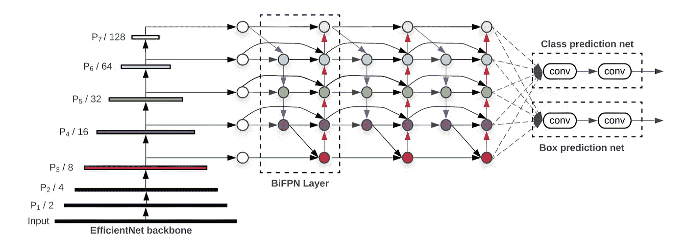***

***出自"[*【Efficient det:可扩展且高效的对象检测*](https://arxiv.org/abs/1911.09070) *"****

**在最近的 CVPR 20 中，EfficientDet 向我们展示了对象检测领域的一些更令人兴奋的进展。FPN 结构已被证明是提高不同尺度目标检测网络性能的有力技术。著名的检测网络，如 RetinaNet 和 YOLO v3，都在盒回归和分类之前采用了 FPN 颈。后来，NAS-FPN 和 PANet(请参阅阅读更多章节)都证明了一个普通的多层 FPN 结构可能受益于更多的设计优化。EfficientDet 继续在这个方向上探索，最终创造了一种叫做 BiFPN 的新颈。基本上，BiFPN 的特点是额外的跨层连接，以鼓励特性的来回聚合。为了证明网络的效率部分，这个 BiFPN 还从最初的 PANet 设计中删除了一些不太有用的连接。对 FPN 结构的另一个创新改进是权重特征融合。BiFPN 为特征聚合添加了额外的可学习权重，以便网络可以学习不同分支的重要性。**

****

**出自“[*【Efficient det:可扩展且高效的对象检测*](https://arxiv.org/abs/1911.09070)*”***

**此外，就像我们在图像分类网络 EfficientNet 中看到的一样，EfficientDet 也引入了一种扩展对象检测网络的原则方法。上式中的φ参数控制 BiFPN 颈部和探测头的宽度(通道)和深度(层数)。**

**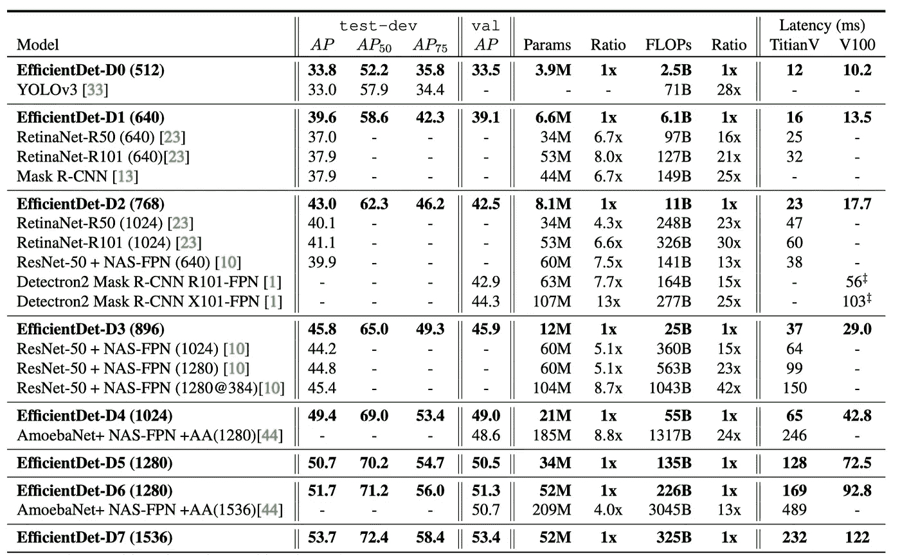**

**出自“[*:Efficient det:可扩展且高效的对象检测*](https://arxiv.org/abs/1911.09070)*”***

**这个新参数导致从 D0 到 D7 的 8 个不同的 EfficientDet 变量。轻型 D0 变体可以实现与 YOLO v3 类似的精度，同时具有少得多的触发器。一个负载沉重的 D7 变体，具有可怕的 1536x1536 输入，在 COCO 上甚至可以达到 53.7 AP，让所有其他竞争者相形见绌。**

# **阅读更多**

**从 R-CNN，YOLO 到最近的 CenterNet 和 EfficientDet，我们见证了深度学习时代对象检测研究的大多数重大创新。除了上面的论文，我还提供了一个附加论文的列表，供你继续阅读以获得更深入的理解。它们或者为目标检测提供了不同的视角，或者用更强大的功能扩展了这一领域。**

## **2009 年:DPM**

> **基于模型的有区别训练的物体检测**

**通过为每个可变形部分匹配许多 HOG 特征，DPM 是深度学习时代之前最有效的对象检测模型之一。以行人检测为例，它采用星型结构，先识别出一般的人模式，再用不同的子滤波器识别出部分，计算出一个总得分。即使在今天，在我们从 HOG 特征切换到 CNN 特征之后，识别具有可变形部分的物体的想法仍然很受欢迎。**

## **2012 年:选择性搜索**

> **目标识别的选择性搜索**

**和 DPM 一样，选择性搜索也不是深度学习时代的产物。然而，这种方法结合了许多经典的计算机视觉方法，也用于早期的 R-CNN 检测器。选择性搜索的核心思想受到语义分割的启发，语义分割是通过相似性对像素进行分组。选择性搜索使用不同的相似性标准，如颜色空间和基于 SIFT 的纹理，以迭代方式将相似区域合并在一起。并且这些合并的区域充当前景预测，随后是用于对象识别的 SVM 分类器。**

## **2016 年:FCN**

> **R-FCN:基于区域的全卷积网络的目标检测**

**更快的 R-CNN 最终将 RPN 和 ROI 特征提取结合起来，大大提高了速度。然而，对于每个区域建议，我们仍然需要完全连接的层来分别计算类和边界框。如果我们有 300 个 ROI，我们需要重复 300 次，这也是一级和两级检测器之间主要速度差异的来源。R-FCN 从 FCN 那里借鉴了语义分割的思想，但 R-FCN 计算的不是类别掩码，而是一个积极的敏感得分图。这个图会预测物体在每个位置出现的概率，所有位置会投票(平均)决定最终的类和包围盒。此外，R-FCN 还在其 ResNet 主干中使用了 atrous 卷积，这是最初在 DeepLab 语义分割网络中提出的。要了解什么是 atrous 卷积，请看我之前的文章《[见证语义分割的进展:从 V1 到 V3+](/witnessing-the-progression-in-semantic-segmentation-deeplab-series-from-v1-to-v3-4f1dd0899e6e) 的 DeepLab 系列》。**

## **2017:软-NMS**

> **用一行代码改进对象检测**

**非最大值抑制(NMS)广泛用于基于锚点的对象检测网络，以减少附近的重复肯定建议。更具体地说，如果候选框具有更高的 IOU，NMS 迭代地消除候选框，并得到更有把握的候选框。当两个具有相同类的对象彼此非常接近时，这可能会导致一些意外的行为。软 NMS 做了一个小的改变，仅用一个参数缩小重叠候选框的置信度得分。当调整本地化性能时，这个缩放参数给我们更多的控制，并且当还需要高召回率时，也导致更好的精度。**

## **2017:级联 R-CNN**

> **级联 R-CNN:探索高质量目标检测**

**当 FPN 探索如何设计一个更好的 R-CNN 颈以使用骨干功能级联 R-CNN 时，调查了一个重新设计的 R-CNN 分类和回归头。潜在的假设简单而深刻:我们在准备阳性目标时使用的 IOU 标准越高，网络将学习做出的假阳性预测就越少。然而，我们不能简单地将这样的 IOU 阈值从常用的 0.5 提高到更积极的 0.7，因为这也可能导致培训期间出现更多压倒性的负面例子。级联 R-CNN 的解决方案是将多个探测头链接在一起，每个探测头将依赖于来自前一个探测头的包围盒提议。只有第一个检测头将使用原始的 RPN 建议。这有效地模拟了后面磁头的 IOU 阈值的增加。**

## **2017:面具 R-CNN**

> **屏蔽 R-CNN**

**Mask R-CNN 不是一个典型的对象检测网络。它旨在解决一个具有挑战性的实例分割任务，即，为场景中的每个对象创建一个遮罩。然而，Mask R-CNN 显示了对更快的 R-CNN 框架的巨大扩展，并且也反过来启发了对象检测研究。主要思想是在 ROI 合并之后添加二进制掩模预测分支，以及现有的边界框和分类分支。此外，为了解决原始 ROI 池层的量化误差，Mask R-CNN 还提出了一种新的 ROI Align 层，该层在遮光罩下使用双线性图像重采样。不出所料，多任务训练(分割+检测)和新的 ROI Align 层都有助于对边界框基准进行一些改进。**

## **2018 年:帕内特**

> **用于实例分割的路径聚合网络**

**实例分割与目标检测有着密切的关系，因此一个新的实例分割网络往往也能间接有利于目标检测的研究。PANet 旨在通过在原来的自上而下路径之后增加一个额外的自下而上路径来促进 R-CNN 面具 FPN 颈部的信息流。为了形象化这种变化，我们在原始的 FPN 颈中有一个↑↓结构，PANet 在汇集来自多个图层的要素之前使它更像一个↑↓结构。此外，PANet 没有为每个要素图层创建单独的池，而是在 Mask R-CNN 的 ROIAlign 之后添加了一个“自适应要素池”图层，以合并(基于元素的最大和)多尺度要素。**

## **2019 年:NAS-FPN**

> **NAS-FPN:学习对象检测的可扩展特征金字塔结构**

**PANet 在适应 FPN 结构方面的成功引起了一组 NAS 研究人员的注意。他们使用了来自图像分类网络 NASNet 的类似强化学习方法，并专注于搜索合并细胞的最佳组合。在这里，合并像元是将任意两个输入要素图层合并为一个输出要素图层的 FPN 的基本构建块。最终结果证明了 FPN 可以进一步优化的想法，但复杂的计算机搜索结构让人类难以理解。**

# **结论**

**目标检测仍然是一个活跃的研究领域。尽管像 R-CNN 这样的两级检测器和像 YOLO 这样的一级检测器很好地塑造了该领域的总体前景，但我们最好的检测器仍然远远没有达到基准指标的饱和，并且还会错过复杂背景中的许多目标。与此同时，像 CenterNet 这样的无锚点检测器向我们展示了一个充满希望的未来，其中对象检测网络可以变得像图像分类网络一样简单。物体检测的其他方向，如少拍识别、NAS 等，还处于初级阶段，未来几年的进展如何，我们拭目以待。然而，随着物体探测技术变得越来越成熟，我们需要对其被军队和警察采用非常谨慎。终结者用 YOLO 探测器猎杀人类的反乌托邦是我们一生中最不想看到的。**

***原载于*[*http://yanjia . Li*](https://yanjia.li/12-papers-you-should-read-to-understand-object-detection-in-the-deep-learning-era/)*2020 年 8 月 9 日***

# **参考**

*   **Pierre Sermanet，David Eigen，Xiang Zhang，，Rob Fergus，Yann LeCun， [*OverFeat:使用卷积网络的综合识别、定位和检测*](https://arxiv.org/abs/1312.6229)**
*   **Ross Girshick，Jeff Donahue，Trevor Darrell，Jitendra Malik， [*基于区域的卷积网络用于精确的对象检测和分割*](http://islab.ulsan.ac.kr/files/announcement/513/rcnn_pami.pdf)**
*   **罗斯·吉希克，[快速 R-CNN](https://arxiv.org/abs/1504.08083)**
*   **约瑟夫·雷德蒙、桑托什·迪夫瓦拉、罗斯·吉斯克、阿里·法尔哈迪、 [*你只看一次:统一的、实时的物体检测*](https://arxiv.org/abs/1506.02640)**
*   **刘威、德拉戈米尔·安盖洛夫、杜米特鲁尔汉、克里斯蒂安·塞格迪、斯科特·里德、傅成阳、亚历山大·c·伯格、 [*SSD:单次多盒探测器*](https://arxiv.org/abs/1512.02325)**
*   **任，，何，，， [*快速 R-CNN:基于区域建议网络的实时目标检测*](https://arxiv.org/abs/1506.01497)**
*   **宗-林逸，彼得·多拉尔，罗斯·吉斯克，明凯·何，巴拉思·哈里哈兰，塞尔日·贝隆吉， [*特征金字塔网络用于物体检测*](https://arxiv.org/abs/1612.03144)**
*   **宗-林逸、普里亚·戈亚尔、罗斯·吉斯克、明凯·何、皮奥特·多拉尔、 [*密集天体探测焦损失*](https://arxiv.org/abs/1708.02002)**
*   **约瑟夫·雷德蒙、阿里·法尔哈迪、[*YOLO9000:更好、更快、更强*](https://arxiv.org/abs/1612.08242)**
*   **约瑟夫·雷德蒙，阿里·法尔哈迪， [*约洛夫 3:增量改进*](https://arxiv.org/abs/1804.02767)**
*   **李，[*潜真深入 v3:*](/dive-really-deep-into-yolo-v3-a-beginners-guide-9e3d2666280e)**
*   **形意周、、、[、物象分、](https://arxiv.org/abs/1904.07850)**
*   **[李，*人体姿态估计用层叠沙漏网和*张量流](/human-pose-estimation-with-stacked-hourglass-network-and-tensorflow-c4e9f84fd3ce)**
*   **明凯·何，乔治亚·格基奥萨里，彼得·多拉尔，罗斯·吉斯克， [*面具 R-CNN*](https://arxiv.org/abs/1703.06870)**
*   **蔡兆伟，努诺， [*级联 R-CNN:钻研高质量物体检测*](https://arxiv.org/abs/1712.00726)**
*   **谭明星，庞若明，郭诉乐， [*EfficientDet:可扩展的高效对象检测*](https://arxiv.org/abs/1911.09070)**
*   **戴继峰，，，，， [*R-FCN:基于区域的全卷积网络目标检测*](https://arxiv.org/abs/1605.06409)**
*   **李， [*见证语义切分的进程:DeepLab 系列从到 V3+*](/witnessing-the-progression-in-semantic-segmentation-deeplab-series-from-v1-to-v3-4f1dd0899e6e)**
*   **Golnaz Ghiasi，Tsung-林逸，庞若明，郭诉乐， [*NAS-FPN:学习用于对象检测的可扩展特征金字塔体系结构*](https://arxiv.org/abs/1904.07392)**
*   **、秦、、、、贾亚佳、 [*路径聚合网络实例分割*](https://arxiv.org/abs/1803.01534)**
*   **李， [*深度学习时代理解图像分类你应该看的 10 篇论文*](/10-papers-you-should-read-to-understand-image-classification-in-the-deep-learning-era-4b9d792f45a7)**