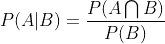

# 数据科学面试的 12 个概率练习题

> 原文：<https://towardsdatascience.com/12-probability-practice-questions-for-data-science-interviews-2ec5230304d9?source=collection_archive---------1----------------------->

Clem Onojeghuo 在 [Unsplash](https://unsplash.com/s/photos/job-interview?utm_source=unsplash&utm_medium=referral&utm_content=creditCopyText) 拍摄的照片

## 自信地完成数据科学面试，第 3 部分

在之前的文章中，我已经谈到了机器学习和统计学中需要准备的面试问题:

 [## 准备面试的 20 个机器学习相关问题

### 自信地完成面试

towardsdatascience.com](/20-machine-learning-related-questions-to-prepare-for-interviews-93bcba72f911)  [## 为数据科学面试做准备的 22 个统计问题

### 自信的钉钉数据科学访谈，第 2 部分

towardsdatascience.com](/22-statistics-questions-to-prepare-for-data-science-interviews-d5651a8b3c56) 

接下来的文章是关于为数据科学面试准备案例研究和行为问题:

 [## 在数据科学面试中组织您对案例研究问题的回答

### 自信地完成数据科学面试，第 4 部分

towardsdatascience.com](/structure-your-answers-for-case-study-questions-during-data-science-interviews-a14a02d21e6c)  [## 为数据科学面试准备行为问题

### 自信地完成数据科学面试，第 5 部分

towardsdatascience.com](/prepare-behavioral-questions-for-data-science-interviews-96e97f13be15) 

在这篇文章中，我会列出概率中的 12 个问题供你练习。我将列出四个主题中常见和经典的问题:一般概率、二项分布、条件概率和贝叶斯概率。我在后面提供了我对这些问题的答案，这样你可以将你的答案与我的进行比较。如果您有任何问题、疑问、建议等，请随时联系我。

**提问**

> **一般概率**

**1、**给定两个公平的骰子，两个骰子总和为 8 的概率是多少？当第一个骰子是 3 时，两个骰子总和为 8 的概率是多少？

**2、**A 人和 B 人在一起射箭。假设他们射向目标的能力完全相同，他们两人击中目标的概率都是 0.5。现在给定 A 发射了 201 支箭，B 发射了 200 支箭，那么 A 比 B 获得更多目标的概率是多少？

**3、**流感季节，对于双亲异性家庭，假设至少一方父母患流感的概率为 17%；父亲患流感的概率是 12%；父母双方都患流感的概率是 6%，母亲患流感的概率是多少？

你有 40 张四种颜色的牌，10 张红色，10 张绿色，10 张蓝色和 10 张黄色。每种颜色都有一个从 1 到 10 的数字。当你挑两张不替换的牌时，两张牌不在同一个颜色，不在同一个号码的概率是多少？

> **二项式分布**

**5、**A 队和 B 队正在进行一场比赛，他们必须在 7 轮比赛中赢下 4 轮才能赢得比赛。A 赢的概率是 p，那么 B 赢的概率是 1-p(没有平手的机会)，他们打满七轮的概率是多少？如果主场(p)和客场(q)A 赢的概率不一样怎么办？

**6、**八个人进入一栋十层楼的电梯。预计停车次数是多少？计算这个期望需要什么假设？

> **条件概率**

一个人一次又一次地投掷一枚无偏的硬币。玩家 A 寻找序列`HHT`，玩家 B 寻找序列`HTT`。参与人 A 先遇到他们序列的概率是多少？

琼斯先生有两个孩子。大孩子是个女孩。两个孩子都是女孩的概率有多大？史密斯先生有两个孩子。其中至少有一个是男孩。两个孩子都是男孩的概率有多大？

天使给了你三扇门的选择。你只能从这三扇门中选择一扇门。在这三扇门中，有两扇门什么都没有，有一扇门中了头奖。在你选择了其中一扇门后，天使向你展示了另外两扇门中的一扇门，后面什么也没有。天使给了你一个机会去改变门，或者你可以坚持你选择的门。你不知道哪扇门后我们一无所有。你应该换还是无所谓？

> **贝叶斯概率**

有四个盒子:A、B、C、d。约翰在其中一个盒子里随机放了一个球，让大卫猜他把球放在哪一个盒子里。大卫猜测球在盒子 A 里，但是他不确定。约翰给了他一个球不在 b 框的提示，这时，球在 C 框的概率是多少？

**11、**所有接受第一次面试的人，有 50%接受第二次面试；你的朋友中有 95%的人得到了第二次面试机会，他们觉得第一次面试很成功；你的朋友中有 75%没有得到第二次面试机会，他们觉得第一次面试很好。如果你觉得你第一次面试很好，你获得第二次面试的概率有多大？(Q16 摘自[本文](/22-statistics-questions-to-prepare-for-data-science-interviews-d5651a8b3c56))

12、假设世界上存在一种非常罕见的疾病。任何人患这种疾病的几率是 0.1%。你想知道你是否被感染，所以你去做了测试，测试结果是阳性。测试的准确性为 99%，这意味着 99%的患病者将测试为阳性，99%的未患病者将测试为阴性(非常感谢 [Xavier Lavenir](https://medium.com/u/19be5d3d26f3?source=post_page-----2ec5230304d9--------------------------------) 纠正了问题中的假设)。你被感染的可能性有多大？(感谢[丹尼斯·迈斯纳](https://medium.com/u/d242f538e931?source=post_page-----2ec5230304d9--------------------------------)，在这里抓住了曲解的错误)

**答案**

**1、**掷出两个公平骰子有 36 (6*6)种结果，当两个骰子总和为 8 时的结果为:

(2, 6), (3,5), (4,4), (5,3), (6,2);

两个骰子总和为 8 的概率是 5/36。

对于第二部分，我们计算的是一个条件概率。假设事件 A 是两个骰子，总和为 8，事件 B 是第一个骰子是 3。我们知道事件 B 的结果是:

(3,1), (3,2), (3,3), (3,4), (3,5), (3,6)

而只有(3，5)使事件 A 发生，因此概率是 1/6。

我们也可以使用贝叶斯定理和条件概率来解决这个问题:

P(AB)和 P(A|B)的区别在于:

*   P(AB)为 1/36:36 个结果中，只有(3，5)个同时满足事件 A 和事件 B；
*   P(A|B)是 1/6:在事件 B 的 6 个结果中，(3，1)，(3，2)，(3，3)，(3，4)，(3，5)，(3，6)，只有一个结果在(3，5)处总计为 8，因此 P(A|B)是 1/6。(也可按 1/36 / 1/6 = 1/6 计算)

201 不是一个偶数，所以让我们先考虑 200 场比赛。假设事件 A 是 A 在 200 场比赛中比 B 向目标射出更多的箭，事件 B 是 B 向目标射出更多的箭，事件 C 是他们向目标射出等量的箭。我们有:

因为 A 和 B 在射箭方面表现相同，所以 200 场比赛，我们有 P(A) = P(B)。因此:

现在来看 A 玩的额外游戏。如果在过去的 200 场比赛中:

*   A 比 B 高，那么在这个额外的游戏中，无论 A 是否击中目标，A 仍然比 B 高。
*   如果 A 比 B 低，即使 A 在额外的比赛中向目标开火，我们也会观察到最多 A=B，A 仍然不会超过 B。
*   如果 A=B，如果 A 在额外的游戏中向目标射击，那么 A 将高于 B，任何游戏中 A 向目标射击的概率是 0.5。

因此，A 高于 B 的总概率为:

我们知道 2P(A) + P(C) = 1，如果我们两边都除以 2，我们将得到:

在 A 玩 201 局，B 玩 200 局的情况下，A 比 B 获得更多目标的概率是 0.5。

**3、**假设父亲患流感的概率为 P(F)，母亲患流感的概率为 P(M)。我们知道:

根据概率的一般加法法则:

因此 P(M)=11%。

**4、**我们可以先计算得到两张相同号码牌的概率和得到两张相同颜色牌的概率，然后用一减去两个概率之和。

得到两张号码相同的牌的概率是:

第一次抽奖可以得到任意数字，也没关系。因此第一次抽牌并不影响概率，但是对于第二次抽牌，你只剩下 39 张牌了，你需要抽取与第一次抽牌相同的号码。对于每个数字，有四张不同颜色的相同数字的卡片。因此对于第二次抽牌，你只能从 39 张牌中挑选 3 张。

相同的逻辑得到两张相同颜色的牌:

我们在第一次抽奖中选择任何颜色，并且只能从剩余的 39 张牌中选择 9 张相同颜色的牌。得不到同号同卡的概率是:

P = 1-P(相同数字)-P(相同颜色)= 27/39

**5、**如果两队打满 7 轮，那么前 6 轮，A 和 B 都要赢正好 3 次，最后一轮谁赢我们不在乎。我们可以把每一轮都看作是伯努利试验，那么 A 在前 6 场比赛中获胜的次数遵循二项分布 Bi(n，k，p)其中 n=6，k=3，p=p，A 获胜的概率。根据二项式分布，A 在 6 场比赛中赢 3 次的概率是:

请注意，A 队赢 3 次会自动设置 B 队赢 3 次。

如果两支球队主场和客场的胜率不同，我们可以假设 A 队主场获胜的概率是 p，客场是 q，A 队主场已经赢了 x 场比赛。两个队打完所有 7 轮比赛的概率将是 x、p 和 q 的函数。具体来说，我们知道 A 队和 B 队都必须赢 3 轮，那么 A 队必须在主场赢 x 场比赛，在客场赢 3-x 场比赛；B 队要客场赢 3-x 场(A 队主场是 B 队的客场，A 主场输 B 队客场赢)，主场赢 x 轮。打七轮的概率是:

如果我们有更多关于 x 的分布的信息，我们可以得到更多关于概率的信息。

想了解更多关于二项分布的知识，请查看[这篇文章](/seven-must-know-statistical-distributions-and-their-simulations-for-data-science-681c5ac41e32)。

如果我们将每个乘客关于是否在某个楼层停留的决定视为伯努利试验，我们可以使用二项式分布来处理这个问题。这些假设包括:

*   8 .乘客自主决策；
*   假设每个人都从底层进入，有 10 个选择，从 1 层到 10 层。(如果假设一楼没人停，那么只有 9 个选择)。

总共有八名乘客，对于每个楼层，如果有人想下车，电梯就会停下来。我们可以计算不停止的概率，而不是计算电梯停在某一楼层的概率。对于任何楼层，电梯不在任何楼层停留的概率为:

电梯停在任何楼层的概率是:

为了找到这种情况下的预期停靠次数，定义一个随机变量 X 作为电梯的停靠次数，X 遵循二项式分布:

其中 n=10，p=1-(9/10)⁸.二项分布随机变量的期望值是 np:

**7、**硬币无偏使得 P(H) = P(T) =0.5。让我们假设 HHT 早于 HTT 的事件是事件 E，我们有:

*   P(E) = P(E|H)*P(H) + P(E|T)*P(T)

其中 P(E|H)在第一次投掷时得到 H。既然得到一条尾巴对得到 HHT 和 HTT 都没有帮助，因此:

*   P(E) = P(E|T) = P(E|TT)=…

插回到前面的等式:

*   P(E)= 0.5 * P(E | H)+0.5 * P(E)= > P(E)= P(E | H)

所以我们只需要得到 P(E|H)来求解 P(E):

*   P(E | H)= P(E | HH)* P(H)+P(E | HT)* P(T)

无论何时你得到 HH，你肯定会比 HTT 早得到 HHT，因为你只需要得到一个额外的 T 就可以到达 HHT，但是你需要得到两个额外的 T 才能到达 HTT。因此 P(E|HH)是 1:

*   P(E|H) = 1*0.5 + P(E|HT)*0.5

出于同样的逻辑:

*   P(E | HT)= P(E | HTH)* P(H)+P(E | HTT)* P(T)

P(E|HTT) =0，因为我们已经先到达了 HTT。当看到 HTH 时，前两次投掷可以忽略不计，就像滚动第一个 h 一样。因此:

*   P(E|HTH) = P(E|H)

现在我们有:

*   P(E | HT)= P(E | HTH)* P(H)+P(E | HTT)* P(T)= P(E | H)* 0.5+0

插回到前面的等式:

*   P(E | H)= 1 * 0.5+P(E | HT)* 0.5 = 0.5+P(E | H)* 0.5 * 0.5 = > P(E | H)= 2/3
*   P(E) = P(E|H) =2/3

**8、**对于有两个孩子的家庭，性别组合有四种可能:

四种可能性

答:如果我们知道大孩子是女孩，那么只有两种可能:

两种可能性

其中一个有两个女儿。概率是 1/2；

B 部分:对于至少一个孩子是男孩，我们有三种可能性:

三种可能性

其中一个怀了两个男孩。概率是 1/3。

对于练习，可以尝试用[条件概率](https://en.wikipedia.org/wiki/Boy_or_Girl_paradox)来解决这个问题。

我们有三扇门，一号门、二号门和三号门。他们每个人都有 1/3 的机会拥有后面的头奖。我们需要根据自己当初是否选择正确来决定是否切换，比较切换和不切换的概率。假设事件 A 在第一次尝试中选择正确:

*   p(A)= 1/3；p(不是 A)= 2/3；

让事件 B 在切换后获胜:

*   P(B|A) = 0:如果你在第一次尝试(事件 A)中选择正确，并且你切换，你将不再获胜；
*   p(B |非 A) = 1:如果你在天使移除另一个错门后第一次尝试(事件非 A)选错了，切换后一定会赢。

因此:

P(B)= P(B | A)*P(A)+P(B |非 A)* P(非 A) = 2/3。

当不切换时，让事件不是最佳获胜:

*   p(不是 B|A) = 1:如果你第一次尝试(事件 A)选择正确，并且你切换，你将赢得头奖；
*   P(Not B|not A) = 0:如果第一次尝试选错了(event not A)，选择不切换就输了。

因此:

P(非 B) = P(非 B|A)*P(A) + P(非 B |非 A)*P(非 A) = 1/3。

比较切换和不切换时的胜算:

P(B) > P(不是 B)

你应该换一下！

**10、**约翰给出暗示后，有三种情况:

*   S1: A=1，B=0，C=0，D = 0；
*   S2: A=0，B=0，C=1，D = 0；
*   S3: A=0，B=0，C=0，D = 1；

将约翰说球不在盒子 B 中的事件定义为事件 B，我们需要计算 P(S2|B)的条件概率。根据贝叶斯定理:

让我们逐个检查这些元素:

*   P(S2)是约翰将球放入四个盒子中的盒子 C 的概率。概率应该和他把球放在任何一个盒子里一样。因此:

*   P(B|S2)是当约翰将球放入盒子 C 时，在大卫已经选择了盒子 A 的情况下，他给出了球不在盒子 B 中的提示。在大卫选择了 A 之后，只剩下三个盒子供约翰排除，分别是 B，C，D。鉴于球实际上在盒子 C 中，约翰只能通过给他提示来帮助大卫排除 B 或 D。他在两个盒子(B，D)中选择 B 的概率是 1/2:

*   根据贝叶斯公式:

我们知道 P(B|S2)是 1/2，我们可以用同样的逻辑得到 P(B|S1)和 P(B|S3)。当球在盒子 A(S1)时，大卫已经得到了正确的答案。约翰有三个选择来给出提示:不在 B 中，不在 C 中，不在 d 中。因此 P(B|S1)是 1/3。P(B|S3)是 1/2，因为约翰可以说不在 B 中或不在 c 中。将所有信息结合在一起，我们将得到:

因此，我们有:

**外卖:**如果约翰没有给出任何提示，我们知道球在盒子 C 里的概率是 1/4。约翰给出的提示增加了球在盒子 C 中的概率，因为我们在用新的信息更新概率，这是贝叶斯定理的关键。

**11、**解决这类问题的关键是仔细定义事件。假设你的朋友很好地代表了整个人口:

*   让我们把第一次面试感觉良好定义为事件 A，把接受第二次面试定义为事件 B；
*   “所有接受第一次面试的人中有 50%接受第二次面试”是指 P(B)=0.5，因此 P(不是 B)是一减去 P(B)，也是 0.5；
*   “你的朋友中有 95%的人得到了第二次面试，他们觉得第一次面试很好”意味着 P(A | B)= 0.95；
*   “75%没有获得复试的朋友认为他们的第一次面试很好”意味着 P(A |不是 B) = 0.75。
*   问题是问给定 P(B)，P(A|B)，P(A |不是 B)，P(B|A)是什么？(如果你觉得你第一次面试很好，你获得第二次面试的概率有多大？)

根据贝叶斯定理:

因此:

**12、**假设事件 A 患病，事件 B 检测呈阳性。根据问题中的信息:

*   P(A) = 0.1%，那么 P(不是 A)就是 99.9%；
*   P(B|A) = 99%，而测试呈阳性的人中有 1%没有这种疾病，所以 P(B | A)= 1%；
*   P(A|B)是什么？

来自贝叶斯定理:

并且:

插件所有号码:

这些都是有解答的问题。希望这篇文章能帮助你练习概率论的技巧。如果你想要更多的练习题，你可以看看这个网站:

 [## 数据科学的 40 个概率问题

### 简介概率形成了许多重要的数据科学概念的主干，从推断统计到…

www.analyticsvidhya.com](https://www.analyticsvidhya.com/blog/2017/04/40-questions-on-probability-for-all-aspiring-data-scientists/) 

感谢您的阅读！这是我所有博客帖子的列表。如果你感兴趣的话，可以去看看！

 [## 我的博客文章库

### 我快乐的地方

zzhu17.medium.com](https://zzhu17.medium.com/my-blog-posts-gallery-ac6e01fe5cc3)  [## 阅读朱(以及媒体上成千上万的其他作家)的每一个故事

### 作为一个媒体会员，你的会员费的一部分会给你阅读的作家，你可以完全接触到每一个故事…

zzhu17.medium.com](https://zzhu17.medium.com/membership)