# 编写更好代码的 12 个 Python 技巧和诀窍

> 原文：<https://towardsdatascience.com/12-python-tips-and-tricks-for-writing-better-code-b57e7eea580b?source=collection_archive---------4----------------------->

## 通过掌握最新的 Python 特性、技术、技巧和诀窍来提高代码的质量👨‍💻👩‍💻


克里斯·里德在 [Unsplash](https://unsplash.com?utm_source=medium&utm_medium=referral) 上拍摄的照片

# 1.f 弦

F-Strings 提供了一种简洁的**和方便的**方式来将 Python 表达式嵌入到字符串文字中用于**格式化**。****

首先，让我们定义两个变量`name`和`age`，它们将包含在我们的`print`语句中。

```
name = "Pavel"
age = 23
```

为了不处理字符串**连接**或在打印语句中使用**逗号**，可以使用 Python 3.6 中发布的改进的字符串格式化语法**“f-Strings”**。

简单地在带有**变量**或**表达式**的字符串前面加上一个**小写**或**大写**字母 **"f"** 在**花括号**内。

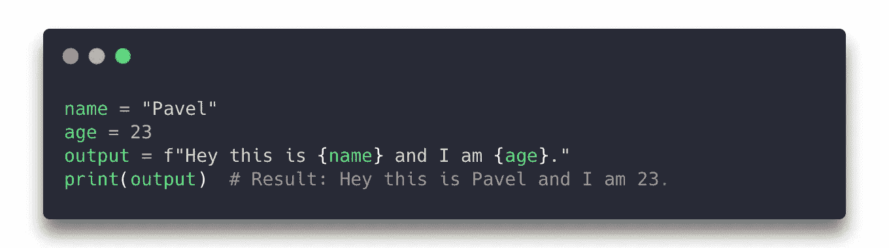

F-Strings 是一种很棒的格式化字符串的新方法，比其他格式化方法更容易阅读，更快，更简洁，更 T42，更不容易出错。

# 2.帮助功能

Python `help`函数用于查找模块、函数、类、关键字等的**文档**。

只需**将**中的一个对象**传递给`help`函数，即可检索该对象的**文档**:**

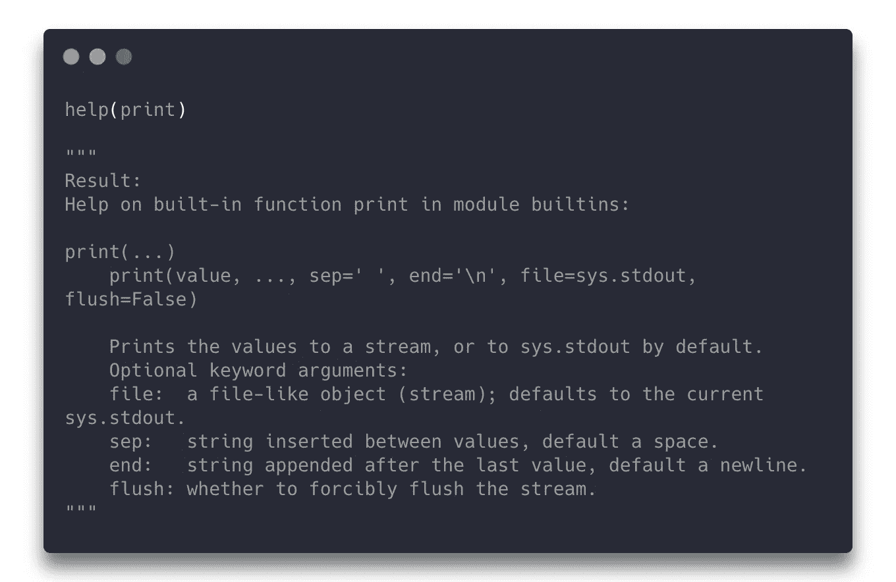

# 3.找出任何物体的大小

默认的`sys`模块包含一个函数`getsizeof` ，它接受一个**对象**，并以**字节**返回其大小。该对象可以是任何类型的****。****

## ****例如:****

****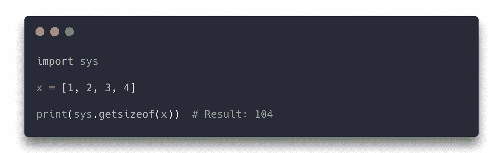****

******只有**的**内存**消耗**的**直接归于被占对象，而不是它所指对象的内存消耗。****

## ****另一个例子:****

****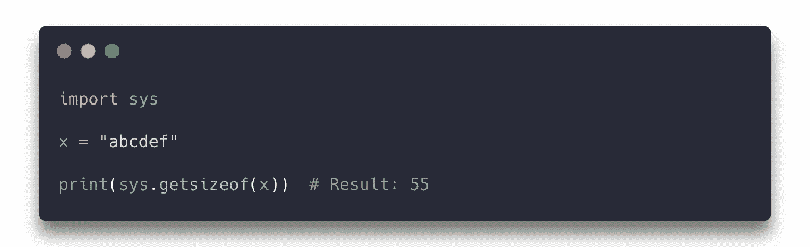****

# ****4.比较运算符的链接****

****通常要检查**比**多**的两个**条件，你就必须使用逻辑运算符，比如`and`**/**/`or`****

```
if a < b and b < c:
```

**在 Python 中，有一种更好的方式来编写它，使用**比较操作符链接**。**

**运算符的链接可以写成如下形式:**

```
if a < b < c:
```

## **例如:**

**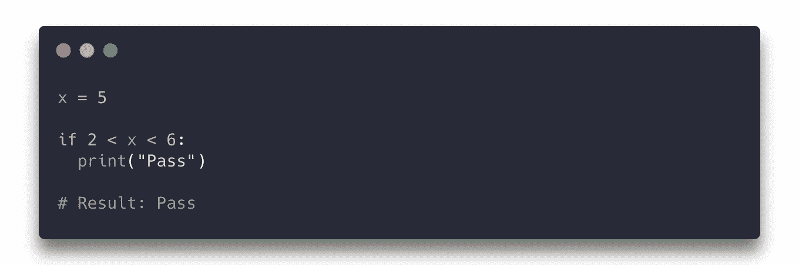**

# **5.列出理解**

****列表理解**是另一种更优雅的制作列表的方式。**

**不用创建一个**空的**列表和**添加**每个元素到**结束**，你可以简单的**定义**列表和它的内容在**相同的** **时间**如下格式:**

```
new_list = [**expression** for **item** in **iterable** (if **conditional**)]
```

## **例如:**

**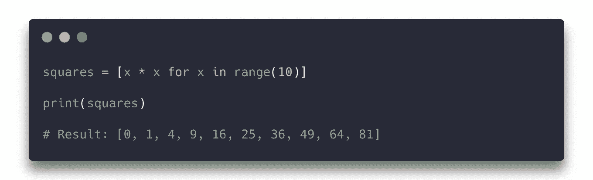**

## **另一个例子(有条件):**

**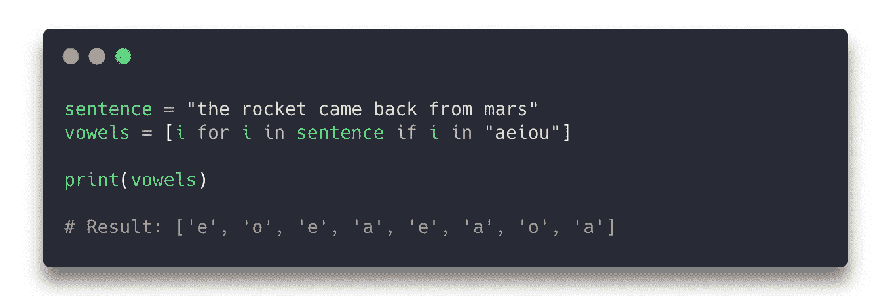**

# **6.字符串乘法**

**在 Python 中，不仅数字可以相乘，字符串也可以相乘。**

## **例如:**

**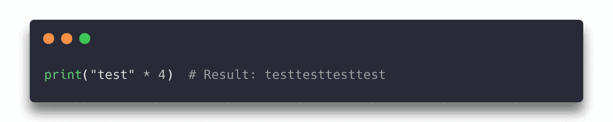**

# **7.在一行中分配多个变量**

**通过用逗号**分隔变量和值**，可以将多个**值**分配给多个**变量**:**

**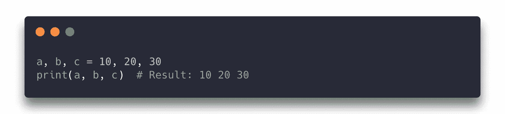**

**当**析构** / **解包**序列，如**列出**或**元组**时，这也是一种更为**优雅的**方式将序列元素分配给单个变量，因为**不需要**使用循环或单独索引序列的每个元素。**

**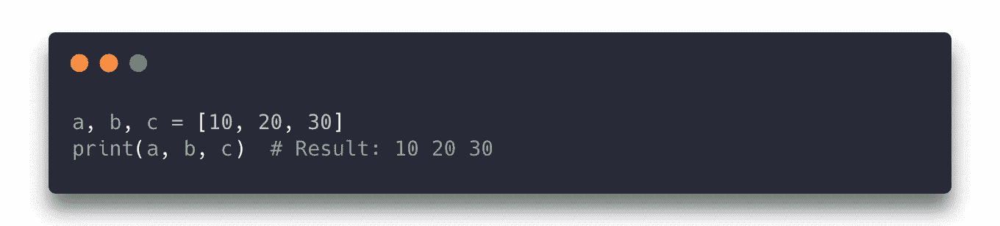**

# **8.就地交换变量**

**在许多其他编程语言中，交换两个**或两个**或更多变量的值只能通过定义一个额外的`temp`(临时)变量**来完成。****

**假设你想交换 x 和 y:**

```
temp = x
x = y
y = temp
```

**在 Python 中，有一个简单的**单行**构造来交换变量，类似于**单行**中将值**分配给多个变量的概念。****

**以下代码与上述代码相同，但**没有**使用任何**临时**变量:**

**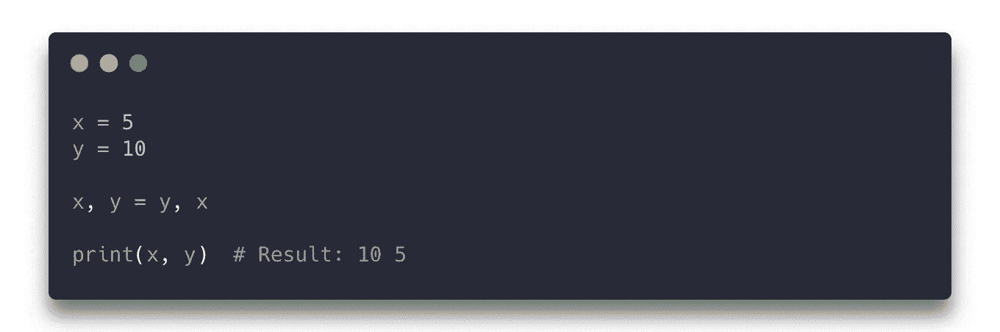**

# **9.创建枚举**

*****Enum*** 是 Python 中用于创建枚举的类，枚举是附加在**唯一**、**常量**值上的一组符号名。**

**为了创建一个 ***枚举*** ，需要创建一个类，这个类是你想要的 ***枚举*** 的**名称**。**

**剩下要做的就是**列出**T21 变量和**设置**它们等于你想要的**值**:**

**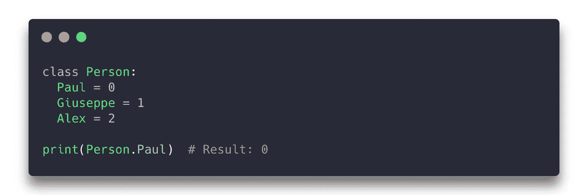**

**以**访问**枚举成员`Paul`为例，你可以只做`Person.Paul`，它将返回`0`。**

**在 Python 中，上面的例子可以通过在旁边列出变量**并设置它们等于**范围**函数**而被**缩短为**:**

**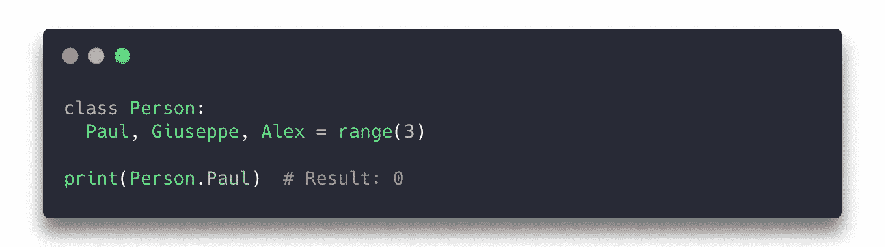**

# **10.列举**

**通常当循环遍历一个列表时，你不仅想访问列表中位置为**的**索引**，还想访问实际的**元素**。****

**让我们定义一个**字符**的**列表**:**

```
x = ['a', 'b', 'c']
```

**代替**循环**通过它的**标准**方式，访问元素和索引:**

**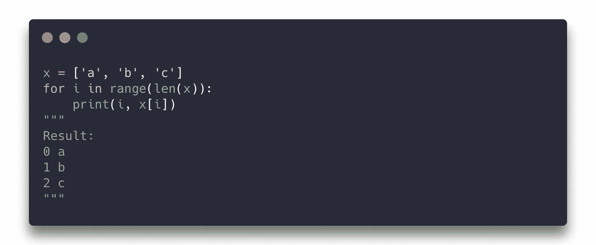**

## **使用枚举**

**Enumerate 是 Python 的一个内置函数，允许我们循环遍历一个**可迭代的**并拥有一个**自动计数器**。它本质上是**将列表中的每个元素**与**对应的索引**配对。大部分新人甚至一些高级程序员都没有意识到。**

**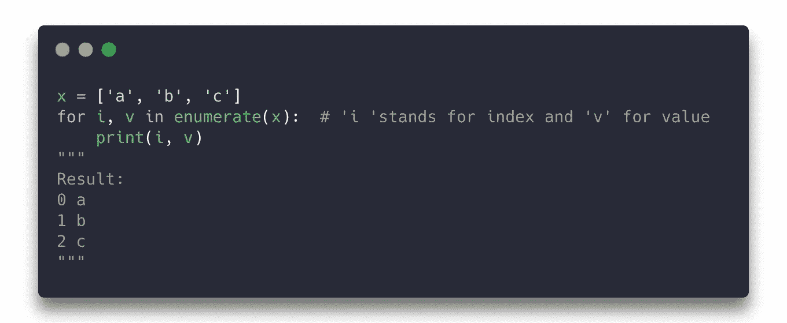**

**您可以将变量`i`和`v`更改为您喜欢的变量名。比如`for **index, count** in enumerate(x)`。**

# **11.Dir 函数**

**`dir()`是 Python3 中一个强大的内置函数，它**返回**任何对象的**属性**和**方法**的列表，如函数、模块、字符串、列表、字典等。**

**这在几乎没有关于模块的信息时非常有用，有助于更快地学习新模块。**

## **例如:**

**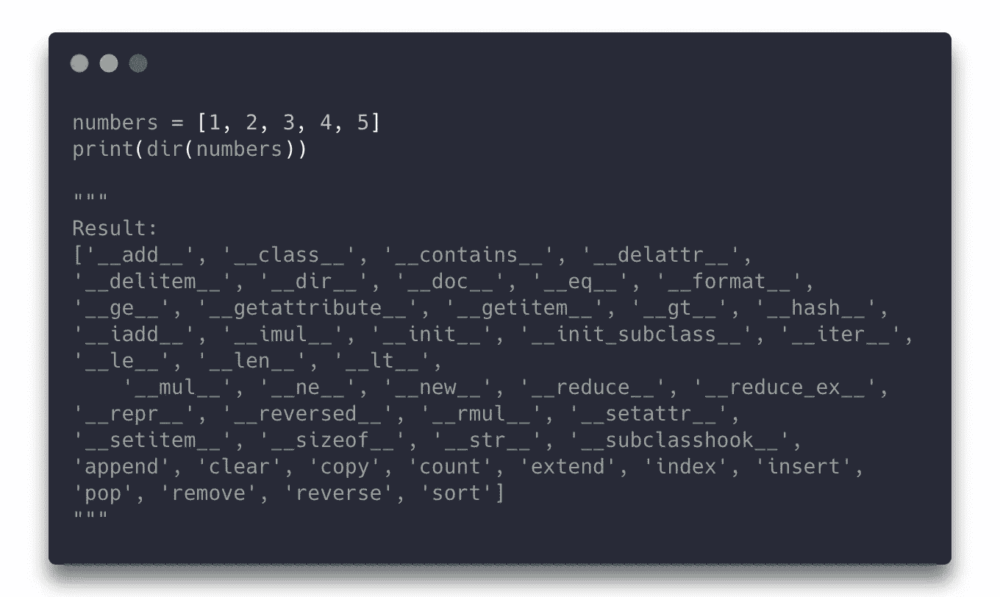**

**`dir()` 通常用于*调试目的*。当分别处理`dir()`许多`dir()`类和函数时，`dir()`列出所传递参数的所有属性的能力非常有用。**

# **12.参数解包**

**有时被称为 *Splat* 或 *Scatter* 操作符`*****`在一个需要**分离** **位置** **参数**的函数调用中需要对列表/元组中的参数进行解包时起作用。**

**例如，内置的`range()` 函数期望单独的 ***开始*** 和 ***停止*** 参数。在编写函数调用时，可以使用`*`操作符来**将参数从列表或元组中解包**:**

**让我们定义一个简单的列表`x = [1,2,3,4,5]`**

**解包操作符的一个常见例子是使用`print`:**

```
print(*x) // Result: 1 2 3 4 5
```

**这只是简单地打印出列表中的每个元素**除了**彼此**由**空格**分隔**，因为**解包操作符**获取列表中的所有元素，**将它们作为**参数**传递给**，所以上面代码的**翻译**将是`print(1,2,3,4,5)`。**

**这个 **Python** 技巧在函数中经常使用，将方法调用接收的所有参数**打包到一个**单变量**中。****

## ****例如:****

****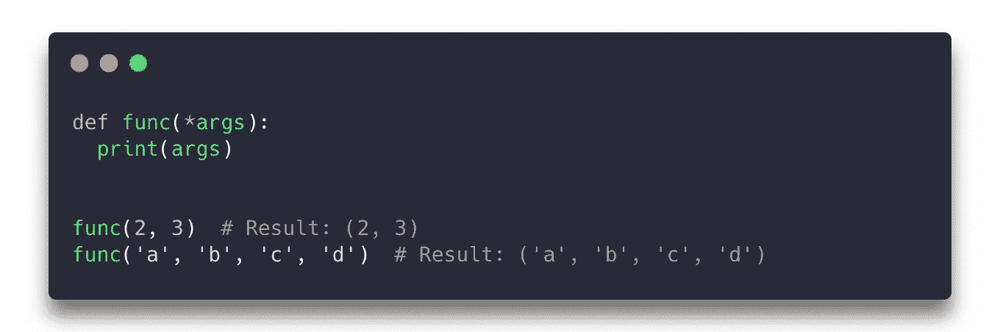****

****上面的`func` 函数可以带一个**无限量**的**自变量** ( `args[0]`和`args[1]`会分别给你第一个**自变量**和第二个**自变量**)。****

****类似地，**字典**可以用`******`操作符传递关键字参数。****

****让我们定义一个名为`person`的 Python 字典:****

```
**person = {"**name**": "Paul", "**age**": 23, "**location**": "London"}**
```

****您可以使用`******`操作符将**字典中的** **传递给一个函数。******

****传入的字典将**分解**键**键**作为函数关键字参数，然后将**值**作为传递给该参数的**实际值**。****

## ****例如:****

****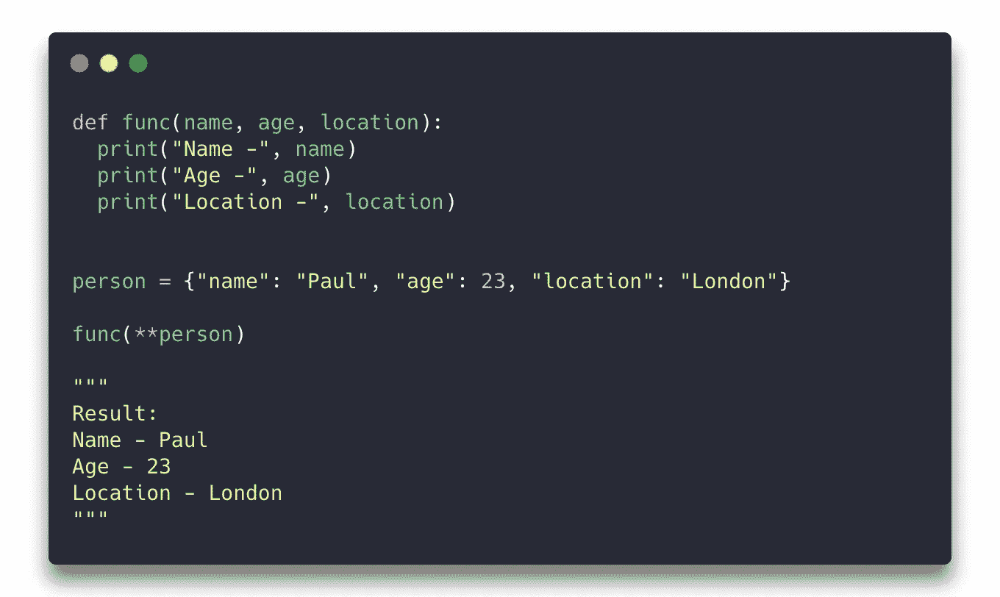****

# ****遗言****

****感谢您的阅读，希望这篇文章对您有用！****

****如果有你认为我应该包括的提示或其他建议，请评论。💬****

****编码快乐！💻☕️****