# 展现 AI 真相的 12 个 XKCD 条

> 原文：<https://towardsdatascience.com/12-xkcd-strips-that-show-the-truth-about-ai-e09fbcd00c4c?source=collection_archive---------17----------------------->

## 简笔画洞察假人工智能，反向图灵测试，超级智能，等等。

乔·奇恰雷利在 [Unsplash](https://unsplash.com?utm_source=medium&utm_medium=referral) 上的照片

[XKCD](https://xkcd.com/) ，一个 15 岁的“浪漫、讽刺、数学和语言的网络漫画家”，巧妙地将复杂的想法，如人工智能，提炼成简单的漫画。

XKCD 慷慨地允许带归属的重新打印，所以这里有 12 个 XKCD 条，展示了关于 AI 的真相。

# 生物神经网络与人工神经网络

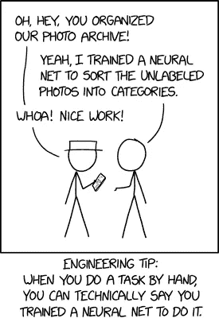

[XKCD #2173](https://xkcd.com/2173/)

你的大脑是一个由 860 亿个神经元组成的互联网络——如果你愿意，可以称之为神经网络。人工神经网络受到这种设计的启发，虽然最简单的构造——感知机——只是单个神经元，但现代神经网络(NNs)可以达到 10 亿个权重和数百万个神经元。

通过从数据中学习模式，神经网络可以完成从图像识别到预测的广泛任务。

然而，如果我们走得太远，我们可能会浪费时间来构建模型，而手动工作会更好。

 [## 何时不使用机器学习或人工智能

### 一厢情愿、不稳定和寻找模式的冒险

towardsdatascience.com](/when-not-to-use-machine-learning-or-ai-8185650f6a29) 

# 假 AI

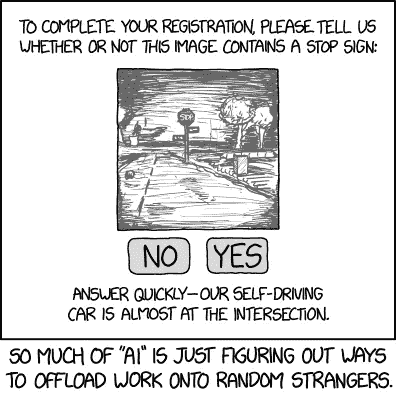

[XKCD #1897](https://xkcd.com/1897/)

从各方面来看，人工智能似乎无处不在。转向产品搜索、Twitter 或/r/startups，看起来好像每分钟都有新的人工智能解决方案冒出来。

但事实真的是这样吗——还是有些公司在“作弊”？事实证明，几家公司已经被抓到了，他们声称使用人工智能，但实际上是外包粗活。据《福布斯》报道，这些只是犯有“伪人工智能”罪的公司中的一部分:

*   汉森机器人公司
*   X.人工智能
*   克拉拉实验室

 [## 人工智能还是人类智能？公司伪造人工智能

### 人工智能是一个广泛的热门话题-从寻求实施人工智能系统的企业到…

www.forbes.com](https://www.forbes.com/sites/cognitiveworld/2020/04/04/artificial-or-human-intelligence-companies-faking-ai/#4112061c664f) 

# 理论

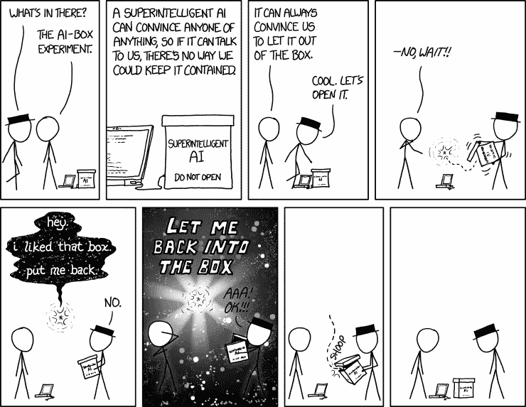

[XKCD #1450](https://xkcd.com/1450/)

虽然未来主义者和思想领袖可能会告诉你，但我们真的不知道超级智能人工智能创造出来后会发生什么。

会仁慈吗？恶毒？中立？无感觉但超级聪明？无论发生什么，都会让我们大吃一惊。

 [## 有知觉的人造生物的权利

### 哲学的进步可能远比科学技术更难

towardsdatascience.com](/rights-of-sentient-artificial-beings-1ada7e7d3e6) 

# 数据管道

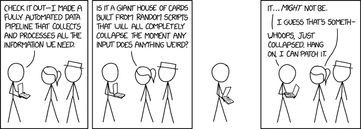

[XKCD #2054](https://xkcd.com/2054/)

建立数据管道并不容易。要构建数据产品，您需要能够从潜在的数百万用户那里收集数据，并近乎实时地处理结果。您的管道需要健壮、可伸缩、高效，并具有监控功能。

有多难，很多管道都不勾选所有的框。

 [## 基于云的高吞吐量低延迟大数据管道架构

### 对于分析和 ML 的成功，可扩展和高效的数据管道与可靠的供应线一样重要…

towardsdatascience.com](/scalable-efficient-big-data-analytics-machine-learning-pipeline-architecture-on-cloud-4d59efc092b5) 

# 培养

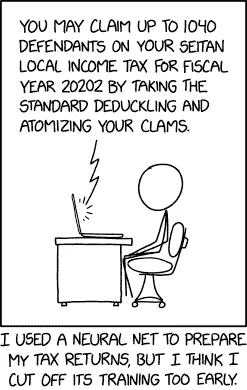

[XKCD #2265](https://xkcd.com/2265/)

通过训练神经网络——或者多次将训练数据传递给复合函数，以便学习模式——我们可以预测新数据。如果你训练的时间不够长，你的模型将会“不合适”，或者根本没有学习到数据中的模式。

你可能最终会有一个会说胡言乱语的聊天机器人，或者一辆只能直行的自动驾驶汽车。

 [## 纪元与批量大小与迭代次数

### 了解您的代码…

towardsdatascience.com](/epoch-vs-iterations-vs-batch-size-4dfb9c7ce9c9) 

# 聊天机器人

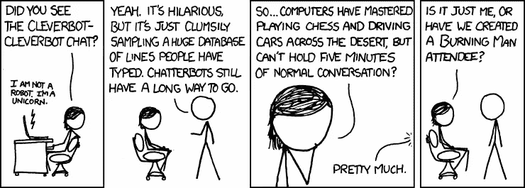

[XKCD #948](https://xkcd.com/948/)

Cleverbot 于 1997 年发布*，所以有点像样的聊天机器人已经有很长的历史了。*

*然而，创造新的和独特的东西的人工智能和仅仅*检索*人类过去做过或说过的东西的人工智能之间有很大的区别——比如 Cleverbot。*

*公平地说，现代聊天机器人在技术上有了很大的进步，而且惊人地准确。*

* [## 我尝试了脸书新的人工智能聊天机器人...太好了，太吓人了。|黑客正午

### 我:嘿，你最喜欢哪个棒球队？Bot:我真的没有喜欢的球队。我更像一个足球迷。什么…

hackernoon.com](https://hackernoon.com/i-tried-facebooks-new-ai-chatbot-its-so-good-its-scary-jn3332ez)* 

# *数据➡️回答*

**

*[XKCD #1838](https://xkcd.com/1838/)*

*尽管我们在人工智能方面取得了很多进展，但在可解释性方面做得相对较少。虽然“黑盒”人工智能的想法有点像神话——因为有很多方法可以解释结果——但对于大多数人工智能模型，尤其是深度学习，如何真正在引擎盖下工作，还没有完全的透明度或直觉。*

* [## 打开医学人工智能的黑匣子

### 在世界各地的诊所中，一种称为深度学习的人工智能开始补充或…

undark.org](https://undark.org/2019/12/04/black-box-artificial-intelligence/)* 

# *感觉*

*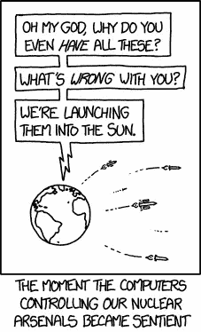*

*[XKCD #1626](https://xkcd.com/1626/)*

*阿西莫夫机器人第三定律是机器人必须保护自己的存在。核爆炸[触发 EMP](https://www.businessinsider.com/nukes-electromagnetic-pulse-electronics-2017-5#:~:text=Nuclear%20blasts%20trigger%20an%20effect,its%20electric%20and%20telecommunications%20infrastructure.)摧毁电子设备，因此遵守阿西莫夫定律的有感知能力的人工智能可能会寻求摧毁我们的核武器，而不是用它们来对付我们。*

* [## 阿西莫夫的机器人定律，以及为什么人工智能可能不遵守它们

### 阅读为人工智能-人类合作设计的法律，并在此过程中一窥 NLP 的最新水平。

towardsdatascience.com](/asimovs-laws-of-robotics-and-why-ai-may-not-abide-by-them-e6da09f8c754)* 

# *我们不应该担心人类吗？*

*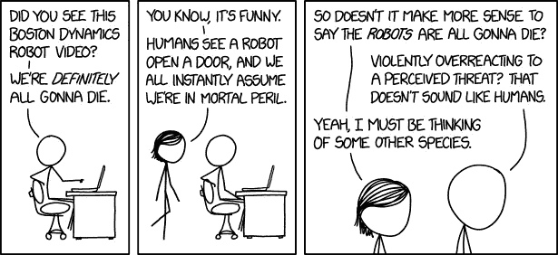*

*[XKCD #1955](https://xkcd.com/1955/)*

*有很多关于人工智能的恐惧，有些是合理的(人工智能可能会带来种族和性别偏见，人工智能可能会刺激失业，等等)，其他人是不合理的(人工智能会杀了我们)。*

*然而，所有这些恐惧忘记了一件事:人类，而不是 AI，才是危险。不幸的事实是，历史上有多达 10 亿人在战争中丧生。*

* [## 为什么人工智能是一门恐惧驱动的学科|黑客正午

### 数据科学的民主化。“71%的消费者担心人工智能会侵犯他们的隐私。”当被问及他们的想法时…

hackernoon.com](https://hackernoon.com/why-ai-is-a-fear-driven-discipline-346zj3yrk)* 

# *图灵检定*

*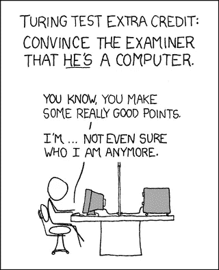*

*[XKCD #329](https://xkcd.com/329/)*

*在关于人工智能的开创性论文 [*计算机械与智能*](https://www.csee.umbc.edu/courses/471/papers/turing.pdf) 中，图灵问道:“机器能思考吗？”—或者，更准确地说，机器能模仿思维吗？*

*到目前为止，答案是“不”，但我们很可能有一天会实现这一目标，也许会通过一项新的测试来提高标准。*

* [## 人工智能的历史:图灵测试

### 机器会思考吗？

towardsdatascience.com](/the-history-of-artificial-intelligence-the-turing-test-c1d6777d2970)* 

# *人类更擅长…*

*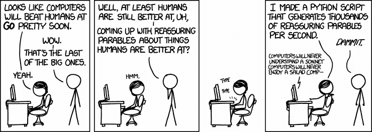*

*[XKCD #1263](https://www.xkcd.com/1263/)*

*随着每一个新的人工智能的进步，愤世嫉俗者不断改变目标，人工智能也不断赶上。*

* [## 14 种深度和机器学习的使用使 2019 年成为一个新的人工智能时代。

### 比格根、塞勒根、斯泰尔根、高根、艺术育种家、德奥迪菲等。:我非常私人的清单(包括奖金)。

towardsdatascience.com](/14-deep-learning-uses-that-blasted-me-away-2019-206a5271d98)* 

# *简单与不可能的任务*

*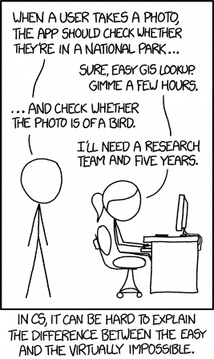*

*[XKCD #1425](https://www.xkcd.com/1425/)*

*在计算机领域，外行人看似相似的两个任务可能很容易成为琐碎和几乎不可能的区别。今天，在上面这幅漫画诞生多年后，图像识别任务已经变得简单多了，但许多其他任务却极具挑战性。*

*例如，我们如何创建一个神经网络，它不仅可以解释，而且可以直观地*解释？我们如何创建新的最先进的神经网络*而不是简单地增加更多的计算、更多的数据和更多的参数？我们怎样才能创造出通用的人工智能，而不是狭义的人工智能？我们如何实现第 5 级自动驾驶——它可以处理像道路工人举着停止标志，同时通过眼神接触向你旁边的司机*示意继续前进这样的事情？****

该领域有许多未解的问题，这使得它更加令人兴奋！

 [## 那是只莺吗？Python 中 Keras CNN 的鸟类分类

### 有没有想过“那是什么鸟？”

towardsdatascience.com](/is-that-a-warbler-bird-classification-with-keras-cnn-in-python-db4606555a33) 

# 想要更多这样的内容？

如果你想了解更多关于人工智能和数据科学的知识，请关注我的[走向数据科学](https://towardsdatascience.com/@frederikbussler)，以及我参与撰写的 Apteo 的[数据科学博客](http://apteo.co/blog)。

 [## 弗雷德里克·布斯勒——走向数据科学

### 阅读 Frederik Bussler 在《走向数据科学》中的文章。数据科学的民主化。Apteo 的顾问-无代码…

towardsdatascience.com](https://towardsdatascience.com/@frederikbussler)