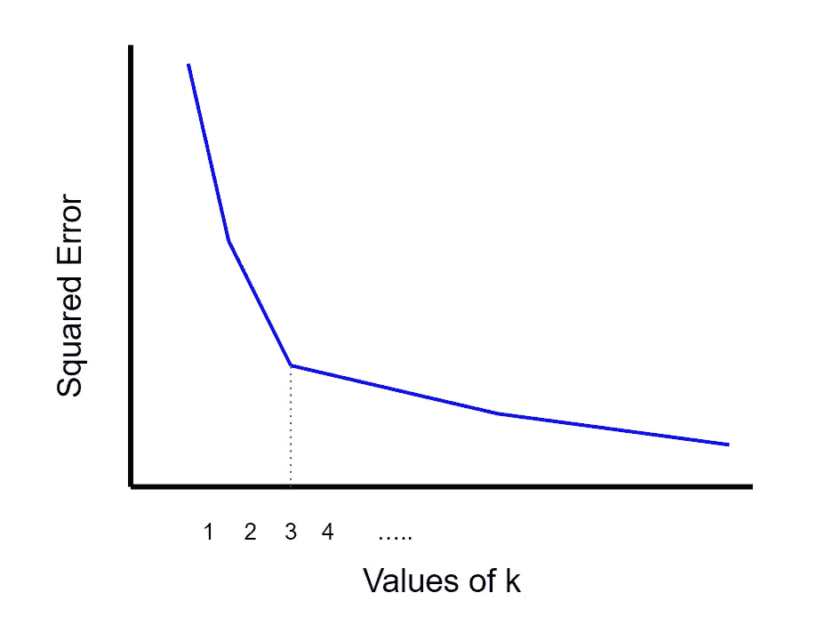
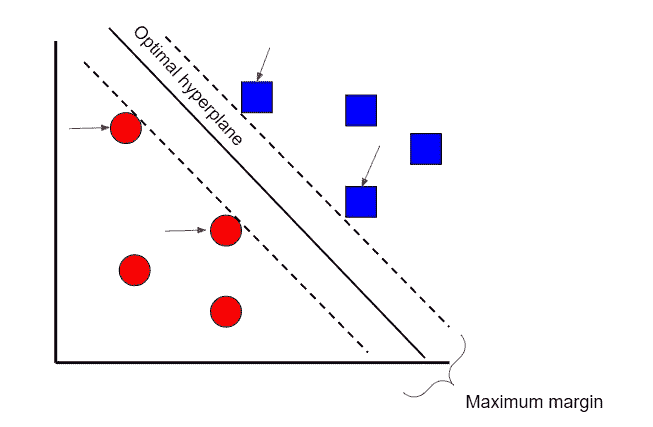
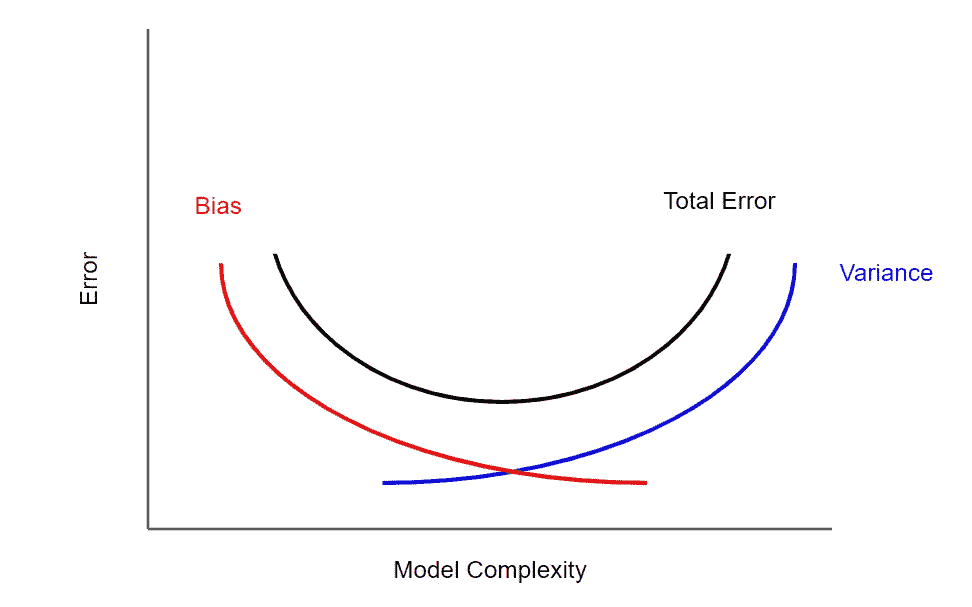
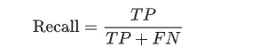
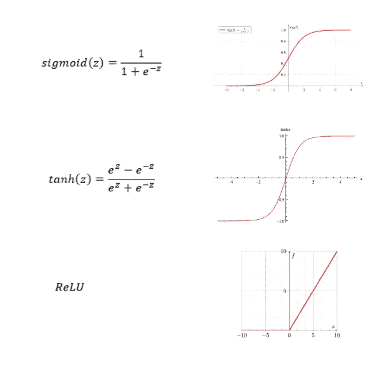
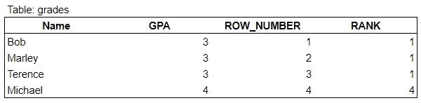
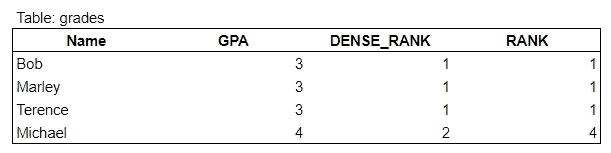
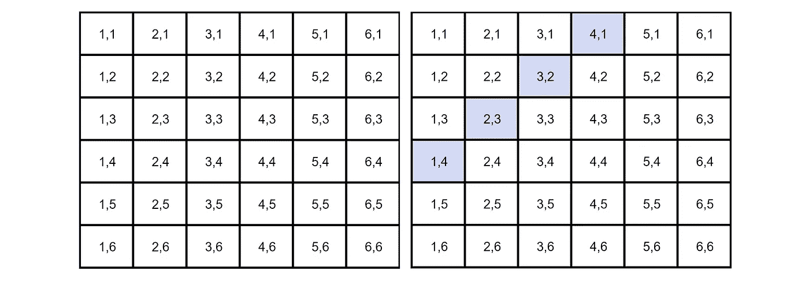
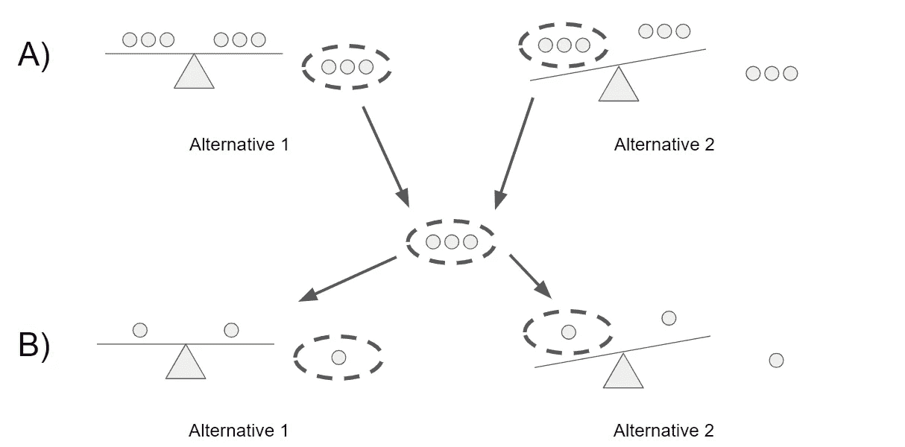

# 2021 年你应该知道的 120+数据科学家面试问答

> 原文：<https://towardsdatascience.com/120-data-scientist-interview-questions-and-answers-you-should-know-in-2021-b2faf7de8f3e?source=collection_archive---------0----------------------->

## 面试问题来自脸书、Yelp、亚马逊、谷歌、苹果、网飞等等


约瑟夫·巴里恩托斯在 [Unsplash](https://unsplash.com/s/photos/san-francisco?utm_source=unsplash&utm_medium=referral&utm_content=creditCopyText) 上拍摄的照片

2020 年不是最伟大的一年，所以我想为什么不在 2021 年领先一步呢！

这篇文章有超过 120 个数据科学面试问题，来自世界上一些顶尖的科技公司，如脸书、谷歌、Yelp、亚马逊等等！

> ***一定要*** [***订阅***](https://terenceshin.medium.com/membership) ***千万不要错过另一篇关于数据科学指南、诀窍和技巧、生活经验等的文章！***

这篇文章和我以前的文章有什么不同？

1.  更多问题！这篇文章不是 100 个问题，而是超过 120 个面试问题来帮助你准备。
2.  更多 SQL！这一次，根据要求，有更多的一般 SQL 问题，而不是技术编码问题。
3.  更多深度学习！这一次，关于神经网络和深度学习的问题更多了。
4.  更多案例分析！有一堆 SQL 案例研究和业务案例研究，这样你就可以自己应用了。
5.  更精致！更少的语法错误(希望如此),以及更少的错误。更多图片和图表！

这分为几个部分:

1.  机器学习
2.  结构化查询语言
3.  统计、概率和数学
4.  数据和业务分析
5.  多方面的
6.  个案研究

说到这里，祝你好运！

# **机器学习**

## 问:线性回归需要哪些假设？如果这些假设中的一些被违反了呢？

有四个与线性回归模型相关的假设:

1.  **线性:**X 和 Y 的均值之间的关系是线性的。
2.  **同方差:**残差的方差对于 x 的任意值都是相同的。
3.  **独立性:**观测值相互独立。
4.  **正态:**对于 X 的任意固定值，Y 都是正态分布。

极端违反这些假设将使结果变得多余。对这些假设的小的违反将导致估计的更大的偏差或方差。

## 问:什么是共线性？什么是多重共线性？你是怎么处理的？

**共线性**是两个预测值之间的线性关联。**多重共线性**是两个**或更多**预测值高度线性相关的情况。

这可能是有问题的，因为它破坏了一个独立变量的统计意义。虽然它不一定对模型的准确性有很大影响，但它会影响预测的方差，并降低独立变量的解释质量。

您可以使用方差膨胀因子(VIF)来确定自变量之间是否存在多重共线性-标准基准是，如果 VIF 大于 5，则存在多重共线性。

> ***一定要*** [***订阅***](https://terenceshin.medium.com/membership) ***千万不要错过另一篇关于数据科学指南、诀窍和技巧、生活经验等的文章！***

## 问:线性模型的缺点是什么？

线性模型有几个缺点:

*   线性模型有一些强有力的假设，在应用中可能不成立。它假设线性关系、多元正态性、没有或很少多重共线性、没有自相关和同方差。
*   线性模型不能用于离散或二元结果。
*   您不能改变线性模型的模型灵活性。

## 问:什么是岭回归和套索回归，它们之间有什么区别？

L1 和 L2 正则化都是用于减少训练数据过拟合的方法。最小二乘法使残差平方和最小，这可能导致低偏差但高方差。


**L2 正则化**，也称为**岭回归**，最小化残差平方和加上λ乘以斜率平方。这个附加项被称为岭回归损失。这增加了模型的偏差，使得对训练数据的拟合更差，但是也减少了方差。
如果你取岭回归罚，用斜率的绝对值代替，那么你得到**套索回归**或者 **L1 正则化**。

L2 不太稳健，但有一个稳定的解决方案，而且总是一个解决方案。L1 更稳健，但是具有不稳定的解，并且可能具有多个解。

## 问:K 近邻是如何工作的？


作者创建的图像

K-最近邻是一种分类技术，其中通过查看最近的分类点对新样本进行分类，因此称为“K-最近”。在上面的例子中，如果 k=1，那么未分类的点将被分类为蓝点。

如果 k 值太低，它可能会受到异常值的影响。但是，如果它太高，可能会忽略只有几个样本的类。

## 问:如何为 k 均值选择 k？

您可以使用**肘法，**，这是一种用于确定 k 的最佳值的常用方法。实际上，您要做的是在图表上绘制 k 的每个值的平方误差(x 轴上的 k 值和 y 轴上的平方误差)。一旦图形制作完成，失真下降最多的点就是肘点。



作者创建的图像

以上面的图像为例，你可以看到当 k=3 时出现肘部，因此 k 应该等于 3。

## 问:为什么朴素贝叶斯“幼稚”？

朴素贝叶斯之所以是朴素的，是因为它有一个强有力的假设，即假设要素之间是不相关的，但事实通常并非如此。

## 问:SVM 的支持向量是什么？

支持向量是接触最大边距边界的数据点(见下文)。



作者创建的图像

## 什么是决策树中的修剪？

**剪枝**是机器学习和搜索算法中的一种技术，通过删除对实例分类几乎没有帮助的部分或分支来减少决策树的大小。

## 问:什么是随机森林？为什么朴素贝叶斯更好？

随机森林是一种基于决策树的[集成学习](https://en.wikipedia.org/wiki/Ensemble_learning)技术。随机森林包括使用原始数据的[自举数据集](https://machinelearningmastery.com/a-gentle-introduction-to-the-bootstrap-method/)创建多个决策树，并在决策树的每一步随机选择一个变量子集。然后，该模型选择每个决策树的所有预测的模式。依靠“多数获胜”模型，它降低了单个树出错的风险。


作者创建的图像

例如，如果我们创建一个决策树，第三个，它会预测 0。但是如果我们依赖所有 4 个决策树的模式，预测值将是 1。这就是随机森林的力量。

随机森林提供了其他几个好处，包括强大的性能，可以模拟非线性边界，不需要交叉验证，并赋予功能重要性。

从过程和结果易于训练和理解的意义上来说，朴素贝叶斯更好。一个随机的森林看起来就像一个黑盒。因此，在实现和理解方面，朴素贝叶斯算法可能更好。但是，就性能而言，随机森林通常更强，因为它是一种集合技术。

## 问:什么时候你会使用随机森林来对抗 SVM，为什么？

为什么随机森林是比支持向量机更好的算法选择有几个原因:

*   随机森林允许您确定要素的重要性。SVM 不能这么做。
*   随机森林比 SVM 建造起来更快更简单。
*   对于多类分类问题，支持向量机需要一种 one-vs-rest 方法，这种方法扩展性差，占用内存多。

## 问:你认为 50 个小决策树比一个大决策树好吗？为什么？

问这个问题的另一种方式是“随机森林是比决策树更好的模型吗？”答案是肯定的，因为随机森林是一种集成方法，需要许多弱决策树来形成强学习器。随机森林更准确、更健壮，并且不容易过度拟合。

## 问:AdaBoosted 树和渐变 Boosted 树有什么区别？

**AdaBoost** 是一种增强的算法，类似于随机森林，但有几个显著的区别:

1.  AdaBoost 通常制作树桩森林(树桩是只有一个节点和两片叶子的树)，而不是树木森林。
2.  每个树桩的决策在最终决策中的权重并不相等。总误差少(精度高)的树桩会有更高的话语权。
3.  树桩创建的顺序很重要，因为每个后续树桩都强调在前一个树桩中被错误分类的样本的重要性。

**梯度增强**在某种意义上类似于 AdaBoost，它构建了多棵树，其中每棵树都是基于前一棵树构建的。与 AdaBoost 构建树桩不同，Gradient Boost 构建的树通常有 8 到 32 片叶子。

更重要的是，Gradient 与 AdaBoost 在决策树的构建方式上有所不同。梯度增强从初始预测开始，通常是平均值。然后，基于样本的残差构建决策树。通过采用初始预测+学习率乘以残差树的结果来进行新的预测，并且重复该过程。

## 问:什么是偏差-方差权衡？

估计量的**偏差**是期望值和真实值之差。具有高偏差的模型往往过于简单，导致拟合不足。方差表示模型对数据和噪声的敏感度。具有高**方差**的模型会导致过度拟合。

因此，**偏差-方差权衡**是机器学习模型的一个属性，其中较低的方差导致较高的偏差，反之亦然。一般来说，可以找到两者的最佳平衡，使误差最小化。



作者创建的图像

## 问:解释什么是 bootstrap 抽样方法，并举例说明何时使用该方法。

从技术上讲，bootstrap 抽样法是一种使用带替换的随机抽样的重抽样方法。*此处阅读更多*[](/what-is-bootstrap-sampling-in-machine-learning-and-why-is-it-important-a5bb90cbd89a)**。**

*它是随机森林算法以及其他集成学习算法的重要组成部分。*

## *问:装袋和助推有什么区别？*

***Bagging** 又称 **bootstrap aggregating** ，是用原始数据集的自举样本对同一学习算法的多个模型进行训练的过程。然后，像上面的随机森林示例一样，对所有模型的输出进行投票。*

**

*作者创建的图像*

*Boosting 是 bagging 的一种变体，其中每个单独的模型都是按顺序构建的，并迭代上一个模型。具体来说，任何被前一个模型错误分类的数据点都会在后一个模型中得到强调。这样做是为了提高模型的整体准确性。这里有一个图表，可以更好地理解这个过程:*

**

*作者创建的图像*

*一旦建立了第一模型，除了第二自举样本之外，还采用错误分类/预测的点来训练第二模型。然后，针对测试数据集使用集合模型(模型 1 和 2 ),并且该过程继续。*

## *问:XGBoost 如何处理偏差-方差权衡？*

**

*作者创建的图像*

*[XGBoost](https://xgboost.ai/) 是一种利用梯度推进算法的集成机器学习算法。本质上，XGBoost 就像是类固醇上的**装袋**和**助推**技术。因此，可以说 XGBoost 处理偏差和方差的方式类似于任何 boosting 技术。Boosting 是一种集成元算法，通过对许多弱模型进行加权平均来减少偏差和方差。通过关注弱预测和迭代模型，误差(从而偏差)减少了。类似地，因为它采用了许多弱模型的加权平均值，所以最终模型比每个弱模型本身具有更低的方差。*

## *问:什么是交叉验证？*

***交叉验证**本质上是一种用于评估模型在新的独立数据集上表现如何的技术。*

*交叉验证最简单的例子是将数据分为三组:训练数据、验证数据和测试数据，其中训练数据用于构建模型，验证数据用于调整超参数，测试数据用于评估最终模型。*

## *问:假设您需要使用多元回归生成一个预测模型。解释你打算如何验证这个模型。*

*有两种主要方法可以做到这一点:*

***A)调整后的 R 平方**。*

*r 平方是一种度量，它告诉你因变量的方差在多大程度上是由自变量的方差来解释的。更简单地说，当系数估计趋势时，R 平方表示最佳拟合线周围的散布。*

*然而，添加到模型中的每个额外的独立变量**总是**增加 R 平方值——因此，具有几个独立变量的模型可能看起来更适合，即使它不是。这就是调整后的 R 的用武之地。调整后的 R 补偿每个额外的独立变量，并且仅在每个给定变量将模型改进到超出概率可能的程度时才增加。这很重要，因为我们正在创建一个多元回归模型。*

***B)交叉验证***

*大多数人常用的方法是交叉验证，将数据分成三组:训练、验证和测试数据。*见前面的回答。**

## *问:在线学习和批量学习有什么区别？*

***批量学习**，也称为离线学习，就是你学习一组组的模式。这是大多数人都熟悉的学习类型，在这种情况下，您可以获取一个数据集，然后一次性在整个数据集上构建一个模型。*

*另一方面，在线学习是一种一次吸收一个观察数据的方法。在线学习是数据高效的，因为数据一旦被消费就不再需要，这在技术上意味着你不必存储你的数据。*

## *问:给出几种处理缺失值的方法*

*有多种方法可以处理空值，包括:*

*   *您可以完全忽略空值行*
*   *您可以用集中趋势的度量值(平均值、中值、众数)替换空值，或者用新的类别替换空值(如“无”)*
*   *您可以根据其他变量预测空值。例如，如果某一行的 weight 值为空，但它的 height 值为空，则可以用该给定高度的平均重量替换该空值。*
*   *最后，如果您正在使用自动处理空值的机器学习模型，则可以保留空值。*

## *问:缺失数据的均值插补是可接受的做法吗？为什么或为什么不？*

***均值插补**是用数据的均值替换数据集中的空值的实践。*

*均值插补通常是不好的做法，因为它没有考虑特征相关性。例如，假设我们有一个显示年龄和健康分数的表格，并假设一个 80 岁的老人缺少健康分数。如果我们从 15 岁到 80 岁的年龄范围内取平均健康分数，那么 80 岁的人看起来会比他实际应该得到的健康分数高得多。*

*第二，均值插补减少了数据的方差，增加了数据的偏倚。由于方差较小，这导致模型不太精确，置信区间较窄。*

## *什么是混淆矩阵？*

*混淆矩阵，也称为误差矩阵，是用于评估分类模型性能的**汇总表**。正确和错误预测的数量用计数值汇总，并按每个类别细分。*

**

*由作者创建*

## *问:什么是监督与非监督学习？*

*监督学习包括在标记为的**数据集上学习，其中**目标变量是已知的**。***

*无监督学习用于从输入数据**中得出推论和发现模式，而不需要**参考标记的结果——没有**目标变量**。*

## *问:什么是集成学习？*

***集成学习**是一种多种学习算法联合使用的方法。这样做的目的是让您获得比单独使用单个算法更高的预测性能。随机森林就是一个例子。*

## *问:如何识别异常值？*

*有几种方法可以识别异常值:*

***Z 值/标准偏差:**如果我们知道一个数据集中 99.7%的数据位于三个标准偏差内，那么我们可以计算一个标准偏差的大小，乘以 3，并确定超出该范围的数据点。同样，我们可以计算给定点的 z 分数，如果它等于+/- 3，那么它就是异常值。
注意:使用该方法时，需要考虑一些意外情况；数据必须呈正态分布，这[不适用于小数据集](https://statisticsbyjim.com/basics/outliers/)，并且过多异常值的存在会影响 z 值。*

***四分位距(IQR):** IQR，用于构建箱线图的概念，也可用于识别异常值。IQR 等于第三个四分位数和第一个四分位数之差。然后，如果一个点小于 Q1-1.5 * IRQ 或大于 Q3 + 1.5*IQR，则可以确定该点是否为异常值。这达到大约 2.698 个标准偏差。*

*其他方法包括 DBScan 聚类、隔离森林和稳健随机采伐森林。*

## *什么是内球？*

*一个**内联者**是一个数据观察，它位于数据集的其余部分内，是不寻常的或者是一个错误。由于它位于数据集中，通常比异常值更难识别，需要外部数据来识别它们。*

## *问:如何处理异常值？*

*有几种方法:*

1.  *如果离群值是垃圾值，则将其移除。*
2.  *你可以试试不同的型号。例如，非线性模型处理异常值的方式可能与线性模型不同。*
3.  *您可以标准化数据以缩小范围。*
4.  *您可以使用计算异常值的算法，例如随机森林。*

## *问:协同过滤和基于内容的过滤有什么相似之处？不一样？*

*在**基于内容的过滤**中，您使用对象的属性来查找相似的产品。例如，使用基于内容的过滤，电影推荐器可以推荐相同类型的电影或者由同一导演执导的电影。*

*在**协同过滤**中，你的行为会与其他用户进行比较，有类似行为的用户会决定向你推荐什么。给**一个非常**简单的例子，如果你买了一台电视，另一个用户买了一台电视和一个躺椅，你也会被推荐这个躺椅。*

## *问:什么是主成分分析？解释你会用主成分分析来解决哪类问题。*

*从最简单的意义上来说，PCA 涉及将高维数据(例如 3 维)投影到更小的空间(例如 2 维)。这导致数据的维度降低(2 维而不是 3 维)，同时保持模型中的所有原始变量。*

*PCA 通常用于压缩目的，以减少所需的内存并加速算法，以及用于可视化目的，使汇总数据更容易。*

## *问:验证集和测试集之间有什么区别？*

*通常，验证集用于调整模型的超参数，而测试集用于评估最终模型。*

## *问:如何避免过度拟合模型？*

*对于那些不知道的人来说，**过度拟合**是一种建模错误，当一个函数与数据过于接近时，会导致新数据被引入模型时出现高水平的错误。*

*有多种方法可以防止模型过度拟合:*

*   ***交叉验证**:交叉验证是一种用于评估模型在新的独立数据集上表现如何的技术。交叉验证最简单的例子是将数据分成两组:定型数据和测试数据，其中定型数据用于构建模型，测试数据用于测试模型。*
*   ***正则化**:当模型具有更高次多项式时，会发生过拟合。因此，**正则化**通过惩罚高次多项式来减少过拟合。*
*   ***减少特征数量**:你也可以通过减少输入特征的数量来减少过度拟合。您可以通过手动移除特征来实现这一点，或者您可以使用一种称为主成分分析的技术，该技术将高维数据(例如 3 维)投影到较小的空间(例如 2 维)。*
*   ***集成学习技术**:集成技术通过 bagging 和 boosting 将许多弱学习者转化为强学习者。通过装袋和增压，这些技术比它们的替代技术更容易过度适应。*

## *问:在应用机器学习算法之前，数据争论和数据清洗的一些步骤是什么？*

*当数据争论和数据清理时，可以采取许多步骤。下面列出了一些最常见的步骤:*

*   ***数据剖析:**几乎每个人都从了解自己的数据集开始。更具体地说，您可以使用。形状和对数值变量的描述。描述()。*
*   ***数据可视化:**有时，用直方图、箱线图和散点图来可视化数据很有用，可以更好地理解变量之间的关系，也可以识别潜在的异常值。*
*   ***语法错误**:这包括确保没有空格，确保字母大小写一致，检查错别字。您可以使用。unique()或使用条形图。*
*   ***标准化或规范化**:根据您正在处理的数据集和您决定使用的机器学习方法，标准化或规范化您的数据可能会很有用，这样不同变量的不同尺度就不会对模型的性能产生负面影响。*
*   ***处理空值:**有多种方式来处理空值，包括完全删除具有空值的行，用均值/中值/众数替换空值，用新的类别(例如未知)替换空值，预测值，或者使用可以处理空值的机器学习模型。*此处阅读更多*[](https://analyticsindiamag.com/5-ways-handle-missing-values-machine-learning-datasets/)**。***
*   ****其他还有:**去除无关数据，去除重复，类型转换。**

## **问:你应该如何处理不平衡的二进制分类？**

**有许多方法可以处理不平衡的二进制分类(假设您想要识别少数类):**

*   **首先，你要重新考虑你用来评估模型的**指标**。你的模型的准确性可能不是最好的衡量标准，因为我将用一个例子来解释为什么。假设 99 次银行取款不是欺诈，1 次取款是欺诈。如果你的模型只是简单地将每个实例归类为“非欺诈”，那么它的准确率将达到 99%！因此，您可能需要考虑使用精度和召回率等指标。**
*   **另一种改善不平衡二进制分类的方法是通过**增加错误分类**少数类的成本。通过增加这样的惩罚，该模型应该更准确地对少数民族进行分类。**
*   **最后，你可以通过**过采样**少数阶级或者**欠采样**多数阶级来改善阶级的平衡。你可以在这里了解更多关于[的信息。](http://how%20to%20deal%20with%20unbalanced%20binary%20classification/?)**

## **问:精确和召回的区别是什么？**

****回忆一下**试图回答“正确识别实际阳性的比例是多少？”**

****

****Precision** 试图回答“多大比例的肯定识别实际上是正确的？”**

****

## **问:为什么均方差不是衡量模型性能的好方法？你有什么建议？**

**均方误差(MSE)对大误差给予相对较高的权重，因此，MSE 往往过于强调大偏差。更可靠的替代方法是 MAE(平均绝对偏差)。**

## **问:解释什么是假阳性和假阴性。为什么这些对彼此很重要？举例说明什么时候假阳性比假阴性重要，什么时候假阴性比假阳性重要。**

**一个**假阳性**是当一个条件不存在时对其存在的不正确识别。**

****假阴性**是对实际存在的条件不存在的错误识别。**

**假阴性比假阳性更重要的一个例子是癌症筛查。与其说有人得了癌症，后来才发现没有，不如说有人没得癌症。**

**这是一个主观的论点，但从心理学的角度来看，假阳性可能比假阴性更糟糕。例如，彩票中奖的假阳性结果可能比假阴性结果更糟糕，因为人们通常并不期望彩票中奖。**

## ****问:用于选择正确变量的特征选择方法有哪些？****

**有两种类型的特征选择方法:过滤方法和包装方法。**

**过滤方法包括以下几种:**

*   **线性判别分析**
*   **方差分析**
*   **卡方检验**

**包装方法包括以下几种:**

*   **向前选择:我们一次测试一个特性，并不断添加它们，直到我们得到一个合适的为止**
*   **反向选择:我们测试所有的特性，并开始移除它们，看看哪个更好**

## **问:简要解释一个基本的神经网络是如何工作的**

**在其核心，**神经网络本质上是数学方程的网络**。它接受一个或多个输入变量，并通过一个方程式网络，产生一个或多个输出变量。**

****

**作者创建的图像**

**在神经网络中，有一个**输入层**，一个或多个**隐藏层**，以及一个**输出层**。输入层由一个或多个**特征变量**(或输入变量或独立变量)组成，表示为 x1，x2，…，xn。隐藏层由一个或多个隐藏**节点**或隐藏单元组成。节点就是上图中的一个圆圈。类似地，输出变量由一个或多个输出单元组成。**

****

**作者创建的图像**

**就像我一开始说的，神经网络只不过是一个方程网络。神经网络中的每个节点由两个函数组成，一个线性函数和一个激活函数。这是事情变得有点混乱的地方，但是现在，把线性函数想成一些最佳拟合线。另外，把激活功能想象成一个电灯开关，它会产生一个介于 1 或 0 之间的数字。**

## **问:为什么整流线性单位是一个很好的激活函数？**

****

**由作者创建**

**整流线性单元，也称为 ReLU 函数，已知是比 sigmoid 函数和 tanh 函数更好的激活函数，因为它执行梯度下降更快。请注意，在左侧的图像中，当 x(或 z)非常大时，斜率非常小，这会显著降低梯度下降的速度。然而，这不是 ReLU 函数的情况。**

## **问:网络中的权重是如何初始化的？**

**神经网络的权重必须随机初始化，因为这是随机梯度下降的期望。**

**如果您将所有权重初始化为相同的值(即 0 或 1)，那么每个隐藏单元将获得完全相同的信号。例如，如果所有权重初始化为 0，所有隐藏单元将获得零信号。**

## **问:如果学习率设置得太高或太低会发生什么？**

**如果学习率太低，您的模型将训练得非常慢，因为在每次迭代中对权重的更新很少。因此，在达到最小值之前，需要进行多次更新。**

**如果学习率设置得太高，由于权重的剧烈更新，这会导致损失函数出现不期望的发散行为，并且可能无法收敛。**

## **问:什么是递归神经网络？**

**递归神经网络，也称为 RNNs，是一类允许以前的输出用作输入，同时具有隐藏状态的神经网络。**

**它们通常用于识别数据中的序列模式，包括时间序列数据、股票市场数据等**

## **问:激活功能的作用是什么？**

**激活函数的目的是将非线性引入神经元的输出。激活函数通过计算加权和并进一步加上偏差来决定一个神经元是否应该被激活。**

# **结构化查询语言**

## **问:聚合函数和窗口函数有什么区别？**

**窗口函数类似于聚合函数，它返回聚合值(如 SUM()、COUNT()、MAX())。**

**窗口函数的不同之处在于它不对结果集进行分组。输出中的行数与输入中的行数相同。**

## **问:ROW_NUMBER 和 RANK 什么时候会给出不同的结果？举个例子。**

**对于特定的排序值，当分区内有联系时，ROW_NUMBER 和 RANK 将给出不同的结果。**

**示例:**

```
****SELECT ROW_NUMBER() OVER(ORDER BY GPA) as ROW_NUMBER
SELECT RANK() OVER(ORDER BY GPA) as RANK****
```

****

**由作者创建**

> ****更多类似问题，** [**查看 StrataScratch**](https://platform.stratascratch.com/?utm_source=blog&utm_medium=click&utm_campaign=terenceshin)**100 个 SQL 问题。****

## **问:左连接和全外连接可能产生相同的结果吗？为什么或为什么不？**

**是的。如果第二个表中的每一个**行都可以连接到第一个表，并且第一个表中的每一个**行都可以使用左连接连接到第二个表，那么对于完全外连接，结果将是相同的。******

## **问:RANK 和 DENSE_RANK 有什么区别？**

**RANK 给出了您在有序分区中的排名。平局被分配相同的等级，跳过下一个等级。如果您看到下图，1 之后的下一个等级是 4，因为 3 行的等级是 1。**

**DENSE_RANK 也给出了有序分区内的等级，但是等级是连续的。如果有包含多个项目的等级，则不会跳过任何等级。您可以在下图中看到这一点，因为使用 DENSE_RANK，迈克尔的排名是 2，而不是 4。**

****

**DENSE_RANK 与 RANK 的示例**

## **问:如果我按 SELECT 语句中没有的列进行分组，会发生什么情况？为什么会这样？**

**您的查询将不会返回任何结果。这是因为作为分组依据的列需要包含在 SELECT 语句中，以便查询可以识别给定列的值。**

**示例:**

```
**SELECT COUNT(DISTINCT ID)
FROM table
GROUP BY Date**
```

**因为 Date 没有包含在 SELECT 子句中，所以它不会返回任何内容。**

## **问:滞后和超前在什么情况下特别有用？**

**当您想要比较不同时期的值时，滞后和超前函数非常有用。例如，如果您想将每周的销售额与前几周进行比较。**

## **问:IFNULL 和 COALESCE 有什么区别？**

**有几个不同之处:**

1.  **ISNULL 只计算一次，因为是函数。另一方面，COALESCE 表达式的输入值可以计算多次。**
2.  **每个结果表达式的数据类型决定是不同的。ISNULL 使用第一个参数的数据类型，而 COALESCE 遵循 CASE 表达式规则，返回优先级最高的值的数据类型。**
3.  **最后，ISNULL 和 COALESCE 的验证是不同的。例如，ISNULL 的 NULL 值被转换为 int，这与必须提供数据类型的 COALESCE 不同。ISNULL 只接受 2 个参数，而 COALESCE 接受可变数量的参数。**

## **问:临时表能让你的代码更干净、更快吗？是二者之一，还是没有？为什么？**

**通常，临时表既快又干净。它比子查询更容易阅读和理解，而且在速度方面，SQL 被优化用于连接而不是子查询。**

## **问:编写 SQL 查询来查找两个事件之间的时间差。**

**首先，您可以使用 LEAD()或 LAG()函数创建一个要比较的新日期列。**

**然后，您可以使用 DATEDIFF 来获取这两个事件之间的时间差。**

## **问:创建视图需要在数据库中存储吗？**

**不，视图不需要数据库中的任何存储，因为它在物理上并不存在。视图唯一需要的空间是存储视图定义的空间，而不是它所表示的数据。**

## **问:在查询数据集时，如何处理空值？**

**当语句、 **IFNULL** 或 **COALESCE** 时，您可以使用 **CASE 查询来处理 NULL。****

# **统计、概率和数学**

## **问:p 值的定义是什么？**

****p** - **值**是在假设零假设正确的情况下，获得一个检验的观察结果的概率；较小的 p 值意味着有更强的证据支持替代假设。**

## **问:什么是协方差和相关性？它们之间有什么关系？**

****协方差**是一个变量与其均值的偏差与另一个变量与其均值的偏差相匹配程度的定量度量。**

****相关性**是两个变量之间关系的度量。它是两个变量的协方差，由每个变量的方差归一化。**

## **问:什么是大数定律？**

**大数定律是一种理论，它指出随着试验次数的增加，结果的平均值将越来越接近期望值。**

**正面硬币 100，000 次的翻转次数应该接近 0.5 次而不是 100 次。**

## **问:什么是中心极限定理？解释一下。为什么重要？**

**中心极限定理表明，无论总体分布的形状如何，随着样本量的增加，样本均值的抽样分布都接近正态分布。**

**中心极限定理很重要，因为它用于假设检验和计算置信区间。**

## **问:什么是马尔可夫性质？**

**当对一个随机过程建模时，在这个随机过程中，一个主体随时间做出随机决策，这样的假设被称为**马尔可夫属性** *。***

## **问:什么是统计能力？**

**“统计功效”是指二元假设的功效，即假设替代假设为真，测试拒绝零假设的概率。**

## **问:什么是混杂变量？**

**混杂变量或混杂因素是一种既影响因变量又影响自变量的变量，导致虚假关联，即两个或更多变量相关但无因果关系的数学关系。**

## **问:实验数据如何与观测数据对比？**

****观察数据**来自观察研究，即在没有干预的情况下观察某些变量**，并试图确定是否存在相关性。****

****实验数据**来自实验研究(**带干预**)，就是你控制某些变量并保持它们不变，来确定是否有因果关系。**

## **问:解释选择偏差(关于数据集，而不是变量选择)。为什么重要？丢失数据处理等数据管理程序如何使情况变得更糟？**

****选择偏倚**是指在选择个人、群体或数据进行分析时，没有实现适当的随机化，最终导致样本不能代表总体的现象。**

**理解和识别选择偏差是很重要的，因为它会严重扭曲结果，并提供关于特定人群的错误见解。**

**选择偏差的类型包括:**

*   ****抽样偏差**:非随机抽样导致的有偏差样本**
*   ****时间间隔**:选择支持预期结论的特定时间范围。例如，在临近圣诞节时进行销售分析。**
*   ****暴露**:包括临床易感性偏倚、原发性偏倚、适应症偏倚。*这里阅读更多*[](https://en.wikipedia.org/wiki/Selection_bias)**。****
*   ****数据**:包括摘樱桃、压制证据、证据不全的谬误。**
*   ****流失**:流失偏倚类似于生存偏倚，即只有那些在长期过程中“存活”下来的人才会被纳入分析，或者类似于失败偏倚，即那些“失败”的人才会被纳入分析**
*   **观察者选择:与人择原理有关，这是一种哲学上的考虑，即我们收集的关于宇宙的任何数据都要经过过滤，为了使它可以被观察到，它必须与观察它的有意识和有智慧的生命兼容。**

**处理缺失数据会使选择偏差变得更糟，因为不同的方法会以不同的方式影响数据。例如，如果您用数据的平均值替换空值，您就增加了偏差，因为您假设数据并不像实际可能的那样分散。**

## **问:内插法和外推法的区别是什么，为什么它很重要？**

****插值**是指使用一组观察值内的输入进行预测。**

****外推**是指使用一组观察值之外的输入进行预测。**

**了解两者的区别很重要，因为内插法通常比外推法更准确。**

## **问:举一个例子，中间值比平均值更好衡量**

**当有许多异常值正或负地扭曲了数据时。**

## **问:什么是生存偏差？**

**在分析中只包括或排除那些在长期过程中“幸存”下来的样本，从而产生有偏差的样本的现象。**

**Sreenivasan Chandrasekar 提供的一个很好的例子如下:**

> ***“我们注册健身房会员，参加几天。每当我们去健身房时，我们看到许多健康、积极、每天锻炼的人的相同面孔。几天后，我们变得沮丧，为什么我们不能坚持我们的时间表和动机超过一周，而我们在健身房看到的大多数人可以。我们没有看到的是，许多注册健身房会员的人也在一周后停止了健身，我们没有看到他们。”***

## **问:给我介绍一下概率基础知识**

****八大概率法则****

*   **规则#1:对于任何事件 A，**0≤P(A)≤1**；*换句话说，一个事件发生的概率范围可以从 0 到 1。***
*   **规则 2:所有可能结果的概率总和总是等于 1。**
*   **规则#3: **P(非 A)= 1—P(A)**；*这个规则解释了一个事件的概率和它的补事件之间的关系。补充事件是指包含 a 中没有的所有可能结果的事件***
*   **规则#4:如果 A 和 B 是不相交事件(互斥)，那么 **P(A 或 B)= P(A)+P(B)**；*这被称为不相交事件的添加规则***
*   **规则#5: **P(A 或 B) = P(A) + P(B) — P(A 和 B)**；*这就是所谓的一般加法法则。***
*   **规则#6:如果 A 和 B 是两个独立事件，那么 **P(A 和 B)= P(A)* P(B)**；这叫做独立事件的乘法法则。**
*   **规则#7:给定事件 A，事件 B 的条件概率为 **P(B|A) = P(A 和 B) / P(A)****
*   **规则#8:对于任意两个事件 A 和 B， **P(A 和 B)= P(A)* P(B | A)**；*这叫做一般乘法法则***

****计数方法****

****阶乘公式:n！= n x(n-1)x(n-2)x…x 2 x 1** 当项目数等于可用位置数时使用。找出 5 个人可以坐在 5 个空座位上的总方法。
= 5 x 4 x 3 x 2 x 1 = 120**

****基本计数原理(乘法)** 当允许重复且填充空位的方式数不受之前填充的影响时，应使用该方法。有 3 种早餐、4 种午餐和 5 种甜点。组合总数= 5 x 4 x 3 = 60**

****排列:P(n，r)= n！/(n r)！** 此方法用于不允许替换且项目排序重要的情况。一个代码有 4 个特定顺序的数字，数字范围从 0 到 9。如果一个数字只能用一次，有多少种排列？
P(n，r) = 10！/(10–4)!=(10 x 9 x 8 x 7 x 6 x 5 x 4 x 3 x2 x 1)/(6x 5 x 4 x 3 x2 x 1)= 5040**

****组合公式:C(n，r)=(n！)/[(n r)！r！]** 当不允许替换且项目的排列顺序无关紧要时使用。要赢得彩票，你必须以 1 到 52 的任意顺序选出 5 个正确的数字。有多少种可能的组合？
C(n，r) = 52！/ (52–5)!5!= 2598960**

## **问:什么是根本原因分析？你如何确定原因和相互关系？举例说明。**

****根本原因分析**是一种解决问题的方法，用于确定问题的根本原因**

**您可以使用简单的数据分析来确定相关性。然后，你可以通过进行实验来识别原因，以便所有其他变量都被隔离(理想情况下)。**

## **问:你在赌场，有两个骰子可以玩。你每掷一次 5 就赢 10 美元。如果你一直玩到你赢了然后停止，预期的回报是多少？**

****

**作者创建的图像**

**我们假设每次你想玩的时候要花 5 美元。**

**两个骰子有 36 种可能的组合。在 36 种组合中，有 4 种组合会掷出 5(*见蓝色*)。这意味着有 4/36 或 1/9 的机会掷出 5。**

**1/9 的胜算意味着你会输八次，赢一次(理论上)。**

**因此，您的预期支出等于$ 10.00 * 1-$ 5.00 * 9 =-35.00。**

## **问:给我 3 种类型的统计偏差，并用例子解释每一种。**

*   ****抽样偏倚**是指由非随机抽样引起的有偏倚的样本。
    举个例子，想象一个房间里有 10 个人，你问他们喜欢葡萄还是香蕉。如果你只调查了三位女性，并得出大多数人喜欢葡萄的结论，你就证明了抽样偏差。**

****

**图片由作者创建，图标由 Freepik 提供**

*   ****确认偏见:**偏爱确认个人信念的信息的倾向。**
*   ****存活偏差**:在分析中只包括或排除那些在长期过程中“存活”下来的样本，从而产生有偏差的样本的现象。**

## **问:解释什么是长尾分布，并提供三个具有长尾的相关现象的例子。为什么它们在分类和回归问题中很重要？**

****长尾分布**是一种重尾分布，它有一条(或多条)逐渐渐近消失的尾巴。**

**3 实际例子包括幂定律、帕累托原则(通常称为 80-20 法则)和产品销售(即最畅销的产品与其他产品相比)。**

**在分类和回归问题中注意长尾分布是很重要的，因为出现频率最低的值构成了总体的大多数。这最终会改变您处理异常值的方式，并且它也与一些假设数据正态分布的机器学习技术相冲突。**

## **问:什么是 A/B 测试？实践中什么时候用？**

**A/B 检验是一种统计假设检验，用于 A 和 B 两个变量的随机实验。它通常用于产品开发和营销。**

## **问:你如何控制偏见？**

**你可以做很多事情来控制和减少偏见。两个常见的事情包括**随机化**，参与者被随机分配，以及**随机抽样**，每个成员被选中的概率相等。**

## **问:给定两个公平的骰子，得分总和为 4 的概率是多少？到 8？**

**滚动 a 4 有 4 种组合(1+3，3+1，2+2):
P(滚动 a 4) = 3/36 = 1/12**

**有滚安 8 的组合(2+6，6+2，3+5，5+3，4+4):
P(滚安 8) = 5/36**

## **问:给出既不是高斯分布也不是对数正态分布的数据的例子。**

*   **任何类型的分类数据都不会有高斯分布或对数正态分布。**
*   **指数分布——例如，汽车电池的持续时间或地震发生前的时间。**

## **问:如何评估洞察力的统计显著性？**

**您将执行假设检验来确定统计显著性。首先，你要陈述零假设和替代假设。其次，您将计算 p 值，即假设零假设为真，获得测试观察结果的概率。最后，您将设置显著性水平(alpha ),如果 p 值小于 alpha，您将拒绝 null 换句话说，结果具有统计显著性。**

## **问:苏格兰的谋杀率从前年的 115 下降到了去年的 99。这种报道的变化真的值得注意吗？**

**由于这是一个泊松分布问题，均值=λ=方差，也就是说标准差=均值的平方根。**

*   **95%的置信区间意味着 z 值为 1.96**
*   **一个标准偏差= sqrt(115) = 10.724**

**因此置信区间= 115+/- 21.45 = [93.55，136.45]。由于 99 在这个置信区间内，我们可以假设这个变化不是很值得注意。**

## **问:有多少种方法可以从一副 52 张牌中抽出 6 张牌？**

****

**回答**

## **问:如果一个变量有 3 个不同的类别(香草、巧克力、草莓)，表示它所需的虚拟变量的最小数量是多少？**

**你需要 2 个虚拟变量来代表 3 个不同的类别。例如:**

*   **巧克力→ x1=1，x2=0**
*   **香草→ x1=0，x2=1**
*   **草莓→ x1=0，x2=0**

## **问:箱线图和直方图有什么区别？**

**虽然箱线图和直方图是用于显示数据分布的可视化工具，但它们传达信息的方式不同。**

**直方图是显示数值变量值的频率的条形图，用于估计给定变量的概率分布。它允许您快速了解分布的形状、变化和潜在的异常值。**

**箱线图表达了数据分布的不同方面。虽然您无法通过箱线图看到分布的形状，但您可以收集其他信息，如四分位数、范围和异常值。当您想要同时比较多个图表时，箱线图尤其有用，因为它们比直方图占用更少的空间。**

## **问:ACF 和 PACF 的含义是什么？**

**要理解 ACF 和 PACF，首先需要知道什么是**自相关**或**序列相关**。自相关着眼于给定时间序列与其自身滞后版本之间的相似程度。**

**因此，**自相关函数(ACF)** 是一种工具，用于发现数据中的模式，具体来说，是指由各种时间滞后分隔的点之间的相关性。例如，ACF(0)=1 意味着所有数据点都与自身完美相关，ACF(1)=0.9 意味着一个点与下一个点之间的相关性为 0.9。**

****PACF** 是**偏自相关函数**的简称。引用 StackExchange 中的一段文字，“它可以被认为是由若干个周期 n 分隔的两个点之间的相关性，但中间相关性的影响已被消除。”比如说。如果 T1 与 T2 直接相关，而 T2 与 T3 直接相关，则似乎 T1 与 T3 相关。PACF 将消除与 T2 之间的关联。**

## **问:对于我们正在考虑的新功能，你会如何设计实验？什么样的指标是重要的？**

****

**作者创建的图像**

**我会进行 A/B 测试，以确定新特性的引入是否会在我们关心的给定指标上带来统计上的显著改进。度量标准的选择取决于功能的目标。例如，可以引入一个功能来提高转换率、web 流量或保留率。**

**首先，我会制定我的零假设(特征 X 不会改善度量 A)和我的替代假设(特征 X 会改善度量 A)。**

**接下来，我会通过随机抽样来创建我的控制组和测试组。因为 t 检验天生就考虑样本量，所以我不打算指定一个必要的样本量，虽然越大越好。**

**一旦我收集了我的数据，根据我的数据的特点，我会进行 t 检验，韦尔奇的 t 检验，卡方检验，或贝叶斯 A/B 检验，以确定我的控制组和测试组之间的差异是否有统计学意义。**

## **问:在任何 15 分钟的间隔中，有 20%的概率你会看到至少一颗流星。你在一小时内看到至少一颗流星的可能性有多大？**

**15 分钟内看不到任何流星的概率:**

**= 1 — P(看到一颗流星)
= 1–0.2 = 0.8**

**一小时内看不到流星的概率:**

**= (0.8) ^ 4 = 0.4096**

**一小时内至少看到一颗流星的概率:**

**= 1 — P(没有看到任何星星)
= 1–0.4096 = 0.5904**

## **问:你从 100 枚硬币中随机抽取一枚——1 枚不公平硬币(正面朝上)，99 枚公平硬币(正面朝下)，然后掷 10 次。如果结果是 10 头，硬币不公平的概率是多少？**

**这可以用贝叶斯定理来回答。贝叶斯定理的扩展方程如下:**

****

**假设选到不公平硬币的概率表示为 P(A)，连续翻转 10 个头像的概率表示为 P(B)。那么 P(B|A)等于 1，P(B∣ A)等于 0。⁵ ⁰，P( A)等于 0.99。**

**如果填入等式，那么 P(A|B) = 0.9118 或者 91.18%。**

## **问:你如何用一个骰子产生一个介于 1-7 之间的随机数？**

**如果你掷骰子两次，考虑两次掷骰子的情况，有 36 种不同的结果。如果我们排除组合(6，6)，将有 35 种可能的结果。然后，您可以为从 1 到 7 的每个数字分配 5 种组合。**

## **问:有一个游戏，给你两个公平的六面骰子，让你掷骰子。如果骰子上的数值之和等于 7，那么您将赢得 21 美元。但是，每次掷出两个骰子，你都必须支付 5 美元。你玩这个游戏吗？**

**掷出 7 的几率是 1/6。
这意味着**期望**支付 30 美元(5*6)赢得 21 美元。
取这两个数字，预期支付额为-$ 9(21–30)。
由于预期支出是负数，你不应该玩这个游戏。**

## **问:我们有两种在 Newsfeed 中投放广告的选择。方案一:每 25 个故事中，就有一个是 ad。方案二:每个故事都有 4%的几率成为广告。对于每个选项，100 个新闻故事中显示的广告的预期数量是多少？**

**两种选择的预期赔率都是 4/100。**

**对于选项 1，1/25 相当于 4/100。
对于选项 2，100 的 4%是 4/100。**

## **问:如果有 8 个重量相等的弹珠和 1 个稍重的弹珠(总共 9 个弹珠)，需要称重多少次才能确定哪个弹珠最重？**

****

**作者创建的图像**

**需要称重两次(见上文 A 和 B 部分):**

1.  **你将九个弹珠分成三组，每组三个，称其中两组的重量。如果天平平衡(选择 1)，你知道重的弹球在第三组弹球中。否则，您将选择权重更大的组(选项 2)。**
2.  **然后你将练习同样的步骤，但是你将有三组一个弹球，而不是三组三个。**

## **问:在位置 A 找到一件商品的概率是 0.6，在位置 b 找到一件商品的概率是 0.8。在亚马逊网站上找到该商品的概率是多少？**

**我们需要对这个问题做一些假设才能回答。**让我们假设在亚马逊上有两个可能的地方购买一件特定的商品，在位置 A 找到它的概率是 0.6，在位置 B 找到它的概率是 0.8。在亚马逊上找到该商品的概率可以这么解释**:**

**我们可以把上面的话重新措辞为 P(A) = 0.6，P(B) = 0.8。此外，让我们假设这些是独立的事件，这意味着一个事件的概率不受另一个事件的影响。然后我们可以使用公式…**

**P(A 或 B) = P(A) + P(B) — P(A 和 B)
P(A 或 B) = 0.6 + 0.8 — (0.6*0.8)
P(A 或 B) = 0.92**

## **问:只知道性别身高，你如何证明男性平均比女性高？**

**你可以用假设检验来证明男性平均比女性高。**

**零假设是男性和女性平均身高相同，而另一个假设是男性的平均身高高于女性的平均身高。**

**然后，您将收集男性和女性身高的随机样本，并使用 t 检验来确定您是否拒绝空值。**

## **问:如果一个项目经理说他们想把新闻订阅的广告数量增加一倍，你如何判断这是不是一个好主意？**

**您可以通过将用户分成两组来执行 A/B 测试:一组是广告数量正常的对照组，一组是广告数量翻倍的测试组。然后，您将选择指标来定义什么是“好主意”。例如，我们可以说零假设是广告数量翻倍会减少花在脸书上的时间，另一个假设是广告数量翻倍不会对花在脸书上的时间有任何影响。但是，您可以选择不同的指标，如活跃用户数或流失率。然后，您将进行测试，并确定拒绝或不拒绝 null 的测试的统计显著性。**

## **问:一个盒子里有 12 张红卡和 12 张黑卡。另一个盒子里有 24 张红牌和 24 张黑牌。你想从两个盒子中的一个里随机抽取两张卡片，一次抽取一张。哪个盒子得到同色卡片的概率更大，为什么？**

**有 24 张红卡和 24 张黑卡的盒子获得两张同色卡片的概率更大。让我们走过每一步。**

**假设你从每副牌中抽出的第一张牌是红色的 a。**

**这意味着在有 12 个红和 12 个黑的牌组中，现在有 11 个红和 12 个黑。因此，你再抽一张红色的几率等于 11/(11+12)或 11/23。**

**一副牌中有 24 个红和 24 个黑，那么就有 23 个红和 24 个黑。因此，你再抽一张红色的几率等于 23/(23+24)或 23/47。**

**由于 23/47 > 11/23，所以卡数较多的第二副牌有较大概率得到相同的两张牌。**

## **问:如何判断给定的硬币是否有偏差？**

**这不是一个难题。答案很简单，就是进行假设检验:**

1.  **零假设是硬币没有偏向，翻转头的概率应该等于 50% (p=0.5)。另一个假设是硬币有偏差，p！= 0.5.**
2.  **抛硬币 500 次。**
3.  **计算 Z 得分(如果样本小于 30，则需要计算 t 统计量)。**
4.  **对比 alpha(双尾检验所以 0.05/2 = 0.025)。**
5.  **如果 p 值>α，则不拒绝 null，硬币不偏。
    如果 p 值<α，则 null 被拒绝，硬币有偏差。**

## **让不公平的硬币变得公平**

**由于抛硬币是二进制的结果，你可以通过抛两次硬币来使不公平的硬币变得公平。如果你掷两次，有两种结果可以赌:正面跟着反面或者反面跟着正面。**

***P(正面)* P(反面)= P(反面)* P(正面)***

**这是有意义的，因为每一次抛硬币都是一个独立的事件。这意味着如果你得到正面→正面或反面→反面，你需要重新抛硬币。**

## **问:给你 40 张四种不同颜色的卡片——10 张绿卡、10 张红牌、10 张蓝卡和 10 张黄牌。每种颜色的卡片都从一到十编号。随机抽取两张牌。找出所选卡片不是相同号码和相同颜色的概率。**

**由于这些事件不是独立的，我们可以使用规则:
P(A 和 B) = P(A) * P(B|A)，也等于
P(非 A 非 B) = P(非 A) * P(非 B |非 A)**

**例如:**

**P(非 4 非黄)= P(非 4) * P(非黄|非 4)
P(非 4 非黄)= (36/39) * (27/36)
P(非 4 非黄)= 0.692**

**所以，挑出来的牌不是同号同色的概率是 69.2%。**

## **问:医院的感染率高于每 100 人-日感染 1 例被认为是高的。某医院在过去的 1787 人/天中有 10 例感染风险。给出医院是否低于标准的正确片面检验的 p 值。**

**由于我们查看的是给定时间段内发生的事件数量(感染数量)，因此这是一个泊松分布问题。**

****

**在一个区间内观察到 k 个事件的概率**

**零(H0):每人每天 1 例感染
备选方案(H1): >每人每天 1 例感染**

**k(实际)= 10 次感染
λ(理论)= (1/100)*1787
p = 0.032372 或 3.2372% *计算使用。excel 中的 poisson()或 R 中的 ppois***

**由于 p 值< alpha (assuming 5% level of significance), we reject the null and conclude that the hospital is below the standard.**

## **Q: You roll a biased coin (p(head)=0.8) five times. What’s the probability of getting three or more heads?**

**Use the General Binomial Probability formula to answer this question:**

****

**General Binomial Probability Formula**

**p = 0.8
n = 5
k = 3，4，5**

**P(3 头以上)= P(3 头)+ P(4 头)+ P(5 头)= **0.94 或 94%****

## **问:假设出现在公交车站的人数为泊松分布，平均值为 2.5 人/小时。在四小时内最多出现三人的概率是多少？**

**x = 3
平均值= 2.5*4 = 10**

**使用 Excel…**

**p = poisson.dist(3，10，true)
**p = 0.010336****

## **问:艾滋病毒检测的敏感性为 99.7%，特异性为 98.5%。患病率为 0.1%的人群中的受试者获得阳性测试结果。测试的精确度是多少(即他是 HIV 阳性的概率)？**

****

**精度方程(PV)**

**精度=阳性预测值= PV
PV =(0.001 * 0.997)/[(0.001 * 0.997)+((1–0.001)*(1–0.985))]
PV = 0.0624 或 6.24%**

## **问:你正在竞选公职，你的民意调查机构调查了数百人。他们中的 60 个人声称他们会投你的票。你能放松吗？**

*   **假设只有你和另一个对手。**
*   **另外，假设我们想要 95%的置信区间。这使我们的 z 值为 1.96。**

****

**置信区间公式**

**p-hat = 60/100 = 0.6
z * = 1.96
n = 100
这给了我们一个[50.4，69.6]的置信区间。因此，给定 95%的置信区间，如果你可以接受最糟糕的捆绑情形，那么你可以放松了。否则，你不能放松，直到 100 分中有 61 分说是。**

## **问:盖革计数器在 5 分钟内记录 100 次放射性衰变。找到每小时衰变数的大约 95%的区间。**

*   **因为这是一个泊松分布问题，均值=λ=方差，这也意味着标准差=均值的平方根**
*   **95%的置信区间意味着 z 值为 1.96**
*   **一个标准偏差= 10**

**因此置信区间= 100 +/- 19.6 = [964.8，1435.2]**

## **问:苏格兰的凶杀率从前年的 115 下降到了去年的 99。这种报道的变化真的值得注意吗？**

*   **因为这是一个泊松分布问题，均值=λ=方差，这也意味着标准差=均值的平方根**
*   **95%的置信区间意味着 z 值为 1.96**
*   **一个标准偏差= sqrt(115) = 10.724**

**因此置信区间= 115+/- 21.45 = [93.55，136.45]。由于 99 在这个置信区间内，我们可以假设这个变化不是很值得注意。**

## **问:考虑双亲异性恋家庭的流感流行。假设父母中至少有一方患病的概率是 17%。父亲感染流感的概率为 12%，而母亲和父亲都感染该疾病的概率为 6%。母亲感染流感的概率有多大？**

**用概率的一般加法法则:
P(母亲或父亲)= P(母亲)+ P(父亲)— P(母亲和父亲)
P(母亲)= P(母亲或父亲)+ P(母亲和父亲)— P(父亲)
P(母亲)= 0.17+0.06–0.12
P(母亲)= 0.11**

## **问:在感兴趣的人群中，9 名男性的样本产生了 1,100cc 的样本平均脑容量和 30cc 的标准偏差。这个新群体的平均脑容量的 95%学生 T 置信区间是多少？**

****

**样本的置信区间**

**假设置信度为 95%，自由度等于 8，t 值= 2.306**

**置信区间= 1100 +/- 2.306*(30/3)
置信区间= [1076.94，1123.06]**

## **问:在六周的时间里，9 名受试者服用了减肥药。体重的平均差异(随访-基线)为-2 磅。要使 95% T 置信区间的上端点达到 0，体重差异的标准偏差必须是多少？**

**上限=平均值+ t 得分*(标准偏差/sqrt(样本大小))
0 =-2+2.306 *(s/3)
2 = 2.306 * s/3
s = 2.601903
因此，标准偏差必须至少约为 2.60，95% T 置信区间的上限才能达到 0。**

# **数据和业务分析**

## **问:如果 iOS 上 70%的脸书用户使用 Instagram，但 Android 上只有 35%的脸书用户使用 Instagram，你会如何调查这种差异？**

**有许多可能的变量会导致这种差异，我将检查一下:**

*   **iOS 和 Android 用户的人口统计数据可能会有很大差异。例如，根据 Hootsuite 的调查，43%的女性使用 Instagram，而男性只有 31%。如果 iOS 的女性用户比例明显高于 Android，那么这可以解释这种差异(或者至少是部分差异)。这也适用于年龄、种族、民族、地点等**
*   **行为因素也会对差异产生影响。如果 iOS 用户比 Android 用户更频繁地使用手机，他们更有可能沉迷于 Instagram 和其他应用程序，而不是那些在手机上花费时间少得多的人。**
*   **另一个需要考虑的因素是 Google Play 和 App Store 有什么不同。例如，如果 Android 用户有明显更多的应用程序(和社交媒体应用程序)可供选择，这可能会导致用户的更大稀释。**
*   **最后，与 iOS 用户相比，用户体验的任何差异都会阻止 Android 用户使用 Instagram。如果这款应用对安卓用户来说比 iOS 用户更容易出错，他们就不太可能在这款应用上活跃。**

## **问:在一个平台上的喜欢、用户和花费的分钟数在增加，但用户总数在减少。它的根本原因是什么？**

**一般来说，你会想从面试官那里获得更多的信息，但是让我们假设这是他/她唯一愿意提供的信息。**

**关注每个用户的点赞数，有两个原因可以解释为什么这个数字会上升。第一个原因是，随着时间的推移，用户的平均参与度普遍提高了——这是有道理的，因为随着使用该平台成为一种习惯性做法，久而久之的活跃用户更有可能成为忠实用户。每个用户点赞数会增加的另一个原因是分母，即用户总数，在减少。假设停止使用该平台的用户是不活跃的用户，也就是参与度和点赞数低于平均水平的用户，这将增加每个用户的平均点赞数。**

**上面的解释也适用于在平台上花费的时间。随着时间的推移，活跃用户变得越来越活跃，而很少使用的用户变得不活跃。总体而言，参与度的增加超过了参与度很低的用户。**

**更进一步说，有可能“参与度低的用户”是脸书能够检测到的机器人。但随着时间的推移，脸书已经能够开发出识别和删除机器人的算法。如果以前有大量的机器人，这可能是这种现象的根本原因。**

## **问:脸书发现赞数每年增长 10%，为什么会这样？**

**给定年份的总赞数是用户总数和每个用户的平均赞数的函数(我称之为参与度)。**

**用户总数增加的一些潜在原因如下:由于国际扩张而获得的用户以及随着年龄增长而注册脸书的年轻群体。**

**参与度增加的一些潜在原因是用户对应用程序的使用增加，用户变得越来越忠诚，新的特性和功能以及用户体验的改善。**

## **问:改变基本会员费会对市场产生什么影响？**

**让我们举一个主要会员费上涨的例子——有两方参与，买方和卖方。**

**对于买家来说，提高会员费的影响最终取决于买家需求的价格弹性。如果价格弹性很高，那么给定的价格上涨将导致需求大幅下降，反之亦然。继续购买会员费的买家可能是亚马逊最忠诚和最活跃的客户——他们也可能更加重视 prime 产品。**

**卖家将受到打击，因为现在购买亚马逊一篮子产品的成本更高了。也就是说，一些产品将受到更严重的打击，而其他产品可能不会受到影响。亚马逊最忠实的顾客购买的高端产品可能不会受到太大影响，比如电子产品。**

## ****问:如何定义/选择指标？****

**没有放之四海而皆准的标准。选择用于评估机器学习模型的度量取决于各种因素:**

*   **是回归还是分类任务？**
*   **商业目标是什么？精确度与召回率**
*   **目标变量的分布是什么？**

**可以使用的指标有很多，包括调整后的 r 平方、MAE、MSE、准确度、召回率、精确度、f1 分数等等。**

## **问:你正在为每个月上传的用户内容编写一份报告，并注意到 10 月份的上传量有一个峰值。特别是图片上传的高峰。您可能认为这是什么原因造成的，您将如何测试它？**

**照片上传数量激增的潜在原因有很多:**

1.  **一项新功能可能已经在 10 月份实施，它涉及上传照片，并获得了用户的大量关注。例如，提供创建相册能力的功能。**
2.  **同样，有可能之前上传照片的过程不直观，在 10 月份得到了改善。**
3.  **可能有一场病毒式的社交媒体运动，包括持续了整个 10 月的上传照片。八月天，但更具扩展性的东西。**
4.  **这有可能是因为人们上传了自己穿着万圣节服装的照片。**

**测试的方法取决于尖峰的原因，但是您可以进行假设测试来确定推断的原因是否是实际原因。**

# **多方面的**

## **问:定义以下术语:提升、KPI、稳健性、模型拟合、实验设计、80/20 法则？**

****提升:**提升是针对随机选择目标模型测量的目标模型的性能的度量；换句话说，lift 告诉你你的模型在预测事物方面比没有模型时好多少。**

****KPI** 代表关键绩效指标，这是一个可衡量的指标，用于确定公司实现其业务目标的情况。错误率。**

****健壮性:**健壮性通常指系统处理可变性并保持有效的能力。**

****模型拟合:**指一个模型对一组观察值的拟合程度。**

****实验设计:**也称为 DOE，是在假设反映变量的条件下，对任何旨在描述和解释信息变化的任务的设计。[4]本质上，实验的目的是根据一个或多个输入(独立变量)的变化来预测结果。**

****80/20 法则:**又称帕累托原理；80%的结果来自 20%的原因。80%的销售额来自 20%的顾客。**

## **问:定义质量保证和六西格玛。**

****质量保证:**一项或一组活动，旨在通过减少错误和缺陷来维持期望的质量水平。**

****六西格玛:**一种特定类型的质量保证方法，由一套用于过程改进的技术和工具组成。六西格玛流程是指所有结果的 99.99966%没有缺陷。**

# **个案研究**

## **案例研究 1:调查用户参与度的下降**

*****要打开 Mode 的 SQL 编辑器，请转到*** [***此链接***](https://mode.com/sql-tutorial/intro-to-intermediate-sql/) ***并点击显示“打开另一个模式窗口”的超链接。*****

**[**链接到案例**](https://mode.com/sql-tutorial/a-drop-in-user-engagement/) **。****

**本案例的目的是确定 Yammer 项目用户参与度下降的原因。在深入研究这些数据之前，您应该先阅读一下 Yammer 的概述[这里的](https://mode.com/sql-tutorial/sql-business-analytics-training/)。您应该使用 4 张表。**

**到案例的链接将为您提供关于问题、数据和应该回答的问题的更多细节。**

**如果您需要指导，请点击此处查看我是如何完成这个案例研究的。**

## **案例研究 2:了解搜索功能**

**[**链接到案例**](https://mode.com/sql-tutorial/understanding-search-functionality/) 。**

**这个案例更侧重于产品分析。在这里，您需要深入研究数据，确定用户体验是好是坏。这个案例的有趣之处在于，由你来决定什么是“好”和“坏”以及如何评估用户体验。**

## **案例研究 3:验证 A/B 测试结果**

**[**链接到**](https://mode.com/sql-tutorial/validating-ab-test-results/) **。****

**最实际的数据科学应用之一是执行 A/B 测试。在本案例研究中，您将深入研究 A/B 测试的结果，其中对照组和治疗组之间存在 50%的差异。在这种情况下，您的任务是在彻底分析后验证或否定结果。**

# **感谢阅读！**

> *****如果你喜欢这篇文章，请务必*** [***订阅***](https://terenceshin.medium.com/membership) ***千万不要错过另一篇关于数据科学指南、技巧和提示、生活经验等的文章！*****

**恭喜你。你坚持到了最后。我希望你觉得这很有用，因为我花了几个小时在这上面。让我知道你希望下次在评论中看到更多的内容。**

**一如既往，我祝您在数据科学领域取得最大成就！**

**不确定接下来要读什么？我为你选了另一篇文章:**

**[](/how-id-learn-data-science-if-i-could-start-over-2-years-in-b821d8a4876c) [## 如果我可以重新开始，我会如何学习数据科学(两年内)

### 尽可能有效地学习数据科学的指南

towardsdatascience.com](/how-id-learn-data-science-if-i-could-start-over-2-years-in-b821d8a4876c) 

**查看 StrataScratch 了解更多数据科学面试问题:**

 [## 斯特拉斯克拉奇

### 编辑描述

platform.stratascratch.com](https://platform.stratascratch.com/?utm_source=blog&utm_medium=click&utm_campaign=terenceshin) 

# 特伦斯·申

*   *如果你喜欢这个，* [*订阅我的媒介*](https://terenceshin.medium.com/membership) *获取独家内容！*
*   *我们来连线上*[*LinkedIn*](https://www.linkedin.com/in/terenceshin/)
*   *有兴趣合作吗？查看我的* [*网站*](http://want%20to%20collaborate/?) *。***