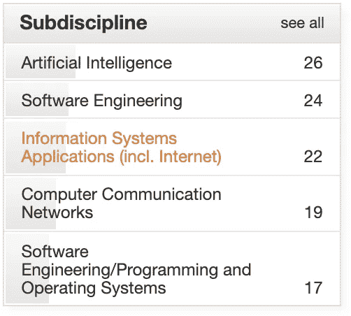
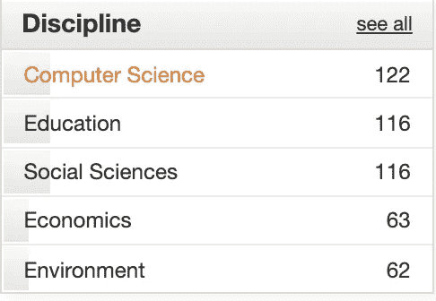
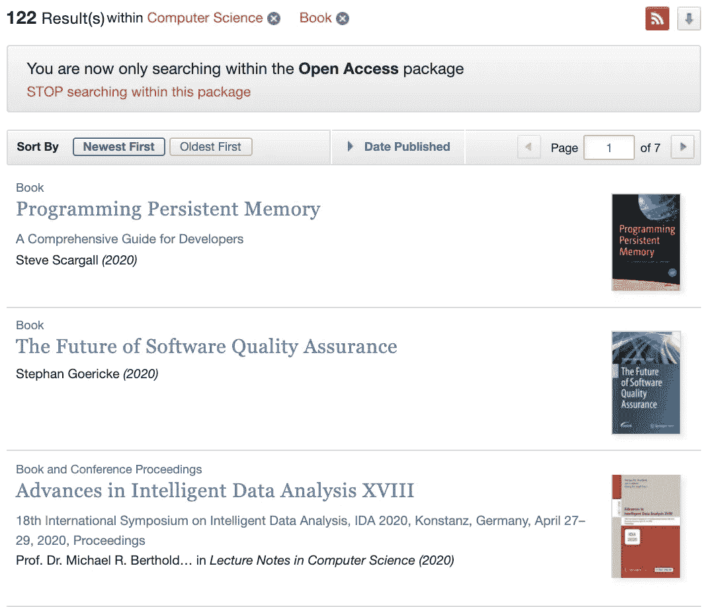
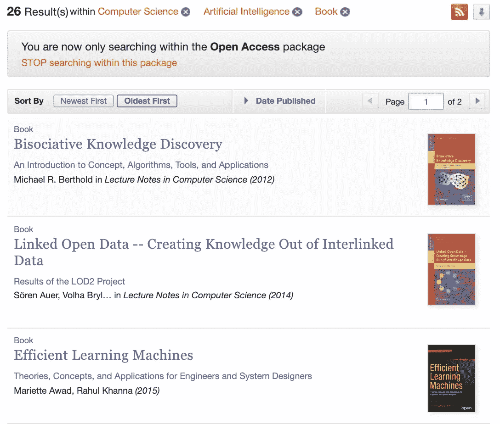
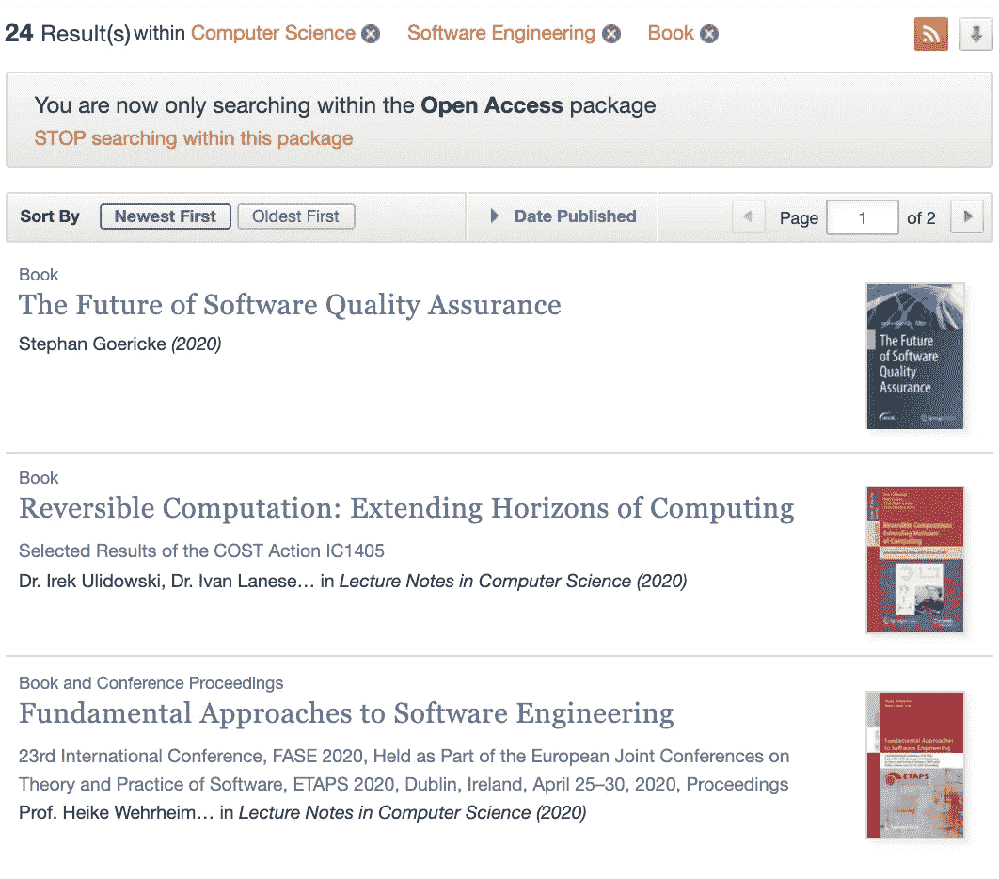
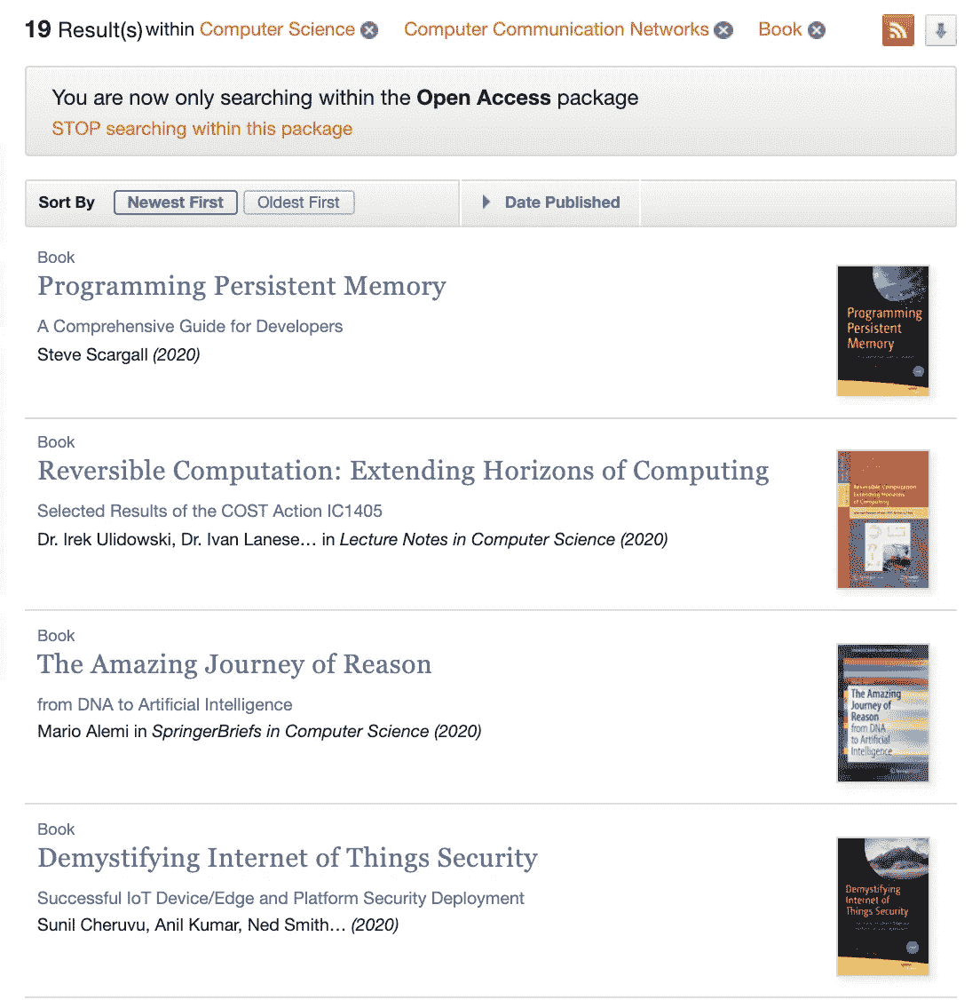
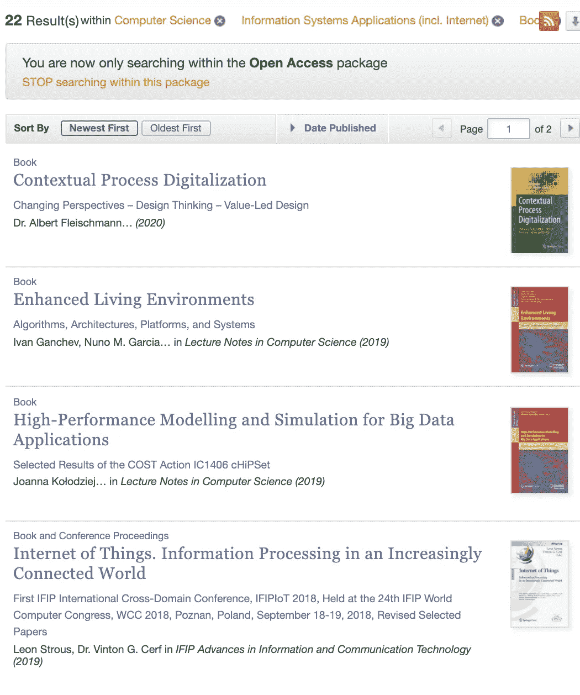
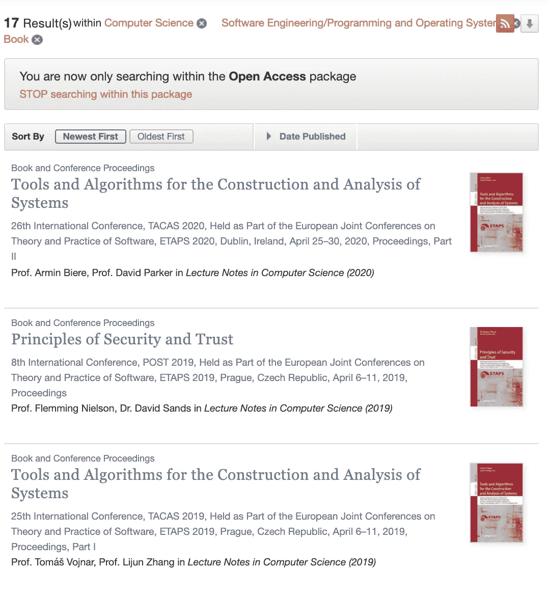

# 122 本来自 SpringerNature 的免费计算机科学 AI、ML、DL 和统计学书籍

> 原文：<https://towardsdatascience.com/122-free-computer-science-ai-ml-dl-statistics-books-from-springernature-38d8554fd5bb?source=collection_archive---------81----------------------->

## 庆祝斯普林格-自然发行 1000 本免费书籍。

在新冠肺炎疫情期间，开放存取运动得到了巨大的推动。领先的出版物之一 SpringerNature 已经将免费图书的数量增加到超过 1000 本！它包含了海量的书籍，[仅计算机科学就有 122 本](https://link.springer.com/search?facet-content-type=%22Book%22&package=openaccess&facet-discipline=%22Computer+Science%22)！

SpringerNature 的计算机科学分科书籍的部分内容。

SpringerNature-1000 本书的部分内容。

# 让我们探索一下在计算机科学的每个子学科中我们都有什么:

## [1。122 计算机科学书籍](https://link.springer.com/search?facet-content-type=%22Book%22&package=openaccess&sortOrder=oldestFirst&facet-sub-discipline=%22Artificial+Intelligence%22&facet-discipline=%22Computer+Science%22)

斯普林格的计算机科学书籍的部分列表

## [2。26 人工智能书籍](https://link.springer.com/search?facet-content-type=%22Book%22&package=openaccess&sortOrder=oldestFirst&facet-sub-discipline=%22Artificial+Intelligence%22&facet-discipline=%22Computer+Science%22)

斯普林格的人工智能书的部分清单

## [3。24 本软件工程书籍](https://link.springer.com/search?facet-discipline=%22Computer+Science%22&facet-content-type=%22Book%22&package=openaccess&facet-sub-discipline=%22Software+Engineering%22)

Springer 的软件工程书籍的部分列表

## [4。19 通信网络书籍](https://link.springer.com/search?facet-discipline=%22Computer+Science%22&facet-content-type=%22Book%22&package=openaccess&facet-sub-discipline=%22Computer+Communication+Networks%22)

斯普林格的通信网络书籍部分列表

## [5。22 信息系统应用书籍](https://link.springer.com/search?facet-discipline=%22Computer+Science%22&facet-content-type=%22Book%22&package=openaccess&facet-sub-discipline=%22Information+Systems+Applications+%28incl.+Internet%29%22)

斯普林格的信息系统应用书籍的部分列表

## [6。17 编程和操作系统书籍](https://link.springer.com/search?facet-discipline=%22Computer+Science%22&facet-content-type=%22Book%22&package=openaccess&facet-sub-discipline=%22Software+Engineering%2FProgramming+and+Operating+Systems%22)

Springer 的编程和操作系统书籍的部分列表

# 结论

斯普林格正在领导一场走向开放知识的伟大运动，这是对科学民主化的巨大贡献。希望看到免费发布的额外书籍和学术论文。

Ori Cohen 博士拥有计算机科学博士学位，主要研究机器学习。他是 TLV 新遗迹公司的首席数据科学家，从事 AIOps 领域的机器和深度学习研究。