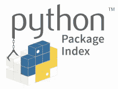

# 数据科学家的 13 个 Conda 命令

> 原文：<https://towardsdatascience.com/13-conda-commands-for-data-scientists-e443d275eb89?source=collection_archive---------25----------------------->

## 此外，何时使用迷你康达，蟒蛇，康达锻造，以及皮普康达好时光😁

Python 是最受数据科学家欢迎的语言。🐍Conda 是使用 Python 为数据科学家创建虚拟环境和管理包的最常用工具。

不幸的是，找出在您的机器上安装 conda 的最佳方式以及何时从各种渠道安装软件包并不简单。在一个地方找到使用 conda 和 pip 的最有用的命令并不容易。☹️

在本文中，我将提供基本的 conda 命令和建议，以帮助您避免安装和使用方面的麻烦。🎉


有时 Python 虚拟环境和包感觉像一座火山。资料来源:pixabay.com

我们开始吧！🚀

# 需求

无论是在本地工作还是在云中的服务器上工作，您都需要一个虚拟环境来隔离您的 Python 版本和包，以便您可以:

1.  对不同的项目使用不同的包版本
2.  试用最新包装版本
3.  获得与您的队友相同的 Python 和包版本，这样您的共享代码就可以类似地工作

# 我一定要用康达吗？

没有。在数据分析和科学计算中很常见，但在外面不那么常见。

有许多工具可以用来管理虚拟 Python 环境。康达、 [Venv](https://docs.python.org/3/library/venv.html) 、 [pyenv、](https://github.com/pyenv/pyenv) [pipenv](https://pipenv-fork.readthedocs.io/en/latest/) 、[诗仙](https://python-poetry.org/)、 [Docker](https://www.docker.com/) 、 [virtualenv](https://virtualenv.pypa.io/en/latest/) 最为突出。相信我，你不会想掉进这个兔子洞的。🐇

但是如果你必须这么做的话，这里有一个黑客新闻线索让你感受一下其中的乐趣。谷歌云的开发者倡导者 Yufeng G 在 conda、virtualenv 和 pyenv 上有一个很好的视频。

今天我们探索康达，所以让我们开始吧！

# 蟒蛇


Anaconda 既是软件背后的公司名称，也是功能齐全的软件发行版的名称。Anaconda 公司提供咨询和三个 Anaconda 版本:个人版、团队版和企业版。个体是普遍而强大的。这不像有免费软件。😉我用的就是这个。

# 发行版:Anaconda vs Miniconda

您可以选择下载并安装两个发行版之一: [Anaconda](https://www.anaconda.com/products/individual) 或 [Miniconda](https://docs.conda.io/en/latest/miniconda.html) 。

## 类似

*   Anaconda 和 Miniconda 都将软件包管理器和虚拟环境管理器合二为一。
*   两者都可以安装在 Windows、Mac 或 Linux 系统上。
*   两者都安装了 Python 和 pip。

## 差异

*   Anaconda 发行版安装了许多数据科学常用的 Python 包和工具。Miniconda 没有。这就是包含电池的大下载和没有为你安装很多软件包的最小下载的区别。
*   2020 年中期，Miniconda 的安装量在 50 到 90 兆字节之间，这取决于你的操作系统。
*   根据 2020 年中期的文档，Anaconda 发行版需要“至少 5 GB 的磁盘空间来下载和安装”。
*   Anaconda 发行版安装程序还包括安装 GUI 和其他流行软件(如 VSCode 文本编辑器)的选项。

如果您正在开始使用 Python 进行科学计算，并且您的计算机上有足够的空间，我建议您下载 Anaconda 发行版。很多东西，但都是好东西。👍

如果你以前和康达合作过，我建议你下载 Miniconda。您可以随时添加您需要的包。😀

请参见 Anaconda [的安装说明，此处为](https://docs.anaconda.com/anaconda/install/)，Miniconda [的安装说明，此处为](https://docs.conda.io/projects/continuumio-conda/en/latest/user-guide/install/macos.html)。


资料来源:pixabay.com

# Conda 命令

如果您安装了 Anaconda 发行版，您可以使用 GUI 安装程序，但是我建议使用命令行界面来帮助您更快地工作。你毕竟是一个程序员(或者即将成为一个程序员)！😉

让我们看看创建和管理 conda 环境的常见 conda 命令。无论您安装的是 Anaconda 还是 Miniconda，一切都是一样的。在这一点上都是康达。😀


## 创造康达环境

`conda create -n myenv pandas jupyterlab`创建一个名为 *myenv* 的新 conda 环境，在 conda 主频道上提供最新版本的 Python。将 pandas 和 jupyterlab 软件包安装到环境中。`-n`是`--name`的简称。

康达要求确认包装变化。当询问您是否要继续时，按`y`。

`conda create -n myclone --clone myenv`将名为 *myenv* 的环境复制到名为 *myclone* 的新环境中。所有的包裹都随车而来！🚙

`conda create -n myenv python=3.8`用指定的 Python 版本创建一个名为 *myenv* 的新 conda 环境。安装了 Pip 和大约 15 个其他软件包。


我保证这本指南里只有蛇的图片。资料来源:pixabay.com

## 管理 conda 环境

`conda activate myenv` —激活 *myenv* 虚拟环境。

您可以知道您处于一个活动的虚拟环境中，因为您的命令行提示符将以括号中的虚拟环境名称开始。像这样:

```
(base) Jeffs-MBP:~ jeffhale$
```

默认的 conda 环境被命名为 *base* 。

Conda 可以设置为在您打开终端时激活环境。安装软件时，安装程序会询问您是否要“通过运行 conda init”来初始化它。我建议你说*是*，这样你的 shell 脚本就会被修改。然后，您将在 conda 环境中开始您的终端会话。

无论您在 on CLI 中的哪个位置导航，您都将处于激活的 conda 虚拟环境中。🎉

`conda deactivate` —停用当前环境。现在你不会在虚拟环境中。你所处的康达环境仍然存在，你只是不在其中。👍

`conda env list` —列出康达环境。

`conda env remove --name myenv` —移除 *myenv* conda 环境。永远删除。


资料来源:pixabay.com

# 管理活动环境中的包

在活动的 conda 环境中使用这些命令。这些是我最常用的 conda 命令。😀

`conda list` —列出活动环境中已安装的软件包。输出包括软件包版本和安装软件包的 conda 通道。👍

## 康达包装

`conda install pandas` —从 conda 主频道下载并安装 pandas 包。

`conda install -c conda-forge pandas` —从 conda-forge 主频道下载并安装 pandas 包。


conda-forge 频道是“一个社区主导的菜谱集合，为 conda 包管理器构建基础设施和发行版。”当一个包在主通道上不存在或者主通道上的版本没有你想要的新时，使用 conda-forge 通道。在康达主频道之前，康达-福吉上的软件包经常会更新。☝️

你也可以指定一些其他的渠道，但是康达-福吉是你会发现很多包的地方。

`conda update pandas` —从康达主频道下载并安装最新的熊猫包。

`conda update all` —下载并安装所有已安装软件包的最新版本。如果你有很多过时的包，速度会很慢。⚠️

`conda uninstall pandas` —在您的 conda 环境中卸载 pandas 软件包。

## 点

Pip 是最常见的软件包安装程序。它与 Python 一起发布。

当处于活动 conda 环境中时，pip 会将软件包安装到该活动 conda 环境中。⚠️

`pip install -U pandas` —从 Python 包索引 PyPI 安装或更新 pandas 包。`-U`指定更新所有依赖包。

`pip uninstall pandas` —卸载 pip 安装的 pandas 包。



PyPI 是找到 Python 包最常见的地方。PyPI 经常有不在 conda 或 conda-forge 上的包。PyPI 通常首先获得最新版本的包。

偶尔 conda 会有不在 PyPI 上的包，但这并不常见。

Conda 和 PyPI 包通常可以很好地配合使用。🎉

确保如果你正在安装来自 PyPI 的软件包版本，你还没有从 conda 安装相同的软件包。如果你已经安装了，那么先卸载 conda 版本。否则康达不会用新的 PyPI 版本。默认情况下，conda 官方频道是优先级最高的频道，conda 将首先使用优先级较高的频道的软件包版本。☝️

conda 官方的建议是先尝试从主要的 conda 通道安装包，然后根据需要从 conda-forge 安装包，最后是 pip。这有助于避免冲突。一般来说，从这些来源中的任何一个安装都应该可以正常工作。

## 如果事情出了岔子

有时候事情会变得一团糟。一般来说，卸载软件包或创建一个新的 conda 环境是你所需要的，以解决这种情况。

如果不起作用，`conda update conda`更新 conda 软件本身。

如果那不起作用，你可以[卸载](https://stackoverflow.com/a/42182997/4590385)重新安装 conda。👍

有很多 conda 用户和大量的文档，所以一如既往，搜索引擎是你的朋友。😉


资料来源:pixabay.com

# 包装

我希望你喜欢这个康达概述。如果你有，请在你最喜欢的社交媒体上分享，这样其他人也可以找到它。😀

我写关于 [Python](https://memorablepython.com) 、 [SQL](https://memorablesql.com) 、 [Docker](https://memorabledocker.com) 和其他技术主题的文章。如果你对这些感兴趣，请注册我的[邮件列表，查看我的 60 多篇文章](https://dataawesome.com)在这里你可以增长你的技能[。👍](https://medium.com/@jeffhale)

[](https://dataawesome.com)

资料来源:pixabay.com

祝您愉快！