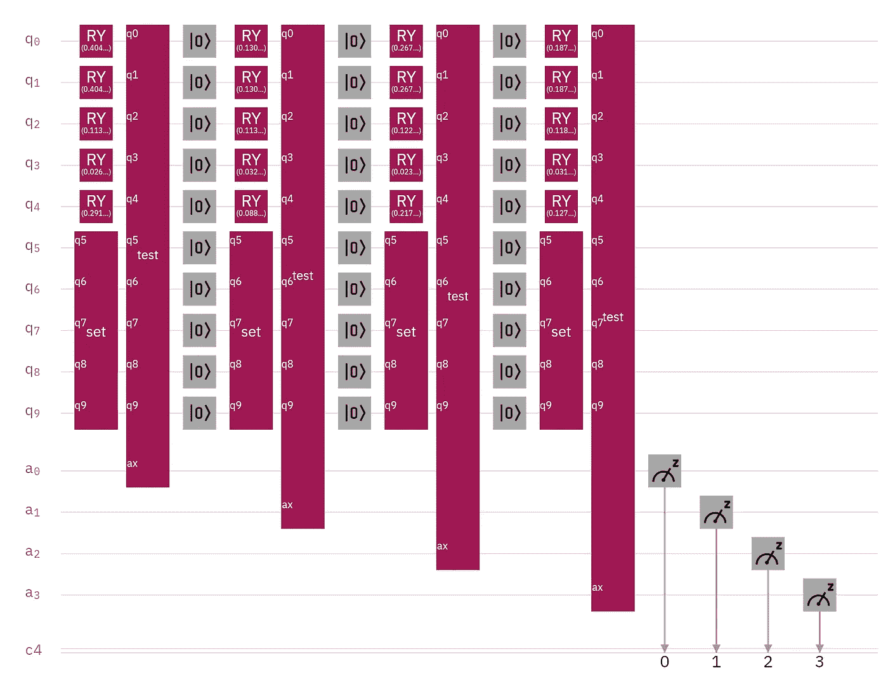
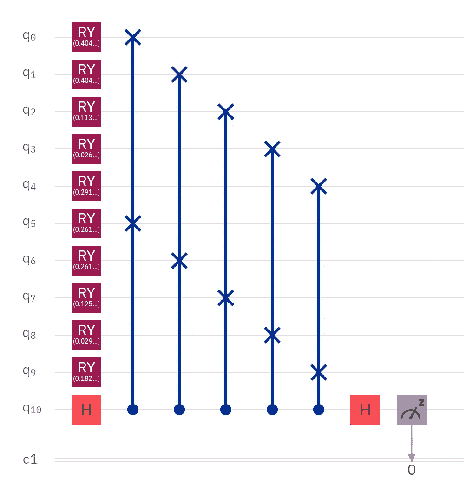
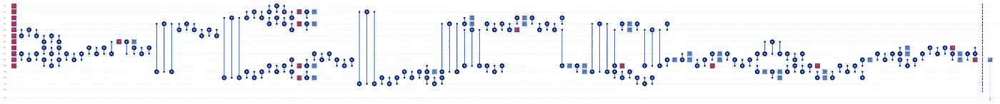
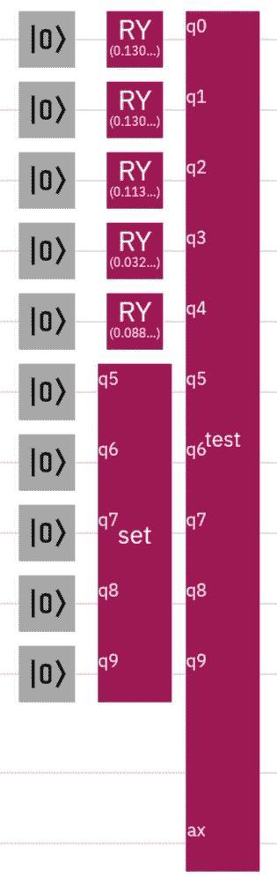

# 130，780 点量子分类

> 原文：<https://towardsdatascience.com/130-780-point-quantum-classification-ddeea767adb1?source=collection_archive---------41----------------------->

## 使用真实世界数据集的量子分类

博士后研究员维沙尔·夏尔马博士最近通过 LinkedIn 短信问我关于量子分类的问题。我不会透露他的 5 列、26，156 行数据集的任何信息，除了它的大小——总共 130，780 个数据点——但我会透露我与他分享的修改后的算法。

## 介绍

量子计算和机器学习是两个截然不同的领域。虽然他们很好地互相恭维，但有可能只熟悉其中一个而不熟悉另一个。因此，在简要介绍[量子分类](https://medium.com/swlh/quantum-classification-cecbc7831be)之前，简要介绍一下分类可能是有益的。

对分类的一个过于简单的描述是，我们有许多被分成类(组)的数据点，我们有新的数据要分配给一个现有的组。通常，该新数据是单个数据点，就像已经分组在一起的所有其他单个数据点一样，尽管也可以将新组分配给现有组。

因此，量子分类是使用量子处理器或其模拟来执行这项任务。由于这两个领域与线性代数的关系，量子计算有望在机器学习任务中表现出色。

## **ibmq _ 16 _ 墨尔本**

我最初的意图是在 NISQ 处理器和量子计算模拟器上运行这个算法，并比较运行时间，但很快就发现这是不可能的。

该电路将一个测试状态与一个等级进行比较。因为可用的量子位数量有限，所以每个类只能运行一次。

前五个量子位各自代表来自数据集的一个类别的一个特征，后五个量子位各自代表来自测试数据点的一个特征。最后一个量子位是用于[交换测试](https://link.medium.com/YIyc5yazb9)的辅助量子位，用于确定测试数据与类数据的接近程度。每个 Fredkin 门(受控交换)使用 ancilla 量子位作为其控制，并使用代表与目标量子位相同特征的量子位。

这是传输电路的样子。Fredkin 门不仅会在传输过程中显著增加电路深度，而且处理器的有限连接性还需要许多额外的交换操作。

因为整体电路深度，结果毫无价值。当状态相同时，交换测试测量|0 >的概率为 1，当状态最大程度相反时，测量|0 >的概率为 0.5，但是测量| 0 >的概率远低于 0.5。那是错误的。

## **ibmq_qasm_simulator**

因为 32 量子位 IBM Q Experience simulator 允许重置门(NISQ 处理器不允许),所以可以在一个电路中比较多个类别的测试数据。重置操作还减少了需要模拟的量子位的数量，这可以大大减少大型电路的运行时间。

第一轮没有使用重置门，因为量子位是刚刚初始化的，但下面是每个类别比较的工作方式:

1.  初始化或重置类数据和测试数据量子位
2.  使用 RY 旋转将数据映射到相应的量子位；因为每个类比较的测试数据保持不变，所以“set”块是一个简化 OpenQASM 代码的子例程
3.  将每个测试特征与每个类特征进行比较；“test”块是一个子程序，它执行与上面的 ibmq_16_melbourne 电路所示相同的 Hadamard 操作和交换测试
4.  在这个裁剪的电路中没有显示:测量控制量子位“ax”，这是用于交换测试的辅助量子位

## **算法**

该算法需要适度的经典预处理。因为我收到了 CSV 文件中的数据，所以我在 Excel 中打开它并在那里进行计算。MIN、MAX 和 AVERAGE 等函数使用起来很简单，甚至连归一化函数也只是减法和除法。

1.  计算每个要素的全局最小值和全局最大值
2.  计算每个类每个要素的平均值
3.  选择测试数据
4.  使用全局最小值和最大值归一化平均值，并使用公式((输入-最小值)/(最大值-最小值))测试从 0 到 1 的数据点
5.  将量子位围绕 y 轴旋转归一化值乘以π；对类别数据的每个特征使用一个量子位，对测试数据的每个特征使用一个量子位
6.  使用交换测试逐个功能地将测试数据与类数据进行比较
7.  测量| ^ 0 >概率最高的交换测试是最接近测试数据的类

当然，你可以在 Python 中完成所有这些，但是我更喜欢在 OpenQASM 中完成所有与量子计算相关的工作，这样就可以把重点放在电路上了。

## **了解数据**

因为我对 SWAP 测试很熟悉，并且我相信这种算法应该可行，所以我发现了一个数据问题，这些数据可能对寻求其他机器学习方法有所帮助。简而言之，标准化的数据太接近了。因此，任何测试数据点都可能被归类为任何类别，就好像算法只是随机生成结果一样。没有一个测试结果是准确的。

幸运的是，可以选择一部分数据来解决这个问题，而不会影响结果。这允许规范化的值之间有一点空间，我终于开始看到准确的分类。

## **结果和结论**

我通常在我的文章中包含直方图，但是这个项目需要太多的测试。相反，我将总结我的发现。

如果您直观地检查测试数据和类数据，您会看到该算法准确地将明显属于某个类的测试数据分类。当测试值介于类值之间时，精确度会降低。有些数据看起来可以用一种方式分类，但却用不同的方式标注。我对数据了解不多，不知道为什么会这样，但我不认为这是一个算法问题。数据点理所当然地更接近其他标签，而不是自己的标签。

## **未来工作**

Sharma 博士最初询问了量子限制玻尔兹曼机器(QRBM)，但我对交换测试更熟悉，所以我向他介绍了这种方法。当然，将我的方法与 QRBM 实现以及 scikit-learn 实现进行比较会很有趣。简单的 QRBM 似乎有可能在 NISQ 处理器上工作，这肯定会很有趣。

## **鸣谢**

所有图片均来自 IBM Q Experience。