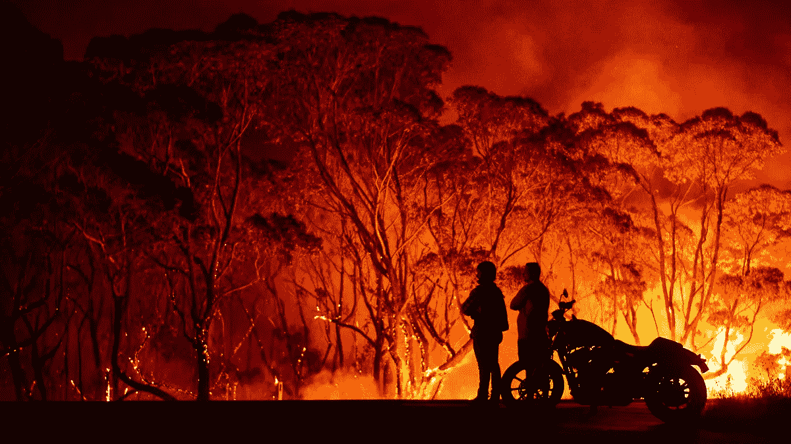

# 14 天隔离期间要做的 14 个数据科学项目

> 原文：<https://towardsdatascience.com/14-data-science-projects-to-do-during-your-14-day-quarantine-8bd60d1e55e1?source=collection_archive---------2----------------------->

## 2020 年发展新技能和强化你的投资组合的终极项目清单

在 [Unsplash](https://unsplash.com/s/photos/projects?utm_source=unsplash&utm_medium=referral&utm_content=creditCopyText) 上由 [Austin Distel](https://unsplash.com/@austindistel?utm_source=unsplash&utm_medium=referral&utm_content=creditCopyText) 拍摄的照片

> ***一定要*** [***订阅***](https://terenceshin.medium.com/membership) ***千万不要错过另一篇关于数据科学指南、诀窍和技巧、生活经验等的文章！***

首先，我想对所有的护士、医生、杂货店店员、公共行政人员和其他任何冒着生命危险为社区服务的人大声疾呼。

我们不要认为这是理所当然的。把这段时间单独拿出来学习新技能，看书，提升自己。对于那些对数据、数据分析或数据科学感兴趣的人，我提供了一个 14 个数据科学项目的列表，你可以在业余时间做这些项目！

有三种类型的项目:

1.  可视化项目
2.  探索性数据分析(EDA)项目
3.  预测建模

# 可视化项目

也许最快完成的项目是数据可视化！下面是三个有趣的数据集，你可以用它们来创建一些有趣的可视化效果，添加到你的文件夹中。

## 冠状病毒可视化

难度:容易
链接到数据集[这里](https://www.kaggle.com/sudalairajkumar/novel-corona-virus-2019-dataset)。

了解如何使用 Plotly 构建动态可视化，以显示冠状病毒如何像上面这样随着时间的推移在全球传播！Plotly 是一个了不起的库，它使数据可视化变得动态、吸引人和简单。

*如果你想学习如何建立一个像上面这样的可视化，查看我的教程* [*这里*](/visualizing-the-coronavirus-pandemic-with-choropleth-maps-7f30fccaecf5) *。*

*我的朋友 Jack 也写过一篇预测冠状病毒复苏的文章* [*这里*](https://www.obviously.ai/post/predicting-coronavirus-recovery-with-machine-learning) *！*

## 澳大利亚野火可视化

难度:容易
链接到数据集[这里](https://www.kaggle.com/carlosparadis/fires-from-space-australia-and-new-zeland)。

摘自 Vox

2019-2020 森林火灾季节，也被称为黑色夏天，由 2019 年 6 月开始的几次极端野火组成。据维基百科报道，这场大火烧毁了大约 1860 万公顷土地和超过 5900 栋建筑[。](https://en.wikipedia.org/wiki/2019%E2%80%9320_Australian_bushfire_season)

这是一个有趣的项目！使用 Plotly 或 Matplotlib 利用您的数据可视化技能来显示野火的规模和地理影响。

*在这里* *看看我的朋友杰克是如何预测巴西的野火模式* [*！*](https://www.obviously.ai/post/predicting-brazils-wildfire-patterns-in-2020)

> ***一定要*** [***订阅***](https://terenceshin.medium.com/membership) ***千万不要错过另一篇关于数据科学指南、诀窍和技巧、生活经验等的文章！***

## 地表温度可视化

难度:容易-中等
链接到数据集[这里](https://www.kaggle.com/berkeleyearth/climate-change-earth-surface-temperature-data/kernels)。

照片由[威廉·博森](https://unsplash.com/@william_bossen?utm_source=unsplash&utm_medium=referral&utm_content=creditCopyText)在 [Unsplash](https://unsplash.com/s/photos/climate-change?utm_source=unsplash&utm_medium=referral&utm_content=creditCopyText) 上拍摄

有否认气候变化的人吗？创建一些数据可视化来显示地球表面温度如何随时间变化。你可以通过创建一个线形图或另一个动画 Choropleth 地图来做到这一点！

额外收获:创建一个预测模型，显示五十年后地球的预期温度。

# 探索性数据分析项目

探索性数据分析(EDA)，也称为数据探索，是数据分析过程中的一个步骤，其中使用了多种技术来更好地理解所使用的数据集。

*如果你想了解更多关于 EDA 的知识，可以查看我的指南* [*这里*](/an-extensive-guide-to-exploratory-data-analysis-ddd99a03199e) *！*

## 纽约 Airbnb 数据探索

难度:中等
链接到数据集[这里](https://www.kaggle.com/dgomonov/new-york-city-airbnb-open-data)。

奥利弗·尼布赖特在 [Unsplash](https://unsplash.com/?utm_source=unsplash&utm_medium=referral&utm_content=creditCopyText) 上拍摄的照片

自 2008 年以来，客人和主人一直使用 Airbnb 来拓展旅行的可能性，并提供更个性化的体验世界的方式。该数据集包含 2019 年纽约房源及其地理信息、价格、评论数量等信息。

您可以尝试回答以下一些问题:

*   哪些主机最忙，为什么？
*   哪些区域的流量比其他区域大，为什么会这样？
*   价格、评论数量和某个列表被预订的天数之间有什么关系吗？

## 与员工流失和绩效相关的最重要因素

难度:简单的
链接到数据集[这里](https://www.kaggle.com/pavansubhasht/ibm-hr-analytics-attrition-dataset)。

[活动创建者](https://unsplash.com/@campaign_creators?utm_source=unsplash&utm_medium=referral&utm_content=creditCopyText)在 [Unsplash](https://unsplash.com/s/photos/employees?utm_source=unsplash&utm_medium=referral&utm_content=creditCopyText) 上拍摄的照片

IBM 创建了一个合成数据集，您可以使用它来了解各种因素如何影响员工流失和满意度。一些变量包括教育、工作投入、绩效评级和工作生活平衡。

探索这个数据集，看看是否有任何重要的变量确实影响员工满意度。更进一步，看看你是否能从最重要到最不重要排列变量。

## 世界大学排名

难度:容易
链接到数据集[这里](https://www.kaggle.com/mylesoneill/world-university-rankings)。

[瓦西里·科洛达](https://unsplash.com/@napr0tiv?utm_source=unsplash&utm_medium=referral&utm_content=creditCopyText)在 [Unsplash](https://unsplash.com/s/photos/university?utm_source=unsplash&utm_medium=referral&utm_content=creditCopyText) 上拍摄的照片

你认为你的国家有世界上最好的大学吗？成为“最好的”大学意味着什么？该数据集包含三个全球大学排名。使用这些数据，看看你能否回答以下问题:

*   顶尖大学在哪些国家？
*   决定一个人世界排名的主要因素是什么？

> ***一定要*** [***订阅***](https://terenceshin.medium.com/membership) ***千万不要错过另一篇关于数据科学的文章，包括指南、诀窍和技巧、生活经验等！***

## 酒精和学业成功

难度:容易
链接到数据集[这里](https://www.kaggle.com/uciml/student-alcohol-consumption)。

照片由[凯文·凯利](https://unsplash.com/@shootervision?utm_source=unsplash&utm_medium=referral&utm_content=creditCopyText)在 [Unsplash](https://unsplash.com/s/photos/alcohol?utm_source=unsplash&utm_medium=referral&utm_content=creditCopyText) 上拍摄

酒精对学生成绩有影响吗？如果不是，那是什么？这一数据是在对中学数学和葡萄牙语课程学生的调查中获得的。它包含几个变量，如酒精消费，家庭规模，课外活动。

利用这个，探究学校成绩和各种因素的关系。作为奖励，看看你能否根据其他变量预测学生的最终成绩！

## 口袋妖怪数据探索

难度:简单的
链接到数据集[这里](https://www.kaggle.com/rounakbanik/pokemon)。

取自 Pokemon.com

对于所有的游戏玩家来说，这里有一个数据集，包含了所有七代 802 个口袋妖怪的信息。这里有几个问题你可以试着回答一下！

*   哪一代人的口袋妖怪最强？哪个最弱？
*   什么口袋妖怪类型最强？最弱的？
*   有没有可能建立一个分类器来识别一个传说中的口袋妖怪？
*   身体特征和力量统计(攻击、防御、速度等)之间有关联吗？)?

## 探索预期寿命的因素

难度:容易
链接到数据集[这里](https://www.kaggle.com/kumarajarshi/life-expectancy-who)。

世卫组织创建了一个所有国家的健康状况数据集，包括预期寿命、成人死亡率等统计数据。使用该数据集，探索各种变量之间的关系。对寿命影响最大的是什么？

创建此数据集是为了回答以下问题:

1.  最初选择的各种预测因素真的会影响预期寿命吗？实际影响预期寿命的预测变量有哪些？
2.  一个预期寿命值较低(< 65 岁)的国家是否应该增加医疗支出以提高其平均寿命？
3.  婴儿和成人死亡率如何影响预期寿命？
4.  寿命与饮食习惯、生活方式、运动、吸烟、饮酒等有正相关还是负相关？
5.  上学对人类的寿命有什么影响？
6.  寿命与饮酒有正相关还是负相关？
7.  人口稠密的国家的预期寿命会更低吗？
8.  免疫覆盖率对预期寿命有什么影响？

*查看我关于* [*用回归*](https://medium.com/swlh/predicting-life-expectancy-w-regression-b794ca457cd4) *预测寿命的文章获取灵感！*

# 预测建模

## 能源消费的时间序列预测

难度:中高级
链接到数据集[这里](https://www.kaggle.com/robikscube/hourly-energy-consumption)。

[马太·亨利](https://unsplash.com/@matthewhenry?utm_source=unsplash&utm_medium=referral&utm_content=creditCopyText)在 [Unsplash](https://unsplash.com/s/photos/energy?utm_source=unsplash&utm_medium=referral&utm_content=creditCopyText) 上的照片

该数据集由 PJM 网站的功耗数据组成。PJM 是美国的一个区域性传播组织。使用这个数据集，看看是否可以建立一个时间序列模型来预测能源消耗。除此之外，看看你是否能发现一天中几个小时的趋势，假日能源使用，以及长期趋势！

## 贷款预测

难度:容易
链接到数据集[这里](https://datahack.analyticsvidhya.com/contest/practice-problem-loan-prediction-iii/)。

德米特里·德米德科在 [Unsplash](https://unsplash.com/s/photos/bank?utm_source=unsplash&utm_medium=referral&utm_content=creditCopyText) 拍摄的照片

该数据集取自 Analytics Vidhya，包含 615 行和 13 列过去已批准和未批准的贷款。看看你能否创建一个模型来预测贷款是否会被批准。

## 二手车价格评估员

难度:中等
链接到数据集[这里](https://www.kaggle.com/austinreese/craigslist-carstrucks-data)。

帕克·吉布斯在 [Unsplash](https://unsplash.com/s/photos/used-car?utm_source=unsplash&utm_medium=referral&utm_content=creditCopyText) 上的照片

Craigslist 是世界上最大的二手车销售网站。这个数据集由 Craigslist 搜集的数据组成，每隔几个月更新一次。使用这个数据集，看看是否可以创建一个数据集来预测一个汽车列表是过高还是过低。

*查看我预测二手车价格的模型* [*这里*](/a-machine-learning-project-predicting-used-car-prices-efbc4d2a4998) *！*

## 检测信用卡欺诈

难度:中高级
链接到数据集[这里](https://www.kaggle.com/janiobachmann/credit-fraud-dealing-with-imbalanced-datasets)。

照片由[rupixen.com](https://unsplash.com/@rupixen?utm_source=unsplash&utm_medium=referral&utm_content=creditCopyText)在 [Unsplash](https://unsplash.com/s/photos/credit-card?utm_source=unsplash&utm_medium=referral&utm_content=creditCopyText) 上拍摄

该数据集显示了两天内发生的交易，284，807 笔交易中有 492 笔欺诈。数据集高度不平衡，正类(欺诈)占所有交易的 0.172%。了解如何处理不平衡数据集并构建信用卡欺诈检测模型。

## 皮肤癌图像检测

难度:高级
链接到数据集[这里](https://www.kaggle.com/kmader/skin-cancer-mnist-ham10000)。

照片由[艾莉·史密斯](https://unsplash.com/@creativegangsters?utm_source=unsplash&utm_medium=referral&utm_content=creditCopyText)在 [Unsplash](https://unsplash.com/s/photos/cancer?utm_source=unsplash&utm_medium=referral&utm_content=creditCopyText) 上拍摄

有了超过 10，000 张图像，看看你能否建立一个神经网络来检测皮肤癌。这绝对是最困难的项目，需要大量的神经网络和图像识别知识。提示:如果你被卡住了，可以参考其他用户创建的内核！

# 感谢阅读！

> ***一定要*** [***订阅***](https://terenceshin.medium.com/membership) ***千万不要错过另一篇关于数据科学的文章，包括指南、诀窍和技巧、生活经验等！***

如果你喜欢我的工作，想支持我…

*   *如果你喜欢这个，* [*在 Medium 上关注我*](https://medium.com/@terenceshin) *了解更多*
*   *关注我关于*[*Kaggle*](https://www.kaggle.com/terenceshin)*了解更多内容！*
*   *我们连线上*[*LinkedIn*](https://www.linkedin.com/in/terenceshin/)
*   *有兴趣合作吗？查看我的* [*网站*](http://Want to collaborate?) *。*
*   *查看* [*我的免费数据科学资源*](https://docs.google.com/document/d/1UV6pvCi9du37cYAcKNtuj-2rkCfbt7kBJieYhSRuwHw/edit#heading=h.m63uwvt9w358) *每周都有新素材！*