# Seaborn 的 14 个数据可视化图

> 原文：<https://towardsdatascience.com/14-data-visualization-plots-of-seaborn-14a7bdd16cd7?source=collection_archive---------4----------------------->

## 警察调查数据并从中提取信息和趋势的工具。

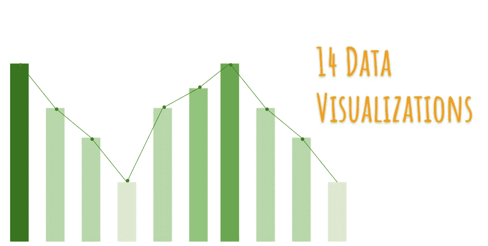

绿色代表**新的开始**和**成长**。它也象征着**更新**和**富足**。

数据可视化在数据挖掘中起着非常重要的作用。各种数据科学家花时间通过可视化来探索数据。为了加快这一进程，我们需要对所有地块进行详细记录。

如果没有规划和架构，即使是大量的资源也无法转化为有价值的商品。因此，我希望这篇文章能为你提供一个良好的架构，包括所有的情节和它们的文档。

# 内容

1.  *简介*
2.  *了解你的数据*
3.  *分配图
    a .分配图
    b .联合图
    c .配对图
    d .地毯图*
4.  *分类图
    a .小节图
    b .计数图
    c .方框图
    d .小提琴图*
5.  *高级地块
    a .带状地块
    b .群体地块*
6.  *矩阵图
    a .热图
    b .聚类图*
7.  *网格
    a .刻面网格*
8.  *回归图*

# 介绍

**Seaborn** 是基于 matplotlib 的 Python 数据可视化库。它提供了一个高层次的界面来绘制有吸引力的和信息丰富的统计图形。

对于 Seaborn 的安装，您可以在命令行中运行以下命令。

```
pip install seaborn
conda install seaborn
```

要导入 seaborn，您可以运行以下命令。

```
import seaborn as sns
```

# 了解您的数据

这些图中使用的数据集就是著名的 [*泰坦尼克号数据集*](https://www.kaggle.com/c/titanic) *(图 1)。*此后，数据集由变量“ **df** ”表示。

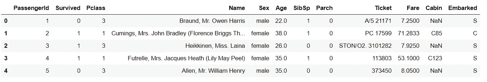

图 1:泰坦尼克号数据集

# 分布图

这些图表帮助我们形象化数据的分布。我们可以用这些图来理解数据的均值、中值、范围、方差、偏差等。

## a.距离图

*   距离图给出了所选连续变量的直方图。
*   这是一个单变量分析的例子。
*   我们可以改变柱的数量，即直方图中垂直条的数量

```
import seaborn as sns
sns.distplot(x = df['age'], bins = 10)
```

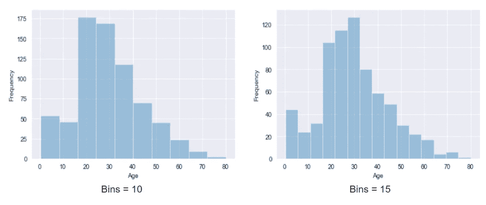

图 2:乘客“年龄”的分布图。

*   这里 x 轴是年龄，y 轴显示频率。例如，对于 bins = 10，大约有 50 个人的年龄在 0 到 10 岁之间

## b.联合地块

*   它是两个变量的距离图的组合。
*   这是双变量分析的一个例子。
*   我们另外获得了变量之间的散点图，以反映它们的线性关系。我们可以将散点图定制为六边形图，其中颜色强度越大，观察次数就越多。

```
import seaborn as sns
# For Plot 1
sns.jointplot(x = df['age'], y = df['Fare'], kind = 'scatter')# For Plot 2
sns.jointplot(x = df['age'], y = df['Fare'], kind = 'hex')
```

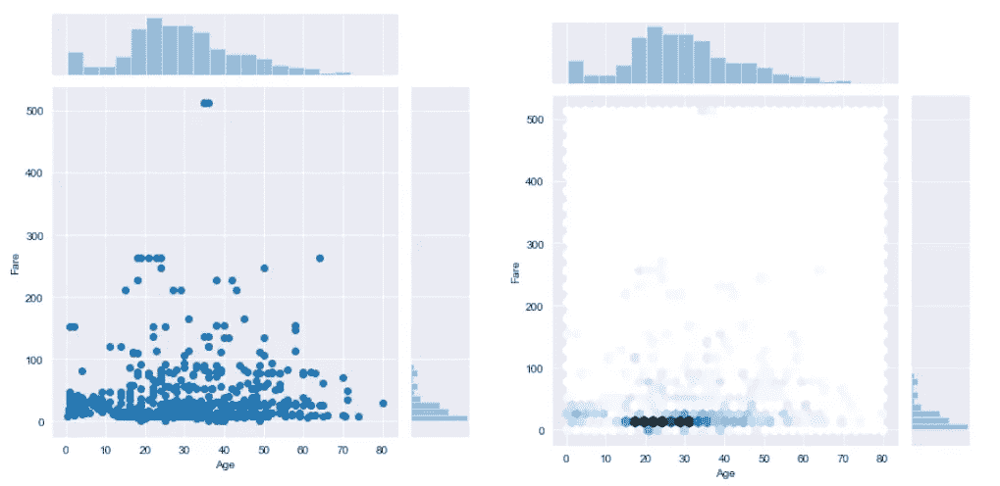

图 3:“年龄”和“费用”之间的联合曲线图

*   我们可以看到年龄和票价之间没有合适的线性关系。
*   kind = 'hex '提供六边形图，kind = 'reg '在图上提供回归线。

## c.配对图

*   它获取数据的所有数字属性，并绘制两个不同变量的成对散点图和相同变量的直方图。

```
import seaborn as sns
sns.pairplot(df)
```

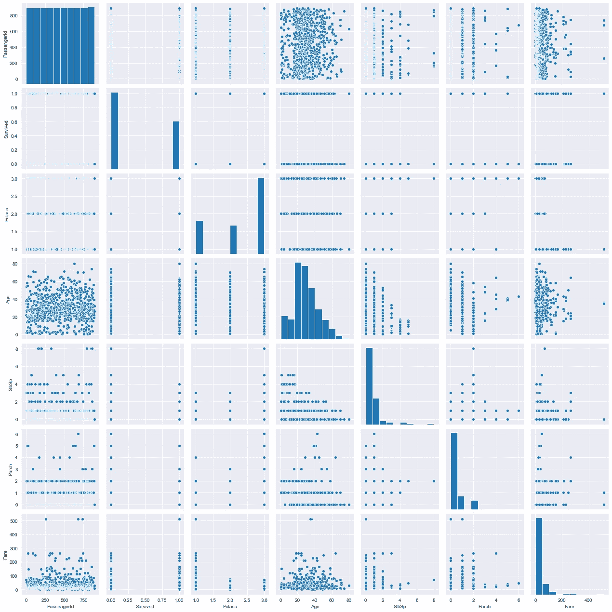

图 4:泰坦尼克号数据集的配对图

## d.地毯图

*   它绘制了一个破折号，而不是 distplot 中的均匀分布。
*   这是一个单变量分析的例子。

```
import seaborn as sns
sns.rugplot(x = df['Age'])
```

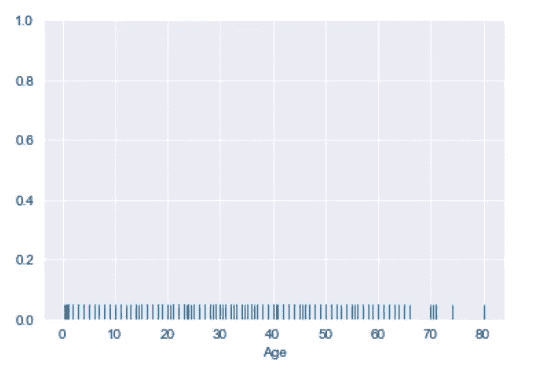

图 5:乘客“年龄”的地毯图

# 分类图

这些图帮助我们理解**分类**变量。我们可以用它们进行单变量和双变量分析。

## a.条形图

*   这是双变量分析的一个例子。
*   在 x 轴上，我们有一个分类变量，在 y 轴上，我们有一个连续变量。

```
import seaborn as sns
sns.barplot(x = df['Sex'], y = df['Fare'])
```

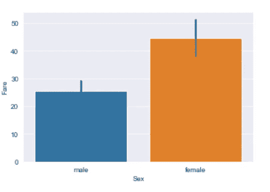

图 6:“费用”和“性别”的条形图

*   我们可以推断女性的平均费用高于男性。

## b.计数图

*   它计算分类变量出现的次数。
*   这是一个单变量分析的例子。

```
import seaborn as sns
sns.countplot(df['Pclass'])
```

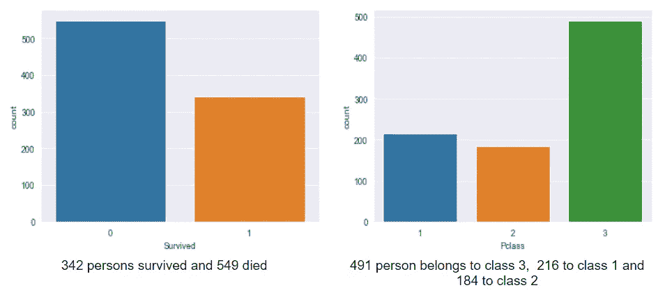

图 7:存活和“P 级”的计数图。

## c.箱形图

*   这是一个 **5 点概要剧情**。它给出了关于连续变量的最大值、最小值、平均值、第一个四分位数和第三个四分位数的信息。此外，它还为我们提供了离群值的知识。
*   我们可以绘制单个连续变量的曲线图，也可以根据连续变量分析不同的分类变量。

```
import seaborn as sns
#For plot 1
sns.countplot(df['Pclass'])#For plot 2
sns.boxplot(y = df['Age'], x = df['Sex'])
```

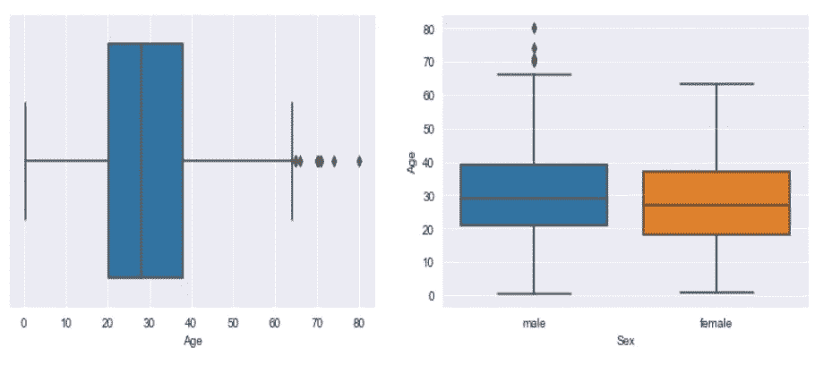

图 8: a)年龄的箱线图，b)年龄的性别的不同类别的箱线图

## d.小提琴情节

*   它类似于箱线图，但它也提供了关于分布的补充信息。

```
import seaborn as sns
sns.violinplot(y = df['Age'], x = df['Sex'])
```

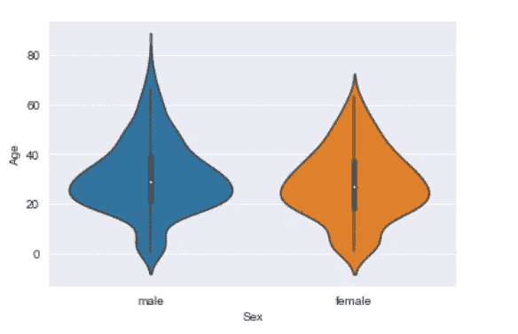

图 9:年龄和性别之间的小提琴图

# 高级绘图

顾名思义，它们是先进的，因为它们应该融合分布和分类编码。

## a.带状图

*   这是一个连续变量和分类变量之间的图。
*   它绘制成散点图，但补充使用分类变量的分类编码。

```
import seaborn as sns
sns.stripplot(y = df['Age'], x = df['Pclass'])
```

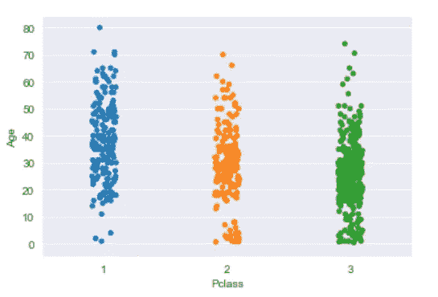

图 10:“年龄”和“P 级”之间的带状图

*   我们可以观察到，在 1 班和 2 班，10 岁左右的儿童不在，60 岁以上的人大多被安排在 1 班。
*   通常，这些类型的观测值用于估算缺失值。

## b.群体图

*   它是一个条形情节和小提琴情节的结合。
*   除了数据点的数量，它还提供了它们各自的分布。

```
import seaborn as sns
sns.swarmplot(y = train['Age'], x = train['Pclass'])
```

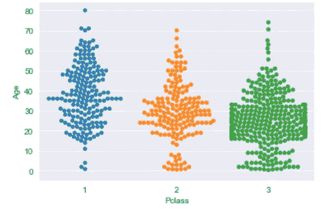

图 11:“年龄”和“P 级”之间的群体图

# 矩阵图

这些是使用**二维矩阵数据**进行可视化的特殊类型的绘图。由于矩阵数据的维数很大，很难从矩阵数据中分析和生成模式。因此，通过为矩阵数据提供颜色编码，该过程变得更加容易。

## a.热图

*   在给定的原始数据集“df”中，我们有七个数值变量。那么，让我们生成这七个变量之间的相关矩阵。

```
df.corr()
```

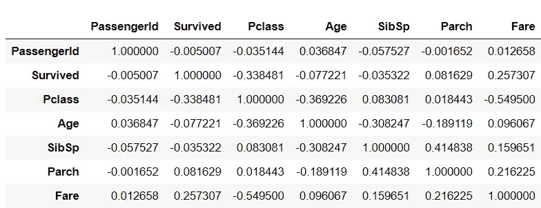

图 12:相关矩阵

*   尽管只有 49 个值，但读取每个值似乎非常困难。当我们遍历成千上万个特征时，复杂性就加剧了。那么，让我们试着实现一些颜色编码，看看解释变得有多容易。

```
sns.heatmap(df.corr(), annot = True, cmap = 'viridis')
```

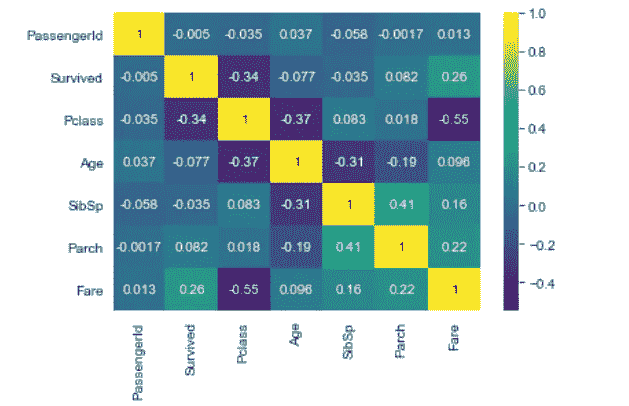

图 titanic 数据集相关矩阵的热图。

*   同一个矩阵现在表达了更多的信息。
*   另一个非常明显的例子是使用热图来理解缺失的价值模式。在图 14 中，黄色破折号代表一个丢失的值，因此它使我们的任务更容易识别丢失的值。

```
sns.heatmap(df.isnull(),yticklabels=False,cbar=False,cmap='viridis')
```

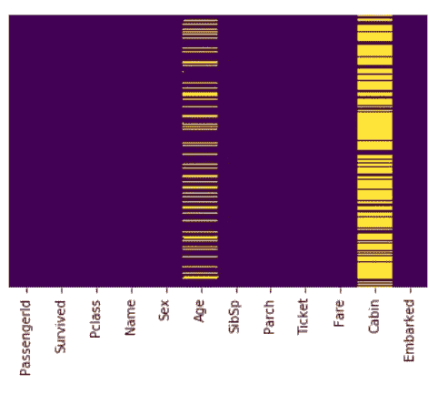

图 14:泰坦尼克号数据中缺失值的热图。

## b.聚类图

*   如果我们有一个矩阵数据，并希望根据相似性对一些要素进行分组，聚类图可以帮助我们。一次，看一下热图(图 13)，然后看一下聚类图(图 15)。

```
sns.clustermap(tran.corr(), annot='True',cmap='viridis')
```

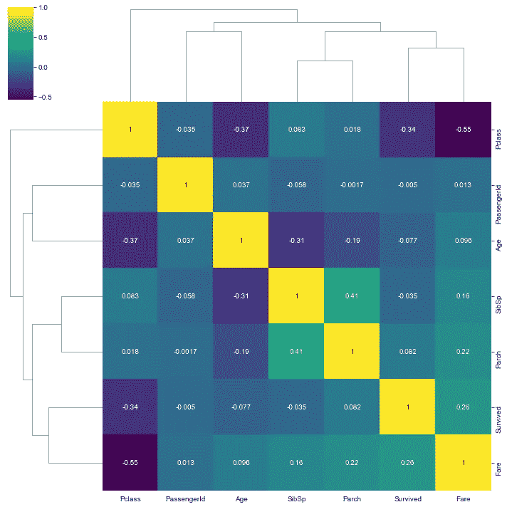

图 15:钛数据相关矩阵的聚类图

*   x 标签和 y 标签是相同的，但它们的协调方式不同。这是因为它们是根据相似性进行分组的。
*   顶部和左侧的流程图结构描述了它们的相似程度。
*   聚类图使用**层次聚类**形成不同的聚类。

# 网格

网格图为我们提供了对可视化的更多控制，并用一行代码绘制了各种各样的图形。

## a.小平面网格

*   假设我们要绘制所有三种船票中男性和女性的年龄分布图。因此，我们总共会有 6 张图。

```
sns.FacetGrid(train, col = 'Pclass', row = 'Sex').map(sns.distplot, 'Age')
```

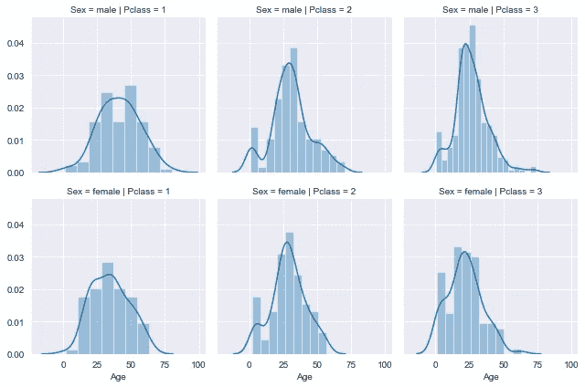

图 16:“性别”和“P 级”等级的“年龄”分布图

*   小平面网格根据要求提供非常清晰的图形。
*   **sns。FacetGrid** ( **列** = ' *列*'，**行** = ' *行*'，**数据** = data)提供了一个包含*列*和*行*中所有唯一类别的空网格。后来，我们可以使用不同的情节和共同的变量为特殊的变化。

# 回归图

这是一个更高级的统计图，提供了散点图以及对数据的线性拟合。

```
sns.lmplot(x = 'Age', y = 'PassengerId', data = df, hue = 'Sex)
```

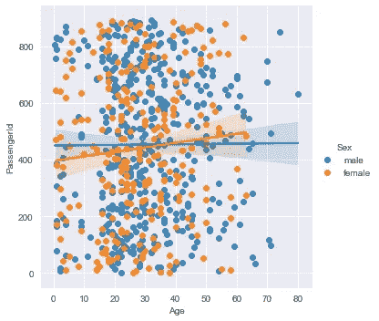

图 17:男性和女性的年龄和乘客 ID 之间的回归图。| **免责声明**:回归年龄和乘客 id 是有意义的。这只是理解可视化的目的。

图 17 显示了男性和女性的乘客 ID 和年龄之间的线性回归拟合。

# 包裹

在本文中，我们看到了使用 seaborn 的 14 种不同的可视化技术。

我相信数据可视化增强了我们对数据解释的理解和潜力。它为我们提供了更令人满意的技能来表示数据、估算缺失值、识别异常值、检测异常等等。

**数据分析师**就像警察一样，需要询问数据并通过数据提取信息。拥有乐观的工具来完成这项工作是极其必要的。因此，我希望这篇文章可以作为一种工具来询问您的数据。

有关探索性数据分析的指南，请访问-

[](/the-eda-theoretical-guide-b7cef7653f0d) [## EDA 理论指南

### 探索性数据分析完全指南

towardsdatascience.com](/the-eda-theoretical-guide-b7cef7653f0d) 

有关数据科学、机器学习、编程的此类内容，请访问 y youtube 频道。

[](https://www.youtube.com/channel/UCqq_T7ktsZO62k7CaibgQvA/) [## 阿尤什·奥斯特瓦尔

### 合十礼！！！🙏🙏这个频道是给想学数据科学和机器学习的人看的。我已经花了很多…

www.youtube.com](https://www.youtube.com/channel/UCqq_T7ktsZO62k7CaibgQvA/) 

## 快乐学习！