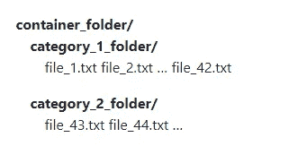

# Scikit 学习库的 14 个鲜为人知的令人印象深刻的特性

> 原文：<https://towardsdatascience.com/14-lesser-known-impressive-features-of-scikit-learn-library-e7ea36f1149a?source=collection_archive---------38----------------------->

## scikit 学习库中经常未知和被低估的功能示例。


[Pixabay](https://pixabay.com/illustrations/precious-diamond-jewelry-expensive-1199183/)

**Scikit learn** 仍然是人工智能领域最受欢迎的开源和机器学习库之一。scikit-learn 库包含了很多用于机器学习和统计建模的高效工具，包括*分类、回归、聚类和降维。*

Scikit-learn 大部分是用 **Python** 编程语言编写的，一些核心算法是用 **Cython** 编写的，以提高其性能。它还可以与许多其他 Python 库很好地集成，例如用于绘图的 **matplotlib** 和 **Plotly** ，用于数组矢量化的 **NumPy** ，以及 **pandas** dataframes、 **scipy** 等等。


[scikit 学习主页](https://scikit-learn.org/stable/)

Scikit-learn 附带了许多特性。以下是其中的几个

*   数据集
*   特征抽出
*   特征选择
*   参数调谐
*   使聚集
*   交叉验证
*   监督模型
*   无监督模型
*   降维
*   集成方法

Scikit learn 在其 [GitHub 资源库](https://github.com/scikit-learn/scikit-learn)上拥有超过 ***1770 个贡献者*** 和 ***41.2k 颗恒星*** ，这意味着许多数据科学家、机器学习工程师和研究人员依赖这个库进行机器学习项目。

我个人喜欢使用 scikit learn 库，因为它提供了极大的灵活性，并且很容易理解带有大量示例的文档。在本文中，我很高兴与您分享 scikit learn 库中您不存在的鲜为人知的令人印象深刻的特性。

## 1.克隆估计量

如果您想要复制一个估计器并将其用于另一个数据集**，克隆函数**可以帮助您做到这一点。克隆函数帮助你用相同的参数构造一个新的估计量。

> *“Clone 在不实际复制附加数据的情况下，在估算器中进行模型的深度复制。它产生了一个新的估计量，其参数与任何数据都不匹配。”-* [*scikit 学习文档*](https://scikit-learn.org/stable/modules/generated/sklearn.base.clone.html#sklearn.base.clone)

***例如:***

我们首先创建一个分类数据集和估值器。

```
from sklearn.linear_model import LogisticRegression
from sklearn.datasets import make_classification# create dataset`
X1, y1 = make_classification(n_classes=2, n_features=5, random_state=1)# create estimators 
logistic_classifier_1 = LogisticRegression()
```

现在我们将使用来自 **sklearn.base** 的克隆函数来复制 **logistic_classifier_1** 模型。

```
from sklearn.base import clone# duplicae the first classifier with clone function 
logistic_classifier_2 = clone(logistic_classifier_1)logistic_classifier_2
```

从逻辑分类器 1 克隆的名为**的逻辑分类器 2** 的新估计器的输出如下。

```
LogisticRegression(C=1.0, class_weight=None, dual=False, fit_intercept=True,
                   intercept_scaling=1, l1_ratio=None, max_iter=100,
                   multi_class='auto', n_jobs=None, penalty='l2',
                   random_state=None, solver='lbfgs', tol=0.0001, verbose=0,
                   warm_start=False)
```

## 2.将评估者识别为分类器或回归器。

如果一个模型实例用两个简单的函数 **is_classifier** 和 **is_regressor** 解决了 scikit-learn 库中的分类或回归任务，您就可以识别该模型实例。如果给定的估计量是分类器，is_classifier 函数返回 True，如果给定的估计量是回归量，is_regressor 函数返回 True。

***举例:***

首先创建两个估计器，第一个作为回归，第二个作为分类。

```
from sklearn.linear_model import LinearRegression
from sklearn.ensemble import RandomForestClassifier# create estimators 
model_1 = LinearRegression()
model_2 = RandomForestClassifier()
```

让我们检查一下第一个模型是否回归。

```
# check if it regressor
from sklearn.base import is_regressoris_regressor(model_1)
```

输出为**真。**

现在让我们检查第二个模型是否是分类。

```
# check if it classifier 
from sklearn.base import is_classifieris_classifier(model_2)
```

输出为**真**

## 3.用 make_column_selector 选择列

将 *make_column_selector 与*[*make _ column _ transformer*](https://scikit-learn.org/stable/modules/generated/sklearn.compose.make_column_transformer.html#sklearn.compose.make_column_transformer)配合使用，根据不同列的数据类型(整数、类别)或列名对其应用不同的预处理。

***举例:***

在本例中，我们使用 make_column-_selector 来选择数据集中的所有对象特征，并通过使用 **OneHotEncoder** 方法来转换它们。

```
import numpy as np 
import pandas as pd
from sklearn.preprocessing import StandardScaler, OneHotEncoder
from sklearn.compose import make_column_transformer
from sklearn.compose import make_column_selector# create a dataframe with different data types
data = pd.DataFrame(
 {“gender”: [“male”, “female”, “female”, “male”],
 “age”: [23, 5, 11, 8]}
)# create a column transformer with make_column_selectorct = make_column_transformer(
 (StandardScaler(), make_column_selector(dtype_include=np.number)), # ages
 (OneHotEncoder(), make_column_selector(dtype_include=object)), # genders
)transformed_data = ct.fit_transform(data)transformed_data
```

转换数据的输出是:-

```
array([[ 1.6464639 ,  0\.        ,  1\.        ],
       [-0.98787834,  1\.        ,  0\.        ],
       [-0.10976426,  1\.        ,  0\.        ],
       [-0.5488213 ,  0\.        ,  1\.        ]])
```

## 4.绘制决策树

您可以使用 **plot_tree 函数**可视化决策树模型。绘图功能允许你用名为 **feature_names 的参数添加特征名。**

***示例:*** 我们首先通过使用决策树算法为虹膜数据集创建分类模型，然后绘制决策树。

```
# import libraries
import matplotlib.pyplot as plt 
from sklearn.model_selection import train_test_split
from sklearn.metrics import plot_confusion_matrix
from sklearn.tree import DecisionTreeClassifier, plot_tree, export_text 
from sklearn.datasets import load_iris#load data 
iris = load_iris()# create our instances
model = DecisionTreeClassifier()# train test split
X_train, X_test, y_train, y_test = train_test_split(iris.data, iris.target, random_state = 0)# fit and predict
model.fit(X_train, y_train)# plot the tree
plt.figure(figsize = (20, 10))
plot_tree(model,feature_names=iris.feature_names, filled = True) 
plt.show()
```

我们通过 plot_tree 函数中的*模型和特征名称*来创建一个决策树图。


决策树图

## 5.从 Openml 获取数据集

Openml 是一个在线平台，旨在通过提供一个开放、协作、无摩擦、自动化的机器学习环境来改进开放式机器学习。

您可以通过使用 scikit-learn 的 **fetch_openml 函数**从 openml 平台获取数据集。

***举例:***

使用名称获取银行营销数据集。

```
from sklearn.datasets import fetch_openml#fetch by using data name
bank_marketing = fetch_openml(name=”bank-marketing”)# seperate independent variables and target variable 
x = bank_marketing.data 
y = bank_marketing.target
```

获取数据集的访问样本。

```
x[:2]
```

输出是

```
array([[ 5.800e+01,  4.000e+00,  1.000e+00,  2.000e+00,  0.000e+00,
         2.143e+03,  1.000e+00,  0.000e+00,  2.000e+00,  5.000e+00,
         8.000e+00,  2.610e+02,  1.000e+00, -1.000e+00,  0.000e+00,
         3.000e+00],
       [ 4.400e+01,  9.000e+00,  2.000e+00,  1.000e+00,  0.000e+00,
         2.900e+01,  1.000e+00,  0.000e+00,  2.000e+00,  5.000e+00,
         8.000e+00,  1.510e+02,  1.000e+00, -1.000e+00,  0.000e+00,
         3.000e+00]])
```

您也可以使用指定的 ID 提取数据。

```
# fetch by using id from this link [https://www.openml.org/d/1461](https://www.openml.org/d/1461)
bank_marketing = fetch_openml(data_id=1461)# seperate independent variables and target variable 
x = bank_marketing.data 
y = bank_marketing.target
```

在上面的例子中，我们获取 ID 为 **1461 的数据。**

## 6.学习曲线

scikit-learn 的学习曲线功能允许您确定不同训练集大小的交叉验证训练和测试分数。

> *“交叉验证生成器在训练和测试数据中将整个数据集拆分 k 次。具有不同大小的训练集的子集将用于训练估计器，并且将计算每个训练子集大小和测试集的分数。之后，对于每个训练子集大小，将在所有 k 次运行中平均分数。”* [*scikit 学习文档*](https://scikit-learn.org/stable/modules/generated/sklearn.model_selection.learning_curve.html#sklearn.model_selection.learning_curve)

***举例:***

```
from sklearn.datasets import make_classification
from sklearn.neighbors import KNeighborsClassifier
from sklearn.model_selection import learning_curve# create dataset`
X, y = make_classification(n_classes=2, n_features=10, n_samples=5000, random_state=1)# create estimator
KNN_classifier = KNeighborsClassifier()#
train_sizes, train_scores, test_scores = learning_curve(
estimator = KNN_classifier,
X = X,
y = y,
train_sizes=np.linspace(0.1, 1.0, 5),
shuffle=True, cv = 5)
```

显示训练规模以生成学习曲线。

```
# the train size
train_sizes
```

输出是

```
array([ 400, 1300, 2200, 3100, 4000])
```

显示训练集的分数。

```
# Scores on training sets
train_scores
```

输出是

```
array([[0.895     , 0.8875    , 0.85      , 0.8675    , 0.8975    ],
       [0.87384615, 0.88846154, 0.87692308, 0.88461538, 0.88230769],
       [0.88818182, 0.89363636, 0.88409091, 0.89045455, 0.88863636],
       [0.89354839, 0.89354839, 0.88903226, 0.88806452, 0.88387097],
       [0.893     , 0.894     , 0.88825   , 0.893     , 0.88625   ]])
```

显示验证分数

```
# show validation scores
test_scores
```

输出是

```
array([[0.83 , 0.812, 0.829, 0.841, 0.819],
       [0.837, 0.813, 0.853, 0.848, 0.828],
       [0.843, 0.823, 0.845, 0.853, 0.821],
       [0.832, 0.831, 0.855, 0.857, 0.83 ],
       [0.834, 0.828, 0.849, 0.86 , 0.835]])
```

我们来找训练分和验证分的手段。

```
# find the mean of training scores and validation scores train_scores_mean = train_scores.mean(axis = 1)
print(“Training Scores mean:{}”.format(train_scores_mean))test_scores_mean = test_scores.mean(axis = 1)
print(“Test Scores mean:{}”.format(test_scores_mean))
```

输出是。

```
Training Scores mean:[0.8795 0.88123077 0.889 0.8896129  0.8909]
Test Scores mean:[0.8262 0.8358 0.837  0.841  0.8412]
```

下图展示了数据是如何被分成 k 次和 5 次交叉验证的。


*了解更多查看另一个例子* [*这里*](https://scikit-learn.org/stable/auto_examples/model_selection/plot_learning_curve.html#sphx-glr-auto-examples-model-selection-plot-learning-curve-py) *。*

## 7.交叉验证和预测

如果您想为您的估计器同时执行交叉验证和预测，您可以使用 scikit-learn 的 **cross_val_predict** 函数。

***举例:***

对 iris 数据集执行 cross_val_predict。

```
from sklearn import datasets, linear_model
from sklearn.model_selection import cross_val_predict
from sklearn.ensemble import RandomForestRegressor#load dataet
diabetes = datasets.load_diabetes()X = diabetes.data
y = diabetes.targetRF_regressor = RandomForestRegressor()# perfrom cross validation and prediction
y_pred = cross_val_predict(estimator=RF_regressor, X= X, y=y, cv=5)
```

显示前 10 个预测。

```
#show prediction
y_pred[:10]
```

输出是:

```
array([225.41,  89.16, 172.4 , 164.03,  79.48, 116.87,  74.47, 157.5 ,155.99, 170.59])
```

## 8。使用 SelectFromModel 函数选择重要功能。

并非数据集中出现的所有特征都对模型性能有用，这意味着您可以通过使用 **SelectFromModel 函数来识别和选择模型的重要特征。**该函数根据重要性权重选择特征。您可以从一系列估计量中进行选择，但请记住，拟合后估计量必须具有 *feature_importances_ 或 coef_ attribute* 。

SelectFromModel 不太健壮，因为它只是根据作为参数给出的*阈值*来删除不太重要的特征。

**示例:**从包含 *10 个独立特征*的糖尿病数据集中选择重要特征。

```
from sklearn import datasets, linear_model
from sklearn.feature_selection import SelectFromModel
from sklearn.linear_model import LogisticRegression#load dataet
diabetes = datasets.load_diabetes()X = diabetes.data
y = diabetes.targetlg_regressor = LogisticRegression()# identify and select important fatures by using SelectFromModel
selector = SelectFromModel(estimator=lg_regressor).fit(X, y)#show estimator coefficient 
selector.estimator_.coef_
```

输出如下。

```
array([[-0.01631211, -0.04448689, -0.01041713, ..., -0.03925967,
        -0.02122777, -0.03405436],
       [ 0.00188878, -0.04444519, -0.00816801, ..., -0.03918144,
        -0.06436135, -0.05463903],
       [-0.02699287, -0.04433151, -0.06285579, ..., -0.0756844 ,
        -0.05557734, -0.06683906],
       ...,
       [ 0.03415162,  0.05040128,  0.11077166, ..., -0.00292399,
         0.027618  ,  0.07302442],
       [ 0.03416799,  0.05030017,  0.12469165, ...,  0.10747183,
        -0.00019805,  0.02747969],
       [-0.04907612, -0.04462806,  0.16038187, ...,  0.0340123 ,
         0.02773604,  0.01114488]])
```

显示用于特征选择的阈值。

```
# show the threshold value
selector.threshold_
```

输出是*12.19469668686*

现在，我们可以使用选定的要素来转换数据。

```
 transformed = selector.transform(X)
transformed[:3]
```

输出是:-

```
array([[ 0.05068012,  0.06169621,  0.02187235, -0.04340085, -0.00259226,
         0.01990842],
       [-0.04464164, -0.05147406, -0.02632783,  0.07441156, -0.03949338,
        -0.06832974],
       [ 0.05068012,  0.04445121, -0.00567061, -0.03235593, -0.00259226,
         0.00286377]])
```

数据集已经从 *10 个特征*转化为 *6 个重要特征*。

## **9。功能变压器**

应用来自 **pandas** 的函数已被用于处理数据帧中从一个形状到另一个形状的数据，但如果您想在管道中使用它，则该函数没有用。 **FunctionTransformer** 函数可以帮助您在管道中添加特征/变量转换。

[FunctionTransformer](http://scikit-learn.org/stable/modules/generated/sklearn.preprocessing.FunctionTransformer.html#sklearn.preprocessing.FunctionTransformer) 提供了其他 sklearn 估算器的一些标准方法(例如，拟合和转换)。

***举例:***

使用 **np.log()** 方法将数组转换为自然对数。

```
import numpy as np
from sklearn.preprocessing import FunctionTransformerX = np.array([[89,34,9, 1,5,87,54,22,67,44], [12, 63,67,2,9,45,81,54,22,73]])#create FunctionTransformer
log_transformer = FunctionTransformer(np.log)#transform the data
log_transformer.transform(X)
```

转换后的输出。

```
array([[4.48863637, 3.52636052, 2.19722458, 0\.        , 1.60943791,
        4.46590812, 3.98898405, 3.09104245, 4.20469262, 3.78418963],
       [2.48490665, 4.14313473, 4.20469262, 0.69314718, 2.19722458,
        3.80666249, 4.39444915, 3.98898405, 3.09104245, 4.29045944]])
```

## **10。确定目标数据类型**

在监督机器学习任务/问题中，我们有*独立变量*和*目标变量。*您还需要知道*目标变量*的数据类型，以选择您将使用哪条路径来解决回归或分类任务的问题。您可以使用 **type_of_target** 函数来检查目标变量所指示的数据类型。

***示例:*** 确定糖尿病数据集中目标变量的类型。

```
from sklearn.utils.multiclass import type_of_target
from skearn import datasets#load dataet
diabetes = datasets.load_diabetes()X = diabetes.data
y = diabetes.targettype_of_target(y)
```

输出为***‘多类’。***

## 11.添加虚拟特征

通过使用 **add_dummy_feature** 功能，可以在数据中添加具有特定值的虚拟特征。

> "这对于将截取项与不能直接拟合的实现相拟合是很有用的." [scikit-learn 文档](https://scikit-learn.org/stable/modules/generated/sklearn.preprocessing.add_dummy_feature.html#sklearn.preprocessing.add_dummy_feature)

***例如:***

数据集对象和虚拟特征值(如 5)将通过 **add_dummy-feature** 函数在我们的数据集中创建一个新的虚拟特征。

```
import numpy as np 
from sklearn.preprocessing import add_dummy_featurep = np.array([[89,34], [12, 63]])add_dummy_feature(p, value=5)
```

在我们的 p 数组中，每一行都将增加一个值 5。

```
array([[ 5., 89., 34.],
       [ 5., 12., 63.]])
```

## 12.使用迭代估算器估算缺失值

大多数时候，我们使用简单的方法来估算数据集中的缺失值。像用于数字特征的**均值/中值**和用于分类特征的**模式**这样的方法。也可以使用 ***迭代估算器*** 等高级方法。

通过使用*机器学习模型*，例如 BayesianRidge，IterativeImputer 使用数据集中所有可用的要素来估计缺失值。这意味着带有缺失值的特征将被标记为*因变量*，其他特征将被标记为*自变量*。

**举例:**

```
import numpy as np
from sklearn.experimental import enable_iterative_imputer 
from sklearn.impute import IterativeImputer# Create dataset with missing values
data = [[61, 22, 43,np.nan,67],
        [np.nan, 6, 27, 8, 11],
        [83, 51, np.nan, 32, 9],
        [74, np.nan, 35, 26, 97],
        [np.nan, 4, 13,45, 33]]
```

现在我们可以用迭代估算函数估算缺失值。

```
# Impute missing values using iterative imputer
iter_imp = IterativeImputer(random_state= 42)
iter_imp.fit_transform(data)
```

没有丢失值的输出:


## 13.使用随机搜索的超参数调谐

RandomizeSearchCV 函数倾向于通过随机选取一组预定的超参数分布来训练和评估一系列模型。在用不同的随机选择的超参数组合训练模型的 N 个不同版本之后，该函数挑选具有最佳参数值的模型的最成功版本。这允许您显式控制尝试的参数组合的数量。

**示例:** 创建随机搜索以找到 XGBoost 算法的最佳参数，从而将虹膜分类为 3 类。

```
from sklearn import linear_model, datasets
from sklearn.model_selection import RandomizedSearchCV
from xgboost import XGBClassifier
from scipy.stats import randint# Load data
iris = datasets.load_iris()
X = iris.data
y = iris.target# create model
classifier = XGBClassifier()# Create Hyperparameter Search Space
param_dist = {
 # randomly sample numbers from 50 to 400 estimators
 “n_estimators”: randint(50,400),
 “learning_rate”: [0.01, 0.03, 0.05],
 “subsample”: [0.5, 0.7],
 “max_depth”: [3, 4, 5],
 “min_child_weight”: [1, 2, 3],
}# create random search# Create randomized search 5-fold cross validation and 100 iterationsclf = RandomizedSearchCV(
 estimator=classifier,
 param_distributions=param_dist,
 random_state=1,
 n_iter=100,
 cv=5,
 verbose=0,
 n_jobs=-1,
)# Fit randomized search
best_model = clf.fit(X, y)
```

运行随机搜索后，我们可以观察最佳参数值，以提高模型性能。

```
# View best hyperparameters
print(‘Best n_estimator:’, best_model.best_estimator_.get_params()[‘n_estimators’])
print(‘Best learning_rate:’, best_model.best_estimator_.get_params()[‘learning_rate’])
print(‘Best subsample:’, best_model.best_estimator_.get_params()[‘subsample’])
print(‘Best max_depth:’, best_model.best_estimator_.get_params()[‘max_depth’])
print(‘Best min_child_weight:’, best_model.best_estimator_.get_params()[‘min_child_weight’])
```

输出:

```
Best n_estimator: 259
Best learning_rate: 0.03
Best subsample: 0.5
Best max_depth: 3
Best min_child_weight: 1
```

有时，RandomizedSearchCV 不会提供准确的结果，因为 **GridSearchCV，**但是当您拥有大型数据集时，GridSearchCV 会大大降低计算时间，并且成本非常高。在这种情况下，建议使用随机搜索，因为您可以定义想要运行的迭代次数。

## 14.加载文本文件

如果您想在 scikit learn 中加载文本文件，您可以使用 **load_files 函数**。load_files 将根/主文件夹中的每个文件夹视为一个类别，该文件夹中的所有文档都将被分配到相应的类别。



**示例:** 从名为 news_report 的文件夹中加载数据。

```
from sklearn.datasets import load_filesnews_reports = load_files(
 container_path=”news_report/”,
 description=”News reports in 2020",
 load_content=True,
)
```

从 l **oad_files** 函数中，我们在名为 **container_path 的参数中传递了文件夹的名称。**

**注意:**当设置 load_content=True 时，您也可以使用' encoding '参数来指定文本的编码。

现在我们可以用 target_names 属性来标识目标名称。

```
# show target names 
news_reports.target_names
```

输出将是。

```
['business', 'healthy', 'international', 'sport']
```

还可以通过使用两个名为 data 和 target 的属性来指定自变量和目标变量。

```
# specify the independent variable and the target variable 
X = news_reports.data
y = news_reports.target
```

# 结论

正如我所说，scikit-learn 仍然是最受欢迎的开源和机器学习库之一，拥有所有可用的功能，您可以进行端到端的机器学习项目。您还可以在您的机器学习项目中实现本文中介绍的 scikit learn 令人印象深刻的功能。

如果您想了解更多关于 scikit-learn 的信息，我推荐您参加来自 [AnalyticVidhya](https://courses.analyticsvidhya.com/courses/get-started-with-scikit-learn-sklearn) 的免费在线课程

你可以在这里下载包含本文介绍的所有 **14 个特性**的笔记本。

[](https://github.com/Davisy/14-Lesser-Known-Impressive-Features-in-Scikit-learn-Library) [## davisy/14-Scikit-Learn-Library 中鲜为人知但令人印象深刻的功能

### scikit 学习库中经常未知和被低估的功能示例。…

github.com](https://github.com/Davisy/14-Lesser-Known-Impressive-Features-in-Scikit-learn-Library) 

如果你学到了新的东西或者喜欢阅读这篇文章，请分享给其他人看。也可以随意发表评论。在那之前，下一篇文章再见！也可以通过推特 [@Davis_McDavid](https://twitter.com/Davis_McDavid) 联系到我。

***最后一件事:*** *在下面的链接里多看看类似这样的文章。*

[](https://medium.com/analytics-vidhya/feature-selection-by-using-voting-approach-e0d1c7182a21) [## 使用投票方法的特征选择

### 如何应用多种技术来选择 Xverse 包的特性？

medium.com](https://medium.com/analytics-vidhya/feature-selection-by-using-voting-approach-e0d1c7182a21) [](https://medium.com/analytics-vidhya/how-to-run-machine-learning-experiments-with-python-logging-module-9030fbee120e) [## 如何用 Python 日志模块运行机器学习实验

### 有时候“打印”并不是一个好主意

medium.com](https://medium.com/analytics-vidhya/how-to-run-machine-learning-experiments-with-python-logging-module-9030fbee120e) [](https://medium.com/analytics-vidhya/how-to-write-configuration-files-in-your-machine-learning-project-47bc840acc19) [## 如何在你的机器学习项目中写配置文件？

### 用配置文件管理参数和初始设置。

medium.com](https://medium.com/analytics-vidhya/how-to-write-configuration-files-in-your-machine-learning-project-47bc840acc19)