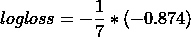

# 机器学习中的 14 个流行评估指标

> 原文：<https://towardsdatascience.com/14-popular-evaluation-metrics-in-machine-learning-33d9826434e4?source=collection_archive---------47----------------------->

## 了解分类和回归机器学习模型中使用的所有评估指标及其使用 sklearn 库的实现


在 [Unsplash](https://unsplash.com?utm_source=medium&utm_medium=referral) 上由 [Hitesh Choudhary](https://unsplash.com/@hiteshchoudhary?utm_source=medium&utm_medium=referral) 拍摄的照片

评估度量用于测量机器学习模型的性能。对于一个模型来说，评价指标的正确选择是非常重要的。本文将涵盖分类和回归机器学习模型中使用的所有指标。

文章中讨论的评估指标:


> 分类模型中使用的指标:

对于分类机器学习算法，模型的输出可以是目标类别标签或概率分数。这两种方法使用不同的评估标准。

## 当 ML 模型的预测是类标签时使用的度量:

> **混乱矩阵:**

混淆矩阵是衡量分类问题性能的最简单的方法。它用于可视化和观察 ML 模型的预测性能。对于 k 类分类模型，使用大小为 k*k 的矩阵来观察预测。对于二元类分类问题，使用标准的 2*2 大小的矩阵。


[来源](/decoding-the-confusion-matrix-bb4801decbb)，用于二进制分类的混淆矩阵

```
**Notations,**
**TP: True Postive:** Number of Points which are actually positive and predicted to be positive
**FN: False Negative:** Number of Points which are actually positive but predicted to be negative
**FP: False Positive:** Number of Points which are actually negative but predicted to be positive
**TN: True Negative:** Number of Points which are actually negative and predicted to be negative
```

如果主对角线上的数字最大，非对角线上的数字最小，则认为 ML 模型是好的。对于二进制混淆矩阵， **TP 和 TN** 应该为高， **FN 和 FP** 应该为低。

不同的问题有不同的指标可供选择:

*   对于癌症诊断的问题，TP 应该很高， **FN 应该很低**接近于 0。患有癌症的患者不应该被预测为不是癌症，这是 FN 的情况。
*   对于垃圾邮件检测的问题， **FP 应该很低**。不应该将不是垃圾邮件的邮件预测为垃圾邮件。

**什么是一型和二型错误？**

第一类错误也称为假阳性(FP)。第二类错误也称为假阴性(FN)。

> **精度:**

准确度是分类算法最常用的性能指标。精确度主要用于平衡数据集。它被定义为正确预测的数量与所有预测的数量之比。


*   精度度量可能不适用于不平衡的数据集，因为它可能偏向于多数类。下述指标克服了这一缺点。

> **TPR(真阳性率):**


TPR 是正确预测的肯定类别数与肯定类别总数的比率。

> **TNR(真阴性率):**


TNR 是正确预测的否定类别数与否定类别总数的比率。

> **FPR(假阳性率):**


FPR 是错误预测的肯定类别的数量与否定类别的总数的比率。

> **FNR(假阴性率):**


TNR 是正确错误地否定类别的数量与肯定类别的总数的比率。

> **精度:**

信息检索中使用的精度度量被定义为从预测为正的所有点中，有多少点实际上是正的。


精确度指标用于 ML 模型，其中低误报率(FP)很重要，例如垃圾邮件检测。

> **回忆:**

召回率也被称为敏感度，敏感度被定义为从实际上为正的所有点中，有多少点被预测为正。召回率与真实阳性率(TPR)相同。


召回指标用于低假阴性(FN)很重要的 ML 模型，如癌症诊断。

> **F-beta 评分:**

对于 FN 和 FP 同样重要的 ML 模型来说，那么我们可以在一个新的称为 F-beta score 的度量中结合精确度和召回率的优势。


```
Here beta is a variable,
(Beta < 1) is used when FP have more impact than FN
(Beta > 1) is used when FN have more impact than FP
(Beta == 1) is used when FN and FP have equal importance
```

当 Beta=1 时，该指标被称为 F1 得分，对精确度和召回率给予同等的重视。


## 当 ML 模型的预测是概率得分时使用的度量:

> **ROC 曲线和 AUC:**

ROC(接收机工作特性)曲线主要用于基于二元分类的 ML 模型。ROC 曲线和 AUC(曲线下面积)可用于输出概率得分的 ML 模型。

ROC 曲线是连接 TPR 对 FPR 图中不同阈值的所有点的曲线。

ML 模型的输出是概率值，对于不同的阈值，找到 y_hat 值，然后计算 TPR 和 FPR。进一步，画一个图来观察 ROC 曲线和 AUC。

对于下面的样本数据集:


(图片由作者提供)，样本数据集不同阈值的 TPR 和 FPR 分数


```
Notation,
**x_i:** ith data point
**y:** target binary class label
**y_hat:** predicted probability value
**y_hat(t):** predicted binary class label for threshold - **t**
```

关于样本数据集的 ROC 曲线(蓝色曲线)如下:


(图片由作者提供)，上述样本数据集的 ROC 曲线

对于真实世界的数据集，ROC 曲线看起来像这样:


(图片由作者提供)，ROC 曲线—蓝线

上面的图是 ROC 曲线(蓝色曲线)，曲线下的面积称为 AUC(曲线下面积)。橙色线就是 x=y 线，ROC 曲线会一直在这条线上面。

> **日志丢失:**

对数损失也称为交叉熵损失，它使用概率估计来计算模型的性能。模型的概率估计值在 0 到 1 之间。模型的对数损失总是大于 0，0 分是最好的模型。对数损失是我们预测的不确定性量，基于它与实际标签的差异程度。在 Log Loss 值的帮助下，我们可以更准确地了解模型的性能。二元分类的测井曲线损失方程为:


```
Notations,
n: number of points in dataset
p_i: predicted probability of ith point
y_i: actual output class label
```

下面是一个样本数据集:


(按作者分类的图片)，样本数据集的实际和预测目标类表

```
Notation,
**x_i:** ith data point
**y:** target binary class label
**y_hat:** predicted probability value
```



> 回归模型中使用的指标:

对于回归问题，ML 模型的输出是实值的。计算回归模型性能的各种指标有:

> **平均绝对误差(MAE):**

MAE 是回归问题中使用的最简单的误差度量。MAE 定义为预测值和实际值之间的绝对差值的平均值之和。它通过对实际值的预测可变性求和来计算回归模型的性能。


```
Notation,
**n:** number of data point
**y:** actual real value
**y_hat:** predicted real value
```

> **均方根误差(RMSE)和均方误差(MSE):**

MSE 与 MAE 相同，但唯一的区别是，它在对实际输出值和预测输出值求和之前，对它们之间的差进行平方，而不是使用绝对值。RMSE 正在计算 MSE 的平方根。


```
Notation,
**n:** number of data point
**y:** actual real value
**y_hat:** predicted real value
```

> **R 平方误差:**

r 平方度量通常用于解释目的，表示一组预测输出值与实际输出值的拟合优度。


```
Notation,
**n:** number of data point
**y_i:** ith actual real value
**y_hat:** predicted real value
**y_bar: mean of y**
```

> 感谢您的阅读！